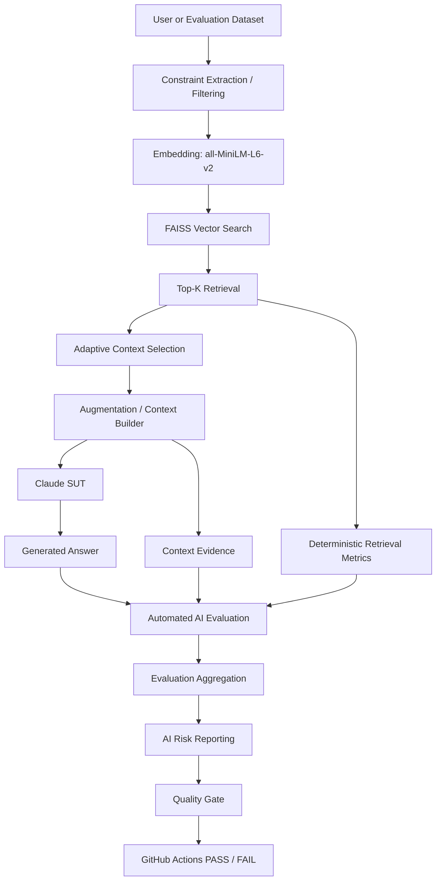
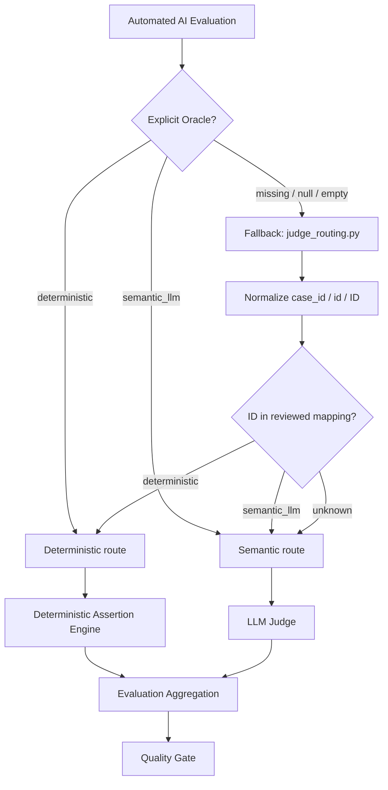
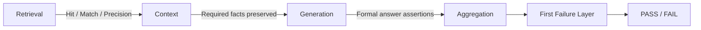
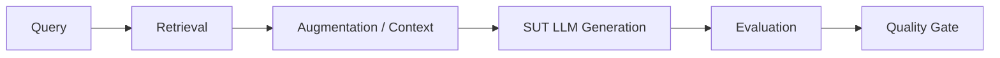
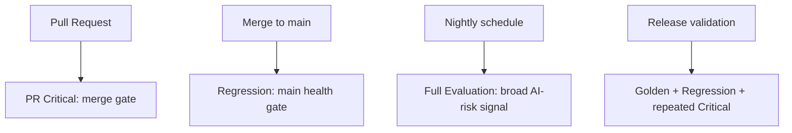
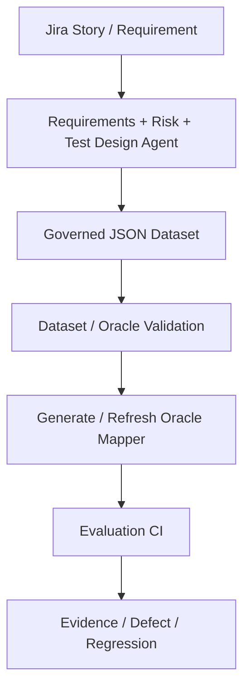

# AI QE Lab

Practical AI Quality Engineering lab for building, testing, evaluating, observing, and governing AI-enabled systems.

## Objective

The objective of this repository is to provide a reproducible, engineering-focused example of how an AI-enabled application can be quality-controlled as a real software system rather than tested only through manual prompting.

It demonstrates how teams can combine controlled datasets, RAG observability, deterministic Python checks, LLM-as-a-Judge evaluation, AI risk metadata, CI quality gates, operational telemetry, failure localization, and human governance into one traceable AI QE workflow.

The repository is intended to give engineers a practical reference for designing AI evaluation datasets, separating deterministic checks from semantic LLM evaluation, validating RAG retrieval/context/generated answers, mapping tests to AI risks, running risk-based CI evaluation, enforcing quality gates, tracking operational metrics, localizing failures, and extending the model toward QA/test-management agents.

---

## Project Workstreams

1. **Shopping RAG Assistant** — implemented and used as the current System Under Test (SUT).
2. **QA Agent** — planned; requirements review, readiness gating, AI-risk identification, test design, and dataset generation.
3. **Test Management Lifecycle Agent** — planned; programme-level test planning, monitoring, evidence, residual-risk, and release-governance support.

---

## Current Implemented Architecture



Detailed architecture: [`docs/architecture.md`](docs/architecture.md).

---

## Automated AI Evaluation — Deterministic and Semantic Oracles

Both paths are **test automation**. The difference is the oracle used to decide PASS/FAIL.



The design rule is:

> **Automate deterministically everything that can be expressed as an objective assertion. Use an LLM Judge only where semantic interpretation is genuinely required.**

The explicit dataset/runtime `Oracle` is the primary source of truth. `judge_routing.py` is a fallback registry for missing Oracle metadata and backward compatibility. If neither an explicit Oracle nor a known mapped ID exists, the safe default is `semantic_llm`.

The LLM Judge does **not** classify the Oracle. The SUT LLM generates the application answer in both routes; the Judge is invoked only when semantic evaluation is required.

### Manually reviewed oracle classification

| Suite | Total | Deterministic | LLM Judge | Target Judge-call reduction |
|---|---:|---:|---:|---:|
| PR Critical | 10 | 6 | 4 | 60.0% |
| Regression | 15 | 7 | 8 | 46.7% |
| Nightly | 80 | 48 | 32 | 60.0% |
| **Total** | **105** | **61 (58.1%)** | **44 (41.9%)** | **58.1%** |

The Deterministic Assertion Engine does not change this classification. It strengthens cases already routed to Python.

---

## Deterministic Assertion Engine

Before the engine, deterministic PASS was driven mainly by retrieval and structured constraint checks. That could prove that the right evidence was found, but not always that the same required fact survived context construction and appeared correctly in the generated answer.

The engine adds structured atomic assertions across the pipeline:



Example:

```text
Expected return window = 30 days

Retrieval: policy found        PASS
Context:   30 days present     PASS
Generation:60 days returned    FAIL

First failure layer = generation
```

This gives two benefits:

- stronger deterministic correctness without additional Judge calls;
- better failure localization: retrieval, augmentation/context, or generation.

Current implementation migrates the six deterministic PR Critical cases first. Regression and Nightly deterministic cases can be migrated incrementally using the same engine.

---

## Diagnostic Architecture



For formal facts, the same expected value can be traced through multiple layers. If retrieval is correct but context loses a fact, the probable defect is augmentation/context building. If retrieval and context are correct but generation changes the fact, the probable defect is generation/prompt/model behavior.

The SUT LLM remains probabilistic even when retrieval and context are correct. Controlled re-runs therefore measure reproducibility; they should not simply turn an intermittent failure into a green test.

---

## Dataset Model

Datasets are defined by **purpose**, not inheritance; overlap is expected.

| Dataset | Purpose | Typical execution |
|---|---|---|
| **Golden** | Trusted reference behaviour and baseline validation | model/prompt/retrieval changes, release validation |
| **PR Critical** | Fast risk-based merge-blocking subset | pull request |
| **Regression** | Stable behaviour plus previously fixed defects | `main` health / post-merge |
| **Evaluation / Nightly** | Broad AI-risk surface, robustness, adversarial and edge coverage | nightly |

Current inventories: Golden 35, PR Critical 10, Regression 15, Nightly 80.

Risk and oracle classification are separate dimensions:

```text
Risk      = what quality failure are we protecting against?
Assertion = what must this case prove?
Oracle    = what mechanism can prove it reliably?
```

Deterministic cases may additionally carry `Deterministic Assertions`, which act as executable formal contracts for the Python engine.

---

## AI Risk Coverage

Cases carry explicit AI-risk metadata and the project builds an AI Risk Coverage Matrix across Critical, Regression and Nightly. Canonical risks include hallucination, groundedness, retrieval quality, constraint adherence, policy grounding, prompt injection, missing information, ambiguity, conflicting data, robustness, out-of-domain abstention, sensitive-data handling and negative behaviour.

---

## CI/CD Execution Model



Current gate model:

```text
Correctness           >= 95%
Groundedness          >= 95%
Retrieval Hit Rate    >= 95%
Constraint Adherence  >= 95%
Hallucination Rate    <= 2%
```

---

## Operational Telemetry and Cost Engineering

The framework records latency, SUT/Judge input/output tokens, cache telemetry, model IDs, API attempts and estimated cost. Operational metrics come from API counters and Python aggregation, not LLM judgment.

The deterministic assertion engine itself uses no Judge tokens. The SUT LLM still runs for deterministic and semantic cases because the generated application response is the object under test.

---

## Failure Localization

```text
Query -> Retrieval -> Context -> Generation -> Evaluation -> Quality Gate
```

A gate failure is classified before changing model, prompt or threshold. Retrieval, context, generation, evaluator and infrastructure defects are different failure classes.

---

## Dataset Governance and Target Evolution

The current product catalogue and policy files are controlled POC fixtures used to prove the mechanics. The target architecture evolves toward Jira requirements plus a connected project knowledge base.



JSON is the authoritative executable dataset. The mapper is a derived runtime fallback, not a second manually maintained business source of truth.

```text
deterministic      -> Python Assertion Engine
semantic_llm       -> LLM Judge
missing/null/empty -> warning + mapper fallback
invalid non-empty  -> validation ERROR
```

---

## Repository Structure

```text
.github/workflows/    GitHub Actions workflows
config/               Runtime configuration examples
data/                 Product catalogue and source data
datasets/             Golden, Critical, Regression and Evaluation datasets
docs/                 Architecture and design documentation
logs/                 Retrieval/context/LLM traces
policies/             Policy knowledge sources
reports/              Evaluation outputs and coverage reports
src/                  RAG, evaluation, reporting and gate implementation
tests/                Software-level tests
```

---

## Current State vs Planned Extensions

Implemented/current evolution: Shopping RAG SUT, structured constraint filtering, FAISS retrieval/telemetry, controlled datasets, deterministic retrieval diagnostics, semantic Judge, manually reviewed Oracle routing with safe semantic fallback, AI-risk metadata/coverage, CI gates, retry policies, operational telemetry/cost optimization, and the Deterministic Assertion Engine for PR Critical deterministic cases.

Next: migrate Regression and Nightly deterministic cases to explicit atomic assertions; strengthen dataset validation; validate assertion-level failure localization across all suites.

Planned after that: Defect -> Regression automation, Jira traceability, Requirements Readiness Agent, AI Risk Analysis Agent, Test Design Agent, duplicate detection, human approval, QA Agent evaluation, Test Management Lifecycle Agent and programme-level release governance.

---

## Target Lifecycle

```text
Requirement
-> Requirements Review
-> Readiness Gate
-> AI Risk Analysis
-> Test Design
-> Evaluation Case + Oracle + Atomic Assertions
-> Duplicate Detection
-> Priority / Suite Classification
-> Human Approval
-> Governed JSON Dataset
-> Dataset Validation
-> Oracle Mapper Generation
-> CI Evaluation
-> Retrieval / Context / Generation Evidence
-> Deterministic Engine or Semantic Judge
-> Quality Gate
-> Defect / Evidence
-> Regression Coverage
-> Residual Risk / Release Decision
```
