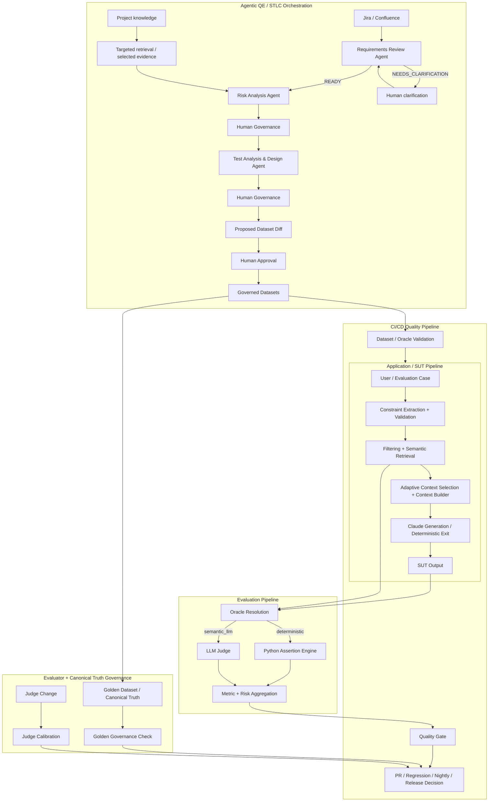

# AI QE Lab

Practical AI Quality Engineering lab for building, testing, evaluating, observing and governing AI-enabled systems.

## Quick start

New to the lab? Follow [`QUICKSTART.md`](QUICKSTART.md) to clone the repository, configure the local environment and run the project on Windows.

## What this lab is

The executable System Under Test (SUT) is a Shopping RAG Assistant. The main purpose of the repository is the QE framework around that SUT: governed datasets, dataset validation, deterministic and semantic evaluation, AI-risk evidence, evaluator calibration, dataset governance, CI quality gates, telemetry, failure localization and Agentic QE/STLC orchestration.

Engineering owns the SUT implementation. QE defines risks and expected behavior, builds evaluation assets, executes the real SUT, evaluates evidence, validates the evaluator itself, governs canonical test truth, gates quality and localizes failures.

## Master architecture

The framework is composed of separate but integrated control planes. Agentic QE orchestration is upstream: it prepares governed quality assets that feed the existing execution, evaluation and CI/CD framework.



**Boundary:** the SUT flow is the reference application built for the lab. On a real project, Development / AI Engineering normally owns that application pipeline. The Agentic QE layer does not replace the evaluator or CI/CD controls; it creates reviewed requirements/risk/test/dataset evidence upstream.

For the full master map and zoomed pipeline views, see [`docs/master_architecture.md`](docs/master_architecture.md).

## Architecture navigation

| Block | What to read |
|---|---|
| Application / SUT Pipeline | [`docs/master_architecture.md`](docs/master_architecture.md#1-application--sut-pipeline) |
| Evaluation Pipeline | [`docs/master_architecture.md`](docs/master_architecture.md#2-evaluation-pipeline) |
| CI/CD Quality Pipeline | [`docs/master_architecture.md`](docs/master_architecture.md#3-cicd-quality-pipeline) |
| Dataset + Evaluator Governance | [`docs/master_architecture.md`](docs/master_architecture.md#4-dataset-and-evaluator-governance) |
| Agentic QE / STLC Orchestration | [`docs/agentic_qe_orchestration.md`](docs/agentic_qe_orchestration.md) |
| Requirements Review Agent | [`docs/requirements_review_agent.md`](docs/requirements_review_agent.md) |
| Risk Analysis Agent | [`docs/risk_analysis_agent.md`](docs/risk_analysis_agent.md) |

## Current QE control planes

| Concern | Purpose |
|---|---|
| SUT | Real Shopping RAG behavior under test |
| Dataset Validation | Reject invalid test/oracle contracts before model calls |
| Product Evaluation | Resolve Oracle, evaluate deterministic/semantic behavior, aggregate metrics and risks |
| Judge Calibration | Regression-test the semantic evaluator itself against human-reviewed truth |
| Golden Governance | Prevent canonical expected behavior from being silently rewritten to make CI green |
| CI/CD Execution | Select suite/control, run it, apply gates and retain evidence |
| Agentic QE / STLC Orchestration | Requirement review -> risk analysis -> test analysis/design -> governed dataset proposal |

## Agentic QE design rules

```text
Requirements Review
-> READY
-> Risk Analysis
-> targeted retrieval where needed
-> Human Governance
-> Test Analysis & Design
-> Human Governance
-> proposed dataset diff
-> Human Approval
-> governed datasets
-> SUT execution
-> Evaluation
-> CI/CD Quality Gates
```

The POC uses **manual execution and Human-in-the-Loop governance**. Selected gates may be automated later only when measured confidence, quality and client expectations justify it.

Every agent follows the minimal-context principle:

```text
Retrieve broadly -> select relevant evidence -> send narrowly to the LLM
```

Operational metadata or unrelated project documentation must not be sent merely because it is available.

## Dataset and CI model

SUT evaluation datasets are organized by execution purpose, not inheritance:

- **PR Critical — 10 cases:** fast merge-blocking risk subset;
- **Regression — 15 cases:** stable behavior and fixed-defect health on main;
- **Nightly Evaluation — 80 cases:** broad AI-risk, edge and adversarial signal;
- **Golden — 35 cases:** trusted canonical baseline / release validation.

Golden is not merely a fourth execution suite. It represents canonical expected behavior and has separate governance.

A separate **Judge Calibration Dataset — 8 human-reviewed cases** tests the evaluator rather than the SUT.

Current CI operating state:

```text
PR Critical        = automatic merge gate
Regression         = manual-only
Nightly            = manual-only
Release Validation = manual-only: Golden + broad Nightly + Release Quality Gate
```

## Evaluation architecture

```text
Validated case
-> Oracle Resolution
   -> deterministic -> Python Deterministic Assertion Engine
   -> semantic_llm  -> version-controlled LLM Judge
   -> missing       -> reviewed fallback registry
-> aggregation
-> Quality Gate
```

Current reviewed routing:

| Suite | Total | Deterministic | Semantic Judge |
|---|---:|---:|---:|
| PR Critical | 10 | 6 | 4 |
| Regression | 15 | 7 | 8 |
| Nightly | 80 | 48 | 32 |
| **Total** | **105** | **61** | **44** |

Quality gates currently enforce:

```text
Correctness >= 95%
Groundedness >= 95%
Retrieval Hit >= 95%
Constraint Adherence >= 95%
Hallucination <= 2%
```

## Governance

### Evaluator governance

The LLM Judge is a probabilistic component, so Judge changes are regression-tested against human-reviewed calibration truth before they are trusted by product quality gates.

### Golden Dataset governance

Golden represents canonical expected behavior. A failed evaluation is not permission to rewrite Golden merely to make CI green. Golden changes require a reason and source of truth and are protected by a dedicated governance workflow.

### Dataset proposal governance

Agent-generated dataset changes are proposals, not direct mutations:

```text
approved test/evaluation cases
-> temporary proposed dataset file
-> diff against governed JSON/Excel truth
-> Human Review
-> approved promotion
-> Dataset Validation
```

## Traceability target

```text
Requirement -> Risk -> Test -> Dataset -> CI Execution
-> Metric / Evidence -> Quality Gate -> Defect / Regression
-> Residual Risk -> Release Decision
```

Cross-cutting evidence should retain, where applicable: requirement/trace ID, model and prompt version, token usage, estimated cost, latency, retrieval/cache evidence, human approval history and quality-gate result.

## Current scope boundary

Automated generation of Playwright/Cypress/API test code is deferred. The current Agentic QE target ends at reviewed test/evaluation assets and governed dataset updates feeding the existing execution/evaluation/CI framework.

## Documentation

- [`QUICKSTART.md`](QUICKSTART.md) — clone, configure and run locally;
- [`docs/master_architecture.md`](docs/master_architecture.md) — master architecture plus focused pipeline views;
- [`docs/architecture.md`](docs/architecture.md) — canonical current application/evaluation architecture and governance control loops;
- [`docs/agentic_qe_orchestration.md`](docs/agentic_qe_orchestration.md) — focused Agentic QE orchestration;
- [`docs/current_status.md`](docs/current_status.md) — concise implementation status;
- [`docs/project_overview.md`](docs/project_overview.md) — end-state operating model;
- [`docs/automated_ai_evaluation.md`](docs/automated_ai_evaluation.md) — Oracle/evaluation details;
- [`docs/metric_contract.md`](docs/metric_contract.md) — canonical metric definitions and denominators;
- [`docs/test_strategy.md`](docs/test_strategy.md) — reusable test strategy including evaluator and dataset governance;
- [`docs/judge_calibration_workflow.md`](docs/judge_calibration_workflow.md) — OLD vs NEW Judge calibration contract and implementation;
- [`docs/golden_dataset_governance.md`](docs/golden_dataset_governance.md) — Golden truth governance and automated PR enforcement;
- [`docs/documentation_index.md`](docs/documentation_index.md) — documentation map.

## Governing rules

> **Formal assertion -> deterministic Python. Meaning/behavior judgment -> semantic LLM Judge. Always report the population actually measured.**

> **The evaluator is tested too: Judge changes are calibrated against human truth. Canonical Golden truth cannot be rewritten merely to make a failing evaluation green.**
