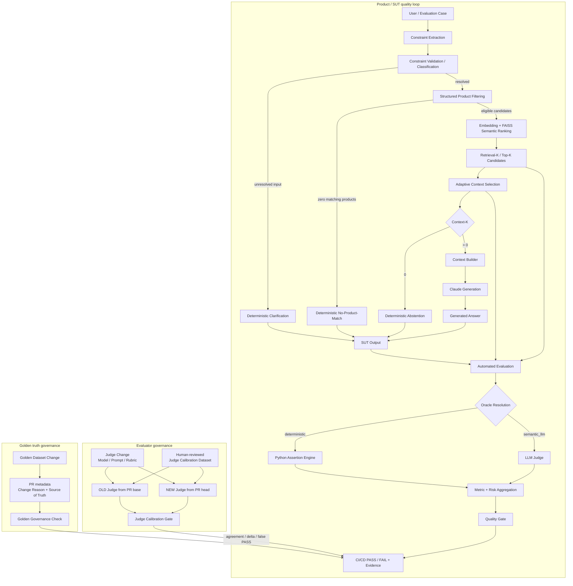

# AI QE Lab

Practical AI Quality Engineering lab for building, testing, evaluating, observing and governing AI-enabled systems.

## Quick start

New to the lab? Follow [`QUICKSTART.md`](QUICKSTART.md) to clone the repository, configure the local environment and run the project on Windows.

## What this lab is

The executable System Under Test (SUT) is a Shopping RAG Assistant. The main purpose of the repository is the QE framework around that SUT: governed datasets, dataset validation, deterministic and semantic evaluation, AI-risk evidence, evaluator calibration, dataset governance, CI quality gates, telemetry and failure localization.

Engineering owns the SUT implementation. QE defines risks and expected behavior, builds evaluation assets, executes the real SUT, evaluates evidence, validates the evaluator itself, governs canonical test truth, gates quality and localizes failures.

## Master architecture



**Boundary:** the SUT flow is the reference application built for the lab. On a real project, Development / AI Engineering normally owns that application pipeline. QE first understands and tests it, then builds the reusable evaluation and governance framework around it.

The deterministic exits have different meanings:

- **Clarification** — user input is unresolved and needs a governed value before retrieval;
- **No-Product-Match** — hard constraints are valid but the catalogue contains no matching product;
- **Abstention** — the request is understood, but no governed evidence survives context selection (`Context-K=0`).

### Retrieval vs context

```text
Structured Filter = enforce exact known fields (price, color, waterproof, size, category)
Semantic Ranking  = rank eligible evidence by vector similarity
Retrieval-K       = up to 5 ranked candidates by default
Adaptive Selector = remove weak candidates below the governed threshold
Context-K         = evidence actually passed to generation
```

Defaults:

```text
RAG_TOP_K=5
RAG_MIN_CONTEXT_K=2       # target, not padding requirement
RAG_MAX_CONTEXT_K=5
RAG_MIN_SIMILARITY=0.30
```

## Current QE control planes

| Concern | Purpose |
|---|---|
| SUT | Real Shopping RAG behavior under test |
| Dataset Validation | Reject invalid test/oracle contracts before model calls |
| Product Evaluation | Resolve Oracle, evaluate deterministic/semantic behavior, aggregate metrics and risks |
| Judge Calibration | Regression-test the semantic evaluator itself against human-reviewed truth |
| Golden Governance | Prevent canonical expected behavior from being silently rewritten to make CI green |
| CI/CD Execution | Select suite/control, run it, apply gates and retain evidence |

The future Agentic QE/Governance layer will create and govern requirements, risks, tests and datasets; it does not replace the evaluator or these controls.

## Dataset and CI model

SUT evaluation datasets are organized by execution purpose, not inheritance:

- **PR Critical — 10 cases:** fast merge-blocking risk subset;
- **Regression — 15 cases:** stable behavior and fixed-defect health on main;
- **Nightly Evaluation — 80 cases:** broad AI-risk, edge and adversarial signal;
- **Golden — 35 cases:** trusted canonical baseline / release validation.

A separate **Judge Calibration Dataset — 8 human-reviewed cases** tests the evaluator rather than the SUT. It contains known good/bad examples for correctness, groundedness, hallucination and constraint adherence. The initial approved baseline (`claude-opus-5`, prompt `v1`, rubric `v1`) achieved 100% agreement across 32 expected field judgments with 0 false PASS and 0 false FAIL.

All active product-evaluation workflows validate the selected dataset before SUT/Judge model calls. Documentation-only changes do not trigger the PR AI evaluation workflow.

## Evaluation architecture

```text
Validated case
-> Oracle Resolution
   -> deterministic -> Python Deterministic Assertion Engine
   -> semantic_llm  -> version-controlled LLM Judge
   -> missing       -> reviewed fallback registry
-> aggregation
-> Quality Gate
```

The production Judge now loads version-controlled assets:

```text
config/judge_config.json = model selection + prompt/rubric versions
config/judge_prompt.txt  = Judge instruction
config/judge_rubric.txt  = scoring interpretation
```

A runtime model override that conflicts with the approved version-controlled configuration is rejected rather than silently changing evaluator behavior.

Current reviewed routing:

| Suite | Total | Deterministic | Semantic Judge |
|---|---:|---:|---:|
| PR Critical | 10 | 6 | 4 |
| Regression | 15 | 7 | 8 |
| Nightly | 80 | 48 | 32 |
| **Total** | **105** | **61** | **44** |

Semantic-only metrics (`Correctness`, `Groundedness`, `Hallucination`, `Context Coverage`, `Context Sufficiency`) use only the Judge population as denominator. Overall Pass Rate and Retrieval Hit are suite-wide. Constraint Adherence is hybrid across deterministic and semantic routes. Empty semantic populations are N/A, not 100%.

Quality gates currently enforce:

```text
Correctness >= 95%
Groundedness >= 95%
Retrieval Hit >= 95%
Constraint Adherence >= 95%
Hallucination <= 2%
```

## Evaluator governance — OLD vs NEW Judge Calibration

The LLM Judge is itself a probabilistic component, so a product quality gate is only trustworthy if changes to the Judge are regression-tested.

On a relevant pull request the workflow executes:

```text
OLD Judge from PR base/main ─┐
                             ├─> same human calibration truth -> compare
NEW Judge from PR head ──────┘

Gate:
NEW agreement >= 90%
agreement drop <= 5 percentage points
NEW false PASS count must not increase
```

Judge Calibration runs automatically when any of these change:

```text
config/judge_config.json
config/judge_prompt.txt
config/judge_rubric.txt
datasets/judge_calibration_dataset.json
src/judge_calibration_runner.py
.github/workflows/judge-calibration.yml
```

It can also be run manually via `workflow_dispatch`. Ordinary documentation or unrelated SUT changes do not trigger it.

This makes changes such as **Opus -> Sonnet**, prompt revisions or rubric revisions measurable against the same human-approved truth before accepting a cheaper or otherwise different evaluator.

## Golden Dataset governance

Golden represents canonical expected behavior. A failed evaluation is not, by itself, permission to change Golden until CI passes.

When `datasets/golden_dataset.json` changes, the PR must provide:

```text
Golden Change Reason: <approved reason for changing canonical expected behavior>
Source of Truth: <requirement, business decision, specification, or defect/reference>
```

The deterministic Golden Governance workflow runs only when one of these paths changes:

```text
datasets/golden_dataset.json
src/golden_governance_check.py
.github/workflows/golden-governance.yml
```

Therefore documentation-only and unrelated feature changes do not invoke this check. Changes to the governance mechanism itself intentionally self-test the mechanism. To make its status non-bypassable, repository branch protection/rulesets must require the `golden-governance` status check.

## Target operating model

```text
Jira Requirement
-> Requirements Review / Entry Gate
-> AI Risk Analysis
-> Test Design
-> Governance / Human Approval
-> Governed JSON datasets / Test Management
-> Dataset Validation
-> Existing SUT + Evaluation + CI framework
-> Evaluator / Golden governance controls
-> Evidence / Defect / Regression
-> Release-readiness decision
```

Traceability target:

```text
Requirement -> Risk -> Test -> Dataset -> CI Execution
-> Metric / Evidence -> Quality Gate -> Defect / Regression
-> Residual Risk -> Release Decision
```

## Documentation

- [`QUICKSTART.md`](QUICKSTART.md) — clone, configure and run locally;
- [`docs/architecture.md`](docs/architecture.md) — canonical current architecture and governance control loops;
- [`docs/current_status.md`](docs/current_status.md) — concise implementation status;
- [`docs/project_overview.md`](docs/project_overview.md) — end-state operating model;
- [`docs/automated_ai_evaluation.md`](docs/automated_ai_evaluation.md) — Oracle/evaluation details;
- [`docs/metric_contract.md`](docs/metric_contract.md) — canonical metric definitions and denominators;
- [`docs/test_strategy.md`](docs/test_strategy.md) — reusable test strategy including evaluator and dataset governance;
- [`docs/judge_calibration_workflow.md`](docs/judge_calibration_workflow.md) — OLD vs NEW Judge calibration contract and implementation;
- [`docs/golden_dataset_governance.md`](docs/golden_dataset_governance.md) — Golden truth governance and automated PR enforcement;
- [`docs/documentation_index.md`](docs/documentation_index.md) — documentation map.

## Governing rules

> **Formal assertion -> deterministic Python. Meaning/behavior judgment -> semantic LLM Judge. Always report the population actually measured.**

> **The evaluator is tested too: Judge changes are calibrated against human truth. Canonical Golden truth cannot be rewritten merely to make a failing evaluation green.**
