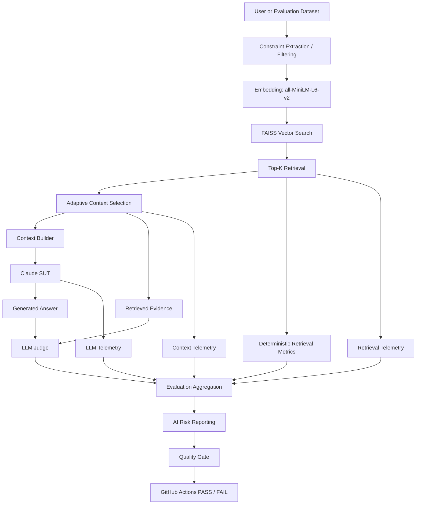
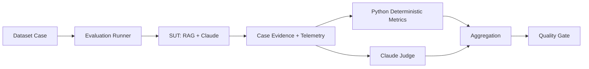
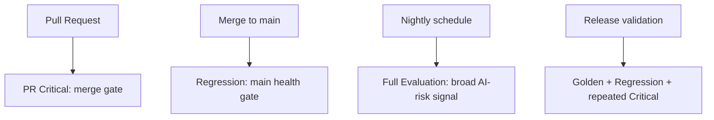

# AI QE Lab

Practical AI Quality Engineering lab for building, testing, evaluating, observing, and governing AI-enabled systems.

## Objective

The objective of this repository is to provide a reproducible, engineering-focused example of how an AI-enabled application can be quality-controlled as a real software system rather than tested only through manual prompting.

It demonstrates how teams can combine controlled datasets, RAG observability, deterministic Python checks, LLM-as-a-Judge evaluation, AI risk metadata, CI quality gates, operational telemetry, failure localization, and human governance into one traceable AI QE workflow.

The repository is intended to give engineers a practical reference for:

- designing AI evaluation datasets;
- separating deterministic checks from semantic LLM evaluation;
- validating RAG retrieval, context quality, and generated answers;
- mapping tests to explicit AI risks;
- running risk-based PR, regression, and nightly evaluation;
- enforcing merge/release quality gates;
- tracking latency and token usage;
- localizing failures to retrieval, context, generation, evaluation, or infrastructure;
- evolving fixed AI defects into permanent regression coverage;
- extending the same governance model toward requirements, risk, test-design, and test-management agents.

---

## Project Workstreams

The project currently focuses on three workstreams:

1. **Shopping RAG Assistant** — implemented and used as the current System Under Test (SUT).
2. **QA Agent** — planned; requirements review, readiness gating, AI-risk identification, test design, and dataset generation.
3. **Test Management Lifecycle Agent** — planned; programme-level test planning, monitoring, evidence, residual-risk, and release-governance support.

The current executable implementation is deliberately centered on the first workstream so that the AI evaluation framework can be built and validated against a concrete SUT before agent orchestration is added.

---

## Current Implemented Architecture



### Important architectural distinction

The evaluation pipeline intentionally separates **retrieval diagnostics**, **context diagnostics**, and **generation diagnostics**:

```text
Retrieval Hit
    ↓
Constraint Match / Precision@K
    ↓
Context Coverage / Sufficiency
    ↓
Correctness / Groundedness / Hallucination / Constraint Adherence
```

This helps distinguish a retrieval defect from a context-building defect or an LLM-generation defect.

See [`docs/architecture.md`](docs/architecture.md) for the detailed architecture and lifecycle model.

---

## Shopping RAG Assistant

The Shopping AI Assistant uses controlled product and policy data as its knowledge base.

Implemented capabilities include:

- product catalogue retrieval;
- policy retrieval;
- semantic vector search;
- structured constraint extraction and filtering;
- configurable retrieval Top-K;
- adaptive context selection so retrieval depth and LLM context depth can differ;
- context augmentation;
- Claude-based answer generation;
- out-of-domain abstention;
- exact handling of discrete product attributes;
- retrieval, context, and LLM telemetry.

Current retrieval stack:

- `sentence-transformers`;
- `all-MiniLM-L6-v2`;
- FAISS `IndexFlatIP` with normalized embeddings.

The embedding model is used only for semantic retrieval. It does not generate answers and does not calculate semantic quality metrics.

---

## AI Evaluation Framework

The evaluation framework runs the SUT against controlled cases and combines deterministic metrics with semantic LLM evaluation.



### Python-computed metrics and telemetry

Python calculates or aggregates:

- Retrieval Hit Rate;
- Constraint Match Score;
- Constraint Precision@K;
- latency and P95 latency;
- SUT/Judge token usage from Anthropic API usage counters;
- cache-token telemetry;
- estimated cost metrics;
- risk coverage inventory;
- pass rates and quality-gate thresholds.

### LLM Judge metrics

The Judge evaluates semantic qualities that require model judgment:

- Correctness;
- Groundedness;
- Hallucination;
- Constraint Adherence;
- Context Coverage;
- Context Sufficiency.

The Judge receives retrieved evidence rather than the complete augmented SUT prompt to reduce duplicated context and evaluation cost.

---

## Dataset Model

The datasets are defined by **purpose**, not by a parent-child hierarchy. Overlap between datasets is expected.

| Dataset | Purpose | Typical execution |
|---|---|---|
| **Golden** | Trusted reference behaviour and baseline validation | model/prompt/retrieval changes, release validation |
| **PR Critical** | Fast risk-based merge-blocking subset | pull request |
| **Regression** | Stable behaviour plus previously fixed defects | `main` health / post-merge |
| **Evaluation / Nightly** | Broad AI-risk surface, robustness, adversarial and edge coverage | nightly |

Current inventories include:

- Golden Dataset — 35 cases;
- PR Critical Dataset — 10 cases;
- Regression Dataset — 15 cases;
- Nightly Evaluation Dataset — 80 cases.

The Nightly suite keeps `Segment` as a test-design dimension and uses explicit canonical AI-risk metadata through `datasets/evaluation_risk_metadata.json`.

---

## Dataset Governance

[`AI_QE_Lab_Datasets_and_Governance.xlsx`](AI_QE_Lab_Datasets_and_Governance.xlsx) is the human-readable dataset-design and governance workbook.

It represents the review/governance layer rather than the runtime execution format. The intended model is:

```text
Requirement / Risk / Test Intent
        ↓
Human-readable governance repository
        ↓
Review and approval
        ↓
Executable JSON datasets
        ↓
Automated evaluation
```

The workbook remains useful as the stakeholder-facing layer for risk, priority, expected behaviour, execution-suite classification, approval, and traceability. JSON remains the machine-executable representation used by CI.

---

## AI Risk Coverage

Evaluation cases carry explicit AI-risk metadata. The project builds an **AI Risk Coverage Matrix** across Critical, Regression, and Nightly inventories.

Example canonical risks include:

- hallucination;
- groundedness;
- retrieval quality;
- constraint adherence;
- policy grounding;
- prompt injection;
- missing information;
- ambiguity;
- conflicting data;
- robustness;
- out-of-domain abstention;
- sensitive-data handling;
- negative behaviour.

`FULL`, `PARTIAL`, and `SINGLE_SUITE` describe how a risk is distributed across dataset inventories. They are not pass/fail results and do not by themselves prove adequate test depth.

---

## Quality Gates

GitHub Actions enforces merge-blocking quality criteria for the PR Critical suite.

Current gate dimensions include:

- critical-case failure;
- Correctness;
- Groundedness;
- Retrieval Hit Rate;
- Constraint Adherence;
- Hallucination Rate.

Current threshold model:

```text
Correctness           >= 95%
Groundedness          >= 95%
Retrieval Hit Rate    >= 95%
Constraint Adherence  >= 95%
Hallucination Rate    <= 2%
```

A failing quality gate returns a non-zero exit code and makes the GitHub Actions check fail.

---

## Hallucination Retry vs API Retry

The project intentionally separates two different retry mechanisms.

**Provider/API retry** handles transient external-service failures such as HTTP 429/5xx/529. Judge requests use bounded retry/backoff so an Anthropic overload does not automatically become an AI-quality defect.

**Hallucination retry** investigates stochastic quality. When hallucination exceeds the configured tolerance, the Critical suite can be repeated to determine whether the failure is reproducible or flaky.

Infrastructure resilience and AI-quality investigation are therefore treated as separate concerns.

---

## CI/CD Execution Model



Current PR workflow includes:

```text
Checkout
    ↓
Python + pip cache
    ↓
Hugging Face model cache
    ↓
Install dependencies
    ↓
Build AI Risk Coverage Matrix
    ↓
Run PR Critical Dataset
    ↓
Evaluate SUT + Judge
    ↓
Hallucination Retry Policy
    ↓
Quality Gate
    ↓
Upload Reports
```

Documentation-only changes do not trigger the PR Critical evaluation because the workflow uses path filtering.

---

## Operational Telemetry and Cost Engineering

The project records operational signals alongside semantic quality metrics.

Current telemetry includes:

- average and P95 latency;
- SUT input/output tokens;
- Judge input/output tokens;
- Anthropic prompt-cache creation/read tokens;
- model identifiers;
- API attempt count;
- estimated cost and cost per case.

Cost optimization is treated as an engineering concern only when quality remains unchanged. Optimizations already explored include:

- shorter Judge prompts;
- compact Judge output;
- raw retrieved evidence instead of full SUT context;
- lower Judge output budget;
- prompt-cache instrumentation;
- separation of Retrieval-K from Context-K;
- adaptive context selection;
- optional risk-aware Judge model routing.

Token usage and latency may vary between executions, so optimization evidence should use controlled BEFORE/AFTER comparisons rather than isolated runs.

---

## Failure Localization

A failed evaluation should be classified before changing the model or thresholds.

```text
Query
  ↓
Retrieval
  ↓
Context
  ↓
Generation
  ↓
Evaluation
  ↓
Quality Gate
```

Typical signals:

| Signal | Probable layer |
|---|---|
| Retrieval Hit fails | retrieval / oracle |
| Constraint Match or Precision@K weak | retrieval / filtering |
| Context Coverage or Sufficiency weak | augmentation / context construction |
| Correctness fails with sufficient context | generation |
| Groundedness or hallucination fails | generation / prompt |
| Provider 529/5xx | infrastructure / external dependency |
| Quality evaluator misclassifies expected source | evaluator / dataset contract |

The first 80-case Nightly run exposed this distinction directly: many apparent failures were traced to an evaluator/oracle contract issue rather than product-quality defects. The corrected full Nightly baseline subsequently achieved 80/80 passing cases while still exposing retrieval precision as an observational improvement area.

---

## Repository Structure

```text
.github/workflows/    GitHub Actions workflows
config/               Runtime configuration examples
data/                 Product catalogue and source data
datasets/             Golden, Critical, Regression and Evaluation datasets
docs/                 Architecture and design documentation
logs/                 Retrieval/context/LLM traces
policies/             Policy knowledge sources
reports/              Evaluation outputs and coverage reports
src/                  RAG, evaluation, reporting and gate implementation
tests/                Software-level tests
```

Important implementation components include:

```text
vector_store.py             embeddings + FAISS retrieval
constraint_filter.py        structured query constraints
context_builder.py          retrieved evidence + SUT context
llm_client.py               SUT Claude integration
retrieval_metrics.py        deterministic retrieval diagnostics
llm_evaluator.py            semantic Judge + API retry
risk_reporting.py           per-risk execution reporting
risk_coverage.py            cross-suite AI-risk inventory
cost_reporting.py           SUT/Judge token and cost aggregation
pr_evaluation_runner.py     PR Critical execution
pr_evaluator.py             PR Critical evaluation
hallucination_retry.py      stochastic hallucination retry policy
quality_gate.py             CI blocking thresholds
```

---

## Current State vs Planned Extensions

### Implemented

- Shopping RAG SUT;
- structured constraint filtering;
- FAISS retrieval and telemetry;
- Golden / Critical / Regression / Nightly datasets;
- deterministic retrieval metrics;
- semantic Judge metrics;
- canonical AI-risk metadata and coverage matrix;
- PR quality gate;
- hallucination retry;
- external Judge API retry/backoff;
- SUT/Judge token telemetry and cost reporting;
- evaluation cost/context optimization.

### Planned

- Defect → Regression automation;
- Jira traceability and defect workflow;
- Requirements Readiness Agent;
- AI Risk Analysis Agent;
- classical + AI-specific Test Design Agent;
- duplicate detection against existing coverage;
- human approval workflow;
- Excel → JSON approved dataset export;
- QA Agent evaluation datasets;
- Test Management Lifecycle Agent;
- programme-level residual-risk and GO / NO-GO reporting.

The planned agents are extensions of the existing QE framework; they are not presented as already implemented functionality.

---

## Target Lifecycle

```text
Requirement
→ Requirements Review
→ Readiness Gate
→ AI Risk Analysis
→ Test Design
→ Functional Tests + AI Evaluation Cases
→ Duplicate Detection
→ Priority / Suite Classification
→ Human Approval
→ Governance Repository
→ JSON Dataset
→ CI Evaluation
→ Retrieval / Context / Generation Metrics
→ Quality Gate
→ Defect / Evidence
→ Regression Coverage
→ Residual Risk / Release Decision
```

The central design principle is traceability:

```text
Requirement
→ AI Risk
→ Test / Evaluation Case
→ Dataset
→ CI Level
→ Metric
→ Threshold
→ Evidence
→ Residual Risk
```
