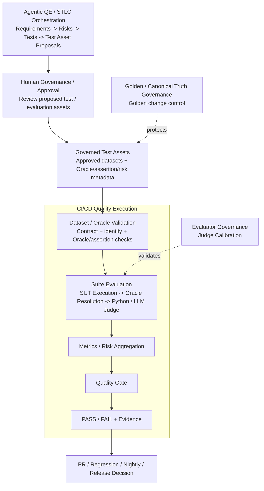

# AI QE Lab

Practical AI Quality Engineering lab for building, testing, evaluating, observing and governing AI-enabled systems.

## Quick start

New to the lab? Follow [`QUICKSTART.md`](QUICKSTART.md) to clone the repository, configure the local environment and run the project on Windows.

## What this lab is

The executable System Under Test (SUT) is a Shopping RAG Assistant. The main purpose of the repository is the QE framework around that SUT: governed test assets, dataset validation, deterministic and semantic evaluation, AI-risk evidence, evaluator calibration, canonical-truth governance, CI quality gates, telemetry, failure localization and Agentic QE/STLC orchestration.

Engineering owns the SUT implementation. QE defines risks and expected behavior, builds evaluation assets, governs their promotion, executes the real SUT, evaluates evidence, validates the evaluator itself, governs canonical test truth, gates quality and localizes failures.

## Master architecture

The README intentionally keeps the master view compact. It separates **upstream Agentic QE and human governance of proposed test assets** from **downstream CI/CD quality execution**. Agentic QE is the target orchestration model; the CI/CD execution path reflects the current repository workflows.



**Boundaries:** `Governed Test Assets` are approved artifacts, not an agent or an execution pipeline. Human governance decides whether proposed assets should become governed assets. Dataset/Oracle Validation is a separate technical execution-precondition check. CI/CD Quality Execution begins with that validation, then runs the suite, evaluation, metrics and quality gate. On a real project, Development / AI Engineering normally owns the SUT implementation inside Suite Evaluation.

For the expanded map and responsibility boundaries, see [`docs/master_architecture.md`](docs/master_architecture.md).

## Architecture navigation

Use the master diagram for orientation, then open the pipeline/control plane that owns the question you are investigating.

| Pipeline / control plane | Responsibility | Detailed view |
|---|---|---|
| **Agentic QE / STLC Orchestration** | Requirement review -> risk analysis -> test analysis/design -> proposed test/evaluation assets | [`docs/agentic_qe_orchestration.md`](docs/agentic_qe_orchestration.md) |
| **Human Governance / Approval** | Review proposed quality assets and approve/reject promotion into governed datasets/assets | [`docs/agentic_qe_orchestration.md`](docs/agentic_qe_orchestration.md) |
| **Dataset / Oracle Validation Pipeline** | Validate case identity and Oracle/assertion contract before SUT/Judge model calls | [`docs/dataset_oracle_validation_pipeline.md`](docs/dataset_oracle_validation_pipeline.md) |
| **Application / SUT Pipeline** | Execute the Shopping RAG flow: constraints -> filtering -> retrieval -> adaptive context -> generation/deterministic exits | [`docs/architecture.md`](docs/architecture.md#3-reference-sut-pipeline) |
| **Evaluation Pipeline** | Resolve Oracle against SUT evidence, route to deterministic Python or semantic LLM Judge, aggregate case results | [`docs/automated_ai_evaluation.md`](docs/automated_ai_evaluation.md) |
| **CI/CD Quality Execution** | Select lifecycle suite, validate dataset, execute SUT/evaluation, aggregate metrics, apply quality gate and retain evidence | [`docs/master_architecture.md`](docs/master_architecture.md#4-cicd-quality-execution) |
| **Dataset Design / Oracle Contract** | Define PR Critical, Regression, Nightly, Golden and Judge Calibration roles plus Oracle/assertion metadata | [`docs/dataset_design.md`](docs/dataset_design.md) |
| **Golden / Canonical Truth Governance** | Prevent canonical expected behavior from being rewritten without approved reason/source of truth | [`docs/golden_dataset_governance.md`](docs/golden_dataset_governance.md) |
| **Evaluator Governance** | Calibrate OLD vs NEW Judge against human-reviewed truth before trusting evaluator changes | [`docs/judge_calibration_workflow.md`](docs/judge_calibration_workflow.md) |
| **Master Architecture** | Expanded end-to-end map, boundaries and cross-cutting rules | [`docs/master_architecture.md`](docs/master_architecture.md) |

### Agent-level navigation

| Agent | Contract / implementation context |
|---|---|
| Requirements Review Agent | [`docs/requirements_review_agent.md`](docs/requirements_review_agent.md) |
| Risk Analysis Agent | [`docs/risk_analysis_agent.md`](docs/risk_analysis_agent.md) |

## Current QE control planes

| Concern | Purpose |
|---|---|
| Agentic QE / STLC Orchestration | Target flow: requirement review -> risk analysis -> test analysis/design -> proposed test assets |
| Human Governance / Approval | Approve or reject proposed test/evaluation assets before promotion |
| Governed Test Assets | Approved datasets and associated Oracle/assertion/risk metadata used for execution |
| Dataset / Oracle Validation | Reject invalid execution contracts before SUT/Judge model calls |
| SUT | Real Shopping RAG behavior under test |
| Product Evaluation | Resolve Oracle, evaluate deterministic/semantic behavior, aggregate metrics and risks |
| CI/CD Quality Execution | Validate -> execute suite -> aggregate metrics -> quality gate -> evidence/decision |
| Judge Calibration | Regression-test the semantic evaluator itself against human-reviewed truth |
| Golden Governance | Prevent canonical expected behavior from being silently rewritten to make CI green |

## Dataset and CI model

SUT evaluation datasets are organized by execution purpose, not inheritance:

- **PR Critical — 10 cases:** fast merge-blocking risk subset;
- **Regression — 15 cases:** stable behavior and fixed-defect health on main;
- **Nightly Evaluation — 80 cases:** broad AI-risk, edge and adversarial signal;
- **Golden — 35 cases:** trusted canonical baseline / release validation.

Golden is not merely a fourth execution suite. It represents canonical expected behavior and has separate governance.

A separate **Judge Calibration Dataset — 8 human-reviewed cases** tests the evaluator rather than the SUT.

Current CI operating state:

```text
PR Critical        = automatic merge gate
Regression         = manual-only
Nightly            = manual-only
Release Validation = manual-only: Golden + broad Nightly + Release Quality Gate
```

For each lifecycle execution, the core sequence is:

```text
Selected Governed Suite
-> Dataset / Oracle Validation
-> Suite Evaluation
   -> SUT Execution
   -> Oracle Resolution
   -> deterministic Python OR semantic LLM Judge
-> Metrics / Risk Aggregation
-> Quality Gate
-> PASS / FAIL + Evidence
-> Lifecycle Decision
```

## Core governing rules

```text
Agent output -> proposal until human-approved promotion.
Formal assertion -> deterministic Python.
Meaning / behavior judgment -> semantic LLM Judge.
Validate dataset/oracle contracts before expensive model calls.
Retrieve broadly -> select relevant evidence -> send narrowly to an agent.
```

Golden is canonical truth under separate governance. PR Critical, Regression and Nightly are execution-purpose suites. Automated generation of Playwright/Cypress/API test code remains deferred from the current Agentic QE scope.

## Traceability target

```text
Requirement -> Risk -> Test / Evaluation Asset -> Human Approval -> Governed Test Asset
-> Dataset / Oracle Validation -> Suite Evaluation -> Metric / Evidence -> Quality Gate
-> Defect / Regression -> Residual Risk -> Release Decision
```

Cross-cutting evidence should retain, where applicable: requirement/trace ID, model and prompt version, token usage, estimated cost, latency, retrieval/cache evidence, human approval history, Oracle route and quality-gate result.

## Documentation

- [`QUICKSTART.md`](QUICKSTART.md) — clone, configure and run locally;
- [`docs/master_architecture.md`](docs/master_architecture.md) — expanded master architecture and responsibility boundaries;
- [`docs/dataset_oracle_validation_pipeline.md`](docs/dataset_oracle_validation_pipeline.md) — dataset/oracle execution-precondition pipeline;
- [`docs/architecture.md`](docs/architecture.md) — detailed reference SUT/application architecture;
- [`docs/agentic_qe_orchestration.md`](docs/agentic_qe_orchestration.md) — focused Agentic QE orchestration;
- [`docs/automated_ai_evaluation.md`](docs/automated_ai_evaluation.md) — Oracle/evaluation details;
- [`docs/dataset_design.md`](docs/dataset_design.md) — dataset purposes and Oracle contract;
- [`docs/metric_contract.md`](docs/metric_contract.md) — canonical metric definitions and denominators;
- [`docs/test_strategy.md`](docs/test_strategy.md) — reusable test strategy including evaluator and dataset governance;
- [`docs/judge_calibration_workflow.md`](docs/judge_calibration_workflow.md) — OLD vs NEW Judge calibration contract and implementation;
- [`docs/golden_dataset_governance.md`](docs/golden_dataset_governance.md) — Golden truth governance and automated PR enforcement;
- [`docs/current_status.md`](docs/current_status.md) — concise implementation status;
- [`docs/documentation_index.md`](docs/documentation_index.md) — full documentation map.
