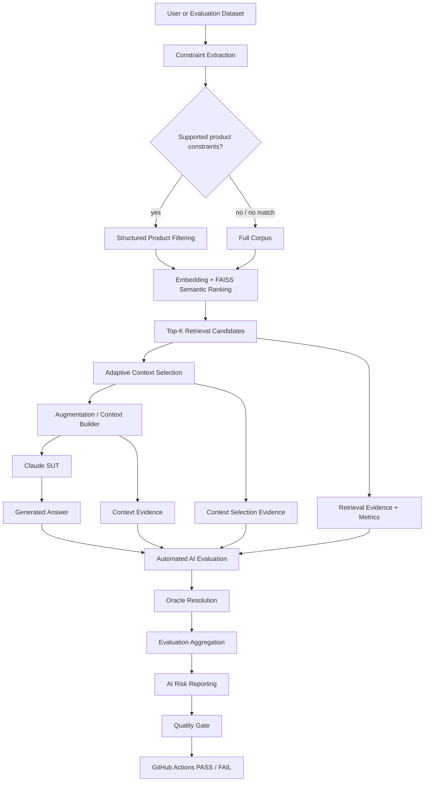
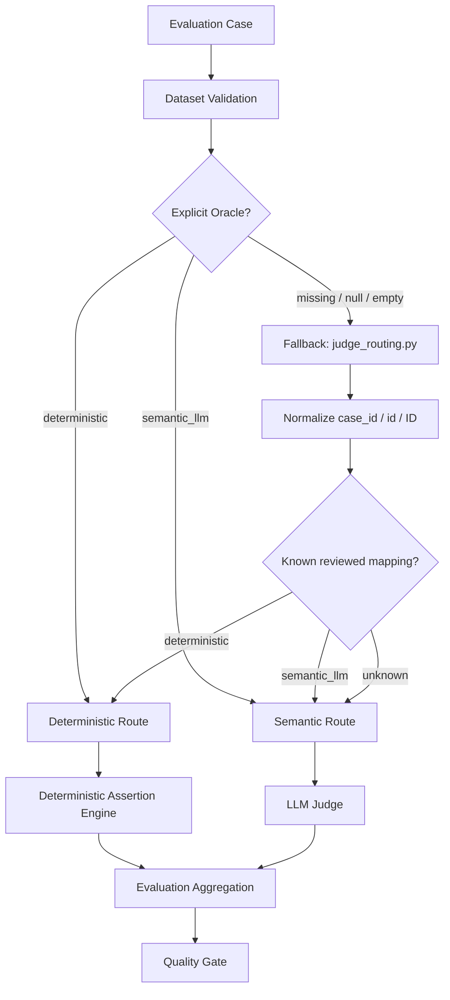
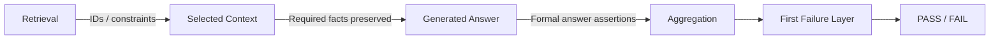
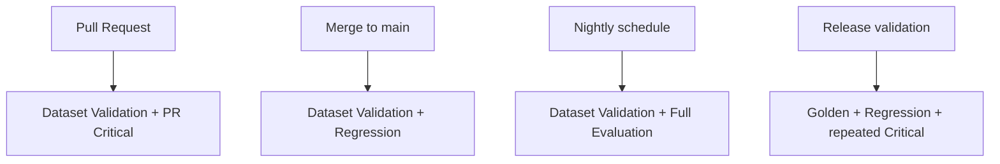
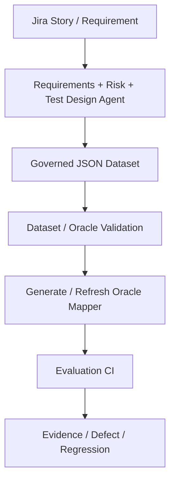

# AI QE Lab

Practical AI Quality Engineering lab for building, testing, evaluating, observing, and governing AI-enabled systems.

## Objective

The repository demonstrates how an AI-enabled application can be quality-controlled as a real software system rather than tested only through manual prompting. The current System Under Test (SUT) is a Shopping RAG Assistant. The surrounding QE framework combines governed datasets, deterministic Python assertions, LLM-as-a-Judge evaluation, AI-risk metadata, CI quality gates, operational telemetry, failure localization, and human governance.

## Current workstreams

1. **Shopping RAG Assistant** — implemented current SUT.
2. **QA Agent** — planned: requirements review, readiness gating, AI-risk identification, test design, and governed dataset generation.
3. **Test Management Lifecycle Agent** — planned: programme-level planning, monitoring, residual-risk and release-governance support.

---

## Current implemented RAG architecture



### Retrieval and adaptive context selection

Retrieval and generation context are deliberately separate concepts.

- `RAG_TOP_K=5` controls the maximum retrieval candidate set.
- structured product constraints are applied **before semantic ranking** when supported constraints are detected and matching products exist;
- if no supported constraints are detected, or structured filtering finds no matching product, retrieval falls back to semantic FAISS search over the full indexed corpus;
- `RAG_MIN_SIMILARITY=0.30` removes low-confidence candidates from the generation context;
- `RAG_MAX_CONTEXT_K=5` caps context evidence;
- `RAG_MIN_CONTEXT_K=2` is a target floor, not permission to add weak evidence: if only one document passes the similarity threshold, only one is used;
- the Context Builder receives only the documents selected by `src/context_selector.py`.

The default effective flow is therefore:

```text
Query
-> Constraint Extraction
-> Structured Product Filtering when applicable
-> Embedding + FAISS Semantic Ranking
-> Top-K Retrieval Candidates (default max 5)
-> Adaptive Context Selection (similarity threshold + dynamic Context-K)
-> Context Builder
-> Claude SUT
-> Answer
```

Detailed architecture: [`docs/architecture.md`](docs/architecture.md).

---

## Automated AI Evaluation — deterministic and semantic oracles

Both routes are automated testing. The difference is the oracle used to determine PASS/FAIL.



The governing rule is:

> **Automate deterministically everything that can be expressed as an objective assertion. Use an LLM Judge only where semantic interpretation is genuinely required.**

The explicit dataset `Oracle` is the primary source of truth. `judge_routing.py` is a fallback registry for missing Oracle metadata and backward compatibility. Unknown cases safely default to `semantic_llm`; the Judge does not classify the Oracle.

### Dataset validation

All three active CI workflows validate their dataset before SUT/Judge execution:

```text
PR Critical -> validate pr_critical_dataset.json -> evaluation
Regression  -> validate regression_dataset.json  -> evaluation
Nightly     -> validate evaluation_dataset.json  -> evaluation
```

Rules:

```text
deterministic      -> valid; deterministic assertions required
semantic_llm       -> valid
missing/null/empty -> warning + runtime mapper fallback
invalid non-empty  -> validation ERROR
missing/duplicate ID -> validation ERROR
```

---

## Reviewed oracle inventory

| Suite | Total | Deterministic | LLM Judge | Judge-call reduction |
|---|---:|---:|---:|---:|
| PR Critical | 10 | 6 | 4 | 60.0% |
| Regression | 15 | 7 | 8 | 46.7% |
| Nightly | 80 | 48 | 32 | 60.0% |
| **Total** | **105** | **61 (58.1%)** | **44 (41.9%)** | **58.1%** |

All 61 deterministic cases are wired to structured deterministic assertion coverage: 6 Critical, 7 Regression and 48 Nightly cases. Nightly assertion metadata is maintained in `datasets/evaluation_assertion_metadata.json`.

---

## Deterministic Assertion Engine

The shared engine evaluates formal expectations across retrieval, context and generation without a Judge call.



Supported assertion types include retrieved IDs, contains/regex/not-regex checks, expected-no-match, answer-product constraint validation, and catalogue minimum-price validation. The engine records the first failure layer so a deterministic defect can be localized to retrieval, context or generation.

---

## Dataset model

Datasets are defined by **purpose**, not inheritance; overlap is expected.

| Dataset | Purpose | Typical execution |
|---|---|---|
| **Golden** | Trusted reference behavior and baseline validation | model/prompt/retrieval changes, release validation |
| **PR Critical** | Fast risk-based merge-blocking subset | pull request |
| **Regression** | Stable behavior plus fixed defects | `main` health / post-merge |
| **Evaluation / Nightly** | Broad AI-risk, adversarial and edge coverage | nightly |

Current inventories: Golden 35, PR Critical 10, Regression 15, Nightly 80.

```text
Risk      = what quality failure are we protecting against?
Assertion = what must the case prove?
Oracle    = what mechanism proves it reliably?
```

---

## CI/CD execution model



Policy:

```text
PR Critical = merge gate
Regression  = main health gate
Nightly     = broad AI-risk signal
Release     = release validation gate
```

Current gate thresholds include Correctness >=95%, Groundedness >=95%, Retrieval Hit >=95%, Constraint Adherence >=95%, and Hallucination <=2%, plus critical-case blocking behavior.

---

## Operational telemetry and cost engineering

The framework records retrieval IDs/ranks/similarity scores, selected context size and IDs in evaluation reports, context, model IDs, latency, token counters, API attempts, cache telemetry and estimated cost. Operational metrics are measured/aggregated by Python; they are not LLM-generated.

The adaptive context layer reduces irrelevant evidence before generation while retaining Top-K retrieval evidence separately for diagnostics.

---

## Failure localization

```text
Query
-> Retrieval Candidates
-> Adaptive Context Selection
-> Context Builder
-> Generation
-> Evaluation
-> Quality Gate
```

A final-answer failure is not automatically an LLM defect. Retrieval, context selection, augmentation, generation, dataset/oracle/evaluator and infrastructure failures are distinct classes.

---

## Dataset governance and target evolution

The current product catalogue and policy files are controlled POC fixtures. The target architecture evolves toward Jira requirements plus connected project knowledge, with agents producing governed JSON evaluation cases.



JSON is authoritative. The Oracle mapper is a derived runtime safety layer, not a second manually maintained source of truth.

---

## Repository structure

```text
.github/workflows/    GitHub Actions workflows
config/               Runtime configuration examples
data/                 Product catalogue and source data
datasets/             Golden, Critical, Regression and Evaluation datasets
docs/                 Architecture, strategy and design documentation
policies/             Policy knowledge sources
src/                  RAG, adaptive context, evaluation, reporting and gates
tests/                Software-level tests
```

---

## Current state vs planned extensions

**Implemented/current:** Shopping RAG SUT; structured constraint extraction/filtering; embeddings and FAISS ranking; Top-K candidate retrieval; adaptive similarity-based context selection; context construction; Claude generation; telemetry; purpose-specific datasets; Dataset/Oracle Validation in all three active workflows; manually reviewed Oracle routing with safe fallback; 61 deterministic atomic-assertion cases; 44 semantic Judge cases; AI-risk reporting/coverage; CI gates; hallucination/provider retry controls; cost/token optimization and failure localization.

**Planned next:** automatically generate/refresh the fallback Oracle mapper from validated approved datasets; complete Defect -> Regression automation and Jira traceability; then Requirements Readiness, AI Risk Analysis, Test Design, duplicate/coverage validation, HITL approval, QA Agent evaluation and Test Management Lifecycle Agent.

---

## Target lifecycle

```text
Requirement
-> Requirements Review
-> Readiness Gate
-> AI Risk Analysis
-> Test Design
-> Evaluation Case + Oracle + Atomic Assertions
-> Duplicate / Coverage Check
-> Human Approval
-> Governed JSON Dataset
-> Dataset Validation
-> Oracle Mapper Generation
-> CI Evaluation
-> Retrieval / Context / Generation Evidence
-> Deterministic Engine or Semantic Judge
-> Quality Gate
-> Defect / Evidence
-> Regression Coverage
-> Residual Risk / Release Decision
```
