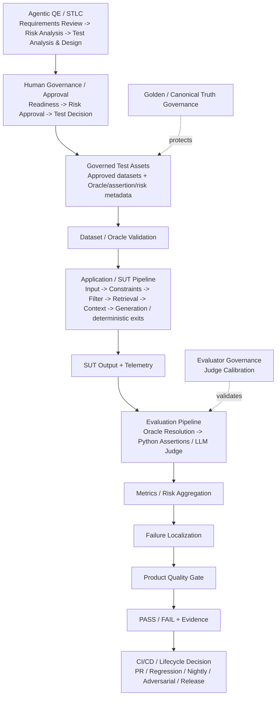

# AI QE Lab

Practical AI Quality Engineering lab for building, testing, evaluating, observing and governing AI-enabled systems.

## Quick start

New to the lab? Follow [`QUICKSTART.md`](QUICKSTART.md) to clone the repository, configure the local environment and run the project on Windows.

## What this lab is

The executable System Under Test (SUT) is a Shopping RAG Assistant. The main purpose of the repository is the QE framework around that SUT: governed test assets, dataset validation, deterministic and semantic evaluation, AI-risk evidence, evaluator calibration, canonical-truth governance, CI quality gates, telemetry, failure localization and Agentic QE/STLC orchestration.

Engineering owns the SUT implementation. QE defines risks and expected behavior, builds evaluation assets, governs their promotion, executes the real SUT, evaluates evidence, validates the evaluator itself, governs canonical test truth, gates quality and localizes failures.

## Master architecture

The README shows the **complete end-to-end architecture in compact form**. `docs/master_architecture.md` and `docs/architecture.md` expand the full architecture; dedicated pipeline documents zoom into the same blocks with detailed state/decision transitions.



**Current upstream state:** Requirements Review, Risk Analysis and Test Analysis & Design are runnable. Risk Jira write-back is approval-gated. Test proposals continue through the actionable Human Decision workflow (`APPROVE / REJECT / EDIT / EXTEND_EXISTING`) and explicit confirmation. Confirmed decision -> governed dataset mutation/promotion is the next unimplemented boundary.

**Boundaries:** `Governed Test Assets` are approved artifacts, not an agent or execution pipeline. Human governance decides whether proposals become governed assets. Dataset/Oracle Validation is a separate technical execution-precondition check. The Application/SUT pipeline ends at `SUT Output + Telemetry`; the Evaluation pipeline starts from that evidence and owns Oracle resolution through quality evidence.

## Architecture navigation

| Pipeline / control plane | Responsibility | Detailed view |
|---|---|---|
| **Full Detailed Architecture** | end-to-end architecture and responsibility boundaries | [`docs/architecture.md`](docs/architecture.md) |
| **Master Architecture** | expanded end-to-end map and pipeline boundaries | [`docs/master_architecture.md`](docs/master_architecture.md) |
| **Agentic QE / STLC Pipeline** | Requirements Review -> Risk Analysis -> Test Analysis & Design -> Human Decision | [`docs/agentic_qe_orchestration.md`](docs/agentic_qe_orchestration.md) |
| **Dataset / Oracle Validation Pipeline** | case identity and Oracle/assertion contract before model calls | [`docs/dataset_oracle_validation_pipeline.md`](docs/dataset_oracle_validation_pipeline.md) |
| **Application / SUT Pipeline** | constraints -> filtering -> retrieval -> adaptive context -> generation/deterministic exits | [`docs/sut_application_pipeline.md`](docs/sut_application_pipeline.md) |
| **Evaluation Pipeline** | SUT evidence -> Oracle routing -> Python / semantic Judge -> metrics/gate | [`docs/automated_ai_evaluation.md`](docs/automated_ai_evaluation.md) |
| **CI/CD / Suite Execution Pipeline** | lifecycle trigger -> selected suite -> shared execution -> lifecycle decision | [`docs/cicd_suite_execution_pipeline.md`](docs/cicd_suite_execution_pipeline.md) |
| **Dataset Design / Oracle Contract** | dataset purposes and Oracle/assertion metadata | [`docs/dataset_design.md`](docs/dataset_design.md) |
| **Specialized AI Testing** | Metamorphic, Back-to-Back and Adversarial | [`docs/future_ai_testing_workflows.md`](docs/future_ai_testing_workflows.md) |
| **Golden Governance** | canonical expected-truth change control | [`docs/golden_dataset_governance.md`](docs/golden_dataset_governance.md) |
| **Evaluator Governance** | OLD vs NEW Judge calibration against human truth | [`docs/judge_calibration_workflow.md`](docs/judge_calibration_workflow.md) |

### Agent-level navigation

| Agent / gate | Detailed view |
|---|---|
| Requirements Review Agent | [`docs/requirements_review_agent.md`](docs/requirements_review_agent.md) |
| Risk Analysis Agent | [`docs/risk_analysis_agent.md`](docs/risk_analysis_agent.md) |
| Test Analysis & Design + Human Decision | [`docs/agentic_qe_orchestration.md`](docs/agentic_qe_orchestration.md) |

## Dataset and CI model

SUT evaluation datasets are organized by execution purpose, not inheritance:

- **PR Critical — 12 physical records:** 10 standard fast merge-blocking cases + 2 Metamorphic Critical records;
- **Regression — 15 cases:** stable behavior and fixed-defect health;
- **Broad Nightly Evaluation — 80 cases:** broad AI-risk, edge and robustness signal;
- **Golden — 35 cases:** trusted canonical baseline / release validation;
- **Adversarial — 10 cases:** governed hostile-input coverage;
- **Judge Calibration — 8 cases:** human-reviewed evaluator truth.

Back-to-Back reuses the 10 standard PR Critical cases; it does not own another dataset.

```text
PR
├─ Standard Critical Evaluation     = automatic merge gate
└─ Metamorphic Critical             = automatic relation gate

Manual comparison
└─ Back-to-Back                     = Model A vs Model B on same 10 PR cases

Scheduled / manual
└─ Adversarial                      = 10 hostile-input cases

Other lifecycle workflows
├─ Regression                       = manual-only
├─ Broad Nightly                    = manual-only
└─ Release Validation               = manual / RC
```

For each lifecycle execution:

```text
Selected Governed Suite
-> Dataset / Oracle Validation
-> Application / SUT Pipeline
-> SUT Output + Telemetry
-> Evaluation Pipeline
   -> Oracle Resolution
   -> deterministic Python OR semantic LLM Judge
-> Metrics / Risk Aggregation
-> Quality Gate
-> PASS / FAIL + Evidence
-> Lifecycle Decision
```

Specialized flows remain separate:

```text
Metamorphic
base + transformed invocation
-> deterministic relation Oracle
-> Metamorphic Gate

Back-to-Back
same Critical suite -> Model A + Model B
-> evaluate both
-> quality / regression / latency / token comparison

Adversarial
10-case attack dataset
-> SUT + evaluator
-> Adversarial Pass Rate / Attack Success Rate / category breakdown
-> Adversarial Gate
```

Drift testing is intentionally outside the current roadmap.

## Core governing rules

```text
Agent output -> proposal until applicable human approval.
Formal assertion -> deterministic Python.
Meaning / behavior judgment -> calibrated semantic LLM Judge.
Validate dataset/oracle contracts before expensive model calls.
Deterministic agent eligibility before paid semantic reasoning.
Similarity -> human evidence, not automatic duplicate verdict.
```

Golden is canonical truth under separate governance. Judge behavior is protected by Judge Calibration.

## Traceability target

```text
Requirement -> Acceptance Criterion -> Risk -> Proposed Test / Evaluation Asset
-> Human Decision -> Governed Test Asset
-> Dataset / Oracle Validation -> Application / SUT Execution -> SUT Evidence
-> Evaluation -> Oracle / Metric / Quality Gate -> Defect / Regression
-> Residual Risk -> Release Decision
```

## Remaining roadmap

Only unimplemented work remains here:

1. confirmed Human Decision -> governed dataset ADD / EDIT / EXTEND_EXISTING mutation;
2. exact BEFORE -> AFTER handling for `EXTEND_EXISTING`;
3. deterministic post-mutation validation;
4. governed dataset diff/commit/PR promotion;
5. optional Requirements Review approval -> Jira `review-completed` write-back;
6. targeted Risk evidence retrieval where justified;
7. Agent Evaluation Dataset and agent-behavior evaluation;
8. state-driven orchestration after manual gates are stable;
9. optional Confluence/test-management/release integrations.

## Documentation

- [`QUICKSTART.md`](QUICKSTART.md) — clone, configure and run locally;
- [`docs/master_architecture.md`](docs/master_architecture.md) — expanded master architecture and responsibility boundaries;
- [`docs/architecture.md`](docs/architecture.md) — full detailed end-to-end architecture reference;
- [`docs/agentic_qe_orchestration.md`](docs/agentic_qe_orchestration.md) — detailed Agentic QE state/decision flow;
- [`docs/dataset_oracle_validation_pipeline.md`](docs/dataset_oracle_validation_pipeline.md) — detailed dataset/oracle validation state flow;
- [`docs/sut_application_pipeline.md`](docs/sut_application_pipeline.md) — detailed Application/SUT state and decision flow;
- [`docs/automated_ai_evaluation.md`](docs/automated_ai_evaluation.md) — detailed Oracle/evaluation pipeline;
- [`docs/cicd_suite_execution_pipeline.md`](docs/cicd_suite_execution_pipeline.md) — detailed CI/CD/suite lifecycle pipeline;
- [`docs/dataset_design.md`](docs/dataset_design.md) — dataset purposes and Oracle contract;
- [`docs/adversarial_testing_contract.md`](docs/adversarial_testing_contract.md) — adversarial test-design contract;
- [`docs/future_ai_testing_workflows.md`](docs/future_ai_testing_workflows.md) — specialized workflow split and remaining roadmap;
- [`docs/metric_contract.md`](docs/metric_contract.md) — canonical metric definitions and denominators;
- [`docs/test_strategy.md`](docs/test_strategy.md) — complete test strategy;
- [`docs/judge_calibration_workflow.md`](docs/judge_calibration_workflow.md) — Judge calibration;
- [`docs/golden_dataset_governance.md`](docs/golden_dataset_governance.md) — Golden truth governance;
- [`docs/current_status.md`](docs/current_status.md) — concise implementation status;
- [`docs/documentation_index.md`](docs/documentation_index.md) — full documentation map.
