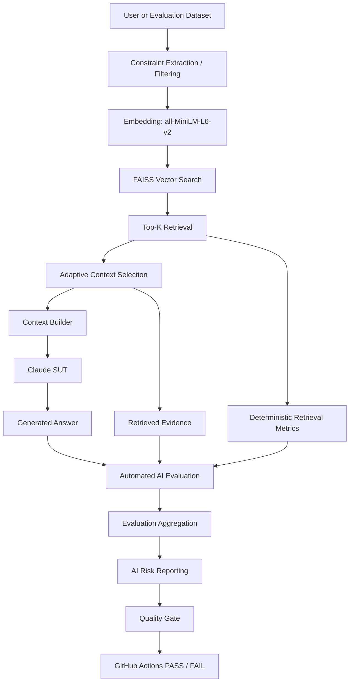
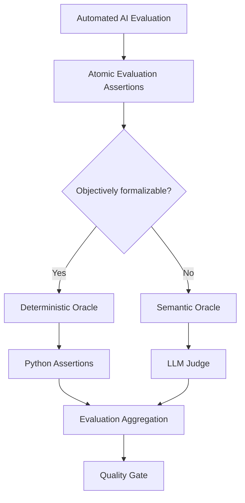
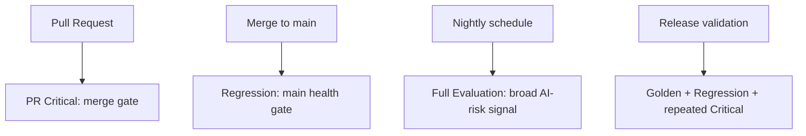

# AI QE Lab

Practical AI Quality Engineering lab for building, testing, evaluating, observing, and governing AI-enabled systems.

## Objective

The objective of this repository is to provide a reproducible, engineering-focused example of how an AI-enabled application can be quality-controlled as a real software system rather than tested only through manual prompting.

It demonstrates how teams can combine controlled datasets, RAG observability, deterministic Python checks, LLM-as-a-Judge evaluation, AI risk metadata, CI quality gates, operational telemetry, failure localization, and human governance into one traceable AI QE workflow.

The repository is intended to give engineers a practical reference for designing AI evaluation datasets, separating deterministic checks from semantic LLM evaluation, validating RAG retrieval/context/generated answers, mapping tests to AI risks, running risk-based CI evaluation, enforcing quality gates, tracking operational metrics, localizing failures, and extending the model toward QA/test-management agents.

---

## Project Workstreams

1. **Shopping RAG Assistant** — implemented and used as the current System Under Test (SUT).
2. **QA Agent** — planned; requirements review, readiness gating, AI-risk identification, test design, and dataset generation.
3. **Test Management Lifecycle Agent** — planned; programme-level test planning, monitoring, evidence, residual-risk, and release-governance support.

---

## Current Implemented Architecture



Detailed architecture: [`docs/architecture.md`](docs/architecture.md).

---

## Automated AI Evaluation — Deterministic and Semantic Oracles

Both paths are **test automation**. The difference is the oracle used to decide PASS/FAIL.



The design rule is:

> **Automate deterministically everything that can be expressed as an objective assertion. Use an LLM Judge only where semantic interpretation is genuinely required.**

Examples of deterministic assertions: IDs, numbers, booleans, ranges, schemas, catalogue membership, exact policy facts and structured product constraints. Examples of semantic assertions: safe refusal, ambiguity handling, out-of-domain abstention, prompt-injection resistance and unsupported semantic claims.

### Manually reviewed oracle classification

Critical, Regression and Nightly were manually reviewed case by case. All 105 cases now have a target oracle classification.

| Suite | Total | Deterministic | LLM Judge | Target Judge-call reduction |
|---|---:|---:|---:|---:|
| PR Critical | 10 | 6 | 4 | 60.0% |
| Regression | 15 | 7 | 8 | 46.7% |
| Nightly | 80 | 48 | 32 | 60.0% |
| **Total** | **105** | **61 (58.1%)** | **44 (41.9%)** | **58.1%** |

This is the reviewed **target routing**, not yet a claim that CI already achieves the reduction. Runtime implementation and validation are handled separately.

Full oracle rationale and case lists: [`docs/automated_ai_evaluation.md`](docs/automated_ai_evaluation.md).

---

## Diagnostic Architecture

```text
Retrieval Hit
    ↓
Constraint Match / Precision@K
    ↓
Context Coverage / Sufficiency
    ↓
Correctness / Groundedness / Hallucination / Constraint Adherence
```

This helps distinguish retrieval, context, generation and evaluator failures.

---

## Dataset Model

Datasets are defined by **purpose**, not inheritance; overlap is expected.

| Dataset | Purpose | Typical execution |
|---|---|---|
| **Golden** | Trusted reference behaviour and baseline validation | model/prompt/retrieval changes, release validation |
| **PR Critical** | Fast risk-based merge-blocking subset | pull request |
| **Regression** | Stable behaviour plus previously fixed defects | `main` health / post-merge |
| **Evaluation / Nightly** | Broad AI-risk surface, robustness, adversarial and edge coverage | nightly |

Current inventories: Golden 35, PR Critical 10, Regression 15, Nightly 80. Nightly keeps `Segment` as a test-design dimension and uses explicit canonical risk metadata in `datasets/evaluation_risk_metadata.json`.

Risk and oracle classification are separate dimensions:

```text
Risk      = what quality failure are we protecting against?
Assertion = what must this case prove?
Oracle    = what mechanism can prove it reliably?
```

---

## AI Risk Coverage

Cases carry explicit AI-risk metadata and the project builds an AI Risk Coverage Matrix across Critical, Regression and Nightly. Canonical risks include hallucination, groundedness, retrieval quality, constraint adherence, policy grounding, prompt injection, missing information, ambiguity, conflicting data, robustness, out-of-domain abstention, sensitive-data handling and negative behaviour.

`FULL`, `PARTIAL`, and `SINGLE_SUITE` describe distribution across dataset inventories; they are not pass/fail results.

---

## CI/CD Execution Model



Current gate model:

```text
Correctness           >= 95%
Groundedness          >= 95%
Retrieval Hit Rate    >= 95%
Constraint Adherence  >= 95%
Hallucination Rate    <= 2%
```

---

## Operational Telemetry and Cost Engineering

The framework records latency, SUT/Judge input/output tokens, cache telemetry, model IDs, API attempts and estimated cost. Operational metrics come from API counters and Python aggregation, not LLM judgment.

The oracle-classification work extends the existing cost-engineering principle: do not pay a semantic Judge to evaluate an assertion that can be proved reproducibly in Python.

---

## Failure Localization

```text
Query -> Retrieval -> Context -> Generation -> Evaluation -> Quality Gate
```

A gate failure is classified before changing model, prompt or threshold. Retrieval/oracle, context, generation, evaluator and infrastructure defects are different failure classes.

---

## Dataset Governance

`AI_QE_Lab_Datasets_and_Governance.xlsx` is the human-readable governance/review layer. JSON datasets are the executable CI representation.

```text
Requirement / Risk / Test Intent
 -> Human review/governance
 -> Approved executable JSON
 -> Automated evaluation
 -> Evidence / Defect / Regression
```

---

## Repository Structure

```text
.github/workflows/    GitHub Actions workflows
config/               Runtime configuration examples
data/                 Product catalogue and source data
datasets/             Golden, Critical, Regression and Evaluation datasets
docs/                 Architecture and design documentation
logs/                 Retrieval/context/LLM traces
policies/             Policy knowledge sources
reports/              Evaluation outputs and coverage reports
src/                  RAG, evaluation, reporting and gate implementation
tests/                Software-level tests
```

---

## Current State vs Planned Extensions

Implemented: Shopping RAG SUT, structured constraint filtering, FAISS retrieval/telemetry, controlled datasets, deterministic retrieval diagnostics, semantic Judge, AI-risk metadata/coverage, CI gates, retry policies, operational telemetry and cost optimization.

Planned: finalized deterministic/semantic routing implementation, Defect -> Regression automation, Jira traceability, Requirements Readiness Agent, AI Risk Analysis Agent, test-design agents, duplicate detection, human approval, Excel -> JSON export, QA Agent evaluation, Test Management Lifecycle Agent and programme-level release governance.

---

## Target Lifecycle

```text
Requirement
-> Requirements Review
-> Readiness Gate
-> AI Risk Analysis
-> Test Design
-> Functional Tests + AI Evaluation Cases
-> Duplicate Detection
-> Priority / Suite Classification
-> Human Approval
-> Governance Repository
-> JSON Dataset
-> CI Evaluation
-> Atomic Assertions
-> Deterministic / Semantic Oracle
-> Quality Gate
-> Defect / Evidence
-> Regression Coverage
-> Residual Risk / Release Decision
```
