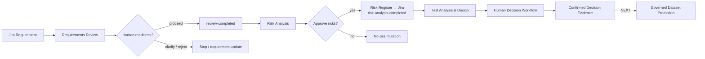
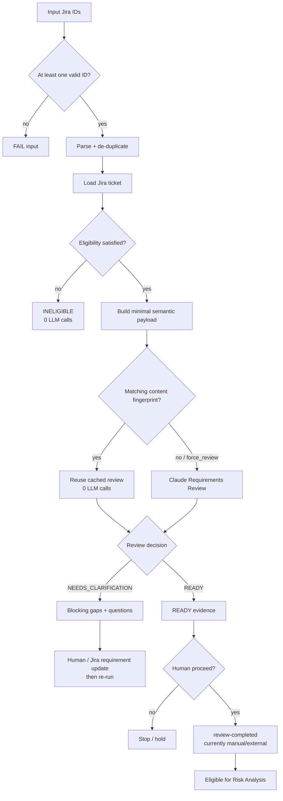
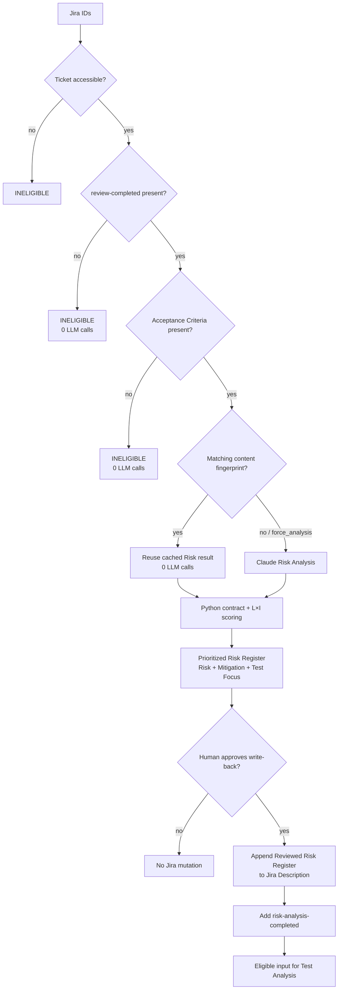
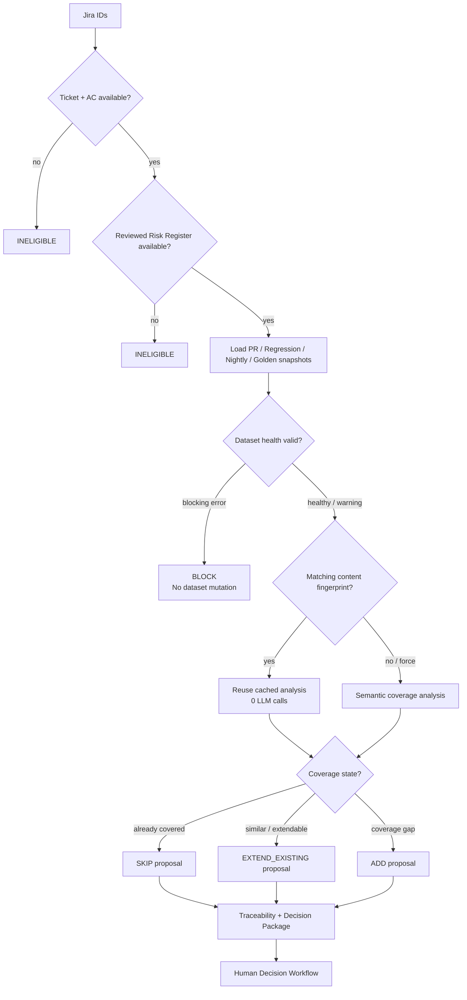
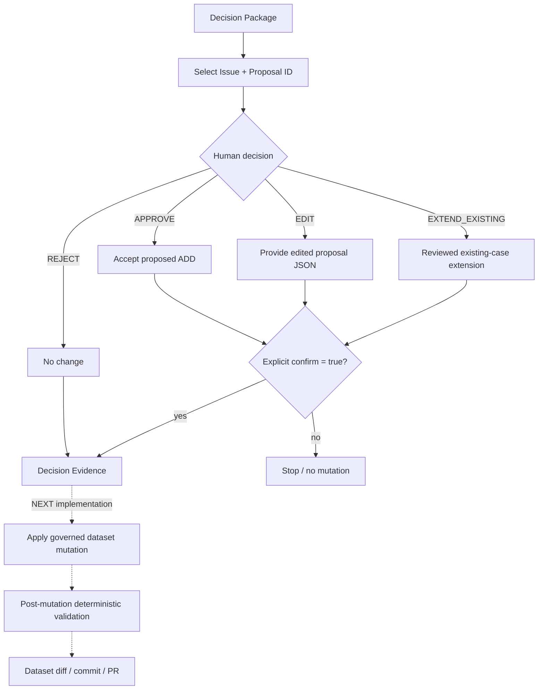
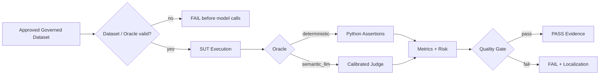

# Agentic QE Orchestration

_Last synchronized with repository: 2026-09-01._

## Purpose

Canonical source of truth for upstream Agentic QE/STLC orchestration. Agents create decision-support evidence and proposals; humans retain approval/mutation boundaries. Downstream SUT/evaluation remains an independent quality-control system.

## Overall implemented workflow

The next unimplemented boundary is **confirmed decision → governed dataset mutation/promotion**.

## Architectural rules

- **Understand → Identify Risks → Design Tests.** Agent responsibilities remain separated.
- **Deterministic before semantic.** Python owns parsing, eligibility, contracts, scoring, cache, dataset health and mutation controls.
- **Minimal context.** Each LLM receives only evidence needed for its responsibility.
- **Human mutation boundaries.** Semantic output remains a proposal until the relevant human gate is passed.
- **Per-ticket isolation.** One failed ticket must not abort valid tickets in a batch where isolation is implemented.
- **No silent dataset mutation.** Test Analysis never changes governed assets.

## 1. Requirements Review Agent — implemented decision flow

Requirements Review evaluates whether the Jira requirement itself is sufficient. External retrieval must not hide missing requirement behavior. Automatic approval → `review-completed` write-back is not implemented.

## 2. Risk Analysis Agent — implemented decision flow

Risk Analysis itself is read-only. The separate approval workflow owns Jira mutation.

## 3. Test Analysis & Design Agent — implemented decision flow

Similarity is decision evidence, not an automatic duplicate threshold. Runtime resilience includes strict Pydantic validation, schema instructions, known-alias normalization, bounded malformed/truncated-output retry and per-ticket failure isolation.

## 4. Human Decision — implemented decision flow

`Run workflow` is the explicit confirmation action. Today the workflow validates and records the decision; the dotted promotion path is deliberately marked as future because dataset mutation is not implemented yet.

### Decision semantics

| Agent recommendation / human action | Meaning |
|---|---|
| ADD → APPROVE | add a new proposed case after promotion is implemented |
| SKIP / REJECT | no governed change |
| EDIT | human changes the proposed new case before addition |
| EXTEND_EXISTING | exact reviewed BEFORE → AFTER modification of an existing case |

## 5. Downstream handoff

Golden canonical truth and Judge Calibration remain separate governance systems.

## Remaining orchestration roadmap

Only unimplemented work:

1. apply confirmed Human Decisions to governed JSON datasets;
2. generate exact BEFORE → AFTER change for `EXTEND_EXISTING`;
3. validate schema, IDs, references, Oracle contract and integrity after mutation;
4. produce governed dataset diff/commit/PR;
5. optionally automate Requirements Review approval → `review-completed` Jira write-back;
6. add targeted Risk evidence retrieval from architecture/rules/policies/specs/defects where justified;
7. add Agent Evaluation Dataset for tools, permissions, prohibited actions and HITL;
8. move to state-driven orchestration only after manual gates are stable and measurable;
9. add Confluence/test-management/release integrations only when required.

Drift testing remains outside the current roadmap.
