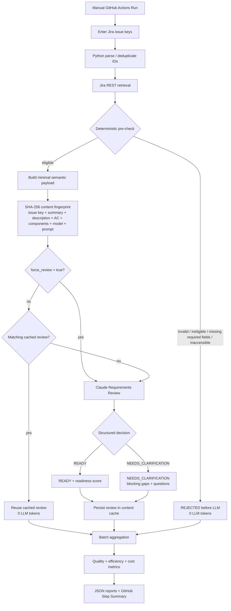
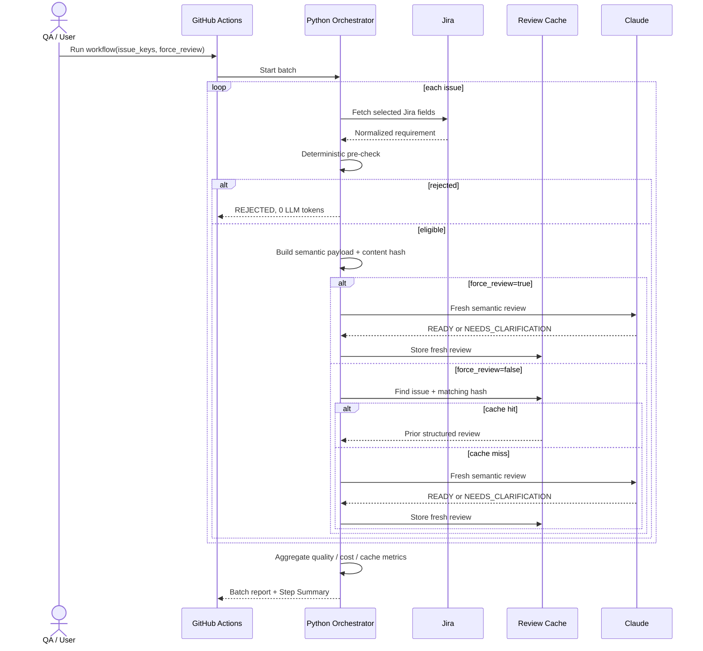
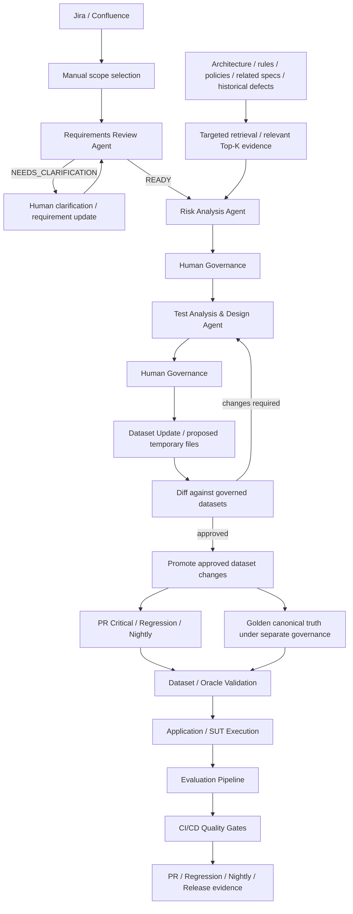

# Agentic QE Orchestration

## Purpose

This document is the repository-level source of truth for the Agentic QE orchestration and its architectural boundaries. The framework intentionally separates the application/SUT pipeline, evaluation pipeline, CI/CD quality pipeline, dataset governance, and upstream Agentic QE/STLC orchestration. These capabilities integrate through governed artifacts and evidence; they are not one mandatory monolithic pipeline.

## Framework pipeline model

```text
Application / SUT Pipeline
  executes the AI-enabled application and produces execution evidence

Evaluation Pipeline
  consumes execution evidence and applies deterministic assertions + semantic Judge evaluation

CI/CD Quality Pipeline
  runs governed suites and applies deterministic Quality Gates for PR / Regression / Nightly / Release

Dataset Governance Pipeline
  validates dataset contracts, Golden truth and proposed dataset changes before promotion

Agentic QE / STLC Orchestration
  Requirement Review → Risk Analysis → Test Analysis & Design → governed dataset proposal
```

On another project the Application and Evaluation pipelines may be deployed together or separately. Agentic QE orchestration remains an upstream QE workflow and should not be coupled to every application request.

## Architectural rules

### 1. Minimal-context principle

Every agent receives only the fields and evidence required for its decision. Requirements Review already follows this rule by sending only issue key, Summary, Description, Acceptance Criteria and Components rather than the full Jira object.

The same rule applies downstream:

```text
available project knowledge may be broad
→ retrieve/select only relevant evidence
→ build compact agent payload
→ send narrowly to the LLM
```

Risk Analysis must not receive an indiscriminate Jira/Confluence/architecture/defect dump. This controls context quality, token consumption and cost.

### 2. Human-first governance with a path to automation

The current POC deliberately uses manual workflow execution and Human-in-the-Loop approval at important transitions. Jira status or document changes do not automatically authorize chains of LLM calls.

Manual batch execution is especially useful when QA needs to review a scope such as 5–10 stories consistently and quickly. For a single simple story, manual human review may be cheaper and faster.

Human approval is initially expected after important semantic outputs, including Requirements Review where clarification is needed, Risk Analysis, generated test assets, and proposed dataset changes. If later evidence shows sufficiently high confidence, stable quality and acceptable client governance, selected gates may be automated. Automation is a maturity decision, not the POC default.

### 3. Test Analysis and Test Design remain one agent initially

The next test-generation component is one **Test Analysis & Design Agent**. It consumes validated requirements, approved/accepted structured risks and only relevant supporting evidence. Analysis and design should not be split into multiple LLM calls until a demonstrated responsibility or quality boundary justifies the extra orchestration and token cost.

### 4. Risk Analysis uses targeted retrieval

Requirements Review evaluates whether the requirement itself is explicit enough and must not use external retrieval to hide missing business behavior.

Risk Analysis is the first planned stage where cross-document retrieval/RAG adds material value. Candidate evidence includes architecture, business rules, policies, related specifications/stories and historical defects. Retrieval may search broadly, but only relevant Top-K evidence should be sent to the Risk Analysis Agent.

### 5. Dataset changes are proposals before promotion

Generated test/evaluation assets do not directly mutate governed datasets. The dataset stage should create a temporary/proposed JSON artifact by combining the current governed dataset with approved candidates. QA reviews the diff first; only an accepted diff is promoted into the canonical dataset.

The Dataset Update component should be Python-heavy and LLM-light: validate structure, classify suite placement, detect duplicates/conflicts and produce a proposed patch. Human approval remains the mutation boundary during the POC.

### 6. Golden is canonical truth, not merely another execution suite

PR Critical, Regression and Nightly are execution suites with different scope/cadence. Golden is the canonical trusted baseline with separate governance and validation controls. An agent must never rewrite Golden automatically because an evaluation failed.

### 7. Automated test-code generation is outside the current POC

The Test Analysis & Design Agent currently targets test/evaluation assets and dataset candidates. Generation of Playwright/Cypress/API automation code is a future extension and should enter normal source-control review and CI if introduced.

### 8. Cross-cutting controls

Observability, traceability, cost control and governance apply across the orchestration rather than forming another LLM pipeline. Preserve Requirement → Risk → Test → Dataset → Execution → Evaluation → Gate traceability together with model/prompt versions, tokens/cost, evidence and approval history where applicable.

## Current implemented orchestration — Requirements Review Agent



## Sequence view



## Cache / validation behavior

| Scenario | Expected behavior | Claude call |
|---|---|---:|
| Eligible story, same Summary / Description / AC / Components, same prompt/model | matching hash → cached structured review | No |
| Summary / Description / Acceptance Criteria / Components change | new hash → fresh review | Yes |
| Prompt or model changes | new hash → fresh review | Yes |
| `force_review=true` | bypass matching cache deliberately | Yes |
| Missing required Description or AC | deterministic pre-check rejection | No |
| Ineligible Jira status | deterministic pre-check rejection | No |

`force_review` is an explicit manual control used when QA intentionally wants a fresh semantic review despite an unchanged fingerprint.

## Planned target orchestration



### Agent responsibility chain

```text
Requirements Review
"Is the requirement itself sufficiently explicit?"
            ↓ READY
Risk Analysis
"What can go wrong?"
            ↓ approved risks + selected evidence
Test Analysis & Design
"What tests/evaluation cases should cover those risks?"
            ↓ approved assets
Dataset Update
"Where do approved assets belong, and what exact governed diff is proposed?"
```

The key retrieval rule remains:

```text
Retrieve broadly → select relevant evidence → send narrowly to the LLM
```

Risk Analysis, Test Analysis & Design, dataset proposal/promotion and full multi-agent state transitions are future implementation slices. Requirements Review is the first implemented upstream Agentic QE slice.
