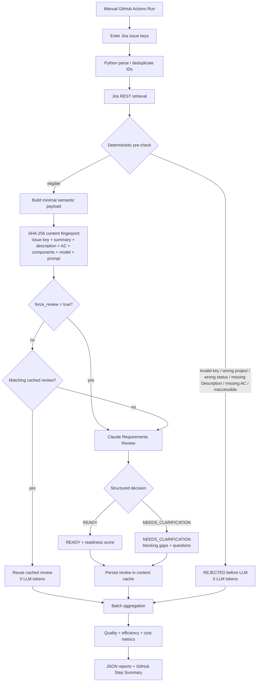
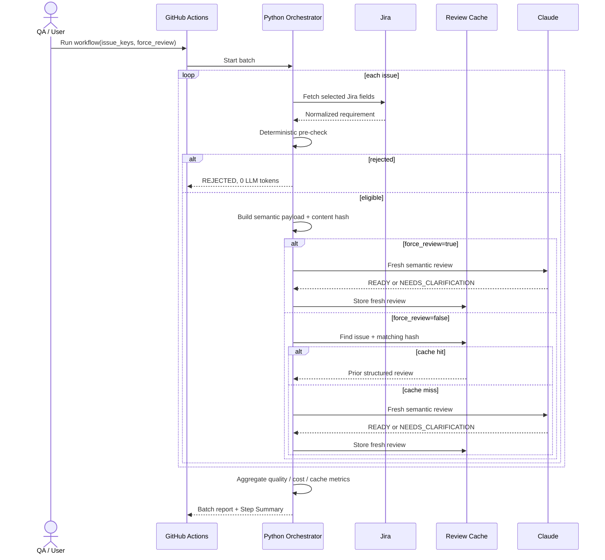
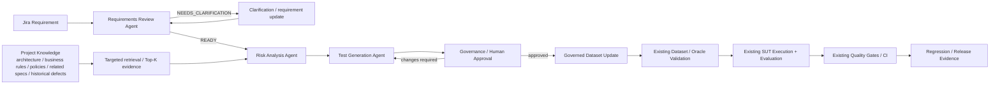

# Agentic QE Orchestration

## Purpose

This document separates the **implemented Requirements Review orchestration** from the downstream Agentic QE stages that are planned next. It is the current repository-level view of how Jira requirements enter the framework and how the first agent is controlled, cached, measured, and gated.

## Current implemented orchestration — Requirements Review Agent



## Sequence view



## Cache / validation behavior

| Scenario | Expected behavior | Claude call |
|---|---|---:|
| Eligible story, same Summary / Description / AC / Components, same prompt/model | matching hash → cached structured review | No |
| Summary changes | new hash → fresh review | Yes |
| Description changes | new hash → fresh review | Yes |
| Acceptance Criteria changes | new hash → fresh review | Yes |
| Components change | new hash → fresh review | Yes |
| Prompt or model changes | new hash → fresh review | Yes |
| `force_review=true` | bypass matching cache deliberately | Yes |
| Missing required Description or AC | deterministic pre-check rejection | No |
| Ineligible Jira status | deterministic pre-check rejection | No |

`force_review` is an explicit manual control in the GitHub Actions workflow. It is used when QA intentionally wants a fresh semantic review despite an unchanged content fingerprint, for example to investigate a suspicious cached result or perform a controlled repeat run.

## Batch metrics after POC closure

The batch report separates requirement quality from execution economics.

### Quality / workflow

- requested
- eligible after pre-check
- rejected before LLM
- READY
- NEEDS_CLARIFICATION
- failed during execution

### Efficiency / cost

- cache hits
- LLM attempts
- successful fresh LLM reviews
- cache hit rate
- LLM execution rate
- avoided LLM calls
- input tokens
- output tokens
- total tokens
- actual estimated batch cost

The framework deliberately reports **avoided LLM calls**, not fabricated cost savings. A cached story has a known avoided call, while hypothetical cost savings would depend on the story's token volume and are therefore not treated as an exact metric.

## Requirements Review POC closure boundary

After this slice is merged, Requirements Review is treated as the first validated Agentic QE component with the following responsibilities:

```text
Python
  Jira retrieval / normalization
  eligibility rules
  required-field presence checks
  minimal payload construction
  content fingerprinting
  cache decision
  force-review control
  execution orchestration
  telemetry / batch metrics

Claude Requirements Review Agent
  semantic ambiguity
  completeness / testability
  requirement-quality findings
  READY vs NEEDS_CLARIFICATION
  blocking gaps
  clarification questions
```

The Requirements Review Agent intentionally does **not** retrieve external documentation to repair an incomplete Jira story. Missing business behavior should remain visible as a requirement-quality gap.

## Planned downstream orchestration



### Boundary for the next agent

```text
Requirements Review
"Is the requirement itself sufficiently explicit?"
            ↓ READY
Risk Analysis
"What can go wrong, and what evidence do I need to assess that risk?"
            ↓
Test Generation
"What tests should cover those risks?"
```

Risk Analysis is the first planned stage where cross-document retrieval/RAG should be evaluated. The design principle is:

```text
Retrieve broadly → select relevant evidence → send narrowly to the LLM
```

Risk Analysis, Test Generation, HITL dataset promotion, and full multi-agent state transitions are future implementation slices and are not implemented by the Requirements Review closure PR.
