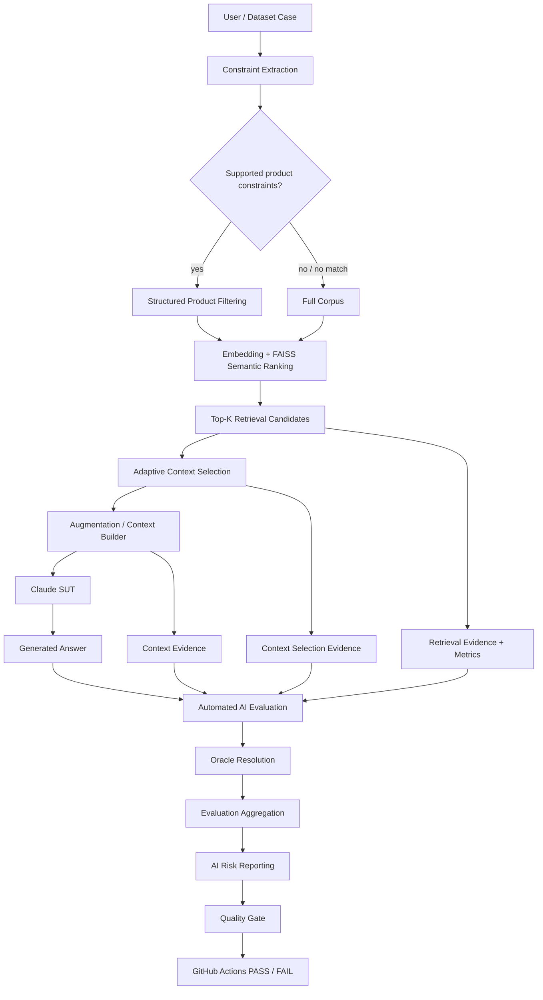
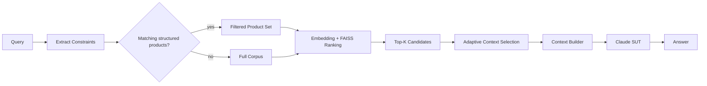
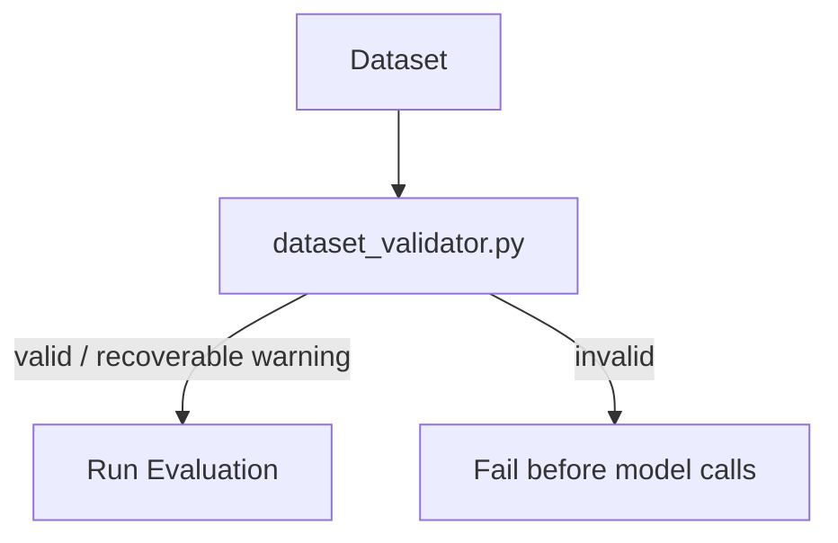
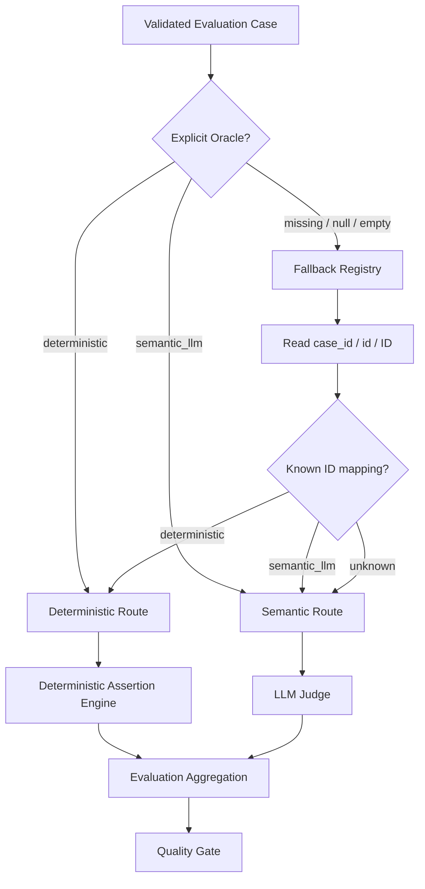
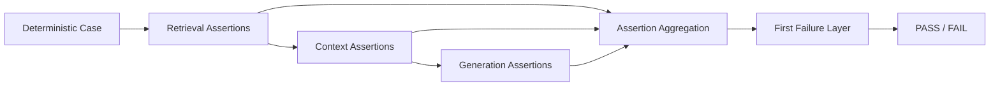
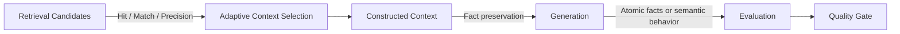
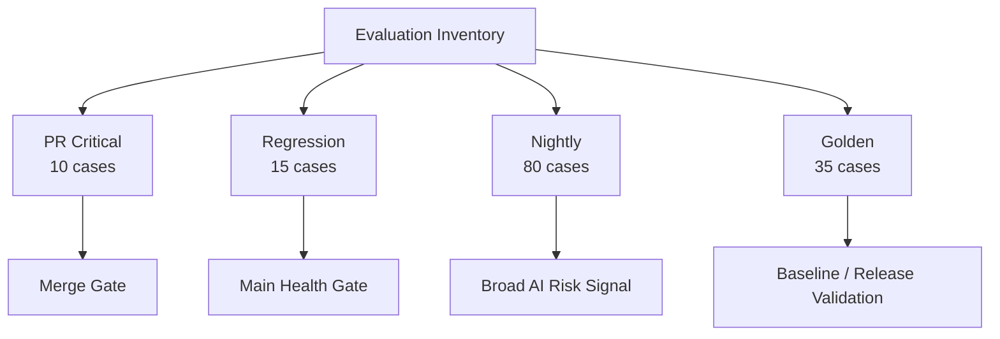
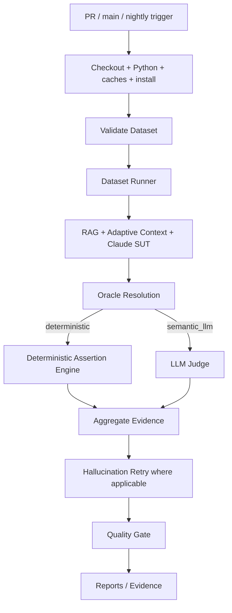
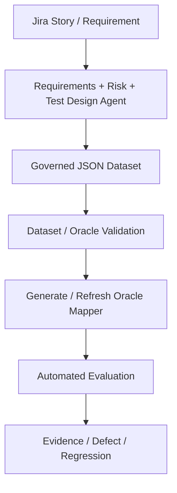

# AI QE Lab — Architecture

## 1. Purpose

The current executable SUT is the Shopping RAG Assistant. The surrounding AI QE framework provides controlled datasets, RAG observability, adaptive context selection, deterministic and semantic evaluation, AI-risk reporting, CI/CD quality gates, telemetry, evidence and governance.

---

## 2. Current System and Evaluation Architecture



The current code path is implemented in `constraint_filter.py`, `vector_store.py`, `context_selector.py`, `context_builder.py`, the dataset runners and `llm_client.py`.

---

## 3. Retrieval and Adaptive Context Selection

### Structured filtering happens before semantic ranking

For supported product constraints (`subcategory`, `waterproof`, `color`, `max_price`, `size`), `vector_store.search()` first applies deterministic structured filtering. If one or more products match, semantic ranking is performed only over that filtered product set. If no supported constraints are detected, or filtering returns no product, retrieval falls back to FAISS search over the full indexed corpus.



### Retrieval-K and Context-K are different

`Top-K Retrieval` is the ranked candidate evidence used for retrieval diagnostics. `Adaptive Context Selection` decides which of those candidates are actually sent to generation.

Default configuration:

```text
RAG_TOP_K=5
RAG_MIN_CONTEXT_K=2
RAG_MAX_CONTEXT_K=5
RAG_MIN_SIMILARITY=0.30
```

Selection rule:

1. retrieve up to `RAG_TOP_K` ranked candidates;
2. consider no more than `RAG_MAX_CONTEXT_K` candidates for context;
3. retain candidates whose cosine-similarity/IP score is `>= RAG_MIN_SIMILARITY`;
4. never add below-threshold evidence merely to satisfy `RAG_MIN_CONTEXT_K`;
5. therefore `RAG_MIN_CONTEXT_K` is a target floor, not a hard padding rule;
6. Context Builder receives only the selected subset.

Examples:

```text
candidate scores: 0.68, 0.61, 0.52, 0.22, 0.10
threshold: 0.30
selected Context-K: 3

candidate scores: 0.57, 0.18, 0.11
threshold: 0.30
selected Context-K: 1
```

This keeps weak evidence out of the prompt rather than injecting noise simply to reach a fixed context size.

Evaluation result JSON keeps retrieval candidates and context-selection metadata separately (`retrieval` vs `context_selection` / `context_k`).

---

## 4. Dataset Validation Before Execution

All active CI evaluation workflows validate their dataset before SUT/Judge execution.



Rules:

```text
deterministic      -> valid; non-empty Deterministic Assertions required
semantic_llm       -> valid
missing/null/empty -> warning; runtime mapper fallback allowed
invalid non-empty  -> validation ERROR
missing/duplicate ID -> validation ERROR
```

This applies to PR Critical, Regression and Nightly after dependency installation.

---

## 5. Oracle Resolution and Evaluation Hierarchy

The dataset Oracle is primary. Missing metadata uses the reviewed fallback registry in `judge_routing.py`; an unknown case safely defaults to the semantic route.



The Judge does not classify the Oracle. It only evaluates semantic PASS/FAIL after routing has selected `semantic_llm`.

> **Formal rule -> deterministic oracle. Meaning/behavior judgment -> semantic oracle.**

---

## 6. Deterministic Assertion Engine

The shared Python engine traces formal expectations through retrieval, selected context and final generation.



Supported assertion types include:

- `retrieved_id`
- `contains`
- `regex`
- `not_regex`
- `no_constraint_match`
- `answer_products_satisfy_constraints`
- `catalogue_min_price_product`

All reviewed deterministic cases are migrated to explicit structured assertions:

| Suite | Deterministic assertions | Semantic Judge |
|---|---:|---:|
| PR Critical | 6 | 4 |
| Regression | 7 | 8 |
| Nightly | 48 | 32 |
| **Total** | **61** | **44** |

Nightly deterministic assertions are loaded from `datasets/evaluation_assertion_metadata.json`.

---

## 7. Diagnostic Chain and Failure Localization



Typical localization:

| Failure signal | Primary investigation layer |
|---|---|
| Retrieval Hit fail | retrieval / source oracle |
| Constraint Match weak | constraint extraction / structured filtering / ranking |
| Precision@K weak | retrieval noise |
| expected evidence retrieved but filtered out by similarity | adaptive context selection / threshold calibration |
| selected evidence correct but context assertion fails | context builder / augmentation |
| retrieval + context pass but deterministic generation assertion fails | SUT generation / prompt / model behavior |
| retrieval + context pass but semantic Judge fails | semantic generation / prompt / model behavior |
| dataset validation error | dataset metadata / authoring |
| Oracle missing but ID known | runtime fallback / dataset governance |
| Provider 429/5xx/529 | external dependency / infrastructure |

---

## 8. Dataset and Execution Architecture



Datasets are organized by execution purpose, not inheritance. Overlap is normal.

---

## 9. CI/CD Architecture



Policy:

```text
PR Critical = merge gate
Regression  = main health gate
Nightly     = broad AI-risk signal
Release     = release validation gate
```

---

## 10. Resilience and Operational Telemetry

Provider/API retry handles transient delivery failures. Hallucination retry investigates stochastic semantic quality failures. They are separate controls.

Operational evidence includes retrieval IDs/ranks/scores, adaptive `context_k`, selected IDs/scores, SUT/Judge tokens, cache counters, latency/P95, model IDs, API attempts and estimated standard token cost.

The deterministic assertion engine requires no Judge tokens. The SUT still runs for deterministic and semantic cases because the generated answer is the object under test.

---

## 11. Governance Layer



Current product and policy files are controlled POC fixtures. The target is Jira/project knowledge -> governed JSON datasets -> validation -> CI. JSON is authoritative; the fallback mapper is a derived runtime safety layer.

---

## 12. Current vs Planned Architecture

### Implemented/current

- Shopping RAG Assistant;
- structured constraint extraction and product filtering;
- `all-MiniLM-L6-v2` embeddings and FAISS ranking;
- configurable Top-K retrieval candidates;
- adaptive similarity-based Context-K selection;
- deterministic context construction and Claude SUT generation;
- retrieval/context/LLM telemetry;
- Golden, PR Critical, Regression and Nightly datasets;
- Dataset/Oracle Validation in all three active workflows;
- reviewed Oracle routing with safe semantic fallback;
- 61 deterministic atomic-assertion cases / 44 semantic Judge cases;
- AI-risk reporting and coverage;
- quality gates, retry controls and cost optimization.

### Planned next

- generate/refresh the fallback Oracle mapper automatically from validated approved datasets;
- Defect -> Regression automation and Jira traceability;
- Requirements Readiness, AI Risk Analysis and Test Design agents;
- duplicate/coverage checks and HITL approval;
- QA Agent evaluation and Test Management Lifecycle Agent.

---

## 13. Target Traceability

```text
Requirement
-> AI Risk
-> Test / Evaluation Case
-> Dataset Validation
-> Oracle metadata
-> Structured Atomic Assertions
-> Retrieval Candidates
-> Adaptive Context Selection
-> Context / Generation Evidence
-> Deterministic Engine or Semantic Judge
-> Dataset / CI Level
-> Metric / Evidence
-> Quality Gate
-> Defect / Regression
-> Residual Risk
-> Release Decision
```
