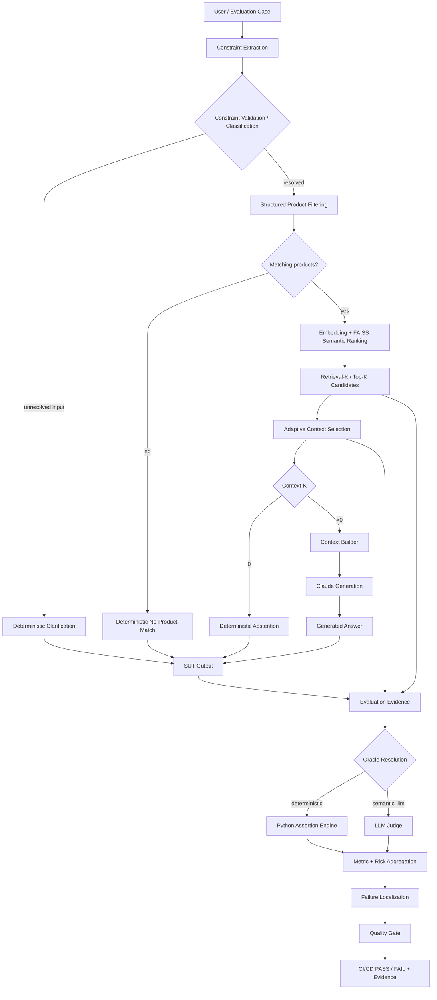
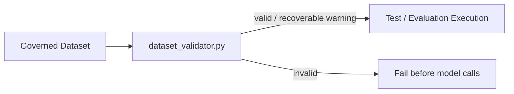
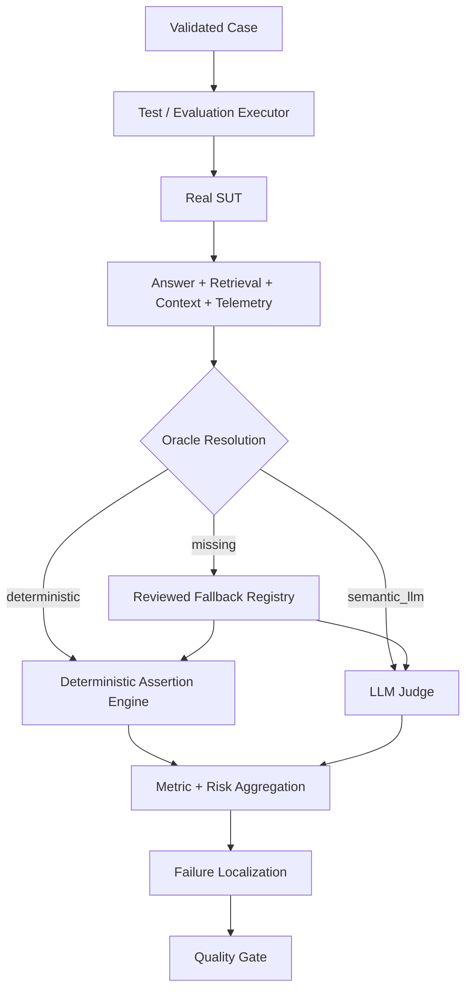
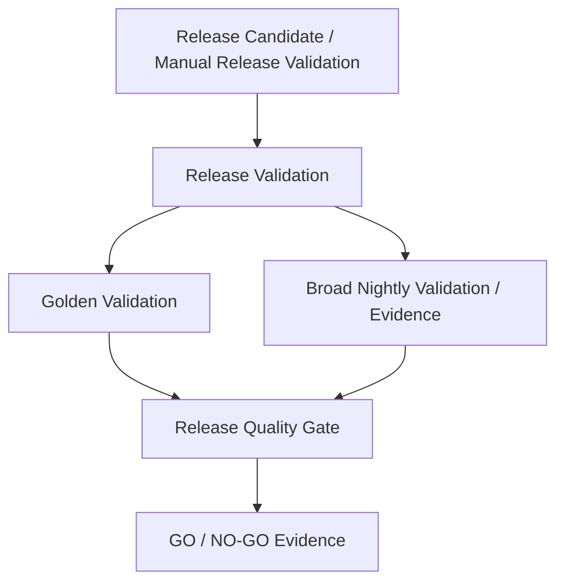
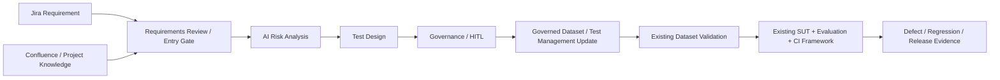

# AI QE Lab — Architecture

## 1. Purpose and architectural boundary

The executable reference SUT is the Shopping RAG Assistant. We built it because the POC needed a real AI application to test. On a real project, Development / AI Engineering normally already owns the application pipeline; QE first understands its architecture and observability, then builds the reusable quality framework around it.

```text
Reference SUT / Application Pipeline
        ↓
observable behavior + evidence
        ↓
AI QE Framework
Dataset Governance -> Validation -> Execution -> Evaluation -> Metrics -> Localization -> Gates -> CI/Release Evidence
```

---

## 2. Master architecture



Deterministic early responses are distinct behaviors:

- **Clarification** — input is unresolved and requires a governed user value; retrieval and Claude are skipped.
- **No-Product-Match** — resolved hard constraints match zero catalogue products; Claude is skipped.
- **Abstention** — request is understood but no evidence survives context selection (`Context-K=0`); Claude is skipped.

---

## 3. Reference SUT pipeline

```text
Query
-> Constraint Extraction
-> Constraint Validation
   -> unresolved -> Clarification
   -> resolved   -> Structured Filter
-> zero hard matches -> No-Product-Match
-> eligible candidates -> Semantic Ranking
-> Retrieval-K
-> Adaptive Context Selection
-> Context-K
   -> 0  -> Abstention
   -> >0 -> Context Builder -> Claude -> Answer
```

Current supported structured fields include `subcategory`, `waterproof`, `color`, `max_price`, and `size`.

Hard constraints are enforced before semantic relevance. A similarity score must not override a known price/color/waterproof/size/category requirement.

### Retrieval-K vs Context-K

```text
RAG_TOP_K=5
RAG_MIN_CONTEXT_K=2       # target, not padding requirement
RAG_MAX_CONTEXT_K=5
RAG_MIN_SIMILARITY=0.30
```

1. Semantic ranking returns up to Retrieval-K candidates.
2. Adaptive Context Selection filters weak evidence.
3. Evidence below the threshold is not padded merely to meet the minimum target.
4. Context-K is the actual evidence eligible for generation and can be `0..Retrieval-K`.
5. `Context-K=0` skips Claude.

---

## 4. Dataset Validation pipeline

Dataset Validation protects the executable test contract before expensive model calls.



Core contract:

```text
deterministic      -> non-empty deterministic assertions required
semantic_llm       -> valid semantic route
missing/null/empty -> warning; reviewed fallback allowed
invalid non-empty  -> validation ERROR
missing/duplicate ID -> validation ERROR
```

PR Critical, Regression and Nightly are validated before execution. Golden is validated when executed by Release Validation.

---

## 5. Test execution and evaluation pipeline

An Evaluation Case is a machine-readable test case. The executor is not another product architecture; it automates what a tester would otherwise do manually.



The Oracle decides **how observed behavior is evaluated**. It does not decide whether Claude was called. Deterministic SUT exits may skip Claude and still be evaluated through the appropriate Oracle.

The Judge never chooses the Oracle. Explicit governed dataset metadata is primary; fallback routing is resilience only.

Current reviewed routine-suite populations:

| Suite | Total | Deterministic | Semantic Judge |
|---|---:|---:|---:|
| PR Critical | 10 | 6 | 4 |
| Regression | 15 | 7 | 8 |
| Nightly | 80 | 48 | 32 |
| **Total** | **105** | **61** | **44** |

---

## 6. Failure localization

Investigation targets the first layer where expected behavior diverged.

| Failure signal | Primary layer |
|---|---|
| Dataset validation error | dataset / Oracle authoring |
| unresolved input handled incorrectly | constraint validation |
| hard constraint mismatch | extraction / filtering |
| expected evidence missing from Retrieval-K | retrieval / ranking |
| evidence retrieved but dropped | adaptive selector / threshold |
| selected evidence malformed or lost | context builder |
| evidence correct but final answer wrong | generation / prompt / model |
| semantic quality failure | generation / semantic behavior |
| provider 429/5xx/529 | external dependency |
| gate/report mismatch | evaluation / aggregation / quality gate |

---

## 7. Dataset and CI/CD model

Datasets are purpose-specific, not inheritance layers:

- **PR Critical** — fast merge-blocking risk subset.
- **Regression** — stable behavior and confirmed fixed-defect coverage.
- **Nightly** — broad AI-risk, edge and adversarial coverage.
- **Golden** — trusted canonical release/reference baseline.

Current executable trigger state:

```text
PR Critical        = automatic for meaningful PR changes
Regression         = manual-only
Nightly            = manual-only
Release Validation = manual-only
```

Release Validation is already implemented as a separate workflow level:



Golden and Nightly serve different purposes: Golden proves trusted canonical behavior; Nightly provides breadth. Target release governance requires both to represent the relevant release candidate/scope/SHA, with evidence reuse allowed when it is valid for that exact candidate.

---

## 8. Responsibility model

```text
Development / AI Engineering
  build and own the SUT/application pipeline
  implement retrieval/context/model/tooling and observability hooks

QE / Quality Architecture
  understand architecture and failure points
  define risks and expected behavior
  govern tests/datasets/Oracle metadata
  build Dataset Validation / evaluator / assertions / Judge routing
  define metrics, failure localization and quality gates
  design CI test levels and release evidence

Shared / Product / Release Governance
  business truth and risk acceptance
  CI/CD integration support
  release evidence and GO/NO-GO accountability
```

---

## 9. Current vs next

### Implemented

- reference Shopping RAG SUT with Constraint Extraction, Validation, Clarification, Structured Filtering, No-Product-Match, FAISS ranking, adaptive Context-K, Abstention, Context Builder and Claude generation;
- retrieval/context/model telemetry;
- Golden, PR Critical, Regression and Nightly datasets;
- Dataset/Oracle Validation;
- deterministic assertion engine + semantic LLM Judge;
- metric/risk aggregation, quality gates and failure localization;
- PR Critical, Regression, Nightly and Release Validation workflows.

### Next phase — Agentic QE / Governance



Agents create and govern quality inputs; they do not replace the existing evaluator or human release accountability.

---

## 10. Target traceability

```text
Requirement
-> Risk
-> Test / Evaluation Case
-> Governed Dataset / Test Management Asset
-> Dataset Validation
-> SUT Execution
-> Evidence
-> Oracle / Assertion / Judge
-> Metric / Risk
-> Failure Localization
-> Quality Gate
-> Defect / Regression
-> Residual Risk
-> Release Decision
```
