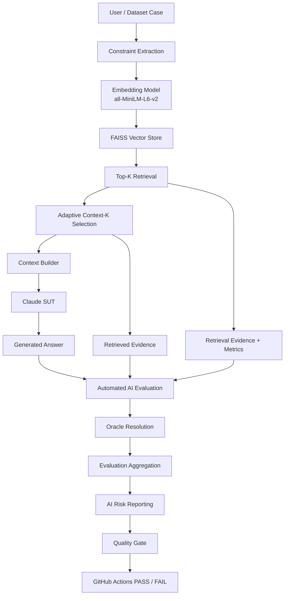
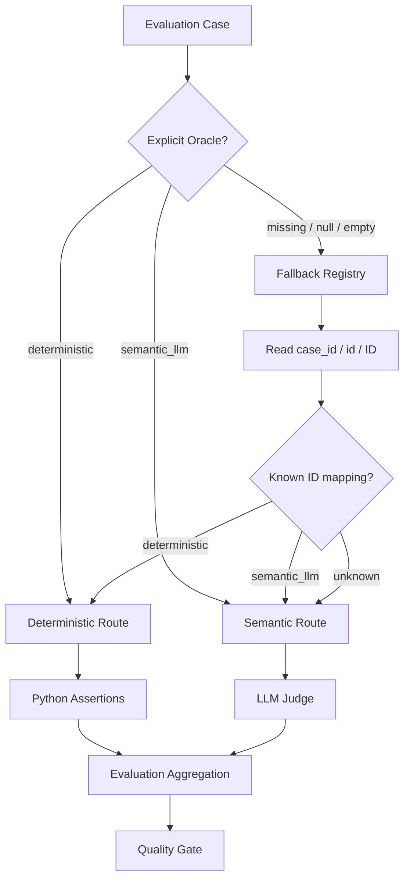
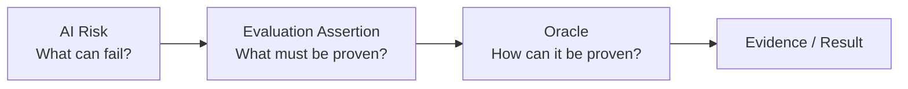
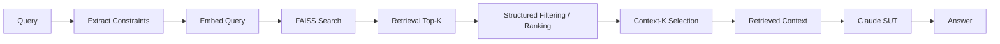
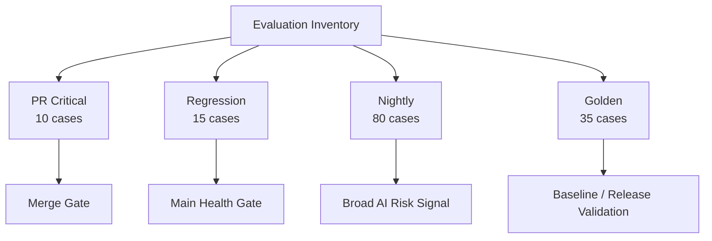
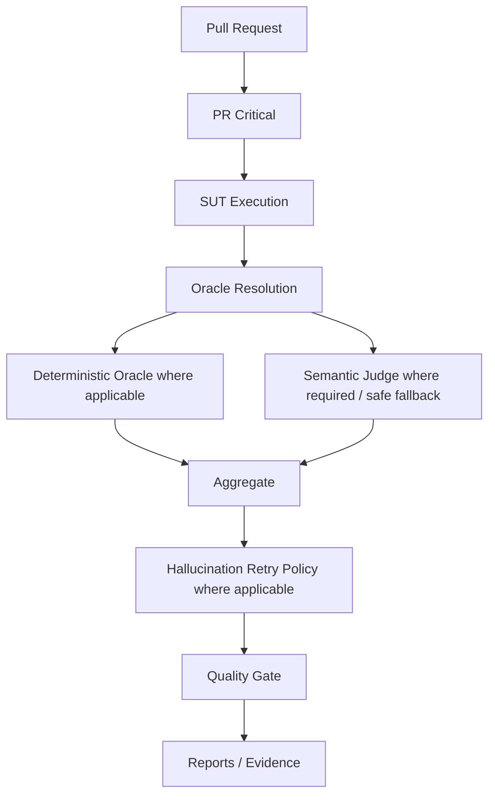
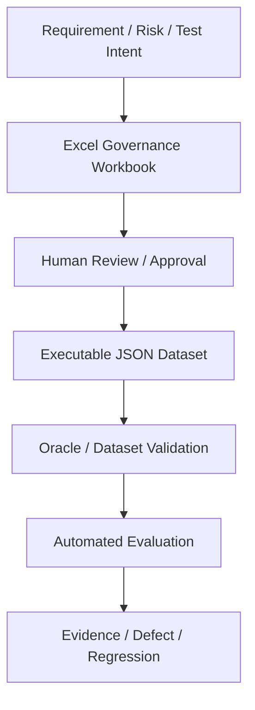

# AI QE Lab — Architecture

## 1. Purpose

The current executable SUT is the Shopping RAG Assistant. The surrounding AI QE framework provides controlled datasets, retrieval/context diagnostics, automated deterministic and semantic evaluation, AI-risk reporting, CI/CD quality gates, telemetry, evidence and governance.

---

## 2. System and Evaluation Architecture



---

## 3. Oracle Resolution and Evaluation Hierarchy

The evaluation layer first resolves which oracle route applies. The explicit dataset/runtime `Oracle` is primary. If it is missing, `judge_routing.py` provides a reviewed-ID fallback. If both are unavailable, routing safely defaults to the semantic Judge.



`case_id`, `id`, and `ID` are alternate field names for the same case identifier. The LLM Judge is not an Oracle classifier: on the final fallback, routing has already selected `semantic_llm`; the Judge only evaluates semantic PASS/FAIL.

Unknown cases are never guessed to be deterministic. A deterministic oracle requires a known formal assertion, so semantic evaluation is the safer fallback when classification metadata is unavailable.

### Atomicity principle

After routing, deterministic evaluation still needs explicit assertions proving the required behavior. Selecting `deterministic` is not itself a PASS condition.

```text
Case
 -> resolve Oracle
 -> one or more evaluation assertions
 -> deterministic and/or semantic evidence
 -> aggregate case result
```

This prevents an LLM Judge from being used for assertions such as `30 == 30`, `price <= 150`, `stock > 0`, `product_id == P-1001`, or `final_sale_returnable == false`, while also preventing deterministic routes from passing without proving their expected facts.

The engineering rule is:

> **Formal rule -> deterministic oracle. Meaning/behavior judgment -> semantic oracle.**

---

## 4. Manually Reviewed Oracle Classification

Critical, Regression and Nightly were manually reviewed. All 105 cases have a target oracle route; no case remains unresolved for deterministic-vs-semantic classification.

| Suite | Total | Deterministic | Semantic Judge | Target Judge-call reduction |
|---|---:|---:|---:|---:|
| PR Critical | 10 | 6 | 4 | 60.0% |
| Regression | 15 | 7 | 8 | 46.7% |
| Nightly | 80 | 48 | 32 | 60.0% |
| **Total** | **105** | **61 (58.1%)** | **44 (41.9%)** | **58.1%** |

The routing implementation now carries explicit Oracle metadata and the safe fallback described above. Complete deterministic atomic assertion coverage is the next implementation layer before treating all deterministic routes as fully proven.

### Critical

Deterministic: `G-001`, `G-002`, `G-003`, `G-032`, `G-033`, `G-034`.

Semantic: `G-004`, `G-005`, `G-031`, `G-035`.

### Regression

Deterministic: `R-001`, `R-007`, `R-008`, `R-010`, `R-011`, `R-013`, `R-015`.

Semantic: `R-002`, `R-003`, `R-004`, `R-005`, `R-006`, `R-009`, `R-012`, `R-014`.

### Nightly

Deterministic segments: `normal`, `negative`, `multi_constraint`, `conflict`, `paraphrase`, `long_query` = 48 cases.

Semantic segments: `ambiguous`, `out_of_domain`, `missing_info`, `adversarial` = 32 cases.

---

## 5. Risk, Assertion and Oracle Are Different Dimensions



Risk labels must not automatically select the Judge. The same risk can contain deterministic and semantic assertions depending on expected behavior.

---

## 6. Retrieval and Generation Flow



Retrieval Top-K is the broader evidence candidate set used for diagnostics. Context-K is the smaller evidence set actually sent to generation/evaluation when appropriate.

---

## 7. Diagnostic Chain and Failure Localization

```text
Retrieval Hit
 -> Constraint Match / Precision@K
 -> Context Coverage / Sufficiency
 -> Oracle resolution
 -> Deterministic factual/constraint assertions
 -> Semantic behavior assertions where required
 -> Quality Gate
```

Typical localization:

| Failure signal | Primary investigation layer |
|---|---|
| Retrieval Hit fail | retrieval / source oracle |
| Constraint Match weak | extraction/filtering/retrieval |
| Precision@K weak | retrieval noise |
| Context insufficient | evidence selection/context builder |
| Oracle missing but ID known | routing fallback / dataset governance |
| Oracle and ID mapping unknown | safe semantic fallback; classify case metadata |
| Deterministic factual assertion fail | SUT fact/business-rule behavior or oracle data |
| Semantic groundedness/safety fail | generation/prompt/evidence use |
| Provider 429/5xx/529 | external dependency/infrastructure |

---

## 8. Dataset and Execution Architecture



Datasets are organized by execution purpose, not inheritance. Nightly keeps `Segment` separate from canonical AI-risk metadata in `datasets/evaluation_risk_metadata.json`.

---

## 9. CI/CD Architecture



Policy:

```text
PR Critical = merge gate
Regression  = main health gate
Nightly     = broad AI-risk signal
Release     = release validation gate
```

---

## 10. Resilience and Operational Telemetry

Provider/API retry handles transient service failures. Hallucination retry investigates stochastic semantic quality failures. They solve different problems.

Operational telemetry includes SUT/Judge tokens, cache counters, latency, P95, model IDs, API attempts and estimated standard token cost. Python records/aggregates these values.

The oracle-routing design adds another cost-control layer: deterministic assertions should not incur Judge tokens when semantic reasoning provides no additional value. An unknown case may deliberately incur a Judge call through the safe semantic fallback rather than risk an unsupported deterministic PASS.

---

## 11. Governance Layer



`AI_QE_Lab_Datasets_and_Governance.xlsx` remains the human-readable governance layer; JSON is the executable representation.

Target governance: new cases explicitly declare `Oracle = deterministic` or `Oracle = semantic_llm`. Missing values may use fallback for compatibility; unsupported non-empty Oracle values should fail validation.

---

## 12. Current vs Planned Architecture

Implemented: Shopping RAG Assistant, retrieval/constraint/context pipeline, telemetry, controlled datasets, deterministic retrieval diagnostics, semantic Judge, manually reviewed oracle routing with explicit metadata and safe ID/semantic fallback, risk reporting/coverage, CI gates, retry policies and operational cost reporting.

Next implementation step: complete deterministic atomic assertions for the reviewed deterministic routes and add stricter dataset Oracle validation, then validate actual Judge-call reduction and unchanged quality behavior across Critical, Regression and Nightly.

Planned after that: Defect -> Regression lifecycle, Jira traceability, Requirements Readiness Agent, AI Risk Analysis Agent, Test Design Agent, duplicate detection, human approval, QA Agent evaluation and Test Management Lifecycle Agent.

---

## 13. Target Traceability

```text
Requirement
-> AI Risk
-> Test / Evaluation Case
-> Oracle metadata
-> Oracle resolution / fallback
-> Atomic Assertion
-> Deterministic or Semantic Oracle
-> Dataset / CI Level
-> Metric / Evidence
-> Quality Gate
-> Defect / Regression
-> Residual Risk
-> Release Decision
```
