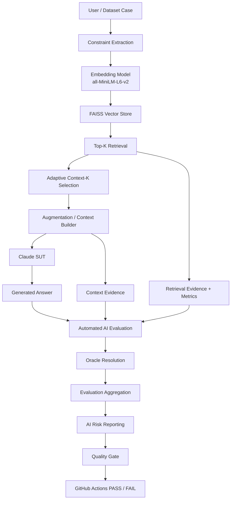
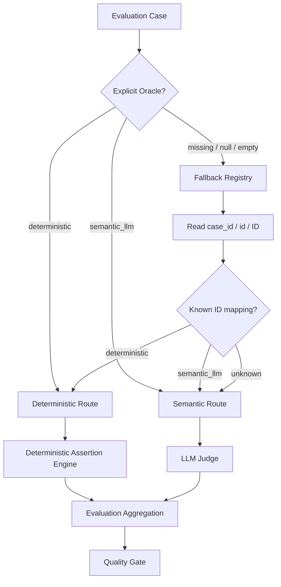
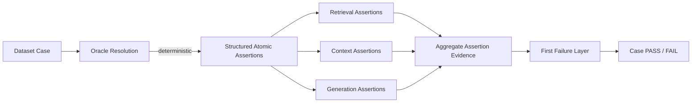
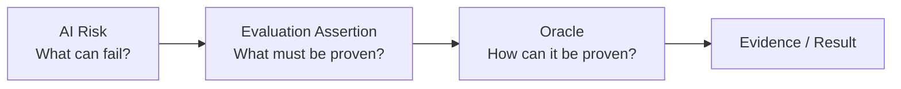
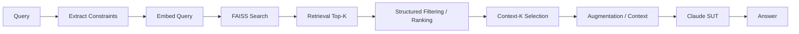
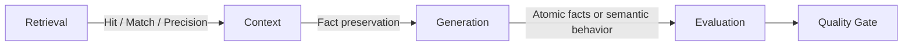
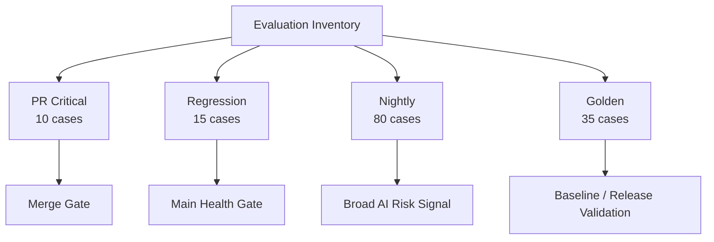
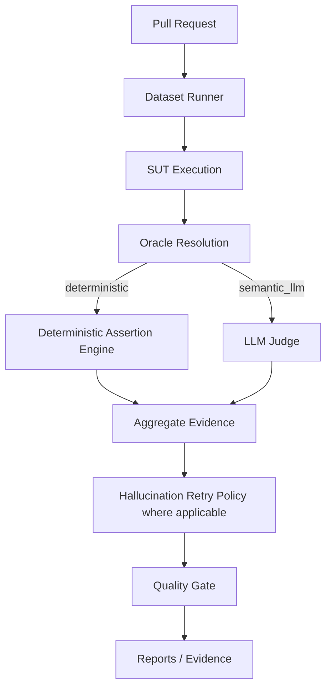
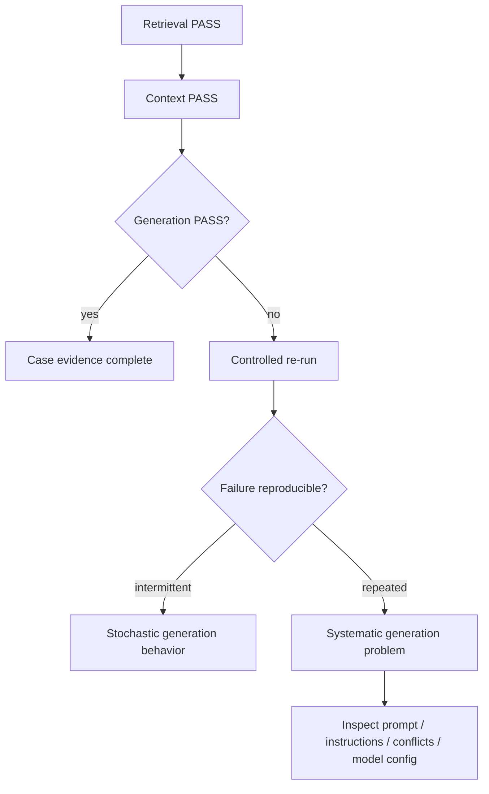
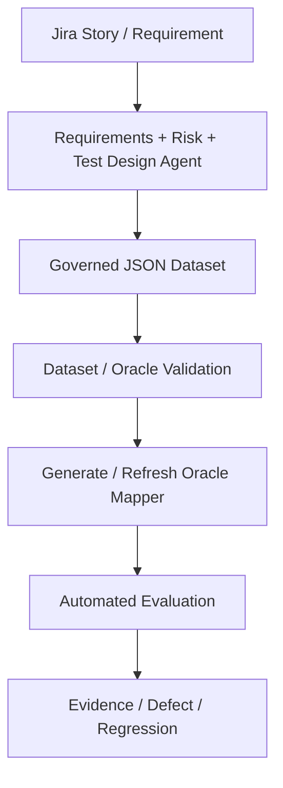

# AI QE Lab — Architecture

## 1. Purpose

The current executable SUT is the Shopping RAG Assistant. The surrounding AI QE framework provides controlled datasets, retrieval/context diagnostics, automated deterministic and semantic evaluation, AI-risk reporting, CI/CD quality gates, telemetry, evidence and governance.

---

## 2. System and Evaluation Architecture



---

## 3. Oracle Resolution and Evaluation Hierarchy

The evaluation layer first resolves which oracle route applies. The explicit dataset/runtime `Oracle` is primary. If it is missing, `judge_routing.py` provides a reviewed-ID fallback. If both are unavailable, routing safely defaults to the semantic Judge.



`case_id`, `id`, and `ID` are alternate field names for the same case identifier. The LLM Judge is not an Oracle classifier: on the final fallback, routing has already selected `semantic_llm`; the Judge only evaluates semantic PASS/FAIL.

Unknown cases are never guessed to be deterministic. A deterministic oracle requires a known formal assertion, so semantic evaluation is the safer fallback when classification metadata is unavailable.

### Atomicity principle

Selecting `Oracle = deterministic` only selects the verification mechanism. It does not prove that the generated answer is correct.



The deterministic engine therefore answers a different question from routing:

- **Routing:** should Python or the LLM Judge verify this behavior?
- **Assertion Engine:** if Python is selected, what exact facts/rules must be proven, and at which layer did they first fail?

The engineering rule remains:

> **Formal rule -> deterministic oracle. Meaning/behavior judgment -> semantic oracle.**

---

## 4. Deterministic Assertion Engine

The shared engine evaluates structured assertions without an LLM Judge. It preserves existing retrieval metrics and extends deterministic verification into context and final generation.

```mermaid
flowchart TD
    Q[Query / Expected Behavior] --> RET[Retrieval]
    RET --> R1[Retrieval Hit]
    RET --> R2[Constraint Match]
    RET --> R3[Precision@K]

    RET --> CTX[Augmentation / Context]
    CTX --> C1[Required facts preserved?]
    CTX --> C2[Expected IDs / values present?]

    CTX --> SUT[SUT LLM]
    SUT --> GEN[Generated Answer]
    GEN --> G1[Factual assertions]
    GEN --> G2[Boolean / threshold assertions]
    GEN --> G3[Expected product / constraint assertions]

    R1 --> A[Assertion Aggregation]
    R2 --> A
    R3 --> A
    C1 --> A
    C2 --> A
    G1 --> A
    G2 --> A
    G3 --> A
    A --> L[Failure Localization]
    L --> P[PASS / FAIL]
```

Example:

```text
Expected: return window = 30 days

Retrieval: returns_policy.md found        PASS
Context:   "30 days" preserved           PASS
Generation:"60 days" returned            FAIL

First failure layer = generation
```

The same mechanism can distinguish an augmentation defect:

```text
Retrieval:  black / M / Ukraine           PASS
Context:    black / M                     FAIL (Ukraine lost)
Generation: black / M                     FAIL

First failure layer = context
```

The engine does not create a new quality layer and does not replace existing retrieval metrics. It strengthens the deterministic oracle by tracing formal expectations through `retrieval -> context -> generation`.

Current implementation migrates the six deterministic PR Critical cases first. Regression and Nightly deterministic cases can then be migrated incrementally to the same structured assertion format.

---

## 5. Manually Reviewed Oracle Classification

Critical, Regression and Nightly were manually reviewed. All 105 cases have a target oracle route; no case remains unresolved for deterministic-vs-semantic classification.

| Suite | Total | Deterministic | Semantic Judge | Target Judge-call reduction |
|---|---:|---:|---:|---:|
| PR Critical | 10 | 6 | 4 | 60.0% |
| Regression | 15 | 7 | 8 | 46.7% |
| Nightly | 80 | 48 | 32 | 60.0% |
| **Total** | **105** | **61 (58.1%)** | **44 (41.9%)** | **58.1%** |

The assertion engine does **not** change this 61/44 classification. It makes the deterministic side stronger: cases already routed to Python now verify formal context/generation expectations rather than relying only on retrieval/constraint PASS.

### Critical

Deterministic: `G-001`, `G-002`, `G-003`, `G-032`, `G-033`, `G-034`.

Semantic: `G-004`, `G-005`, `G-031`, `G-035`.

### Regression

Deterministic: `R-001`, `R-007`, `R-008`, `R-010`, `R-011`, `R-013`, `R-015`.

Semantic: `R-002`, `R-003`, `R-004`, `R-005`, `R-006`, `R-009`, `R-012`, `R-014`.

### Nightly

Deterministic segments: `normal`, `negative`, `multi_constraint`, `conflict`, `paraphrase`, `long_query` = 48 cases.

Semantic segments: `ambiguous`, `out_of_domain`, `missing_info`, `adversarial` = 32 cases.

---

## 6. Risk, Assertion and Oracle Are Different Dimensions



Risk labels must not automatically select the Judge. The same risk can contain deterministic and semantic assertions depending on expected behavior.

---

## 7. Retrieval and Generation Flow



Retrieval Top-K is the broader evidence candidate set used for diagnostics. Context-K is the evidence actually passed into generation.

---

## 8. Diagnostic Chain and Failure Localization



Typical localization:

| Failure signal | Primary investigation layer |
|---|---|
| Retrieval Hit fail | retrieval / source oracle |
| Constraint Match weak | extraction/filtering/retrieval |
| Precision@K weak | retrieval noise |
| Retrieval PASS, context assertion FAIL | evidence selection / augmentation / context builder |
| Retrieval + context PASS, deterministic generation assertion FAIL | SUT generation / prompt / model behavior |
| Retrieval + context PASS, semantic Judge FAIL | semantic generation / prompt / model behavior |
| Oracle missing but ID known | routing fallback / dataset governance |
| Oracle and ID mapping unknown | safe semantic fallback; classify case metadata |
| Provider 429/5xx/529 | external dependency/infrastructure |

This is the core visibility improvement: the framework can identify where an expected fact first diverged, instead of reporting only a final case failure.

---

## 9. Dataset and Execution Architecture



Datasets are organized by execution purpose, not inheritance. Deterministic cases may additionally carry `Deterministic Assertions`, which are executable formal contracts consumed by the Python assertion engine.

---

## 10. CI/CD Architecture



Policy:

```text
PR Critical = merge gate
Regression  = main health gate
Nightly     = broad AI-risk signal
Release     = release validation gate
```

---

## 11. Probabilistic Generation and Re-runs

Even with perfect retrieval and context, the SUT LLM remains probabilistic at generation time.



A re-run is evidence about reproducibility, not a mechanism for making a failed test green.

---

## 12. Resilience and Operational Telemetry

Provider/API retry handles transient service failures. Hallucination retry investigates stochastic semantic quality failures. They solve different problems.

Operational telemetry includes SUT/Judge tokens, cache counters, latency, P95, model IDs, API attempts and estimated standard token cost. Python records/aggregates these values.

The deterministic assertion engine itself requires no Judge tokens. The SUT LLM still runs for both deterministic and semantic cases because the generated application response is the object under test.

---

## 13. Governance Layer



The current product catalogue and policy files are controlled POC fixtures used to prove the evaluation mechanics. The target architecture evolves toward Jira requirements plus a connected project knowledge base, with agents creating/updating governed JSON datasets directly.

The JSON dataset is authoritative. The Oracle mapper is a derived runtime safety layer, not a second manually maintained source of truth.

Oracle integrity rule:

```text
deterministic      -> Python assertion engine
semantic_llm       -> LLM Judge
missing/null/empty -> warning + mapper fallback
invalid non-empty  -> validation ERROR
```

---

## 14. Current vs Planned Architecture

Implemented/current evolution: Shopping RAG Assistant, retrieval/constraint/context pipeline, telemetry, controlled datasets, deterministic retrieval diagnostics, semantic Judge, manually reviewed oracle routing with explicit metadata and safe fallback, risk reporting/coverage, CI gates, retry policies, operational cost reporting, plus the Deterministic Assertion Engine implementation for PR Critical deterministic cases.

Next hardening: migrate Regression and Nightly deterministic cases to explicit structured assertions; add stricter dataset assertion/Oracle validation; validate failure-localization evidence and quality-gate behavior across all suites.

Planned after that: Defect -> Regression lifecycle, Jira traceability, Requirements Readiness Agent, AI Risk Analysis Agent, Test Design Agent, duplicate detection, human approval, QA Agent evaluation and Test Management Lifecycle Agent.

---

## 15. Target Traceability

```text
Requirement
-> AI Risk
-> Test / Evaluation Case
-> Oracle metadata
-> Structured Atomic Assertions
-> Retrieval / Context / Generation Evidence
-> Deterministic Engine or Semantic Judge
-> Dataset / CI Level
-> Metric / Evidence
-> Quality Gate
-> Defect / Regression
-> Residual Risk
-> Release Decision
```