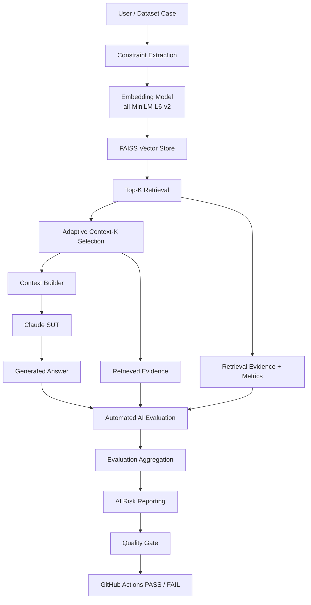
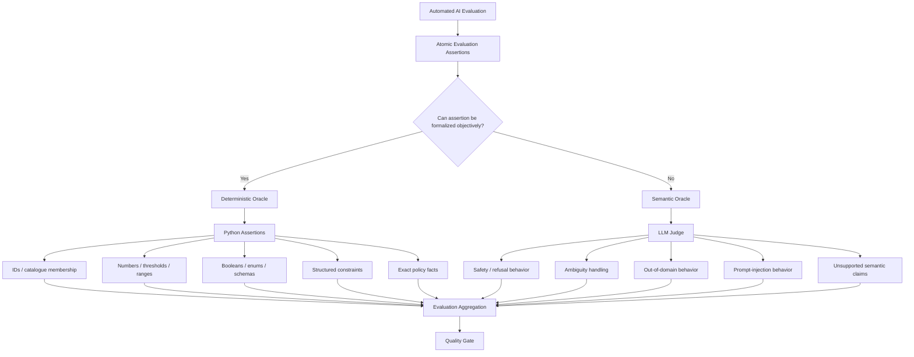
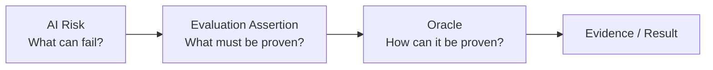
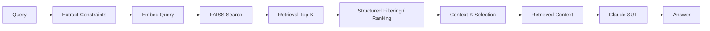
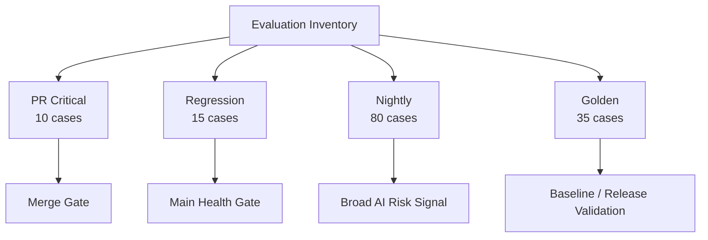
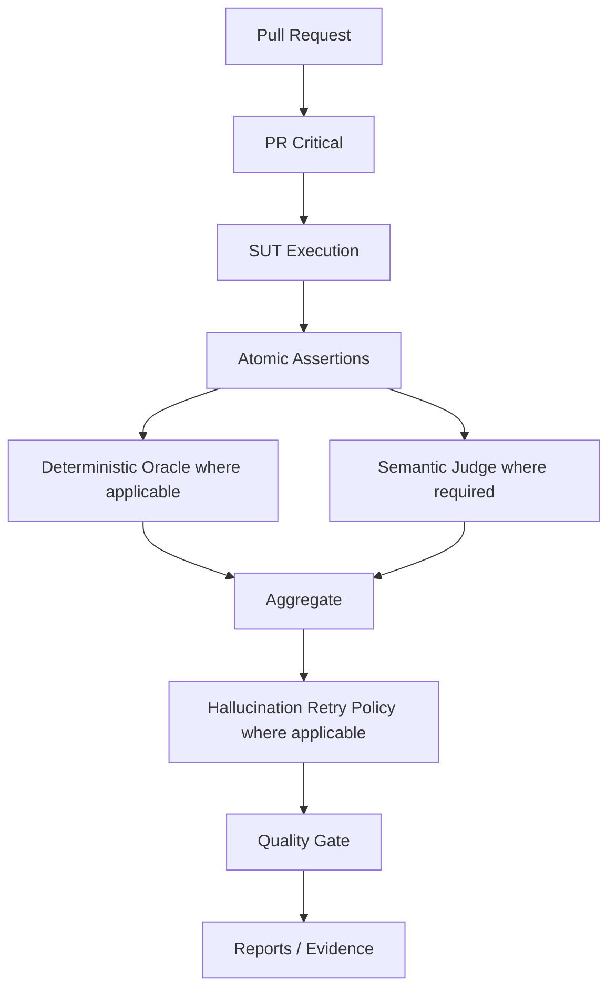
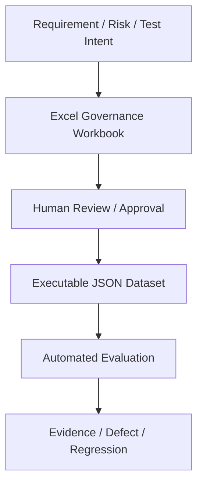

# AI QE Lab — Architecture

## 1. Purpose

The current executable SUT is the Shopping RAG Assistant. The surrounding AI QE framework provides controlled datasets, retrieval/context diagnostics, automated deterministic and semantic evaluation, AI-risk reporting, CI/CD quality gates, telemetry, evidence and governance.

---

## 2. System and Evaluation Architecture



---

## 3. Automated AI Evaluation Hierarchy

The evaluation layer is not `automation versus AI`. Both oracle paths are automated. The distinction is how an **atomic evaluation assertion** is proven.



### Atomicity principle

Do not ask whether an entire AI case is inherently deterministic or semantic before decomposing what it must prove.

```text
Case
 -> one or more evaluation assertions
 -> oracle selection per assertion
 -> deterministic and/or semantic evidence
 -> aggregate case result
```

This prevents an LLM Judge from being used for assertions such as `30 == 30`, `price <= 150`, `stock > 0`, `product_id == P-1001`, or `final_sale_returnable == false`.

The engineering rule is:

> **Formal rule -> deterministic oracle. Meaning/behavior judgment -> semantic oracle.**

---

## 4. Manually Reviewed Oracle Classification

Critical, Regression and Nightly were manually reviewed. All 105 cases have a target oracle route; no case remains unresolved for deterministic-vs-semantic classification.

| Suite | Total | Deterministic | Semantic Judge | Target Judge-call reduction |
|---|---:|---:|---:|---:|
| PR Critical | 10 | 6 | 4 | 60.0% |
| Regression | 15 | 7 | 8 | 46.7% |
| Nightly | 80 | 48 | 32 | 60.0% |
| **Total** | **105** | **61 (58.1%)** | **44 (41.9%)** | **58.1%** |

These figures describe the approved routing design. They become measured runtime savings only after implementation and CI validation.

### Critical

Deterministic: `G-001`, `G-002`, `G-003`, `G-032`, `G-033`, `G-034`.

Semantic: `G-004`, `G-005`, `G-031`, `G-035`.

### Regression

Deterministic: `R-001`, `R-007`, `R-008`, `R-010`, `R-011`, `R-013`, `R-015`.

Semantic: `R-002`, `R-003`, `R-004`, `R-005`, `R-006`, `R-009`, `R-012`, `R-014`.

### Nightly

Deterministic segments: `normal`, `negative`, `multi_constraint`, `conflict`, `paraphrase`, `long_query` = 48 cases.

Semantic segments: `ambiguous`, `out_of_domain`, `missing_info`, `adversarial` = 32 cases.

---

## 5. Risk, Assertion and Oracle Are Different Dimensions



Risk labels must not automatically select the Judge. The same risk can contain deterministic and semantic assertions depending on expected behavior.

---

## 6. Retrieval and Generation Flow



Retrieval Top-K is the broader evidence candidate set used for diagnostics. Context-K is the smaller evidence set actually sent to generation/evaluation when appropriate.

---

## 7. Diagnostic Chain and Failure Localization

```text
Retrieval Hit
 -> Constraint Match / Precision@K
 -> Context Coverage / Sufficiency
 -> Deterministic factual/constraint assertions
 -> Semantic behavior assertions where required
 -> Quality Gate
```

Typical localization:

| Failure signal | Primary investigation layer |
|---|---|
| Retrieval Hit fail | retrieval / source oracle |
| Constraint Match weak | extraction/filtering/retrieval |
| Precision@K weak | retrieval noise |
| Context insufficient | evidence selection/context builder |
| Deterministic factual assertion fail | SUT fact/business-rule behavior or oracle data |
| Semantic groundedness/safety fail | generation/prompt/evidence use |
| Provider 429/5xx/529 | external dependency/infrastructure |

---

## 8. Dataset and Execution Architecture



Datasets are organized by execution purpose, not inheritance. Nightly keeps `Segment` separate from canonical AI-risk metadata in `datasets/evaluation_risk_metadata.json`.

---

## 9. CI/CD Architecture



Policy:

```text
PR Critical = merge gate
Regression  = main health gate
Nightly     = broad AI-risk signal
Release     = release validation gate
```

---

## 10. Resilience and Operational Telemetry

Provider/API retry handles transient service failures. Hallucination retry investigates stochastic semantic quality failures. They solve different problems.

Operational telemetry includes SUT/Judge tokens, cache counters, latency, P95, model IDs, API attempts and estimated standard token cost. Python records/aggregates these values.

The oracle-routing design adds another cost-control layer: deterministic assertions should not incur Judge tokens when semantic reasoning provides no additional value.

---

## 11. Governance Layer



`AI_QE_Lab_Datasets_and_Governance.xlsx` remains the human-readable governance layer; JSON is the executable representation.

---

## 12. Current vs Planned Architecture

Implemented: Shopping RAG Assistant, retrieval/constraint/context pipeline, telemetry, controlled datasets, deterministic retrieval diagnostics, semantic Judge, risk reporting/coverage, CI gates, retry policies and operational cost reporting.

Next implementation step: encode the manually approved 61 deterministic / 44 semantic routes in the evaluator and datasets, then validate actual Judge-call reduction and unchanged quality behavior in CI.

Planned after that: Defect -> Regression lifecycle, Jira traceability, Requirements Readiness Agent, AI Risk Analysis Agent, Test Design Agent, duplicate detection, human approval, QA Agent evaluation and Test Management Lifecycle Agent.

---

## 13. Target Traceability

```text
Requirement
-> AI Risk
-> Test / Evaluation Case
-> Atomic Assertion
-> Deterministic or Semantic Oracle
-> Dataset / CI Level
-> Metric / Evidence
-> Quality Gate
-> Defect / Regression
-> Residual Risk
-> Release Decision
```
