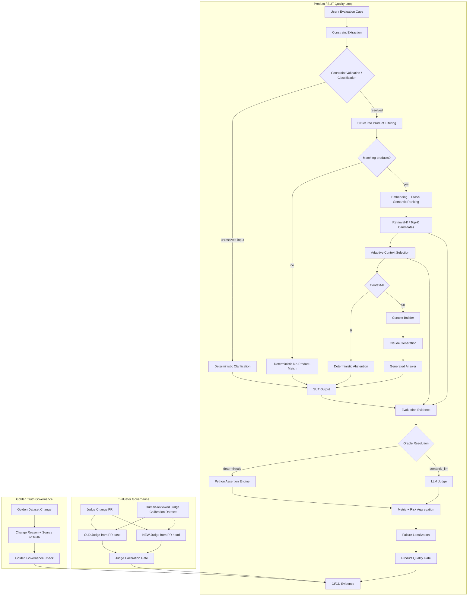
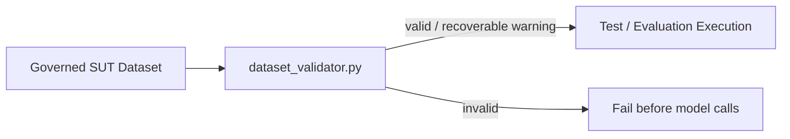
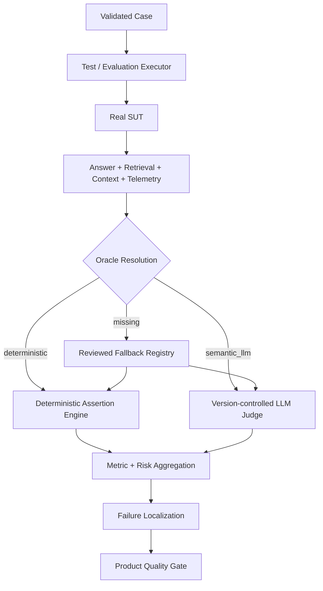
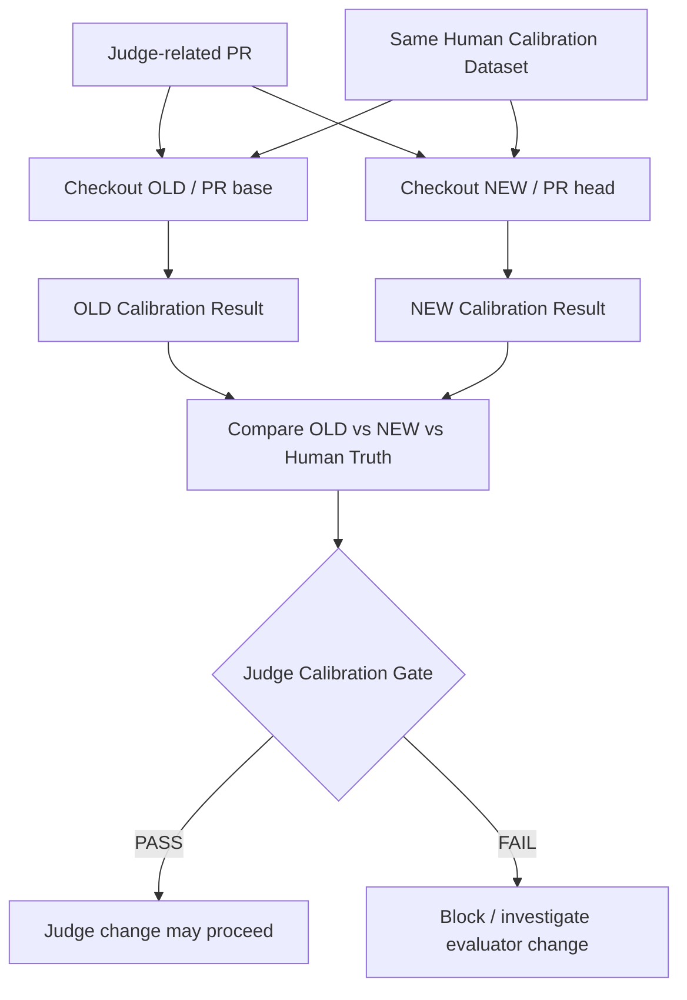
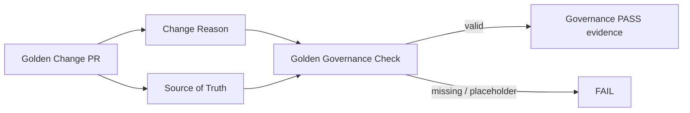
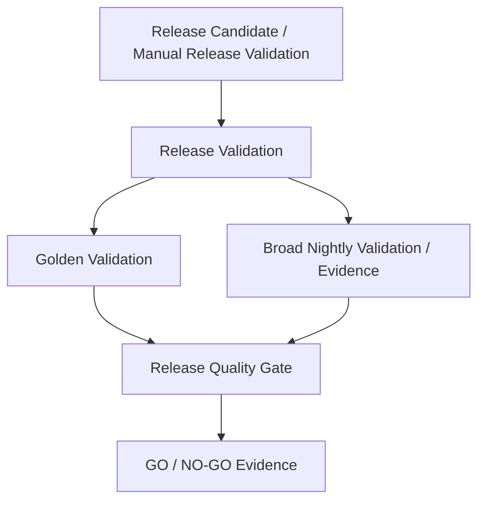
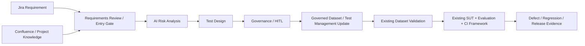

# AI QE Lab — Architecture

## 1. Purpose and architectural boundary

The executable reference SUT is the Shopping RAG Assistant. We built it because the POC needed a real AI application to test. On a real project, Development / AI Engineering normally already owns the application pipeline; QE first understands its architecture and observability, then builds the reusable quality framework around it.

The framework now has three distinct control loops:

```text
1. PRODUCT QUALITY
Reference SUT / Application Pipeline
        ↓
observable behavior + evidence
        ↓
Dataset Validation -> Execution -> Evaluation -> Metrics -> Localization -> Product Quality Gate

2. EVALUATOR QUALITY
Judge Model + Prompt + Rubric change
        ↓
OLD vs NEW on Human Calibration Truth
        ↓
Judge Calibration Gate

3. CANONICAL TRUTH GOVERNANCE
Golden expected-behavior change
        ↓
Reason + Source of Truth
        ↓
Golden Governance Check
```

This separation matters because three different questions are being answered:

- **Is the product behavior acceptable?**
- **Is the evaluator that judges semantic behavior still trustworthy?**
- **Is a change to canonical expected truth legitimate and auditable?**

---

## 2. Master architecture



Deterministic early responses are distinct behaviors:

- **Clarification** — input is unresolved and requires a governed user value; retrieval and Claude are skipped.
- **No-Product-Match** — resolved hard constraints match zero catalogue products; Claude is skipped.
- **Abstention** — request is understood but no evidence survives context selection (`Context-K=0`); Claude is skipped.

---

## 3. Reference SUT pipeline

```text
Query
-> Constraint Extraction
-> Constraint Validation
   -> unresolved -> Clarification
   -> resolved   -> Structured Filter
-> zero hard matches -> No-Product-Match
-> eligible candidates -> Semantic Ranking
-> Retrieval-K
-> Adaptive Context Selection
-> Context-K
   -> 0  -> Abstention
   -> >0 -> Context Builder -> Claude -> Answer
```

Current supported structured fields include `subcategory`, `waterproof`, `color`, `max_price`, and `size`.

Hard constraints are enforced before semantic relevance. A similarity score must not override a known price/color/waterproof/size/category requirement.

### 3.1 Classic RAG vs the detailed lab architecture

At the conceptual level, classic RAG is:

```text
R — Retrieval
↓
A — Augmentation
↓
G — Generation
```

The lab deliberately decomposes each stage into observable engineering steps:

```text
RETRIEVAL
├─ Constraint Extraction / Validation
├─ Structured Product Filtering
├─ Embedding + FAISS Semantic Ranking
└─ Retrieval-K / Top-K Candidates

AUGMENTATION
├─ Adaptive Context Selection
├─ Retrieval-K → Context-K
├─ Selected evidence IDs / similarity scores
├─ Context Builder
└─ Final Context passed to generation

GENERATION
├─ Claude model invocation
└─ Generated Answer / SUT Output
```

`Context Selection` and `Context Building` are parts of **Augmentation**. Retrieval finds/ranks candidate evidence; augmentation decides which evidence is actually supplied to the model and constructs the final context; generation uses that context to produce the answer.

The QE framework measures quality at those boundaries:

```text
RETRIEVAL
│  Retrieval Hit
│  Constraint Match
│  Precision@K
↓
AUGMENTATION
│  Retrieval-K → Context-K
│  Selected IDs / scores
│  Context atomic assertions
│  Context Coverage
│  Context Sufficiency
↓
GENERATION
│  Generation atomic assertions
│  Correctness
│  Groundedness
│  Hallucination
│  Constraint Adherence
↓
OVERALL QUALITY
│  Pass Rate
│  AI Risk outcomes
↓
OPERATIONS
   Latency
   Tokens
   Cost
```

This does not redefine RAG. It makes Retrieval -> Augmentation -> Generation observable and testable at finer-grained boundaries.

### 3.2 Retrieval-K vs Context-K

```text
RAG_TOP_K=5
RAG_MIN_CONTEXT_K=2       # target, not padding requirement
RAG_MAX_CONTEXT_K=5
RAG_MIN_SIMILARITY=0.30
```

1. Semantic ranking returns up to Retrieval-K candidates.
2. Adaptive Context Selection filters weak evidence.
3. Evidence below the threshold is not padded merely to meet the minimum target.
4. Context-K is the actual evidence eligible for generation and can be `0..Retrieval-K`.
5. `Context-K=0` skips Claude.

---

## 4. Dataset Validation pipeline

Dataset Validation protects the executable SUT test contract before expensive model calls.



Core contract:

```text
deterministic      -> non-empty deterministic assertions required
semantic_llm       -> valid semantic route
missing/null/empty -> warning; reviewed fallback allowed
invalid non-empty  -> validation ERROR
missing/duplicate ID -> validation ERROR
```

PR Critical, Regression and Nightly are validated before execution. Golden is validated when executed by Release Validation.

The Judge Calibration Dataset is separate: it is a human-reviewed evaluator test asset, not part of the SUT routing inventory.

---

## 5. Test execution and product-evaluation pipeline

An Evaluation Case is a machine-readable test case. The executor automates what a tester would otherwise do manually.



The Oracle decides **how observed behavior is evaluated**. It does not decide whether Claude was called. Deterministic SUT exits may skip Claude and still be evaluated through the appropriate Oracle.

The Judge never chooses the Oracle. Explicit governed dataset metadata is primary; fallback routing is resilience only.

Current reviewed routine-suite populations:

| Suite | Total | Deterministic | Semantic Judge |
|---|---:|---:|---:|
| PR Critical | 10 | 6 | 4 |
| Regression | 15 | 7 | 8 |
| Nightly | 80 | 48 | 32 |
| **Total** | **105** | **61** | **44** |

---

## 6. Version-controlled Judge configuration

The semantic evaluator is no longer defined only by runtime environment variables or an embedded string. Its behavior is explicitly version-controlled:

```text
config/judge_config.json
  primary model
  optional light model
  prompt version
  rubric version

config/judge_prompt.txt
  evaluator instruction

config/judge_rubric.txt
  semantic scoring interpretation
```

Production evaluation loads the same approved assets that are subject to calibration. A runtime model value that conflicts with the version-controlled model configuration is rejected rather than silently changing evaluator behavior.

Evaluation telemetry records Judge model plus prompt/rubric version so a result can be reconstructed and evaluator changes can be distinguished from SUT changes.

---

## 7. Judge Calibration pipeline

The Judge is itself a probabilistic component. Therefore it has its own regression-test loop against human-approved truth.

Current calibration test object:

```text
datasets/judge_calibration_dataset.json
8 human-reviewed known good/bad examples
4 expected semantic dimensions per case
= 32 expected field judgments
```

The initial approved baseline is:

```text
Model  = claude-opus-5
Prompt = v1
Rubric = v1
Human agreement = 100%
False PASS = 0
False FAIL = 0
```

Normal post-bootstrap PR behavior:



Current gate:

```text
NEW human agreement >= 90%
NEW agreement may not drop by > 5 percentage points vs OLD
NEW false PASS count may not exceed OLD false PASS count
```

Automatic trigger paths:

```text
config/judge_config.json
config/judge_prompt.txt
config/judge_rubric.txt
datasets/judge_calibration_dataset.json
src/judge_calibration_runner.py
.github/workflows/judge-calibration.yml
```

The workflow also supports `workflow_dispatch`.

The calibration runner hardens evaluator-output handling: empty/invalid JSON is detected, bounded response retries are attempted, diagnostic metadata is emitted, and persistent parse failure is classified as calibration infrastructure failure rather than as a product failure.

This control enables safe evaluator changes such as trying a cheaper model tier (for example Opus -> Sonnet) while measuring whether human agreement, especially false-PASS behavior, remains acceptable.

---

## 8. Golden Dataset Governance pipeline

Golden represents canonical expected behavior. It must not move merely because the SUT or Judge started producing a different result.

Core rule:

```text
Evaluation FAIL
!=
Change Golden until CI passes
```

Automated PR enforcement is path-scoped to:

```text
datasets/golden_dataset.json
src/golden_governance_check.py
.github/workflows/golden-governance.yml
```

When triggered, the PR body must include valid non-placeholder values for:

```text
Golden Change Reason: ...
Source of Truth: ...
```



Documentation-only and unrelated product changes do not trigger this check. Changes to the checker/workflow intentionally self-test the enforcement mechanism. The workflow creates a status check; repository branch protection/rulesets determine whether that status is an unbypassable merge requirement.

---

## 9. Failure localization

Investigation targets the first layer where expected behavior diverged.

| Failure signal | Primary layer |
|---|---|
| Dataset validation error | dataset / Oracle authoring |
| unresolved input handled incorrectly | constraint validation |
| hard constraint mismatch | extraction / filtering |
| expected evidence missing from Retrieval-K | retrieval / ranking |
| evidence retrieved but dropped | adaptive selector / threshold |
| selected evidence malformed or lost | context builder |
| evidence correct but final answer wrong | generation / prompt / SUT model |
| semantic product quality failure | generation / semantic behavior |
| Judge disagrees with human calibration truth | evaluator / Judge configuration |
| Judge response cannot be parsed after bounded retries | evaluator infrastructure / provider response contract |
| Golden PR lacks legitimate change evidence | dataset governance |
| provider 429/5xx/529 | external dependency |
| gate/report mismatch | evaluation / aggregation / quality gate |

A Judge Calibration failure is **not** a Shopping Assistant defect. A Golden Governance failure is **not** evidence that the SUT is wrong. These are separate control domains.

---

## 10. Dataset and CI/CD model

SUT datasets are purpose-specific, not inheritance layers:

- **PR Critical** — fast merge-blocking risk subset.
- **Regression** — stable behavior and confirmed fixed-defect coverage.
- **Nightly** — broad AI-risk, edge and adversarial coverage.
- **Golden** — trusted canonical release/reference baseline.

Evaluator data is separate:

- **Judge Calibration Dataset** — human-reviewed expected Judge judgments used to test evaluator behavior.

Current executable trigger state:

```text
PR Critical        = automatic for meaningful PR changes
Regression         = manual-only
Nightly            = manual-only
Release Validation = manual-only
Judge Calibration  = automatic for Judge/calibration behavior changes + manual
Golden Governance  = automatic for Golden/check/workflow changes
```

Release Validation is a separate workflow level:



Golden and Nightly serve different purposes: Golden proves trusted canonical behavior; Nightly provides breadth. Target release governance requires both to represent the relevant release candidate/scope/SHA, with evidence reuse allowed when it is valid for that exact candidate.

---

## 11. Responsibility model

```text
Development / AI Engineering
  build and own the SUT/application pipeline
  implement retrieval/context/model/tooling and observability hooks

QE / Quality Architecture
  understand architecture and failure points
  define risks and expected behavior
  govern tests/datasets/Oracle metadata
  build Dataset Validation / evaluator / assertions / Judge routing
  calibrate and regression-test the Judge
  govern canonical Golden truth and change evidence
  define metrics, failure localization and quality gates
  design CI test levels and release evidence

Shared / Product / Release Governance
  approve business truth and material canonical expectation changes
  own/accept residual business risk
  support CI/CD integration and required-check policy
  own final release accountability
```

---

## 12. Current vs next

### Implemented

- reference Shopping RAG SUT with Constraint Extraction, Validation, Clarification, Structured Filtering, No-Product-Match, FAISS ranking, adaptive Context-K, Abstention, Context Builder and Claude generation;
- retrieval/context/model telemetry;
- Golden, PR Critical, Regression and Nightly SUT datasets;
- Dataset/Oracle Validation;
- deterministic assertion engine + semantic LLM Judge;
- version-controlled Judge model/prompt/rubric assets;
- human-reviewed Judge Calibration Dataset;
- OLD-vs-NEW Judge Calibration workflow and gate;
- deterministic Golden Dataset Governance PR check;
- metric/risk aggregation, quality gates and failure localization;
- PR Critical, Regression, Nightly and Release Validation workflows.

### Next phase — Agentic QE / Governance



The next orchestration layer must reuse the existing product-evaluation, evaluator-calibration and canonical-truth governance controls rather than bypassing them.

---

## 13. Target traceability

```text
Requirement
-> Risk
-> Test / Evaluation Case
-> Governed Dataset / Test Management Asset
-> Dataset Validation
-> SUT Execution
-> Evidence
-> Oracle / Assertion / Judge
-> Metric / Risk
-> Product Quality Gate
-> Defect / Regression
-> Residual Risk
-> Release Decision

Evaluator configuration change
-> OLD/NEW Judge identity
-> Human Calibration Case
-> Agreement / false PASS / false FAIL
-> Judge Calibration Gate
-> Approved evaluator baseline

Golden expectation change
-> Golden Case
-> Change Reason
-> Source of Truth
-> Human PR review
-> Golden Governance Check
-> Approved canonical baseline
```
