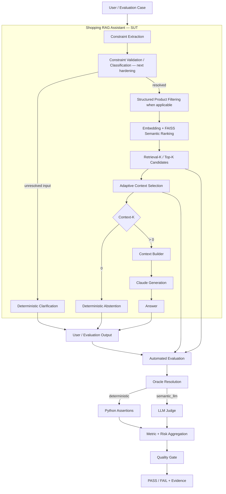
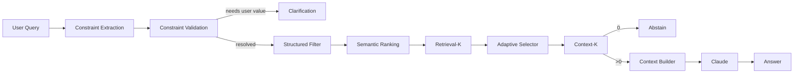
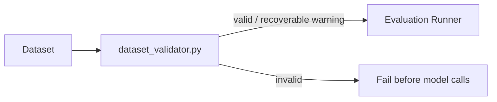
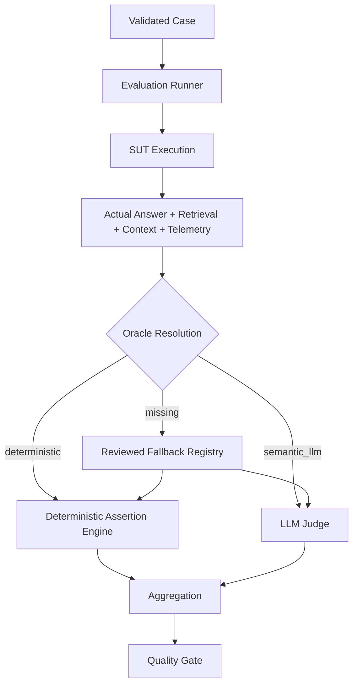
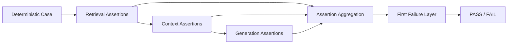
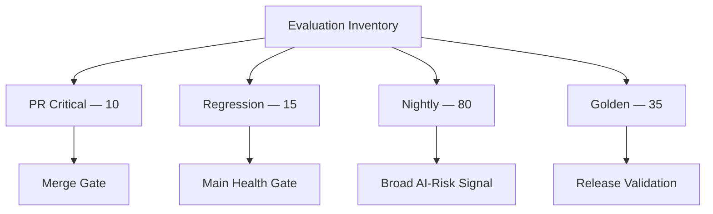
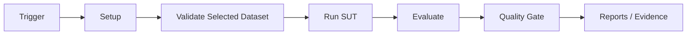
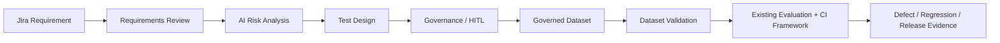

# AI QE Lab — Architecture

## 1. Purpose

The executable SUT is the Shopping RAG Assistant. The AI QE framework tests that real application through governed datasets, dataset validation, deterministic and semantic evaluation, telemetry, failure localization and CI/CD quality gates.

The architecture is intentionally separated into pipelines so that application behavior, test-asset validation, evaluation logic and CI orchestration are not confused.

---

## 2. Master Architecture



Two deterministic early exits have different meanings:

- **Clarification** — the input itself is unresolved; the user must supply a governed value (for example a maximum price for `cheap`). This is the next SUT hardening change.
- **Abstention** — the request is understood but no governed evidence survives context selection (`Context-K=0`). This is implemented now.

---

## 3. SUT / Input and Retrieval Pipeline



### Structured Filter and Semantic Search solve different problems

Constraint Extraction returns controlled conditions. Structured Filtering applies exact conditions to catalogue records. Semantic Ranking then orders eligible evidence by vector similarity.

```text
Input: "black waterproof jacket under $80 for hiking"

Constraint Extraction:
  color=black
  waterproof=true
  subcategory=Jackets
  max_price=80

Structured Filter:
  catalogue -> only records satisfying those exact fields

Semantic Ranking:
  eligible records -> vector similarity ranking against the query
```

Hard constraints are applied before semantic relevance because a high similarity score must not override a known price/color/waterproof requirement.

Current supported structured fields are `subcategory`, `waterproof`, `color`, `max_price`, and `size`.

If structured constraints match zero products, the current implementation takes a deterministic no-product-match path rather than falling back to irrelevant semantic candidates.

### Retrieval-K vs Context-K

```text
RAG_TOP_K=5
RAG_MIN_CONTEXT_K=2       # target, not padding requirement
RAG_MAX_CONTEXT_K=5
RAG_MIN_SIMILARITY=0.30
```

1. FAISS/semantic ranking returns up to Retrieval-K candidates.
2. Adaptive Context Selection considers up to the configured maximum.
3. Candidates below `RAG_MIN_SIMILARITY` are removed.
4. Weak evidence is never padded merely to hit the minimum target.
5. Context-K is therefore `0..Retrieval-K` and contains only evidence actually eligible for generation.
6. `Context-K=0` skips Claude and returns deterministic abstention.

---

## 4. Dataset Validation Pipeline

Dataset Validation protects the test contract before SUT/Judge model calls.



Core rules:

```text
deterministic      -> non-empty Deterministic Assertions required
semantic_llm       -> valid semantic route
missing/null/empty -> warning; reviewed runtime fallback allowed
invalid non-empty  -> validation ERROR
missing/duplicate ID -> validation ERROR
```

This applies to PR Critical, Regression and Nightly execution.

---

## 5. Evaluation Pipeline

The runner executes the real SUT and records answer plus retrieval/context/telemetry evidence. The evaluator then applies the case Oracle.



The LLM Judge does not choose the Oracle. Dataset metadata is primary; the reviewed fallback exists only as a safety layer.

Current reviewed populations:

| Suite | Total | Deterministic | Semantic Judge |
|---|---:|---:|---:|
| PR Critical | 10 | 6 | 4 |
| Regression | 15 | 7 | 8 |
| Nightly | 80 | 48 | 32 |
| **Total** | **105** | **61** | **44** |

---

## 6. Deterministic Assertion and Failure Localization



Supported assertions include `retrieved_id`, `contains`, `regex`, `not_regex`, `no_constraint_match`, `answer_products_satisfy_constraints`, and `catalogue_min_price_product`.

Typical localization:

| Failure | Primary layer |
|---|---|
| Retrieval Hit fail | retrieval / expected source |
| Constraint mismatch | extraction / structured filtering / ranking |
| expected evidence retrieved but not selected | adaptive selector / threshold |
| selected evidence lost or malformed | context builder |
| retrieval/context pass but answer fails | generation / prompt / model |
| semantic quality fail | generation / semantic behavior |
| dataset validation error | dataset/oracle authoring |
| provider 429/5xx/529 | external dependency |

---

## 7. Dataset and CI/CD Execution Pipeline

Datasets are purpose-specific, not inheritance layers.



Execution orchestration:



Policy:

```text
PR Critical = fast merge gate
Regression  = main health gate
Nightly     = broad AI-risk signal
Golden      = trusted baseline / release validation
```

---

## 8. Current QE Responsibility Model

```text
Engineering:
  implement SUT/application logic
  constraint/retrieval/context/generation code

QE:
  understand architecture and risks
  define expected behavior / Oracle
  build and validate datasets
  execute SUT through evaluation cases
  measure deterministic + semantic quality
  run regression and quality gates
  localize failures and provide evidence
```

The evaluation framework tests application behavior; it does not replace engineering ownership of production implementation.

---

## 9. Current vs Next

### Implemented

- deterministic constraint extraction for supported fields;
- structured product filtering before semantic ranking;
- `all-MiniLM-L6-v2` embeddings + FAISS ranking;
- Retrieval-K and adaptive Context-K selection;
- deterministic no-product-match response;
- `Context-K=0` deterministic abstention with Claude skipped;
- context construction and Claude generation when evidence exists;
- retrieval/context/model telemetry;
- Golden, PR Critical, Regression and Nightly datasets;
- dataset/oracle validation;
- deterministic assertion engine and semantic LLM Judge;
- metric/risk aggregation, quality gates and CI evidence.

### Immediate hardening changes

- restore PR workflow to PR Critical-only after temporary broad verification;
- add Constraint Validation / unresolved-input classification and deterministic clarification;
- keep clarification and no-evidence abstention as distinct SUT paths.

### Future Agentic QE layer



Agents create and govern quality inputs; they do not replace the existing evaluator.

---

## 10. Target Traceability

```text
Requirement
-> Risk
-> Test / Evaluation Case
-> Dataset Validation
-> SUT Execution
-> Retrieval / Context / Generation Evidence
-> Deterministic Engine or Semantic Judge
-> Metric / Risk
-> Quality Gate
-> Defect / Regression
-> Residual Risk
-> Release Decision
```
