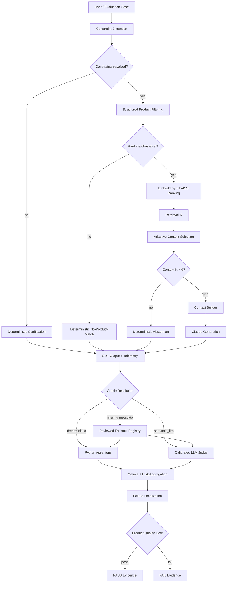
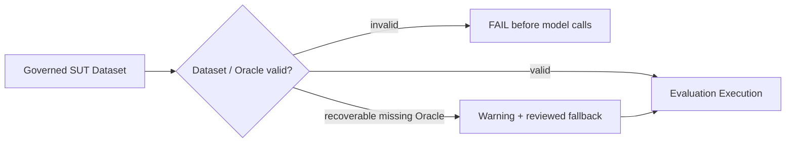
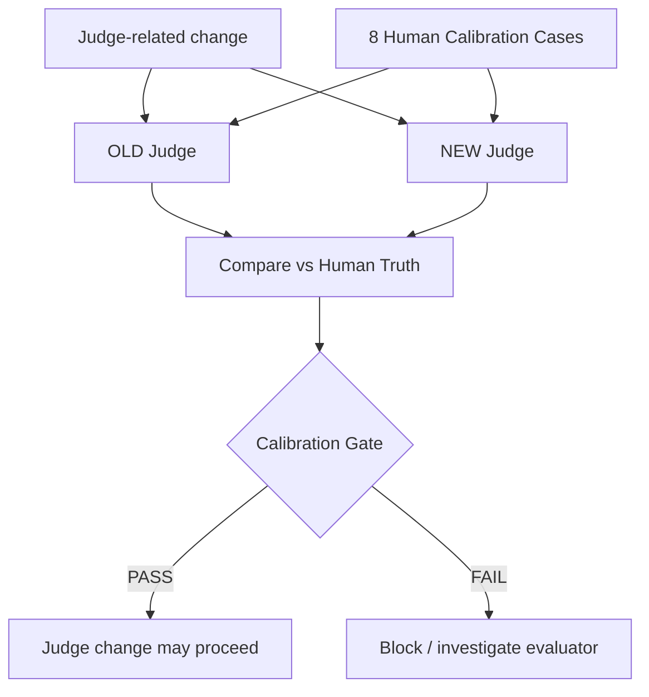
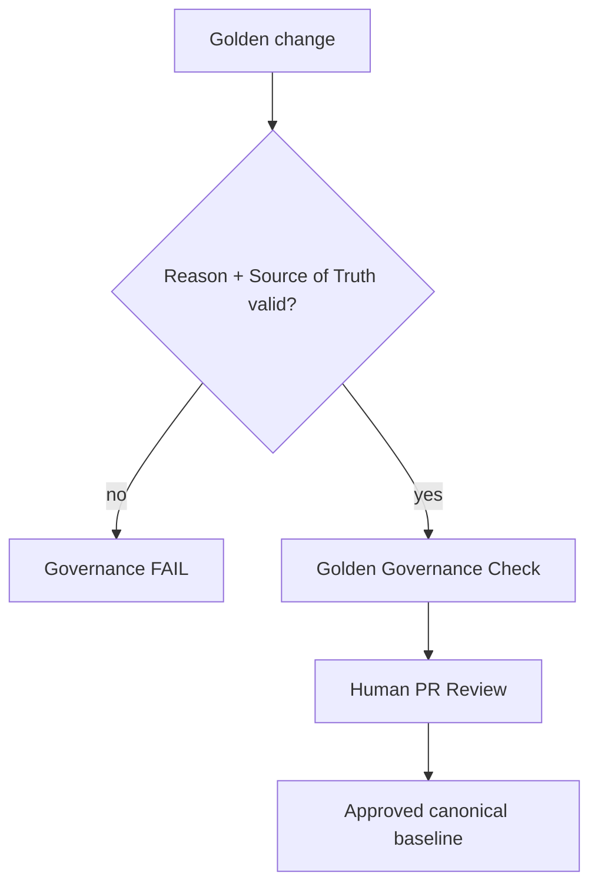
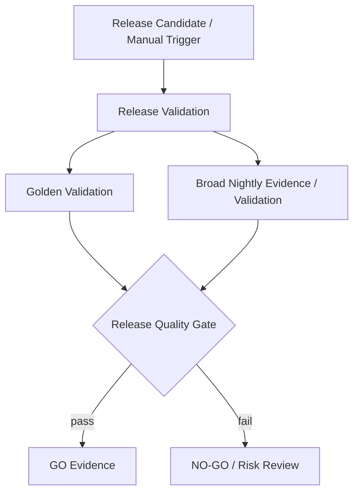

# AI QE Lab — Architecture

_Last synchronized with repository: 2026-09-01._

## 1. Purpose and architectural boundary

The executable reference SUT is the Shopping RAG Assistant. On a real project, Development / AI Engineering normally owns the application pipeline; QE understands its architecture/observability and builds quality controls around it.

This document owns the **reference SUT and downstream evaluation architecture**. Upstream agent branching is canonical in `agentic_qe_orchestration.md`; the compact cross-system view is in `master_architecture.md`.

The framework has four control domains:

1. **Agentic QE governance** — requirement → risk → test proposal → human decision.
2. **Product quality** — SUT execution → evaluation → metrics → quality gate.
3. **Evaluator quality** — Judge Calibration against human truth.
4. **Canonical truth governance** — Golden expected-behavior change control.

---

## 2. Reference SUT + product quality pipeline



Deterministic early responses are distinct:

- **Clarification** — unresolved governed input; retrieval/Claude skipped.
- **No-Product-Match** — resolved hard constraints match zero products; Claude skipped.
- **Abstention** — request understood but no evidence survives context selection; Claude skipped.

## 3. RAG decomposition

```text
RETRIEVAL
Constraint Extraction / Validation
→ Structured Filtering
→ Embedding + FAISS Ranking
→ Retrieval-K

AUGMENTATION
Retrieval-K
→ Adaptive Context Selection
→ Context-K
→ Context Builder

GENERATION
Final Context
→ Claude
→ Answer
```

Current structured fields include `subcategory`, `waterproof`, `color`, `max_price`, and `size`. Hard constraints precede semantic relevance; similarity cannot override a known hard constraint.

Current selection controls:

```text
RAG_TOP_K=5
RAG_MIN_CONTEXT_K=2       # target, not padding requirement
RAG_MAX_CONTEXT_K=5
RAG_MIN_SIMILARITY=0.30
```

`Context-K` can be `0..Retrieval-K`; `Context-K=0` skips Claude.

## 4. Dataset / Oracle Validation



Core contract:

```text
deterministic      → non-empty deterministic assertions required
semantic_llm       → valid semantic route
missing/null/empty → warning; reviewed fallback allowed
invalid non-empty  → ERROR
missing/duplicate ID → ERROR
```

## 5. Metric ownership by layer

```text
RETRIEVAL
Retrieval Hit • Constraint Match • Precision@K

AUGMENTATION
Retrieval-K → Context-K • selected IDs/scores • Context Coverage • Context Sufficiency

GENERATION
Correctness • Groundedness • Hallucination • Constraint Adherence

OVERALL
Pass Rate • AI-risk outcomes

OPERATIONS
Latency • Tokens • Cost • Errors
```

Semantic denominators contain only semantically judged cases. Formal facts remain deterministic.

## 6. Governed routine-suite populations

| Suite | Total | Deterministic | Semantic Judge |
|---|---:|---:|---:|
| PR Critical standard | 10 | 6 | 4 |
| Regression | 15 | 7 | 8 |
| Broad Nightly | 80 | 48 | 32 |
| **Routine total** | **105** | **61** | **44** |

Additional assets: 2 Metamorphic Critical records, 10 Adversarial cases, 35 Golden cases and 8 Judge Calibration cases. Back-to-Back reuses the 10 standard PR cases.

## 7. Judge configuration and calibration

Semantic evaluator behavior is version-controlled by:

```text
config/judge_config.json
config/judge_prompt.txt
config/judge_rubric.txt
```



Current gate:

```text
NEW human agreement >= 90%
NEW agreement drop vs OLD <= 5 percentage points
NEW false PASS <= OLD false PASS
```

A calibration failure is evaluator evidence, not a Shopping Assistant defect.

## 8. Golden canonical-truth governance



An evaluation failure is not permission to rewrite Golden until CI passes.

## 9. Failure localization

Investigate the first layer where expected behavior diverged.

| Failure signal | Primary layer |
|---|---|
| Dataset validation error | dataset / Oracle authoring |
| unresolved input handled incorrectly | constraint validation |
| hard constraint mismatch | extraction / filtering |
| expected evidence absent from Retrieval-K | retrieval / ranking |
| evidence retrieved but dropped | adaptive selector |
| selected evidence malformed/lost | context builder |
| evidence correct but answer wrong | generation / SUT model/prompt |
| Judge disagrees with human truth | evaluator configuration |
| Judge output persistently malformed | evaluator/provider contract |
| Golden change lacks evidence | canonical-truth governance |
| provider 429/5xx/529 | external dependency |
| gate/report mismatch | aggregation / gate/reporting |

## 10. CI/CD execution state

| Workflow | Current trigger/state |
|---|---|
| PR Critical | automatic on meaningful PR changes |
| Metamorphic Critical | automatic PR relation gate |
| Back-to-Back | manual |
| Adversarial | manual + nightly |
| Regression | manual-only |
| Broad Nightly | manual-only |
| Release Validation | manual / RC |
| Judge Calibration | Judge-related changes + manual |
| Golden Governance | Golden-related changes |

Broad Regression/Nightly product schedules are intentionally paused.

## 11. Release Validation



Golden proves canonical behavior; broad Nightly provides breadth. Evidence reuse is valid only for the relevant release candidate/scope/SHA.

## 12. Upstream Agentic QE handoff — current state

Agentic QE is implemented upstream through **decision evidence**, not merely planned:

```text
Jira Requirement
→ Requirements Review
→ human readiness boundary
→ Risk Analysis
→ human risk approval + Jira Risk Register write-back
→ Test Analysis & Design
→ Human Decision
→ confirmed Decision Evidence
→ [NEXT: governed dataset mutation/promotion]
→ Dataset / Oracle Validation
→ this product-quality architecture
```

Detailed YES/NO/cache/eligibility/human-decision branches are maintained in `agentic_qe_orchestration.md`. This avoids duplicating a large agent state machine inside the SUT architecture.

## 13. Responsibility model

**Development / AI Engineering:** owns SUT/application implementation and observability hooks.

**QE / Quality Architecture:** defines risks/expected behavior, governed assets, validation, Oracles, evaluator controls, metrics, localization, CI levels and release evidence.

**Human/Product/Release Governance:** approves business truth, governed mutations and residual risk where required.

## 14. Remaining architecture work

Only unimplemented work:

1. confirmed Human Decision → governed dataset mutation;
2. deterministic post-mutation validation;
3. source-control dataset diff/commit/PR promotion;
4. optional Requirements Review approval → Jira `review-completed` write-back;
5. targeted Risk evidence retrieval where useful;
6. Agent Evaluation Dataset and agent behavior gates;
7. state-driven orchestration after manual gates are stable;
8. optional external project integrations.

Drift testing remains outside the roadmap.
