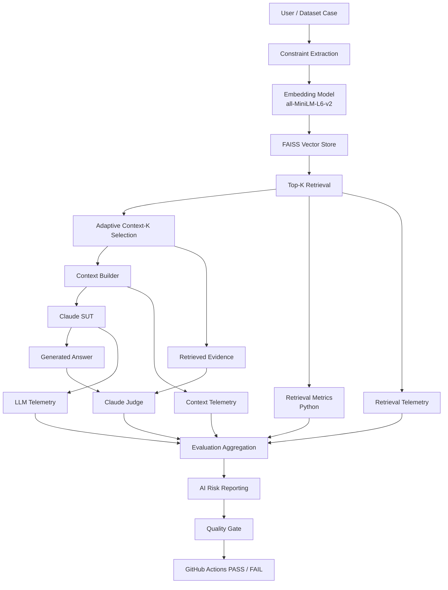
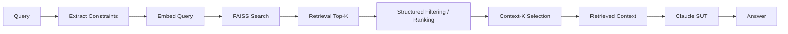
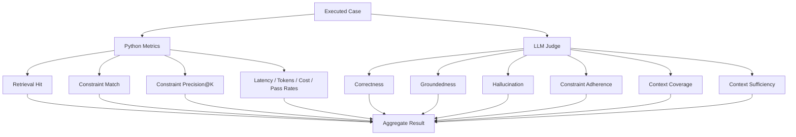
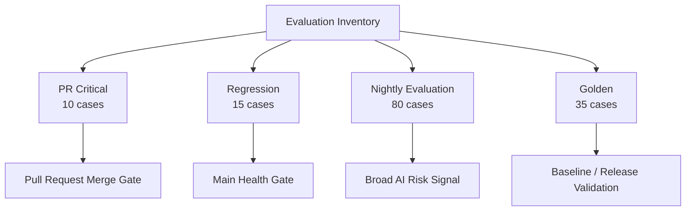
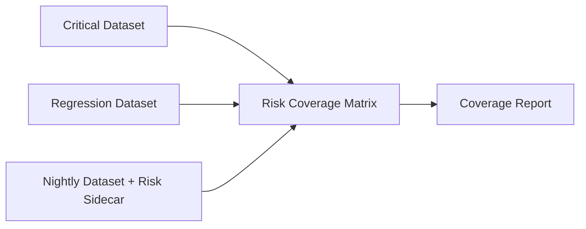
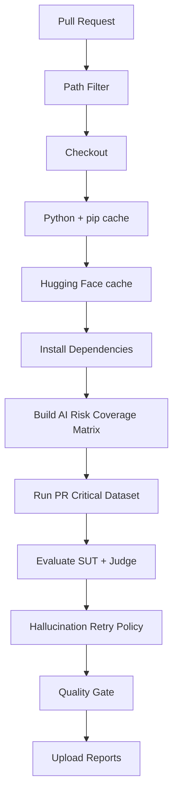
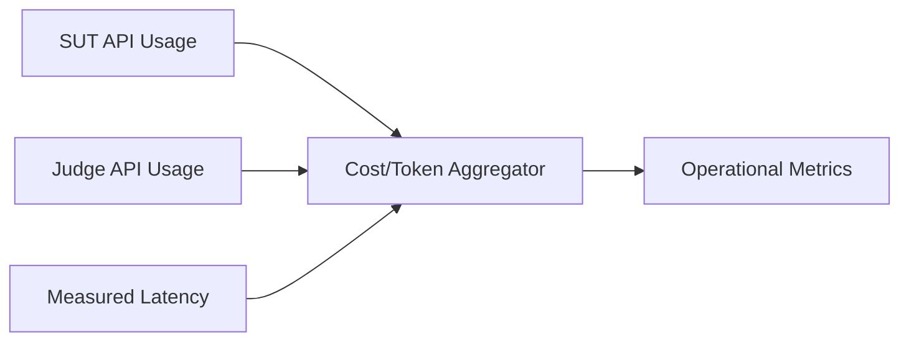
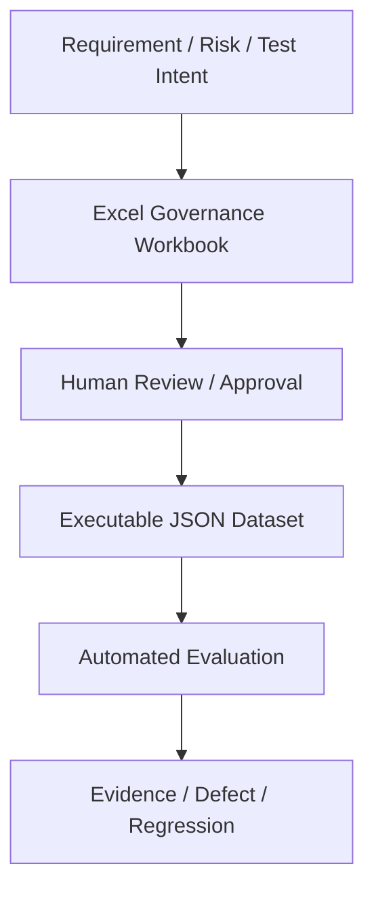
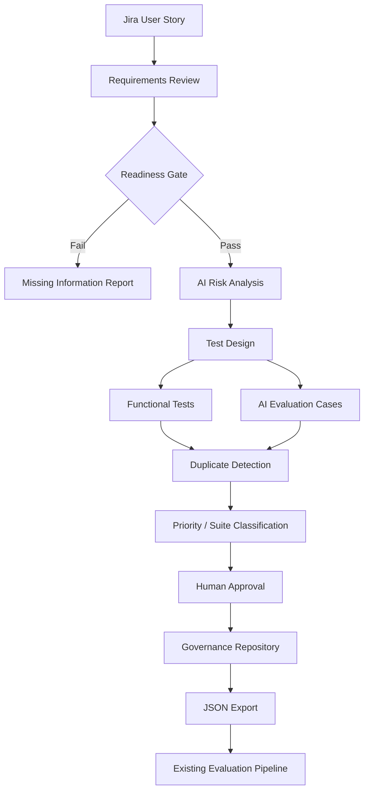

# AI QE Lab — Architecture

## 1. Purpose

This document describes the **current implemented architecture** of the AI QE Lab and the **planned target lifecycle**. These are intentionally separated so planned agents are not confused with functionality that already exists.

The current executable System Under Test (SUT) is the Shopping RAG Assistant. The surrounding framework provides retrieval diagnostics, semantic evaluation, AI-risk reporting, CI/CD quality gates, telemetry, and evidence.

---

## 2. Current Implemented Architecture



### Implemented components

| Layer | Implementation | Responsibility |
|---|---|---|
| Data | product catalogue + policy files | controlled knowledge sources |
| Constraints | `constraint_filter.py` | extract/apply structured product constraints |
| Embedding | `all-MiniLM-L6-v2` | convert text to semantic vectors |
| Retrieval | FAISS `IndexFlatIP` | retrieve ranked candidate evidence |
| Context | `context_builder.py` | select evidence and build SUT context |
| SUT | Claude via `llm_client.py` | generate Shopping Assistant answer |
| Retrieval diagnostics | `retrieval_metrics.py` | deterministic retrieval/context indicators |
| Semantic evaluation | `llm_evaluator.py` | Judge answer/context quality |
| Risk reporting | `risk_reporting.py` | aggregate outcomes by canonical AI risk |
| Risk coverage | `risk_coverage.py` | inventory risk coverage across suites |
| Operational reporting | `cost_reporting.py` | token/cost aggregation |
| CI gate | `quality_gate.py` | enforce blocking thresholds |

---

## 3. Retrieval and Generation Flow



### Retrieval-K is not Context-K

The retrieval layer may retain a broader Top-K for diagnostic metrics while sending fewer documents to the LLM when the relevant evidence is already clear.

This preserves retrieval observability while reducing context/token cost.

```text
Retrieval Top-K = evidence candidates used for retrieval diagnostics
Context-K       = evidence actually sent to the SUT/Judge
```

---

## 4. Evaluation Architecture

The framework deliberately separates **deterministic Python metrics** from **semantic LLM judgment**.



### Python-computed

- Retrieval Hit Rate;
- Constraint Match Score;
- Constraint Precision@K;
- average and P95 latency;
- SUT/Judge input/output token aggregation;
- cache token counters from Anthropic usage telemetry;
- estimated cost and cost per case;
- risk coverage matrix;
- quality-gate threshold checks.

### LLM Judge

- Correctness;
- Groundedness;
- Hallucination;
- Constraint Adherence;
- Context Coverage;
- Context Sufficiency.

The Judge receives **raw retrieved evidence** rather than the complete SUT prompt. This avoids paying to judge duplicated system/augmentation text that is not needed for semantic comparison.

---

## 5. Diagnostic Chain and Failure Localization

The framework uses the following diagnostic sequence:

```text
Retrieval Hit
    ↓
Constraint Match / Precision@K
    ↓
Context Coverage / Sufficiency
    ↓
Correctness / Groundedness / Hallucination / Constraint Adherence
```

Interpretation examples:

| Failure signal | Primary investigation layer |
|---|---|
| Retrieval Hit fail | retrieval, source oracle, expected-source contract |
| Constraint Match weak | constraint extraction/filtering/retrieval |
| Precision@K weak | noisy retrieval candidates |
| Context Coverage weak | evidence selection / context builder |
| Context Sufficiency false | missing evidence / context selection |
| Correctness fail with sufficient context | generation |
| Groundedness fail | unsupported generation |
| Hallucination fail | generation / prompt / evidence use |
| Provider 429/5xx/529 | external dependency / infrastructure |

A quality-gate failure is therefore not automatically classified as an LLM defect.

---

## 6. Dataset and Execution Architecture

Datasets are organized by **execution purpose**, not inheritance.



Overlap between datasets is valid. A business-critical behaviour may be represented in Golden, Critical, and Regression because each suite serves a different execution purpose.

### Canonical AI risk metadata

Critical and other cases carry explicit AI-risk metadata. Nightly uses an explicit sidecar:

`datasets/evaluation_risk_metadata.json`

`Segment` is preserved independently as a test-design category and is not treated as the canonical Risk field.

---

## 7. AI Risk Coverage Architecture



The matrix reports how canonical risks are represented across suite inventories.

`FULL`, `PARTIAL`, and `SINGLE_SUITE` represent suite distribution only. They do not mean pass/fail and do not prove statistical adequacy.

---

## 8. CI/CD Architecture

### Pull Request



Current policy:

```text
PR Critical = merge gate
Regression  = main health gate
Nightly     = broad AI-risk signal
Release     = release validation gate
```

### Quality-gate thresholds

```text
Correctness           >= 95%
Groundedness          >= 95%
Retrieval Hit Rate    >= 95%
Constraint Adherence  >= 95%
Hallucination Rate    <= 2%
```

Critical case failures also block the PR.

---

## 9. Resilience Architecture

Two retry mechanisms solve different problems.

### API/provider retry

`llm_evaluator.py` retries bounded transient Judge failures such as:

- 429;
- 500;
- 502;
- 503;
- 504;
- 529.

The retry is infrastructure resilience. It does not change evaluation semantics.

### Hallucination retry

`hallucination_retry.py` reruns the Critical evaluation only when hallucination breaches the configured tolerance, allowing stochastic quality failures to be distinguished from reproducible ones.

```text
API retry            = can the provider deliver the request?
Hallucination retry  = is the semantic failure reproducible?
```

---

## 10. Operational Telemetry and Cost Engineering



Operational values are not LLM opinions. Anthropic returns usage counters; Python records and aggregates them.

Current telemetry includes:

- SUT input/output tokens;
- Judge input/output tokens;
- prompt-cache creation/read tokens;
- average latency;
- P95 latency;
- estimated standard token cost;
- cost per case;
- API attempt count.

Optimization principles:

1. deterministic Python checks before LLM judgment where appropriate;
2. minimize duplicated Judge context;
3. Judge only the evidence needed for the metric;
4. separate Retrieval-K from Context-K;
5. use caching only when token volume and provider cache rules make it worthwhile;
6. validate model tiering before making it default;
7. compare controlled BEFORE/AFTER runs and reject optimizations that degrade quality.

---

## 11. Governance Layer

`AI_QE_Lab_Datasets_and_Governance.xlsx` is the current human-readable dataset/governance artifact.



Excel is the stakeholder-facing review layer. JSON is the runtime representation.

---

## 12. Current Implementation vs Planned Agent Architecture

### Implemented now

- Shopping RAG Assistant;
- product/policy retrieval;
- constraint filtering;
- FAISS retrieval;
- retrieval/context/LLM telemetry;
- Golden, PR Critical, Regression, and Nightly datasets;
- retrieval diagnostics;
- semantic LLM Judge;
- AI-risk metadata/reporting;
- risk coverage matrix;
- CI quality gate;
- hallucination retry;
- provider retry/backoff;
- token/cost reporting and optimization.

### Planned extensions



Planned modules include:

- Requirements Readiness Agent;
- AI Risk Analysis Agent;
- classical + AI-specific Test Design Agent;
- semantic duplicate detection;
- suite recommendation;
- Jira traceability;
- defect draft/create workflow;
- defect → Regression automation;
- QA Agent evaluation;
- Test Management Lifecycle Agent;
- residual-risk and GO / NO-GO reporting.

These components are target architecture, not current runtime functionality.

---

## 13. Target End-to-End Traceability

```text
Requirement
→ AI Risk
→ Functional Test / AI Evaluation Case
→ Dataset
→ Execution Level
→ Metric
→ Threshold
→ Evidence
→ Defect / Regression
→ Residual Risk
→ Release Decision
```

This traceability model is the long-term architecture goal of the repository.
