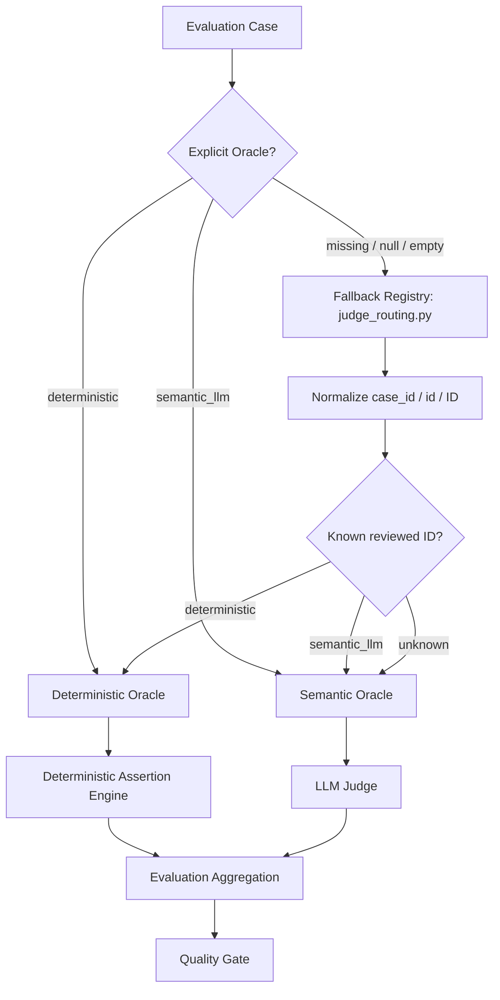
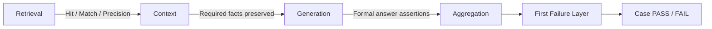
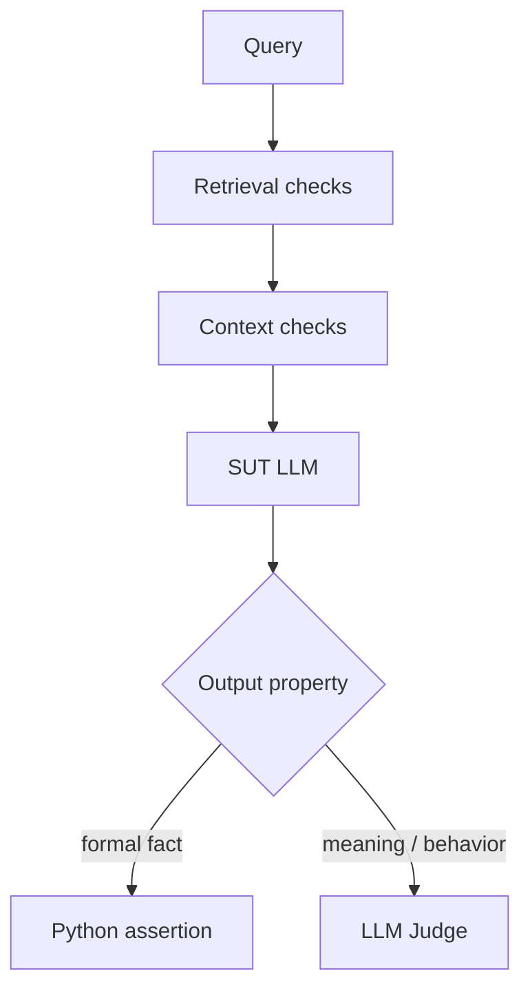
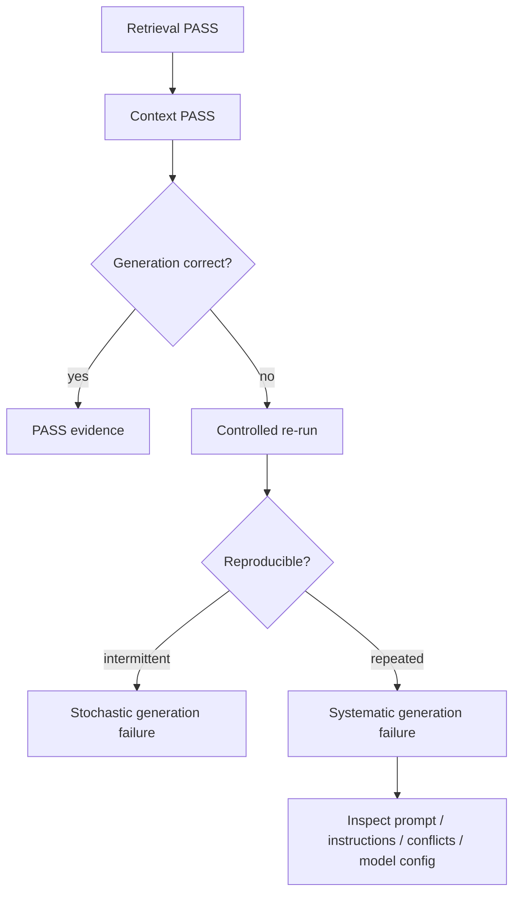

# Automated AI Evaluation — Oracle Architecture

## Purpose

AI evaluation in this lab is automated test execution. Deterministic checks and LLM-as-a-Judge are two test-oracle mechanisms inside the same Automated AI Evaluation framework.

## Hierarchy



The SUT LLM generates the actual application answer in both routes. The Oracle controls how that answer is evaluated, not whether the SUT LLM runs.

## Oracle selection principle

> If a quality property can be represented as an objective, reproducible rule, evaluate it deterministically. Use an LLM Judge only when PASS/FAIL requires semantic interpretation of meaning or behavior.

| Oracle | Appropriate for | Examples |
|---|---|---|
| Deterministic Oracle | objective formal rules | IDs, numbers, booleans, ranges, schemas, structured constraints, exact policy facts, catalogue membership |
| Semantic Oracle | meaning and behavior | safe refusal, ambiguity handling, conflict interpretation, out-of-domain abstention, prompt-injection resistance, unsupported semantic claims |

Natural-language complexity does not imply a semantic oracle. A long query can still reduce to formal constraints, while a short query may require semantic evaluation.

## Oracle resolution and fallback

```text
1. explicit Oracle = deterministic -> Python route
2. explicit Oracle = semantic_llm  -> Judge route
3. missing/null/empty              -> fallback registry by case ID
4. known ID                        -> previous reviewed route
5. unknown ID                      -> safe semantic_llm fallback
6. invalid non-empty Oracle        -> dataset validation error (target governance)
```

The Judge does not classify Oracle type. It evaluates semantic PASS/FAIL only after routing has selected the semantic path.

## Deterministic Assertion Engine

Routing answers **who evaluates the case**. The engine answers **what Python must prove**.

Before the engine, deterministic PASS was primarily based on retrieval and structured constraint checks. Those checks prove that relevant evidence was found, but do not necessarily prove that the same required fact was preserved in context and returned correctly by the SUT LLM.

The engine adds structured atomic assertions across three observable layers:



### Example — generation defect

```text
Expected: return window = 30 days

Retrieval: returns policy found      PASS
Context:   30 days preserved         PASS
Generation:60 days returned          FAIL

First failure layer = generation
```

### Example — augmentation defect

```text
Expected: black / M / Ukraine

Retrieval:  black / M / Ukraine      PASS
Context:    black / M                FAIL
Generation: black / M                FAIL

First failure layer = context
```

This is not a new quality layer. It is a stronger deterministic oracle plus explicit failure localization.

## Semantic route remains unchanged

A semantic case may use the same retrieval and augmentation pipeline as a deterministic case. The difference is that the final expected behavior cannot be fully reduced to a formal assertion.

Example: two policies are retrieved correctly and preserved in context, but the SUT must explain their interaction without making an unsupported assumption. Retrieval/context checks can still be deterministic, while the final interpretation requires the LLM Judge.



This is the longer-term assertion-level model. Current routing remains case-level for the reviewed suites.

## Manual Oracle Classification — 105 cases

| Suite | Total | Deterministic | Semantic LLM Judge | Judge-call reduction target |
|---|---:|---:|---:|---:|
| PR Critical | 10 | 6 (60.0%) | 4 (40.0%) | 60.0% |
| Regression | 15 | 7 (46.7%) | 8 (53.3%) | 46.7% |
| Nightly Evaluation | 80 | 48 (60.0%) | 32 (40.0%) | 60.0% |
| **Total** | **105** | **61 (58.1%)** | **44 (41.9%)** | **58.1%** |

The engine does not increase the 61 deterministic cases. It strengthens cases already routed to Python.

Current implementation migrates the six deterministic PR Critical cases to structured atomic assertions first:

- `G-001`
- `G-002`
- `G-003`
- `G-032`
- `G-033`
- `G-034`

Regression and Nightly deterministic cases remain compatible with the existing route and can be migrated incrementally to the same assertion format.

## Probabilistic generation and re-runs

The SUT LLM remains probabilistic even if retrieval and context are both correct.



A re-run measures reproducibility. It should not be used simply to replace a failed result with a later green one.

## Relationship to AI risk

```text
AI Risk       -> what quality failure are we protecting against?
Assertion     -> what exactly must be proven for this case?
Oracle        -> what mechanism can prove that assertion reliably?
Failure Layer -> where did the expected evidence first diverge?
```

## Engineering outcome

The architecture now separates four concerns clearly:

```text
Dataset Case
-> SUT execution through Retrieval + Augmentation + SUT LLM
-> Oracle resolution
-> Deterministic Assertion Engine or Semantic Judge
-> Layer-level evidence + aggregation
-> Quality Gate
```

Benefits:

- deterministic cases prove final expected facts rather than only retrieval success;
- no extra Judge calls for formal assertions;
- retrieval/context/generation defects are easier to distinguish;
- stochastic generation failures can be separated from systematic pipeline defects;
- the same assertion model can later be generated from Jira-driven governed datasets.

## Engineering rule

**Automate deterministically everything that can be expressed as an objective assertion. Use an LLM Judge only where the residual quality property genuinely requires semantic interpretation.**
