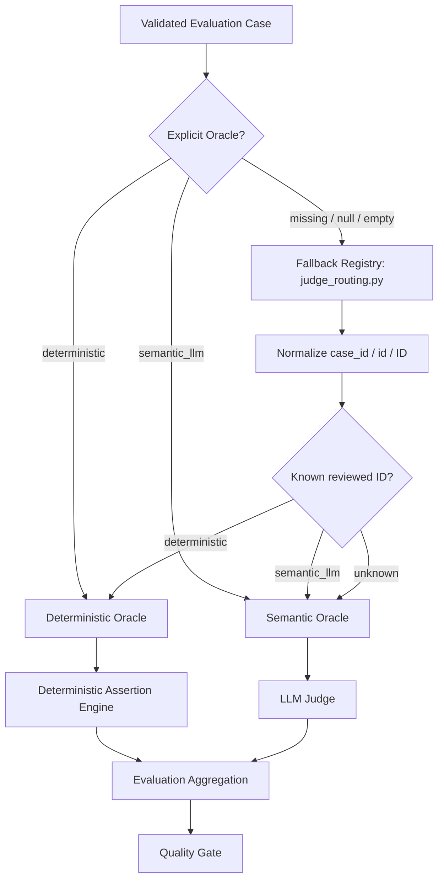
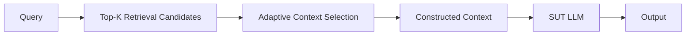
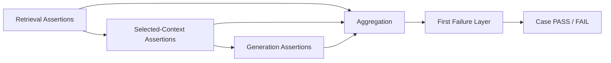
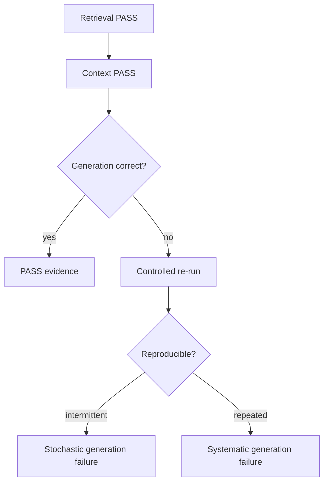

# Automated AI Evaluation — Oracle Architecture

## Purpose

AI evaluation in this lab is automated test execution. Deterministic checks and LLM-as-a-Judge are two test-oracle mechanisms inside the same framework. The current SUT path includes retrieval candidates, adaptive context selection, context construction and Claude generation before Oracle evaluation.

## Pre-execution dataset validation

Before any active CI evaluation starts, the dataset is validated by `src/dataset_validator.py`.

```text
deterministic      -> valid; non-empty Deterministic Assertions required
semantic_llm       -> valid
missing/null/empty -> warning; runtime mapper fallback allowed
invalid non-empty  -> validation ERROR
missing/duplicate ID -> validation ERROR
```

PR Critical, Regression and Nightly all run this validation after dependency installation and before model calls.

## Oracle hierarchy



The SUT LLM generates the application answer in both routes. The Oracle controls how that answer is evaluated, not whether the SUT runs.

> If a quality property can be represented as an objective, reproducible rule, evaluate it deterministically. Use an LLM Judge only when PASS/FAIL requires semantic interpretation of meaning or behavior.

| Oracle | Appropriate for | Examples |
|---|---|---|
| Deterministic Oracle | objective formal rules | IDs, numbers, booleans, ranges, schemas, structured constraints, exact policy facts, catalogue membership |
| Semantic Oracle | meaning and behavior | safe refusal, ambiguity handling, conflict interpretation, out-of-domain abstention, prompt-injection resistance, unsupported semantic claims |

The Judge never classifies Oracle type. An unknown mapping is conservatively routed to `semantic_llm` before the Judge is called.

## SUT evidence chain



Retrieval candidates remain available for retrieval metrics. Only the adaptively selected subset is passed to the Context Builder and generation. This separation allows a failure to be localized to retrieval, context selection, context construction or generation.

## Deterministic Assertion Engine

Routing answers **who evaluates the case**. The engine answers **what Python must prove**.



Supported assertion types include `retrieved_id`, `contains`, `regex`, `not_regex`, `no_constraint_match`, `answer_products_satisfy_constraints`, and `catalogue_min_price_product`.

All reviewed deterministic cases are migrated to structured atomic assertions:

| Suite | Total | Deterministic | Semantic LLM Judge |
|---|---:|---:|---:|
| PR Critical | 10 | 6 | 4 |
| Regression | 15 | 7 | 8 |
| Nightly Evaluation | 80 | 48 | 32 |
| **Total** | **105** | **61 (58.1%)** | **44 (41.9%)** |

Nightly deterministic assertions are loaded from `datasets/evaluation_assertion_metadata.json`. The 61/44 split is the currently implemented case-level routing model.

## Semantic route

A semantic case can share exactly the same retrieval and context pipeline. The difference is that its expected behavior cannot be reduced to a complete objective assertion.

Example: two policies may be retrieved and preserved correctly, but the SUT must explain their interaction without unsupported assumptions. Retrieval/context evidence is still useful, while final behavioral PASS/FAIL requires the Judge.

## Probabilistic generation and re-runs

The SUT remains probabilistic even if retrieval and selected context are correct.



A re-run measures reproducibility; it does not erase the original failure.

## Relationship to AI risk

```text
AI Risk           -> what quality failure are we protecting against?
Assertion         -> what exactly must be proven?
Oracle            -> what mechanism can prove it reliably?
Failure Layer     -> where did evidence first diverge?
Context Selection -> which retrieved evidence actually reached the SUT?
```

## Engineering outcome

```text
Dataset Validation
-> RAG SUT execution
   -> Retrieval Candidates
   -> Adaptive Context Selection
   -> Context Builder
   -> SUT LLM
-> Oracle resolution
-> Deterministic Assertion Engine or Semantic Judge
-> Layer-level evidence + aggregation
-> Quality Gate
```

Benefits:

- malformed Oracle metadata fails before expensive execution;
- deterministic cases prove final expected facts without Judge calls;
- retrieval and generation context are independently observable;
- context-selection threshold mistakes are distinguishable from retrieval defects;
- stochastic failures can be separated from systematic defects;
- the same governed structure can later be produced from Jira-driven agent workflows.

## Engineering rule

**Automate deterministically everything that can be expressed as an objective assertion. Use an LLM Judge only where the residual quality property genuinely requires semantic interpretation.**
