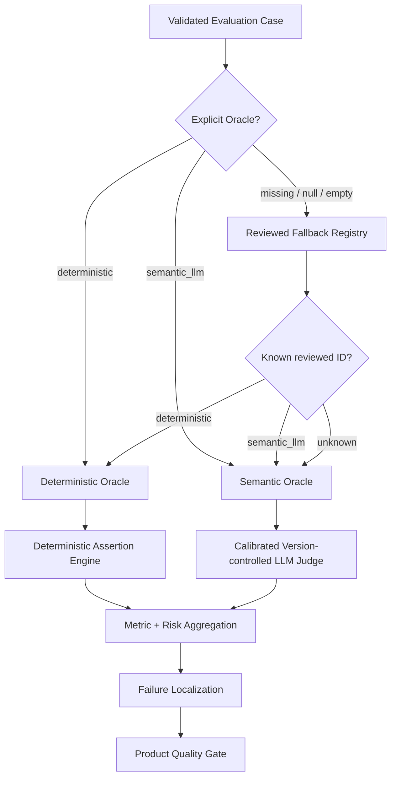
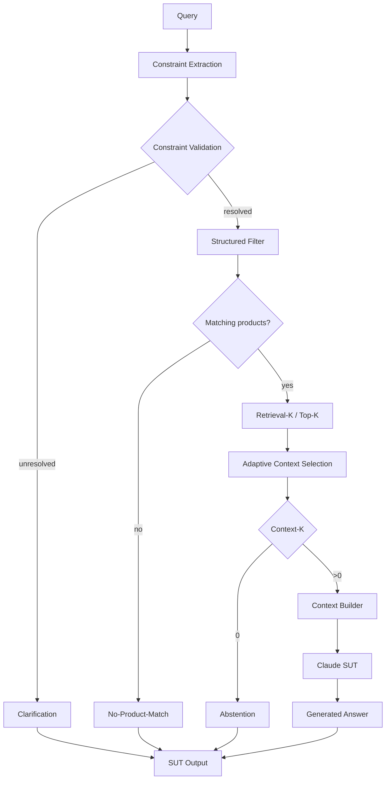
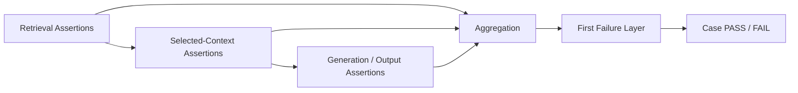
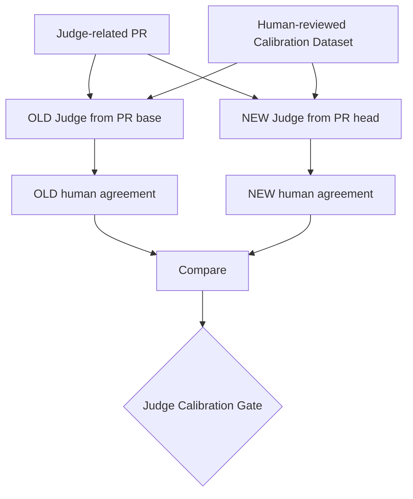

# Automated AI Evaluation — Oracle Architecture

## Purpose

AI evaluation in this lab is automated test execution against the real reference SUT. Deterministic checks and LLM-as-a-Judge are two Oracle mechanisms inside the same QE framework.

The semantic Judge is itself a probabilistic component, so the framework also contains an independent **Judge Calibration** control that tests evaluator behavior against human-reviewed truth. Golden canonical expectations have a separate deterministic governance control.

The canonical metric definitions and denominators are maintained in `docs/metric_contract.md`.

## Pre-execution Dataset Validation

Before active SUT evaluation, the selected governed dataset is validated by `src/dataset_validator.py`.

```text
deterministic      -> valid only with non-empty deterministic assertions
semantic_llm       -> valid semantic route
missing/null/empty -> warning; reviewed runtime fallback allowed
invalid non-empty  -> validation ERROR
missing/duplicate ID -> validation ERROR
```

PR Critical, Regression and Nightly validate their selected datasets before SUT/Judge model calls. Golden is also validated when executed inside Release Validation.

## Oracle hierarchy



The governed dataset Oracle is the primary routing source. The fallback registry is resilience only. The Judge never chooses the Oracle.

> **Oracle routing decides how observed behavior is evaluated. It does not decide whether the SUT calls Claude.**

The SUT has deterministic early-response paths that can skip Claude:

```text
unresolved governed input -> Clarification -> no retrieval / no Claude
zero hard-constraint matches -> No-Product-Match -> no Claude
Context-K=0 -> Abstention -> no Claude
otherwise -> Context Builder -> Claude Generation
```

All behaviors can still be evaluated through deterministic or semantic Oracle logic according to the governed case contract.

## SUT evidence chain



Retrieval candidates remain available for diagnostics. Only selected Context-K evidence is eligible for generation. Failures can therefore be separated across validation, filtering, retrieval, context selection, context construction and generation.

## Deterministic Assertion Engine

Routing answers **who/what evaluates the case**. The assertion engine defines **what Python must prove**.



Supported assertions include `retrieved_id`, `contains`, `regex`, `not_regex`, `no_constraint_match`, `answer_products_satisfy_constraints`, and `catalogue_min_price_product`.

Current reviewed routine-suite routing:

| Suite | Total | Deterministic | Semantic LLM Judge |
|---|---:|---:|---:|
| PR Critical | 10 | 6 | 4 |
| Regression | 15 | 7 | 8 |
| Nightly | 80 | 48 | 32 |
| **Total** | **105** | **61** | **44** |

Golden is a separate trusted release/reference baseline. Judge Calibration is also separate because it tests the evaluator rather than the SUT.

## Version-controlled semantic Judge

The production Judge loads:

```text
config/judge_config.json
config/judge_prompt.txt
config/judge_rubric.txt
```

Judge behavior is therefore explicitly reconstructable as:

```text
Model + Prompt Version + Rubric Version
```

A configured runtime model override that conflicts with the version-controlled approved model is rejected rather than silently changing evaluator behavior. Semantic telemetry records Judge model plus prompt/rubric versions.

## Judge Calibration — testing the evaluator



The current calibration set has 8 cases with 32 human-approved expected semantic fields. The initial `claude-opus-5` + prompt `v1` + rubric `v1` baseline achieved 100% agreement, 0 false PASS and 0 false FAIL.

Current gate:

```text
NEW agreement >= 90%
OLD -> NEW agreement drop <= 5 percentage points
NEW false PASS count <= OLD false PASS count
```

Automatic calibration paths:

```text
config/judge_config.json
config/judge_prompt.txt
config/judge_rubric.txt
datasets/judge_calibration_dataset.json
src/judge_calibration_runner.py
.github/workflows/judge-calibration.yml
```

The calibration runner separates response-format/infrastructure failure from semantic disagreement by detecting empty/invalid JSON, using bounded retries and emitting diagnostics before failing the calibration infrastructure.

This means a product semantic failure can be interpreted using a Judge whose own behavior has a versioned regression baseline.

## Golden canonical-truth governance

Product evaluation answers **whether observed SUT behavior satisfies the governed expectation**. Golden Governance answers a different question: **whether changing that governed canonical expectation is justified**.

A Golden change requires PR metadata:

```text
Golden Change Reason: ...
Source of Truth: ...
```

and is automatically checked only when the Golden dataset or its governance mechanism changes.

This prevents an evaluation failure from being “fixed” by moving the expected result without approved evidence.

## Metric population rules

| Metric | Mechanism | Population |
|---|---|---|
| Overall Pass Rate | Python aggregation | all executed cases |
| Retrieval Hit Rate | deterministic Python | applicable executed cases |
| Constraint Match / Precision@K | deterministic Python | applicable structured-constraint cases |
| Correctness | calibrated LLM Judge | semantic/Judge cases only |
| Groundedness | calibrated LLM Judge | semantic/Judge cases only |
| Hallucination | calibrated LLM Judge | semantic/Judge cases only |
| Context Coverage | calibrated LLM Judge | semantic/Judge cases only |
| Context Sufficiency | calibrated LLM Judge | semantic/Judge cases only |
| Constraint Adherence | deterministic Python or Judge by route | applicable hybrid population |

Semantic-only fields are N/A for deterministic-only cases and excluded from semantic denominators. An empty semantic population is **N/A**, never fabricated as 100%.

Current POC product-quality thresholds:

```text
Correctness >= 95%
Groundedness >= 95%
Retrieval Hit >= 95%
Constraint Adherence >= 95%
Hallucination <= 2%
```

The final Product Quality Gate remains deterministic even when source metrics include semantic Judge outcomes.

## Probabilistic generation and reruns

When Claude generation is used, stochastic behavior remains possible. A rerun is evidence about reproducibility; it does not erase the original failure.

```text
original failure
-> preserve evidence
-> controlled rerun if required for diagnosis
-> intermittent = stochastic stability signal
-> repeated = systematic defect signal
```

## Relationship to AI risk and failure localization

```text
Risk          -> what can fail?
Test Case     -> how do we exercise it?
Oracle        -> how is product PASS/FAIL decided?
Assertion     -> what objective fact must Python prove?
Judge         -> what meaning-level product behavior needs interpretation?
Calibration   -> does the Judge still agree with human truth?
Golden Gov    -> is a canonical expected-result change justified?
Evidence      -> what happened at each layer/control?
Localization  -> where did behavior first diverge?
Gate          -> what lifecycle decision follows?
```

## Engineering rule

**Automate deterministically everything that can be expressed as an objective assertion. Use a calibrated LLM Judge only where residual quality genuinely requires semantic interpretation. Keep Oracle routing independent from the SUT generation path, test evaluator changes against human truth, govern canonical Golden changes separately, and always report the population actually measured.**
