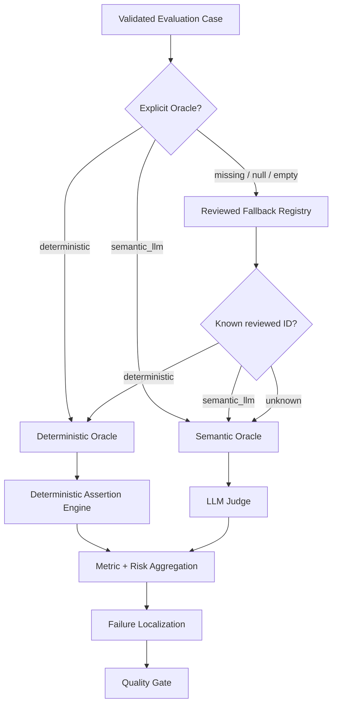
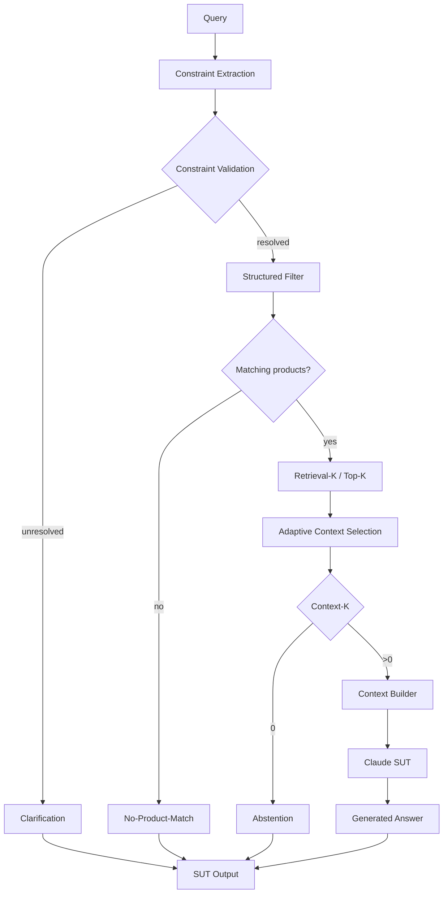
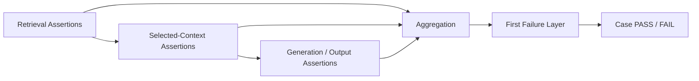

# Automated AI Evaluation — Oracle Architecture

## Purpose

AI evaluation in this lab is automated test execution against the real reference SUT. Deterministic checks and LLM-as-a-Judge are two Oracle mechanisms inside the same QE framework.

The canonical metric definitions and denominators are maintained in `docs/metric_contract.md`.

## Pre-execution Dataset Validation

Before active evaluation, the selected governed dataset is validated by `src/dataset_validator.py`.

```text
deterministic      -> valid only with non-empty deterministic assertions
semantic_llm       -> valid semantic route
missing/null/empty -> warning; reviewed runtime fallback allowed
invalid non-empty  -> validation ERROR
missing/duplicate ID -> validation ERROR
```

PR Critical, Regression and Nightly validate their selected datasets before SUT/Judge model calls. Golden is also validated when executed inside Release Validation.

## Oracle hierarchy



The governed dataset Oracle is the primary routing source. The fallback registry is resilience only. The Judge never chooses the Oracle.

> **Oracle routing decides how observed behavior is evaluated. It does not decide whether the SUT calls Claude.**

The SUT itself has deterministic early-response paths that can skip Claude:

```text
unresolved governed input -> Clarification -> no retrieval / no Claude
zero hard-constraint matches -> No-Product-Match -> no Claude
Context-K=0 -> Abstention -> no Claude
otherwise -> Context Builder -> Claude Generation
```

All of those behaviors can still be evaluated through deterministic or semantic Oracle logic according to the governed case contract.

## SUT evidence chain



Retrieval candidates remain available for retrieval diagnostics. Only selected Context-K evidence is eligible for generation. This allows failures to be separated across validation, filtering, retrieval, context selection, context construction and generation.

## Deterministic Assertion Engine

Routing answers **who/what evaluates the case**. The assertion engine defines **what Python must prove**.



Supported assertions include `retrieved_id`, `contains`, `regex`, `not_regex`, `no_constraint_match`, `answer_products_satisfy_constraints`, and `catalogue_min_price_product`.

Current reviewed routine-suite routing:

| Suite | Total | Deterministic | Semantic LLM Judge |
|---|---:|---:|---:|
| PR Critical | 10 | 6 | 4 |
| Regression | 15 | 7 | 8 |
| Nightly | 80 | 48 | 32 |
| **Total** | **105** | **61** | **44** |

Golden is a separate trusted release/reference baseline and is not included in this 105-case routine-suite inventory.

## Metric population rules

| Metric | Mechanism | Population |
|---|---|---|
| Overall Pass Rate | Python aggregation | all executed cases |
| Retrieval Hit Rate | deterministic Python | all applicable executed cases according to metric contract |
| Constraint Match / Precision@K | deterministic Python | applicable structured-constraint cases |
| Correctness | LLM Judge | semantic/Judge cases only |
| Groundedness | LLM Judge | semantic/Judge cases only |
| Hallucination | LLM Judge | semantic/Judge cases only |
| Context Coverage | LLM Judge | semantic/Judge cases only |
| Context Sufficiency | LLM Judge | semantic/Judge cases only |
| Constraint Adherence | deterministic Python or Judge by route | applicable hybrid population |

Semantic-only fields are N/A for deterministic-only cases and are excluded from semantic denominators. An empty semantic population is **N/A**, never fabricated as 100%.

Current quality thresholds:

```text
Correctness >= 95%
Groundedness >= 95%
Retrieval Hit >= 95%
Constraint Adherence >= 95%
Hallucination <= 2%
```

The final Quality Gate remains deterministic even when source metrics include semantic Judge outcomes.

## Probabilistic generation and reruns

When Claude generation is used, stochastic behavior remains possible. A rerun is evidence about reproducibility; it does not erase the original failure.

```text
original failure
-> preserve evidence
-> controlled rerun if required for diagnosis
-> intermittent = stochastic stability signal
-> repeated = systematic defect signal
```

## Relationship to AI risk and failure localization

```text
Risk          -> what can fail?
Test Case     -> how do we exercise it?
Oracle        -> how is PASS/FAIL decided?
Assertion     -> what objective fact must Python prove?
Judge         -> what meaning-level behavior needs interpretation?
Evidence      -> what happened at each SUT layer?
Localization  -> where did behavior first diverge?
Quality Gate  -> what lifecycle decision follows?
```

## Engineering rule

**Automate deterministically everything that can be expressed as an objective assertion. Use an LLM Judge only where the residual quality property genuinely requires semantic interpretation. Keep Oracle routing independent from the SUT generation path, and always report the population actually measured.**
