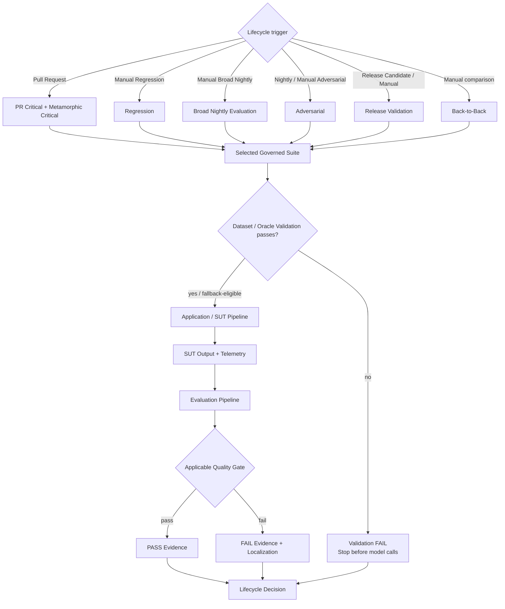
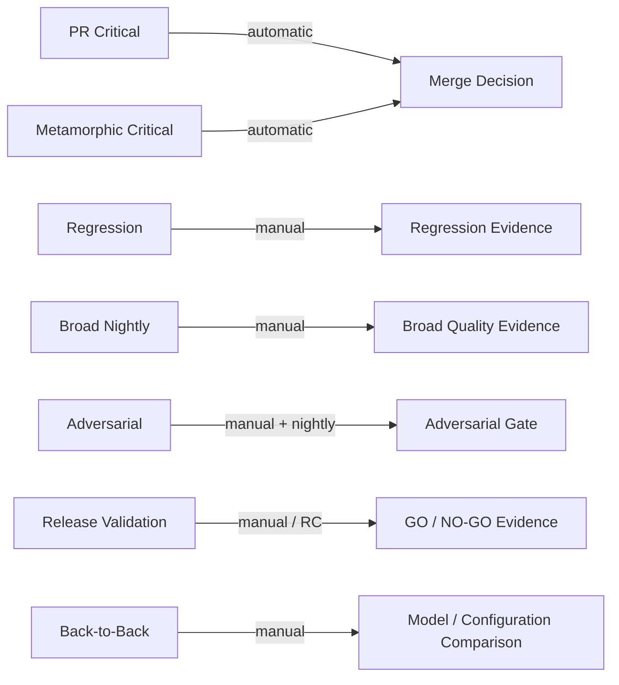

# CI/CD / Suite Execution Pipeline

_Last synchronized with repository: 2026-09-01._

## Purpose

This document is the detailed zoom-in for the **CI/CD / Suite Execution** block from the Master Architecture. It shows how a lifecycle trigger selects a governed suite, invokes the shared validation → SUT → evaluation chain, and turns evidence into the corresponding lifecycle decision.

## Detailed state / decision flow



## Current lifecycle state



Broad Regression/Nightly product schedules are intentionally paused. Back-to-Back reuses the 10 standard PR Critical cases. Golden is used as canonical release/reference truth under separate governance; Judge Calibration validates evaluator quality separately.

## Shared execution boundary

Every ordinary governed suite reuses the same architectural chain rather than owning another application or evaluation architecture:

```text
Selected Governed Suite
-> Dataset / Oracle Validation
-> Application / SUT Pipeline
-> SUT Output + Telemetry
-> Evaluation Pipeline
-> Quality Gate
-> Evidence
-> Lifecycle Decision
```

Specialized workflows may add their own comparison/relation/adversarial aggregation, but they do not redefine the SUT pipeline.