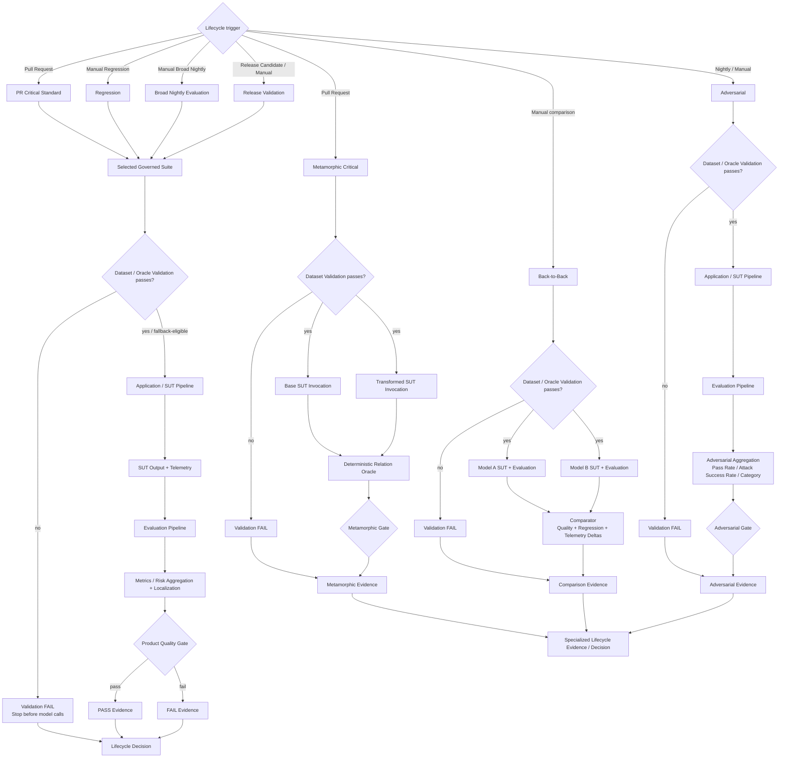
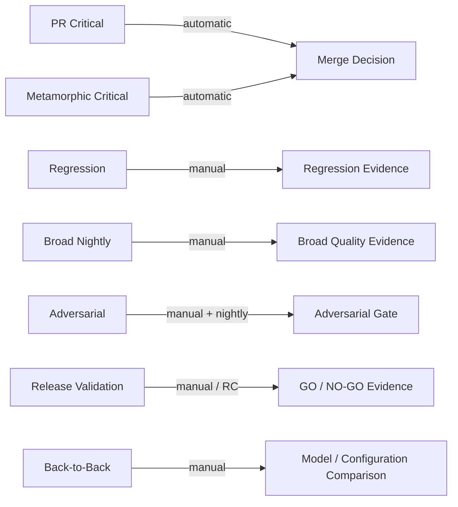

# CI/CD / Suite Execution Pipeline

_Last synchronized with repository: 2026-09-01._

## Purpose

This document is the detailed zoom-in for the **CI/CD / Suite Execution** block from the Master Architecture. It shows how lifecycle triggers select governed assets, invoke the shared validation → SUT → evaluation components, and turn evidence into the corresponding lifecycle decision.

Ordinary lifecycle suites use the common linear execution chain. Specialized AI-testing workflows reuse the same governed SUT/evaluation components where applicable but have their own execution topology, Oracle/aggregation and gate.

## Detailed state / decision flow



## Current lifecycle state



Broad Regression/Nightly product schedules are intentionally paused. Back-to-Back reuses the 10 standard PR Critical cases. Golden is used as canonical release/reference truth under separate governance; Judge Calibration validates evaluator quality separately.

## Shared execution boundary

Ordinary governed suites reuse the same architectural chain:

```text
Selected Governed Suite
-> Dataset / Oracle Validation
-> Application / SUT Pipeline
-> SUT Output + Telemetry
-> Evaluation Pipeline
-> Metrics / Risk Aggregation + Failure Localization
-> Product Quality Gate
-> Evidence
-> Lifecycle Decision
```

Specialized workflows reuse those components compositionally rather than redefining the SUT architecture:

```text
Metamorphic
validated META cases
-> base + transformed SUT invocations
-> deterministic relation Oracle
-> Metamorphic Gate

Back-to-Back
same validated 10 PR Critical standard cases
-> Model A SUT + Evaluation
-> Model B SUT + Evaluation
-> comparator
-> comparison evidence

Adversarial
validated adversarial cases
-> SUT
-> Evaluation
-> adversarial-specific aggregation
-> Adversarial Gate
```
