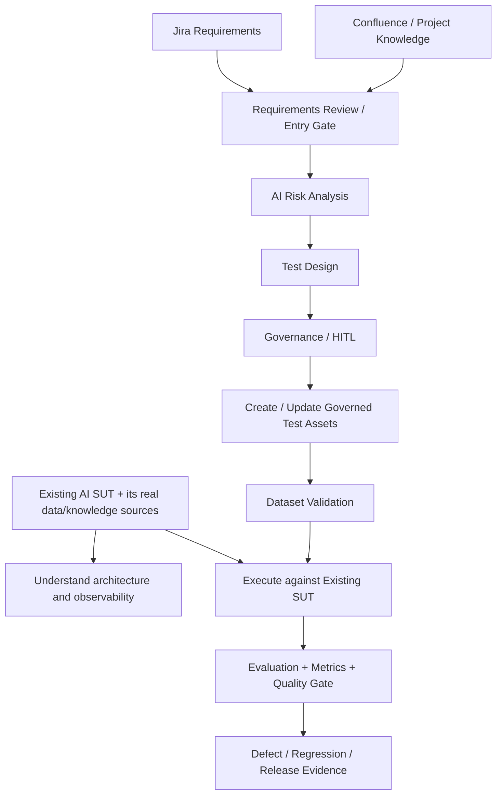

# Dataset Lifecycle Evolution

## Why the controlled SUT data exists

The current product catalogue and policy knowledge base are controlled **POC fixtures for the reference SUT**. They let the lab validate retrieval, adaptive context selection, generation, evaluation, Oracle routing, telemetry, quality gates and failure localization against known source data.

They are not the same thing as future Jira/Confluence governance inputs.

```text
SUT knowledge / application data
= catalogue, policies, enterprise KB, databases, APIs, tools

QE governance inputs
= Jira requirements, Confluence/project knowledge, risk and test metadata
```

On a real project, the SUT knowledge/data layer is defined by the application architecture. Jira or Confluence do not automatically replace the SUT knowledge base; they provide requirement and governance context used to design and maintain quality assets.

## Current governed dataset controls

The executable datasets are already subject to Dataset/Oracle Validation before active evaluation. Current rules are:

- `Oracle = deterministic` -> valid and requires non-empty deterministic assertions;
- `Oracle = semantic_llm` -> valid;
- Oracle missing / `null` / empty -> warning and reviewed runtime fallback is allowed;
- unsupported non-empty Oracle values -> validation error;
- missing or duplicate case IDs -> validation error.

The governed dataset is the primary source of truth. The runtime fallback registry is a resilience mechanism, not an independent business-truth source.

## Planned evolution



The important separation is that agents/governance create **test assets and traceability around an existing SUT**. They do not replace the SUT's own catalogue, policies, vector store, databases or other runtime knowledge sources.

## Target test-asset lifecycle

The target design does not require Excel as an intermediate format. Agents can create/update governed executable JSON after requirements review and human approval where required.

For every case, the governed dataset should carry enough metadata for execution and traceability: case ID, requirement/business behavior, applicable risk, priority/criticality, target suite, expected evidence, Oracle and deterministic assertions where applicable.

```text
Jira Story + Confluence Context
  -> Requirements Review
  -> AI Risk Analysis
  -> Functional + AI Evaluation Test Design
  -> duplicate / coverage / Oracle review
  -> suite classification
  -> Human approval where required
  -> Governed Test Management asset / JSON Dataset update
  -> Dataset Validator
  -> Existing SUT Execution
  -> Evaluation / Quality Gate
  -> Defect / Regression / Release Evidence
```

## Oracle integrity and runtime fallback

The dataset is authoritative. The fallback registry exists only for resilience:

```text
Oracle missing / null / empty
  -> warning
  -> normalize case identifier
  -> reviewed fallback lookup
      -> known ID -> last approved deterministic / semantic route
      -> unknown ID -> safe semantic_llm default
```

Automatically generating/refreshing derived fallback mappings from validated approved dataset metadata remains useful hardening, but it is not the primary next roadmap milestone.

## Current versus target state

| Area | Current POC | Target evolution |
|---|---|---|
| SUT knowledge/data | Controlled catalogue + policy fixtures | Real project-specific KB/data/APIs/tools owned by the application |
| QE governance input | QE-authored local context | Jira requirements + Confluence/project knowledge |
| Dataset authoring | QE-managed repository JSON | Agent-assisted governed test-asset lifecycle |
| Classification | Explicit suite/risk metadata | Risk/criticality-driven recommendation + governance |
| Oracle | Explicit metadata + reviewed fallback | Explicit governed Oracle + derived fallback resilience |
| Integrity | Dataset Validation + runtime fallback | Validation + broader governance/traceability controls |
| Governance | QE-managed POC | Agent-assisted with human approval for material decisions |

The architectural intent is evolutionary: the controlled SUT proves the mechanics; Jira/Confluence later make the **QE lifecycle requirements-driven**, not the SUT knowledge base Jira-driven.
