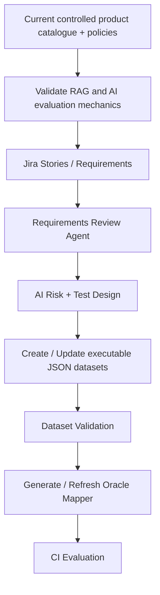

# Dataset Lifecycle Evolution

## Why the current catalogue exists

The current product catalogue and policy knowledge base are a controlled **POC fixture**. They let the lab learn and validate retrieval, context construction, evaluation, Oracle routing, telemetry, quality gates, and failure localization against known source data.

They are not intended to be the final enterprise knowledge source.

## Planned evolution



As the lab evolves, Jira requirements and the connected project knowledge base become the real inputs for QA-agent workflows. The current catalogue remains useful as a controlled SUT fixture, but it is no longer the conceptual end state.

## Target dataset lifecycle

The target design removes Excel as a mandatory intermediate format. The agent can create or update executable JSON directly after requirements review and human governance where required.

For every case, the governed dataset should carry enough metadata to support execution and traceability, including case ID, expected behavior, AI risk, priority/criticality, target suite, Oracle, and deterministic assertions where applicable.

```text
Jira Story
  -> Requirements Review
  -> AI Risk / Test Design
  -> duplicate and coverage review
  -> suite classification
  -> JSON Dataset update
  -> Dataset Validator
  -> Oracle Mapper generation
  -> CI evaluation
```

## Oracle integrity rules

The dataset is the primary source of truth.

- `Oracle = deterministic` -> deterministic Python route.
- `Oracle = semantic_llm` -> semantic Judge route.
- Oracle missing / `null` / empty -> runtime fallback is allowed and should emit a warning.
- Unsupported non-empty Oracle values such as `banana` -> dataset validation error; do not silently hide corrupted metadata behind fallback.

When all cases pass dataset validation, the Oracle mapper/registry should be regenerated automatically from the approved dataset rather than edited independently by a person. This prevents the dataset and mapper from drifting because someone forgot to update both.

## Runtime fallback

The mapper remains valuable as a runtime resilience mechanism:

```text
Oracle missing / null / empty
  -> warning
  -> normalize case_id / id / ID
  -> mapper lookup
      -> known ID -> use last approved deterministic / semantic route
      -> unknown ID -> safe semantic_llm default
```

The fallback protects evaluation if Oracle metadata is lost during propagation or a legacy case does not contain the field. It is not a second manually maintained business source of truth.

## Continuous dataset integrity

Dataset integrity should be checked whenever a dataset changes. A scheduled CI integrity job can additionally scan all datasets periodically (for example weekly) and report missing Oracle metadata, invalid Oracle values, duplicate IDs, unsupported risks, missing required assertions, and mapper consistency.

This gives the lifecycle three controls:

1. the QA Agent creates or updates governed cases;
2. CI validation detects dataset-quality defects;
3. the generated mapper provides runtime fallback if primary Oracle metadata is missing.

## Current versus target state

| Area | Current POC | Target evolution |
|---|---|---|
| Knowledge source | Product catalogue + policy fixtures | Jira requirements + connected project knowledge base |
| Dataset authoring | Controlled repository datasets | Agent-assisted JSON dataset lifecycle |
| Classification | Existing suite metadata | Risk/criticality-driven automatic suite recommendation |
| Oracle | Explicit metadata + fallback routing | Explicit validated Oracle + generated mapper |
| Integrity | Runtime routing safeguards | Change-time validation + scheduled integrity checks + runtime fallback |
| Governance | QE-managed POC | Agent-assisted with human approval for material decisions |

The architectural intent is therefore evolutionary: the current catalogue lets us prove the mechanics in a controlled environment; Jira and the project knowledge base later turn the same evaluation framework into a requirements-driven AI QE workflow.