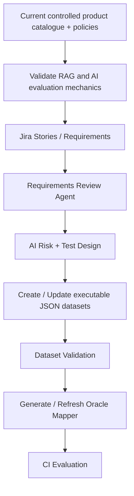

# Dataset Lifecycle Evolution

## Why the current catalogue exists

The current product catalogue and policy knowledge base are controlled **POC fixtures**. They let the lab validate retrieval, adaptive context selection, generation, evaluation, Oracle routing, telemetry, quality gates and failure localization against known source data. They are not intended to be the final enterprise knowledge source.

## Current governed dataset controls

The executable JSON datasets are already subject to Dataset/Oracle Validation in PR Critical, Regression and Nightly CI. Current rules are:

- `Oracle = deterministic` -> valid and requires non-empty deterministic assertions;
- `Oracle = semantic_llm` -> valid;
- Oracle missing / `null` / empty -> warning and runtime fallback is allowed;
- unsupported non-empty Oracle values -> validation error;
- missing or duplicate case IDs -> validation error.

All 61 reviewed deterministic cases currently have structured atomic assertions. The dataset is the primary source of truth; the runtime mapper is a resilience mechanism.

## Planned evolution



As the lab evolves, Jira requirements and connected project knowledge become inputs for QA-agent workflows. The catalogue remains useful as a controlled SUT fixture, but it is not the conceptual enterprise end state.

## Target dataset lifecycle

The target design does not require Excel as an intermediate format. Agents can create/update governed executable JSON after requirements review and human approval where required.

For every case, the governed dataset should carry enough metadata for execution and traceability: case ID, expected behavior, AI risk, priority/criticality, target suite, Oracle and deterministic assertions where applicable.

```text
Jira Story
  -> Requirements Review
  -> AI Risk / Test Design
  -> duplicate and coverage review
  -> suite classification
  -> Human approval where required
  -> Governed JSON Dataset update
  -> Dataset Validator
  -> Oracle Mapper generation
  -> CI evaluation
```

## Oracle integrity and runtime fallback

The dataset is authoritative. The mapper is valuable only as runtime resilience:

```text
Oracle missing / null / empty
  -> warning
  -> normalize case_id / id / ID
  -> mapper lookup
      -> known ID -> use last approved deterministic / semantic route
      -> unknown ID -> safe semantic_llm default
```

The next governance hardening step is to regenerate the mapper automatically from validated approved dataset metadata rather than edit it independently. This prevents source-of-truth drift.

## Continuous dataset integrity

Change-time validation is implemented in the three active CI workflows. A scheduled integrity audit remains optional future hardening for additional checks such as unsupported risks, mapper consistency and broader cross-dataset duplication/coverage rules.

The lifecycle therefore has three intended controls:

1. governed cases are created/updated in JSON;
2. CI validation catches dataset-quality defects before model execution;
3. the derived mapper provides runtime fallback when primary Oracle metadata is missing.

## Current versus target state

| Area | Current POC | Target evolution |
|---|---|---|
| Knowledge source | Product catalogue + policy fixtures | Jira requirements + connected project knowledge |
| Dataset authoring | QE-managed repository JSON | Agent-assisted governed JSON lifecycle |
| Classification | Explicit suite/risk metadata | Risk/criticality-driven suite recommendation |
| Oracle | Explicit metadata + reviewed fallback | Explicit validated Oracle + automatically generated mapper |
| Integrity | Change-time Dataset Validation + runtime fallback | Validation + generated mapper + optional scheduled integrity audit |
| Governance | QE-managed POC | Agent-assisted with human approval for material decisions |

The architectural intent is evolutionary: the controlled SUT proves the mechanics; Jira and project knowledge later make the same framework requirements-driven.
