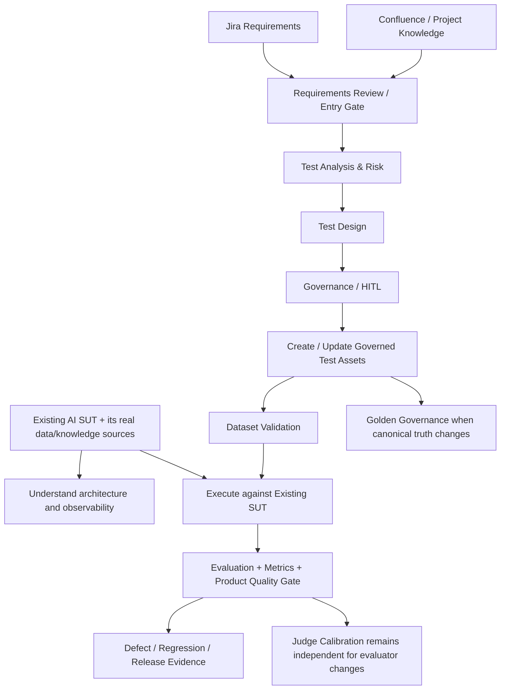

# Dataset Lifecycle Evolution

## Why the controlled SUT data exists

The current product catalogue and policy knowledge base are controlled **POC fixtures for the reference SUT**. They let the lab validate retrieval, adaptive context selection, generation, evaluation, Oracle routing, telemetry, quality gates and failure localization against known source data.

They are not the same thing as future Jira/Confluence governance inputs.

```text
SUT knowledge / application data
= catalogue, policies, enterprise KB, databases, APIs, tools

QE governance inputs
= Jira requirements, Confluence/project knowledge, risk and test metadata
```

On a real project, the SUT knowledge/data layer is defined by application architecture. Jira/Confluence provide requirement and governance context used to design/maintain quality assets; they do not automatically replace the SUT knowledge base.

## Current governed test-asset controls

The framework now has multiple test-asset controls because not every dataset represents the same kind of truth.

### SUT evaluation datasets

PR Critical, Regression, Nightly and Golden are executable product-evaluation assets. Before SUT evaluation:

- `Oracle = deterministic` -> valid and requires non-empty deterministic assertions;
- `Oracle = semantic_llm` -> valid;
- Oracle missing / `null` / empty -> warning and reviewed runtime fallback is allowed;
- unsupported non-empty Oracle values -> validation error;
- missing/duplicate case IDs -> validation error.

The governed dataset is primary. The runtime fallback registry is resilience, not an independent business-truth source.

### Golden canonical truth

Golden has an additional governance layer because it represents canonical expected behavior.

```text
Golden change
-> Golden Change Reason
-> Source of Truth
-> deterministic Golden Governance Check
-> Dataset Validation
-> Human Review
-> approved canonical baseline
```

Automatic enforcement triggers only for:

```text
datasets/golden_dataset.json
src/golden_governance_check.py
.github/workflows/golden-governance.yml
```

This protects against goalpost movement: a failing product evaluation or changed Judge verdict does not by itself justify rewriting Golden.

### Judge Calibration Dataset

`datasets/judge_calibration_dataset.json` is different from SUT evaluation data. It tests the semantic evaluator itself using human-reviewed known examples.

```text
Human Calibration Truth
       ↓             ↓
OLD Judge         NEW Judge
       ↓             ↓
       agreement / false PASS / false FAIL
                  ↓
          Judge Calibration Gate
```

The calibration set is also governed truth. It should not be rewritten simply because a proposed model/prompt/rubric performs poorly.

The initial 8-case baseline produced 100% agreement across 32 expected field judgments with 0 false PASS and 0 false FAIL for `claude-opus-5` + prompt `v1` + rubric `v1`.

## Planned evolution



Agents/governance create **test assets and traceability around an existing SUT**. They do not replace the SUT's catalogue, policies, vector store, databases or runtime knowledge sources. They also must not bypass existing Judge Calibration or Golden Governance controls.

## Target test-asset lifecycle

The target design does not require Excel as an intermediate format. Agents can create/update governed executable JSON after requirements review and human approval where required.

Every case should carry enough metadata for execution and traceability: case ID, requirement/business behavior, applicable risk, priority/criticality, target suite, expected evidence, Oracle and deterministic assertions where applicable.

```text
Jira Story + Confluence Context
  -> Requirements Review
  -> Test Analysis & Risk
  -> Functional + AI Evaluation Test Design
  -> Coverage / Gap / Oracle Review
  -> suite classification
  -> Human approval where required
  -> Governed Test Management asset / JSON Dataset update
  -> Dataset Validator
  -> Existing SUT Execution
  -> Evaluation / Product Quality Gate
  -> Defect / Regression / Release Evidence
```

If an agent proposes a **Golden** change, the Golden-specific reason/source/human-review lifecycle applies. If an agent proposes a **Judge** model/prompt/rubric change, the Judge Calibration workflow applies. Agent automation does not get a special bypass.

## Oracle integrity and runtime fallback

```text
Oracle missing / null / empty
  -> warning
  -> normalize case identifier
  -> reviewed fallback lookup
      -> known ID -> last approved deterministic / semantic route
      -> unknown ID -> safe semantic_llm default
```

Automatically deriving/refreshing fallback mappings from validated approved dataset metadata remains useful hardening but is not a competing source of business truth.

## Current versus target state

| Area | Current POC | Target evolution |
|---|---|---|
| SUT knowledge/data | Controlled catalogue + policy fixtures | Real project-specific KB/data/APIs/tools owned by application |
| QE governance input | QE-authored repository context | Jira + Confluence/project knowledge |
| SUT dataset authoring | QE-managed governed JSON | Agent-assisted governed test-asset lifecycle |
| Classification | Explicit suite/risk metadata | Risk/criticality-driven recommendation + governance |
| Oracle | Explicit metadata + reviewed fallback | Explicit governed Oracle + derived fallback resilience |
| SUT dataset integrity | Dataset Validation | Validation + broader traceability/coverage governance |
| Golden truth | Human policy + deterministic PR check | Business/QE approval linked to enterprise source of truth |
| Judge configuration | Version-controlled Model + Prompt + Rubric | Same, with release/customer governance as required |
| Judge quality | OLD-vs-NEW calibration on human truth | Larger calibrated evidence/trend policy where justified |
| Governance | QE-managed POC | Agent-assisted with explicit human approval for material decisions |

The architectural intent is evolutionary: controlled SUT data proves the mechanics; Jira/Confluence later make the **QE lifecycle requirements-driven** while the already-implemented evaluation, evaluator-calibration and truth-governance controls remain independent quality safeguards.
