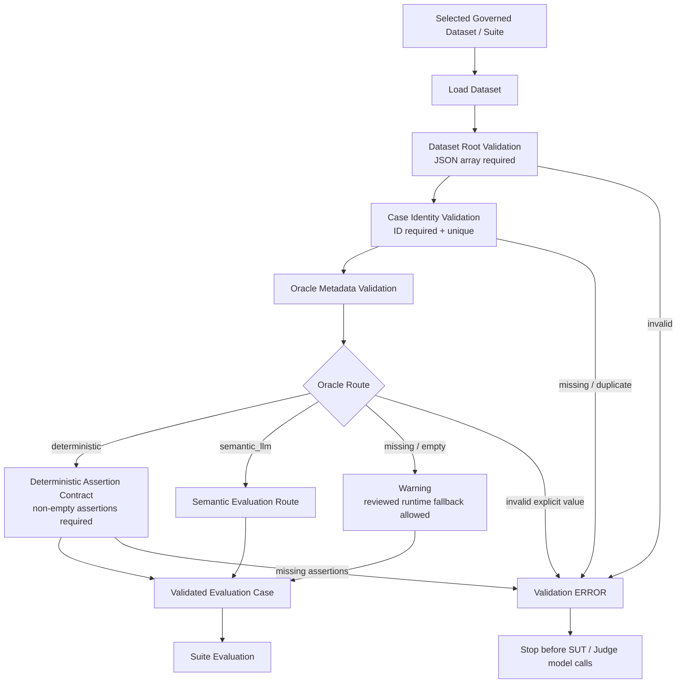

# Dataset / Oracle Validation Pipeline

## Purpose

This pipeline is the first technical stage of downstream CI/CD quality execution. It answers:

> Does the selected governed evaluation case satisfy the implemented execution/evaluation contract well enough to proceed?

It is not Human Governance / Approval, not the Application/SUT pipeline, and not Golden/Judge change governance.

## Current implemented pipeline



## Current validation contract

The current `src/dataset_validator.py` enforces the following behavior:

| Step | Implemented check | Failure behavior |
|---|---|---|
| Dataset root | Dataset root must be a JSON array | Validation ERROR |
| Case identity | Case ID must exist and be unique within the selected dataset | Validation ERROR |
| Oracle metadata | Explicit Oracle must be `deterministic` or `semantic_llm` | Validation ERROR for invalid explicit values |
| Missing Oracle | Missing/null/empty Oracle is allowed only through the reviewed runtime fallback path | Validation WARNING |
| Deterministic assertion contract | Explicit deterministic cases require non-empty deterministic assertions | Validation ERROR |
| Nightly assertion compatibility | `evaluation_dataset.json` may obtain deterministic assertions from the existing assertion metadata sidecar | Continue when assertions resolve |

```text
dataset root
    -> JSON array required

case ID
    -> required and unique

deterministic
    -> non-empty deterministic assertions required

semantic_llm
    -> valid semantic evaluation route

missing / null / empty Oracle
    -> warning
    -> reviewed runtime fallback may resolve the route

invalid non-empty Oracle
    -> validation ERROR
```

The governed dataset is authoritative for explicit Oracle routing. Runtime/legacy routing exists for compatibility and resilience; it must not silently override a valid explicit dataset Oracle.

## Future hardening behind the same boundary

The architectural boundary intentionally remains broader than the current implementation. Future validation may add:

- fuller per-case schema validation;
- required query/input fields;
- expected-behavior/source field contracts;
- risk/criticality metadata requirements;
- explicit execution eligibility rules;
- cross-file/sidecar consistency checks.

These are **future hardening items**, not claims about what the current validator already enforces.

## Boundary with Human Governance / Approval

Human governance occurs before these assets become governed:

```text
Test Analysis & Design
-> Proposed Test / Evaluation Assets
-> Human Review / Approval
-> Governed Test Assets
```

That process answers:

> Should this proposed quality asset be accepted into the governed test assets?

Dataset / Oracle Validation happens later, when an approved governed suite is selected for execution, and answers:

> Is this selected case technically valid under the executable contract?

The two controls are intentionally separate.

## Boundary with Application / SUT

Dataset validation ends at a **Validated Evaluation Case**. The reference application execution then begins:

```text
Validated Evaluation Case
-> Constraint Extraction
-> Constraint Validation / Classification
-> Structured Filtering / deterministic routing
-> Semantic Ranking / Retrieval-K where applicable
-> Adaptive Context Selection
-> Context Builder
-> Generation / deterministic exit
-> SUT Output
```

This boundary is important because a malformed execution contract should fail before it consumes SUT or Judge model tokens.

## Boundary with Evaluation

Dataset / Oracle Validation verifies the case contract. Evaluation later applies that route to actual SUT evidence:

```text
Dataset / Oracle Validation
-> valid / fallback-eligible Oracle contract

SUT Execution
-> actual output + retrieval/context evidence

Evaluation
-> Oracle Resolution
-> deterministic Python OR semantic LLM Judge
-> evaluated case result
-> metrics / risk aggregation
```

## Boundary with governance control planes

Do not confuse runtime/execution validation with governance:

- **Human Test-Asset Governance / Approval** — reviews proposed test/evaluation assets before promotion.
- **Dataset / Oracle Validation** — checks selected governed cases immediately before execution.
- **Golden Governance** — protects changes to canonical expected truth.
- **Judge Calibration** — checks whether a changed semantic evaluator remains trustworthy against human-reviewed truth.

## Position inside CI/CD Quality Execution

```text
Selected Governed Suite
-> Dataset / Oracle Validation
-> SUT Execution
-> Evaluation
-> Metrics / Risk Aggregation
-> Quality Gate
-> PASS / FAIL + Evidence
-> PR / Regression / Nightly / Release Decision
```

CI/CD therefore **starts with Dataset / Oracle Validation for the selected suite**; it is not a separate box that begins after evaluation.

## Cost-control implication

Validation is deterministic and must run before expensive model execution wherever possible. Invalid cases should fail fast rather than consume SUT or Judge tokens and produce misleading quality metrics.
