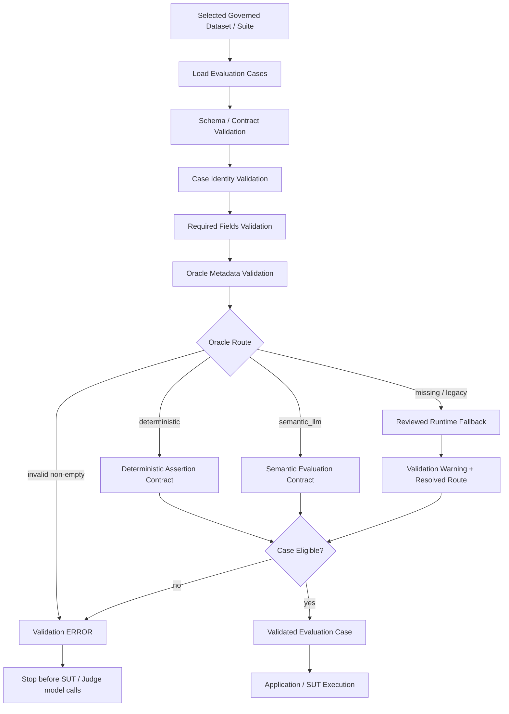

# Dataset / Oracle Validation Pipeline

## Purpose

This pipeline answers one question before expensive SUT or Judge execution begins:

> Is the selected evaluation case structurally valid, sufficiently specified, and correctly routed to an Oracle?

It is an execution-precondition pipeline. It is not the Application/SUT pipeline and it is not Golden/Judge change governance.

## Pipeline



## Validation sequence

| Step | What is checked | Failure behavior |
|---|---|---|
| Dataset / suite selection | A governed execution asset was selected for the intended lifecycle purpose | Do not execute an undefined suite |
| Schema / contract validation | Dataset and case structure conform to the governed contract | Validation ERROR |
| Case identity | Case ID exists and is unique | Validation ERROR |
| Required fields | Required input/expected metadata is present for the case contract | Validation ERROR where required by schema/route |
| Oracle metadata | Oracle is present, valid, or eligible for the reviewed legacy fallback | ERROR for invalid explicit values; warning for reviewed missing/legacy route |
| Deterministic assertion contract | Deterministic cases contain non-empty formal assertions | Validation ERROR |
| Semantic route | `semantic_llm` cases are valid for Judge evaluation | Continue to SUT/evaluation |
| Eligibility | The case has a usable input and resolved evaluation route | Invalid cases stop before expensive execution |

## Current Oracle contract

```text
deterministic
    -> non-empty deterministic assertions required

semantic_llm
    -> valid semantic evaluation route

missing / null / empty
    -> warning
    -> reviewed runtime fallback may resolve the route

invalid non-empty Oracle
    -> validation ERROR

missing / duplicate case ID
    -> validation ERROR
```

The governed dataset is authoritative for Oracle routing. A sidecar or runtime heuristic must not silently replace an explicit valid case Oracle.

## Boundary with Application / SUT

Dataset validation ends at a **Validated Evaluation Case**. Only then does the reference application pipeline begin:

```text
Validated Evaluation Case
-> Constraint Extraction
-> Constraint Validation / Classification
-> Structured Filtering
-> Semantic Ranking / Retrieval-K
-> Adaptive Context Selection
-> Context Builder
-> Generation / deterministic exit
-> SUT Output
```

This boundary is important because a malformed test asset should fail before it consumes SUT or Judge model tokens.

## Boundary with Evaluation

Dataset / Oracle Validation establishes that a case has a usable Oracle contract. Evaluation later applies that Oracle to actual SUT evidence:

```text
Dataset / Oracle Validation
-> resolved Oracle contract

SUT Execution
-> actual output + retrieval/context evidence

Evaluation
-> Oracle Resolution
-> deterministic Python OR semantic LLM Judge
-> metric aggregation
```

Validation checks whether the Oracle contract is valid. Oracle Resolution during evaluation uses that validated contract to decide how PASS/FAIL is measured.

## Boundary with Governance

Do not confuse execution validation with change governance:

- **Dataset / Oracle Validation** — checks whether cases can be executed safely and correctly.
- **Golden Governance** — checks whether a change to canonical expected truth is legitimate and auditable.
- **Judge Calibration** — checks whether a changed semantic evaluator remains trustworthy against human-reviewed truth.
- **Agentic Dataset Governance** — reviews proposed dataset diffs before promotion into governed datasets.

## Execution position

```text
Agentic QE / human-authored assets
-> Governed Dataset
-> Dataset / Oracle Validation
-> Application / SUT
-> Evaluation
-> Quality Gate
-> PR / Regression / Nightly / Release decision
```

## Cost-control implication

Validation is deterministic and must run before expensive model execution wherever possible. Invalid cases should fail fast rather than consume SUT or Judge tokens and produce misleading quality metrics.
