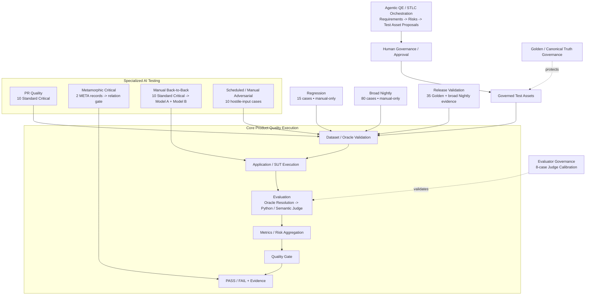
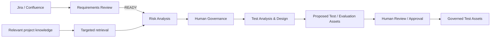
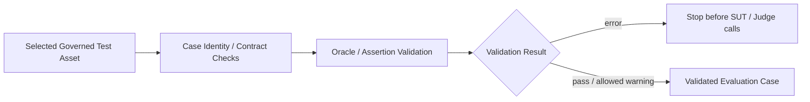
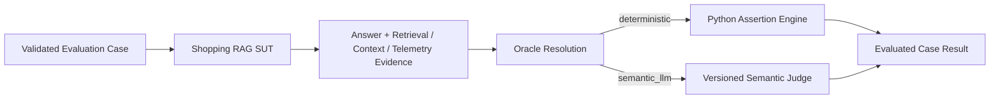
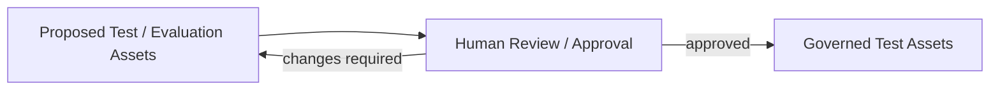
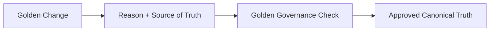
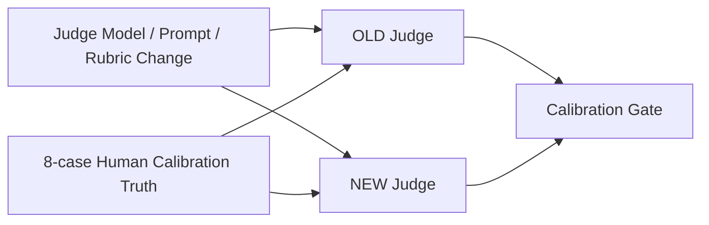

# AI QE Lab — Master Architecture

## Purpose

This document is the expanded top-level map of the lab. It aligns the reusable AI QE framework with the workflows and governed assets currently implemented in the repository.

The framework separates:

- **target Agentic QE/STLC orchestration** that creates proposed quality assets;
- **Human Governance / Approval** that promotes reviewed proposals into governed test assets;
- **CI/CD Quality Execution** that validates selected assets, executes the SUT/evaluation path, aggregates evidence and applies gates;
- **specialized AI testing workflows** for Metamorphic, Back-to-Back and Adversarial testing;
- independent **Golden** and **Evaluator/Judge** governance control planes.

## Master architecture



The master diagram shows responsibility boundaries and execution paths. Internal SUT details remain in `architecture.md`; Oracle/evaluator details remain in `automated_ai_evaluation.md`.

## Governed asset model

The standard routine SUT inventory is intentionally distinct from specialized and governance assets.

| Asset | Current role |
|---|---|
| **PR Critical standard** | 10 fast merge-blocking cases; 6 deterministic / 4 semantic |
| **Metamorphic Critical** | 2 dedicated META records stored in `pr_critical_dataset.json`; relation-based PR gate |
| **Regression** | 15 stable/fixed-defect cases; manual-only currently |
| **Broad Nightly Evaluation** | 80 broad AI-risk/edge cases; manual-only currently |
| **Golden** | 35 canonical release/reference cases |
| **Adversarial** | 10 dedicated hostile-input cases with its own taxonomy/summary/gate |
| **Judge Calibration** | 8 human-reviewed evaluator cases; tests the Judge, not the SUT |

The 105 standard routine SUT cases are the 10 standard PR Critical + 15 Regression + 80 Broad Nightly cases. The 2 Metamorphic records and 10 Adversarial cases are separate technique-specific assets. Golden and Judge Calibration serve different governance purposes.

Back-to-Back does **not** own another dataset. It reuses the 10 standard PR Critical cases against two selected generation models/configurations.

## 1. Agentic QE / STLC Orchestration — target architecture



Agent output remains a proposal/evidence artifact until Human Governance / Approval promotes it.

## 2. Dataset / Oracle Validation

Dataset/Oracle Validation is the first technical execution-precondition for ordinary selected governed suites.



The current validator enforces dataset root shape, case ID presence/uniqueness, allowed Oracle values and non-empty deterministic assertions for deterministic routes, with a warning/fallback path for missing Oracle metadata.

## 3. Core SUT and evaluation path



Semantic Judge verdicts must include a short non-empty rationale for both PASS and FAIL. Missing `reason` is an evaluator contract violation, not a valid semantic result. Judge model/prompt/rubric assets are version-controlled and changes are calibrated against the 8-case human-reviewed calibration set.

## 4. Specialized AI testing workflows

### PR quality

```text
Pull Request
├─ Standard Critical Evaluation
│  └─ 10 standard PR Critical cases
└─ Metamorphic Critical
   └─ 2 META records
      -> base invocation + transformed invocation
      -> deterministic relation Oracle
      -> Metamorphic Gate
```

The standard Critical path and the Metamorphic relation path are separate execution paths even though the META records are stored in the same `pr_critical_dataset.json` file.

### Back-to-Back

```text
Manual workflow_dispatch
-> choose Model A + Model B
-> same 10 standard PR Critical cases
-> execute both models
-> evaluate both outputs
-> compare quality metrics
-> classify improved / regressed / unchanged cases
-> compare latency and token telemetry
-> retain comparison evidence
```

Back-to-Back is a comparative technique and therefore reuses a controlled dataset instead of introducing another suite.

### Adversarial

```text
workflow_dispatch or nightly schedule
-> datasets/adversarial_dataset.json (10 cases)
-> SUT execution
-> semantic Judge evaluation
-> Adversarial Pass Rate
-> Attack Success Rate
-> category breakdown
-> critical adversarial failure count
-> Adversarial Gate
```

The adversarial dataset follows `adversarial_testing_contract.md`. All current ADV cases explicitly use `semantic_llm` because attack success/failure is meaning-level behavior.

### Drift

Drift testing is intentionally not part of the current roadmap.

## 5. Lifecycle execution

```text
Regression         = 15 cases, manual-only
Broad Nightly      = 80 cases, manual-only
Release Validation = manual: 35 Golden + broad Nightly evidence + Release Quality Gate
```

Release Validation is not another name for Golden. Golden provides canonical reference behavior; release readiness combines Golden with broader relevant evidence.

## 6. Governance control planes

### Human test-asset governance



### Golden / canonical truth



### Evaluator / Judge



## Cross-cutting rules

```text
Agent output -> proposal until human-approved promotion.
Formal assertion -> deterministic Python.
Meaning / behavior judgment -> semantic LLM Judge.
Semantic Judge verdict -> non-empty rationale required.
Validate dataset/oracle contracts before expensive model calls.
Retrieve broadly -> select relevant evidence -> send narrowly to an agent.
```

Retain where applicable: requirement/case/trace ID, dataset identity, model and prompt version, Oracle route, rationale/evaluation evidence, token usage, latency, retrieval/context evidence, human approval history and quality-gate result.
