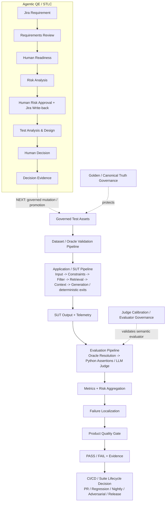

# AI QE Lab — Master Architecture

_Last synchronized with repository: 2026-09-01._

## Purpose

This document is the **full detailed end-to-end architecture** of the AI QE Lab. The root `README.md` shows the same architecture in a compact form. Dedicated pipeline documents are zoom-ins of the corresponding blocks below and contain the detailed state/decision transitions.

No pipeline document defines a competing architecture: each one expands one part of this master flow.

## Full architecture



The architecture has explicit boundaries:

```text
Agentic QE
-> Human Governance
-> Governed Test Assets
-> Dataset / Oracle Validation
-> Application / SUT Pipeline
-> SUT Output + Telemetry
-> Evaluation Pipeline
-> Metrics / Risk / Localization
-> Product Quality Gate
-> Evidence
-> CI/CD Lifecycle Decision
```

Golden Governance protects canonical truth. Judge Calibration protects evaluator quality. Neither is part of the ordinary SUT execution path.

## Canonical pipeline map

| Master block | Detailed state / decision document |
|---|---|
| Agentic QE / STLC | `agentic_qe_orchestration.md` |
| Dataset / Oracle Validation | `dataset_oracle_validation_pipeline.md` |
| Application / SUT | `sut_application_pipeline.md` |
| Evaluation | `automated_ai_evaluation.md` |
| CI/CD / Suite Execution | `cicd_suite_execution_pipeline.md` |
| Judge governance | `judge_calibration_workflow.md` |
| Golden governance | `golden_dataset_governance.md` |
| Specialized AI testing | `future_ai_testing_workflows.md` |

`architecture.md` remains the complete detailed architecture reference across these domains; the documents above provide deeper zoom-ins without redefining the master flow.

## Implemented upstream responsibilities

| Stage | Deterministic responsibilities | Semantic responsibilities | Mutation boundary |
|---|---|---|---|
| Requirements Review | input/eligibility, cache, contract, telemetry | requirement quality, gaps/questions | no automatic Jira approval write-back yet |
| Risk Analysis | eligibility, cache, L×I scoring, priority, contract | risk identification, mitigation/test-focus proposals | explicit approval writes Risk Register to Jira |
| Test Analysis & Design | dataset health, cache, contract normalization/retry, failure isolation | risk-driven optimized coverage, similarity reasoning, concrete test proposals, priority/time/suite rationale | analysis never mutates datasets |
| Human Decision | proposal lookup, decision validation, explicit confirmation | human judgment | decision evidence only; promotion is next slice |

## Governed asset model

| Asset | Scope / state |
|---|---|
| PR Critical standard | 10 |
| Metamorphic Critical | 2 |
| Regression | 15, manual |
| Broad Nightly | 80, manual |
| Golden | 35 canonical cases |
| Adversarial | 10, manual + nightly |
| Judge Calibration | 8 evaluator cases |
| Back-to-Back | reuses 10 PR cases |
| Agent Evaluation | planned |

Golden is canonical truth, not an ordinary execution tier. Judge Calibration tests evaluator quality, not product quality.

## Cross-cutting architecture rules

- deterministic Python owns formal contracts and exact decisions;
- LLMs own semantic reasoning where meaning-level judgment is required;
- deterministic eligibility runs before paid semantic calls;
- content-aware caches avoid unchanged repeat calls;
- prompts/models/cache versions participate in invalidation;
- human approval precedes governed/external mutation where defined;
- agent batches isolate per-ticket failures;
- similarity is evidence, not an automatic duplicate verdict;
- Judge quality and Golden truth have independent governance;
- no retry-until-green policy.

## Remaining architecture work

Only unimplemented items remain:

1. confirmed Human Decision → governed dataset ADD/EDIT/EXTEND_EXISTING mutation;
2. deterministic post-mutation validation;
3. source-control dataset diff/commit/PR promotion;
4. optional Requirements Review approval → Jira `review-completed` write-back;
5. targeted cross-document Risk evidence retrieval where useful;
6. Agent Evaluation Dataset and agent-behavior evaluation;
7. state-driven multi-agent orchestration after manual gates are stable;
8. optional Confluence/test-management/release integrations.

Drift testing remains outside the current roadmap.
