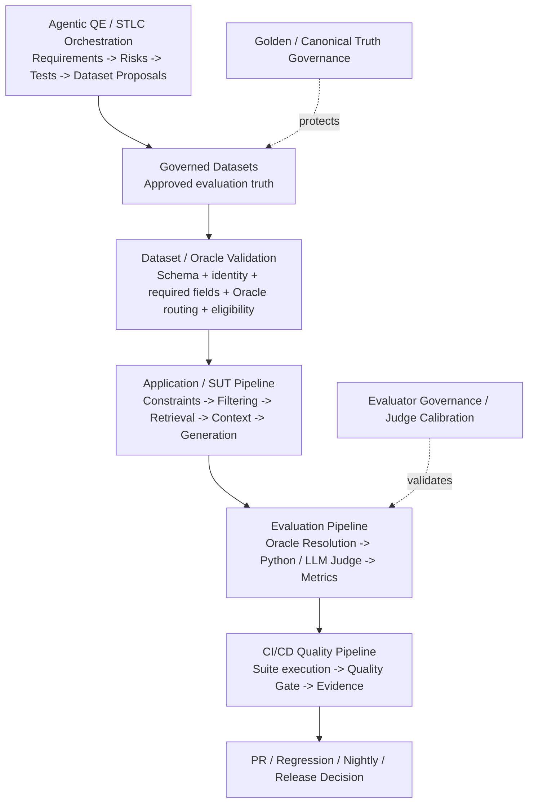
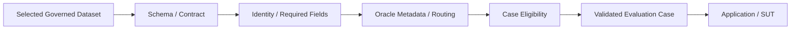
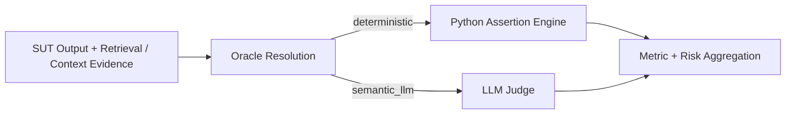
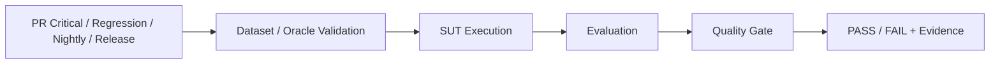
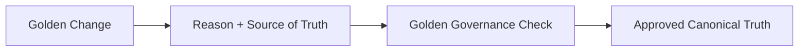
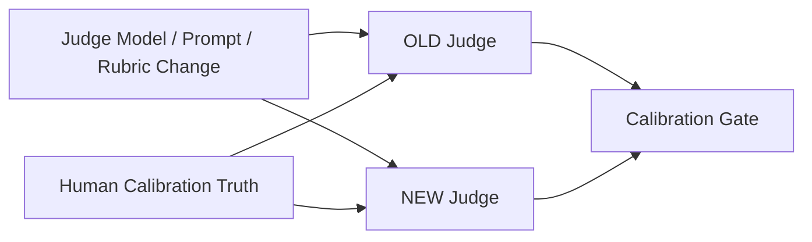
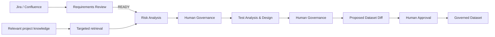

# AI QE Lab — Master Architecture

## Purpose

This document is the expanded top-level map of the lab. The repository README keeps the same architecture at a compact orientation level and links to one focused Markdown document per pipeline/control plane.

The framework is intentionally decomposed. A pipeline should answer one class of engineering question without forcing the reader to load the whole project context.

## Master architecture



The master diagram is deliberately simplified. It shows **responsibility boundaries and hand-offs**, not every internal implementation step.

## Responsibility boundaries

| Block | Primary responsibility | Starts with | Produces |
|---|---|---|---|
| Agentic QE / STLC Orchestration | Turn requirements into reviewed risks, test designs and governed dataset proposals | Jira / Confluence requirement context | Approved quality-asset proposal / governed dataset change |
| Dataset / Oracle Validation | Prove selected evaluation cases are structurally valid and correctly routed before expensive execution | Selected governed dataset/suite | Validated evaluation cases + resolved/valid Oracle contracts |
| Application / SUT | Produce real application behavior and observable retrieval/context evidence | Validated user/evaluation input | SUT output + execution evidence |
| Evaluation | Judge observed behavior using deterministic or semantic Oracle paths | SUT output + evidence + Oracle contract | Per-case metrics / risk evidence |
| CI/CD Quality | Execute the lifecycle suite, aggregate results, apply gates and retain evidence | Validated execution/evaluation results | PASS/FAIL quality decision and evidence |
| Golden / Canonical Truth Governance | Protect changes to trusted expected behavior | Golden change proposal | Approved/rejected canonical truth change |
| Evaluator Governance | Regression-test Judge changes against human-reviewed truth | Judge model/prompt/rubric change | Calibration evidence / evaluator gate |

## Focused pipeline decomposition

The detailed internal steps are maintained in focused documents rather than duplicated into the master diagram.

| Pipeline / control plane | Internal flow at a glance | Canonical detailed document |
|---|---|---|
| Agentic QE / STLC Orchestration | Requirement Review -> READY -> Risk Analysis -> targeted evidence -> Human Governance -> Test Analysis & Design -> dataset proposal/diff -> approval | [`agentic_qe_orchestration.md`](agentic_qe_orchestration.md) |
| Dataset / Oracle Validation | Dataset selection -> schema/contract -> identity -> required fields -> Oracle metadata/routing -> eligibility -> validated case | [`dataset_oracle_validation_pipeline.md`](dataset_oracle_validation_pipeline.md) |
| Application / SUT | Constraint extraction -> validation -> structured filter -> semantic ranking -> Retrieval-K -> adaptive selection -> Context-K -> generation/deterministic exit | [`architecture.md`](architecture.md#3-reference-sut-pipeline) |
| Evaluation | SUT output/evidence -> Oracle Resolution -> deterministic Python or semantic LLM Judge -> aggregation | [`automated_ai_evaluation.md`](automated_ai_evaluation.md) |
| CI/CD Quality | Select suite -> validate -> execute SUT -> evaluate -> quality gate -> evidence/decision | This document plus workflow-specific docs |
| Dataset Design / Oracle Contract | Suite purpose -> case metadata -> Oracle -> deterministic assertion/semantic route | [`dataset_design.md`](dataset_design.md) |
| Golden Governance | Golden change -> reason + source of truth -> governance check -> canonical promotion/rejection | [`golden_dataset_governance.md`](golden_dataset_governance.md) |
| Evaluator Governance | Judge change -> OLD vs NEW -> human calibration truth -> calibration gate | [`judge_calibration_workflow.md`](judge_calibration_workflow.md) |

## 1. Dataset / Oracle Validation Pipeline

Dataset validation is a first-class pipeline between governed test assets and application execution. It is intentionally deterministic and fail-fast.



Full contract: [`dataset_oracle_validation_pipeline.md`](dataset_oracle_validation_pipeline.md).

## 2. Application / SUT Pipeline

```mermaid
flowchart LR
    U["Validated User / Evaluation Case"] --> CE["Constraint Extraction"]
    CE --> CV["Constraint Validation / Classification"]
    CV --> SF["Structured Filtering"]
    SF --> SR["Embedding + Semantic Ranking"]
    SR --> RK["Retrieval-K"]
    RK --> AS["Adaptive Context Selection"]
    AS --> CK["Context-K"]
    CK --> CB["Context Builder"]
    CB --> LLM["Claude Generation / Deterministic Exit"]
    LLM --> OUT["SUT Output"]
```



The detailed reference application, including Clarification, No-Product-Match and Abstention branches, remains in [`architecture.md`](architecture.md).

## 3. Evaluation Pipeline



Validation establishes that the Oracle contract is usable. Evaluation-time Oracle Resolution applies that contract to actual evidence.

## 4. CI/CD Quality Pipeline



PR Critical, Regression and Nightly are execution-purpose suites. Golden is canonical truth/release baseline under stronger governance, not merely a fourth routine suite.

## 5. Governance Control Planes

### Golden / canonical truth



### Evaluator / Judge



## 6. Agentic QE / STLC Orchestration



The POC uses manual execution and repeated Human-in-the-Loop controls. Selected gates may be automated later only when measured confidence, quality and client expectations justify it.

## Cross-cutting rules

### Minimal context

Every agent receives only context required for its decision:

```text
Retrieve broadly -> select relevant evidence -> send narrowly to the LLM
```

### Human-first governance

Agent output is a proposal/evidence artifact until the relevant governance step approves it. Dataset changes are temporary files/patches reviewed as diffs before promotion.

### Fail fast before expensive execution

Dataset/Oracle contract errors should stop before SUT or Judge model calls wherever possible.

### Cost, observability and traceability

Retain where applicable:

```text
requirement / case / trace ID
model + prompt version
input/output tokens
estimated cost
latency
retrieval/cache evidence
Oracle route
human approval history
quality-gate result
```

### Current scope boundary

Automated generation of Playwright/Cypress/API test code is deferred. The current Agentic QE target ends at approved test/evaluation assets and governed dataset updates feeding the existing validation, SUT, evaluation and CI/CD framework.
