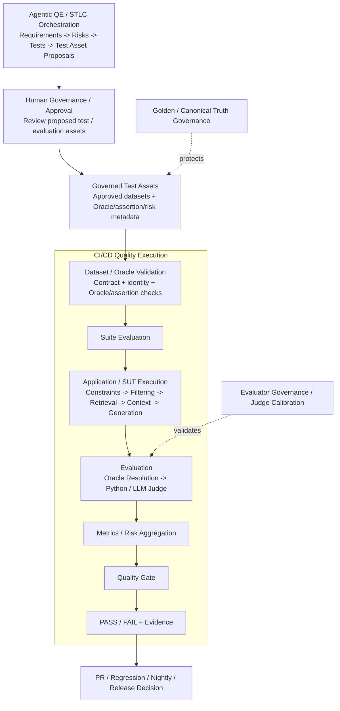
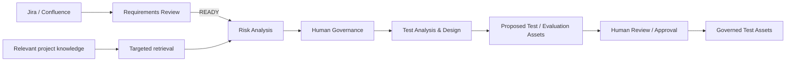
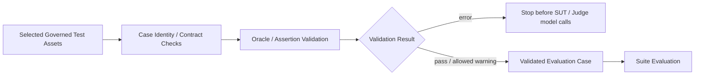
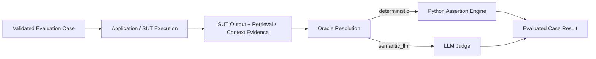
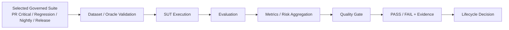
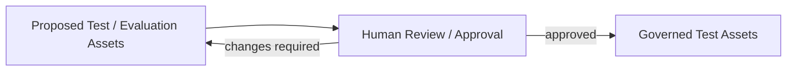
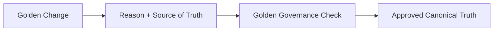
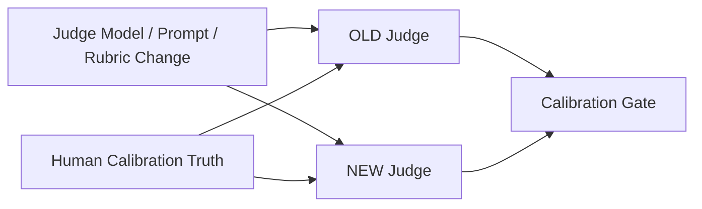

```mermaid
flowchart LR
    U["Validated User / Evaluation Case"] --> CE["Constraint Extraction"]
    CE --> CV["Constraint Validation / Classification"]
    CV --> SF["Structured Filtering"]
    SF --> SR["Embedding + Semantic Ranking"]
    SR --> RK["Retrieval-K"]
    RK --> AS["Adaptive Context Selection"]
    AS --> CK["Context-K"]
    CK --> CB["Context Builder"]
    CB --> LLM["Claude Generation / Deterministic Exit"]
    LLM --> OUT["SUT Output"]
```

# AI QE Lab — Master Architecture

## Purpose

This document is the expanded top-level map of the lab. The repository README keeps the same architecture at a compact orientation level and links to focused Markdown documents per pipeline/control plane.

The framework is intentionally decomposed. The master separates:

- **target Agentic QE/STLC orchestration** that creates proposed quality assets;
- **Human Governance / Approval** that promotes reviewed proposals into governed test assets;
- **CI/CD Quality Execution** that begins with Dataset/Oracle Validation and continues through suite execution, evaluation, metrics and quality gating;
- independent Golden and Evaluator governance control planes.

## Master architecture



The master diagram is deliberately simplified. It shows **responsibility boundaries and hand-offs**, not every internal implementation step.

## Responsibility boundaries

| Block | Primary responsibility | Starts with | Produces |
|---|---|---|---|
| Agentic QE / STLC Orchestration | Target flow that turns requirements into reviewed risks, test designs and proposed test/evaluation assets | Jira / Confluence requirement context | Proposed quality assets |
| Human Governance / Approval | Decide whether proposed assets are acceptable for promotion | Proposed tests/evaluation cases/dataset diff | Approved or rejected promotion decision |
| Governed Test Assets | Persist approved execution assets | Human-approved proposal | Approved datasets plus Oracle/assertion/risk metadata |
| Dataset / Oracle Validation | Prove selected cases have a usable execution/evaluation contract before expensive calls | Selected governed suite | Validated cases / validation errors and warnings |
| Application / SUT | Produce real application behavior and observable retrieval/context evidence | Validated evaluation case | SUT output + execution evidence |
| Evaluation | Apply deterministic or semantic Oracle path to observed SUT behavior | SUT output + evidence + Oracle contract | Per-case evaluated result |
| Metrics / Risk Aggregation | Aggregate evaluated case evidence into suite-level quality signals | Evaluated case results | Metrics / risk report |
| Quality Gate | Apply deterministic thresholds/policies to the aggregated report | Suite metrics and evidence | PASS / FAIL decision |
| CI/CD Quality Execution | Orchestrate validation, suite execution, evaluation, aggregation, gating and evidence retention | Selected governed lifecycle suite | Lifecycle quality evidence and decision |
| Golden / Canonical Truth Governance | Protect changes to trusted canonical expected behavior | Golden change proposal | Approved/rejected canonical truth change |
| Evaluator Governance | Regression-test Judge changes against human-reviewed truth | Judge model/prompt/rubric change | Calibration evidence / evaluator gate |

### Important terminology

`Governed Test Assets` are **artifacts**, not an agent and not another validation pipeline. In this lab they include approved datasets and associated Oracle/assertion/risk metadata used by the execution framework.

`Human Governance / Approval` answers whether a proposed test/evaluation asset should become governed. `Dataset / Oracle Validation` answers whether an already governed selected case is technically executable and correctly routed for evaluation. These are separate checks.

## Focused pipeline decomposition

| Pipeline / control plane | Internal flow at a glance | Canonical detailed document |
|---|---|---|
| Agentic QE / STLC Orchestration | Requirement Review -> READY -> Risk Analysis -> targeted evidence -> Human Governance -> Test Analysis & Design -> proposed asset/diff -> Human Approval | [`agentic_qe_orchestration.md`](agentic_qe_orchestration.md) |
| Dataset / Oracle Validation | Dataset selection -> identity/contract -> Oracle/assertion validation -> validation result | [`dataset_oracle_validation_pipeline.md`](dataset_oracle_validation_pipeline.md) |
| Application / SUT | Constraint extraction -> validation -> structured filter -> semantic ranking -> Retrieval-K -> adaptive selection -> Context-K -> generation/deterministic exit | [`architecture.md`](architecture.md#3-reference-sut-pipeline) |
| Evaluation | SUT output/evidence -> Oracle Resolution -> deterministic Python or semantic LLM Judge -> evaluated case result | [`automated_ai_evaluation.md`](automated_ai_evaluation.md) |
| CI/CD Quality Execution | Select suite -> Dataset/Oracle Validation -> SUT execution -> evaluation -> metrics/risk aggregation -> quality gate -> evidence/decision | This document plus workflow-specific YAML |
| Dataset Design / Oracle Contract | Suite purpose -> case metadata -> Oracle -> deterministic assertion/semantic route | [`dataset_design.md`](dataset_design.md) |
| Golden Governance | Golden change -> reason + source of truth -> governance check -> canonical promotion/rejection | [`golden_dataset_governance.md`](golden_dataset_governance.md) |
| Evaluator Governance | Judge change -> OLD vs NEW -> human calibration truth -> calibration gate | [`judge_calibration_workflow.md`](judge_calibration_workflow.md) |

## 1. Agentic QE / STLC Orchestration — target architecture



This remains the target Agentic QE operating architecture. The repository may implement its stages incrementally; the target flow does not need to be reduced to only the currently complete agent slice.

Agent output is a proposal/evidence artifact until Human Governance / Approval promotes it.

## 2. Dataset / Oracle Validation Pipeline

Dataset/Oracle Validation is the **first stage of downstream quality execution** for a selected governed suite. It is deterministic/fail-fast where possible.



The current codebase specifically enforces dataset root shape, case ID presence/uniqueness, allowed Oracle values and non-empty deterministic assertions for deterministic routes, with a warning/fallback path for missing Oracle metadata. Broader schema/required-field hardening can evolve behind the same architectural boundary.

Full contract: [`dataset_oracle_validation_pipeline.md`](dataset_oracle_validation_pipeline.md).

## 3. Suite Evaluation

`Suite Evaluation` is the execution unit after dataset validation. It combines the real SUT run with independent evaluation of the resulting evidence.



### Application / SUT internals



The detailed reference application, including Clarification, No-Product-Match, deterministic cheapest-product routing and Abstention branches, remains in [`architecture.md`](architecture.md).

## 4. CI/CD Quality Execution

CI/CD is **not a downstream box after evaluation**. It is the orchestration/execution envelope that starts with validation of the selected governed suite.



This mirrors the current GitHub workflow pattern. For example, PR Critical executes:

```text
Validate PR Critical Dataset
-> Run PR Critical Evaluation / SUT execution
-> Evaluate PR Critical Dataset
-> PR Critical Quality Gate
-> retain reports/evidence
```

PR Critical, Regression and Nightly are execution-purpose suites. Golden is canonical truth/release baseline under stronger governance, not merely a fourth routine suite.

## 5. Governance Control Planes

### Human test-asset governance



This governance step decides whether proposed quality assets may be promoted. It is deliberately separate from runtime Dataset/Oracle Validation.

### Golden / canonical truth



Golden is the canonical expected-behavior baseline. Ordinary PR Critical/Regression/Nightly assets are governed execution assets, but should not all be described as canonical truth.

### Evaluator / Judge



## Cross-cutting rules

### Minimal context

Every agent receives only context required for its decision:

```text
Retrieve broadly -> select relevant evidence -> send narrowly to the LLM
```

### Human-first governance

Agent output is a proposal/evidence artifact until the relevant human governance step approves promotion. Dataset changes are temporary files/patches reviewed as diffs before becoming governed test assets.

### Fail fast before expensive execution

Dataset/Oracle contract errors should stop before SUT or Judge model calls wherever possible.

### Cost, observability and traceability

Retain where applicable:

```text
requirement / case / trace ID
model + prompt version
input/output tokens
estimated cost
latency
retrieval/cache evidence
Oracle route
human approval history
quality-gate result
```

### Current scope boundary

Automated generation of Playwright/Cypress/API test code is deferred. The Agentic QE target ends at approved test/evaluation assets and governed dataset updates feeding the existing Dataset/Oracle Validation -> Suite Evaluation -> Metrics/Risk -> Quality Gate execution framework.
