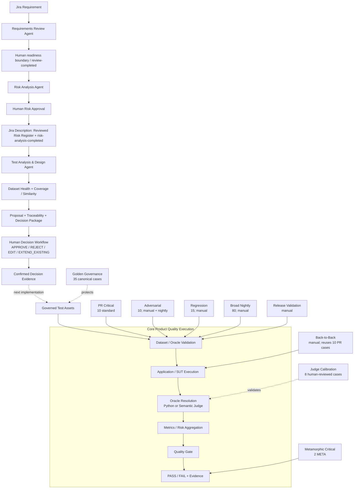

# AI QE Lab — Master Architecture

_Last synchronized with repository: 2026-09-01._

## Purpose

This is the top-level map of the implemented AI QE framework. It separates upstream Agentic QE/STLC governance from downstream SUT/evaluation execution and from independent Golden/Judge governance.

## Master architecture



## Implemented upstream responsibilities

| Stage | Deterministic responsibilities | Semantic responsibilities | Mutation boundary |
|---|---|---|---|
| Requirements Review | input/eligibility, cache, contract, telemetry | requirement quality, gaps/questions | no automatic Jira approval write-back yet |
| Risk Analysis | eligibility, cache, L×I scoring, priority, contract | risk identification, mitigation/test-focus proposals | separate explicit approval writes approved Risk Register to Jira |
| Test Analysis & Design | dataset health, cache, contract normalization/retry, failure isolation | coverage/similarity reasoning, test proposals, Oracle/suite rationale | no dataset mutation during analysis |
| Human Decision | proposal lookup, decision validation, explicit confirmation | human judgment | records decision evidence; dataset promotion is next slice |

## Human governance semantics

Risk Analysis and Test Analysis have different gates.

```text
Risk Analysis
→ proposal
→ explicit approval
→ Jira write-back

Test Analysis & Design
→ proposal
→ APPROVE / REJECT / EDIT / EXTEND_EXISTING
→ explicit confirmation
→ decision evidence
→ future governed dataset promotion
```

For test assets:

- APPROVE = add the proposed new case;
- REJECT = no change;
- EDIT = modify the proposal before adding;
- EXTEND_EXISTING = review and apply an exact BEFORE → AFTER change to an existing case.

## Governed asset model

```text
PR Critical standard = 10
Metamorphic Critical = 2
Regression           = 15
Broad Nightly        = 80
Golden               = 35
Adversarial          = 10
Judge Calibration    = 8
Back-to-Back         = no separate dataset
Agent Evaluation     = planned
```

Golden is canonical truth, not an ordinary execution tier. Judge Calibration tests evaluator quality, not product quality.

## SUT architecture

The Shopping RAG Assistant remains:

```text
Input
→ Constraint Extraction / Validation
→ Structured Filtering
→ Embedding + FAISS Semantic Ranking
→ Retrieval-K
→ Adaptive Context Selection
→ Context Builder
→ Claude Generation
→ Output + Telemetry
```

Deterministic clarification/no-match/abstention paths can skip Claude where applicable. A failed final answer is not automatically a generation defect; investigation starts at the first failing layer.

## Core governance controls

- deterministic Python for formal contracts and exact checks;
- semantic LLM reasoning only where meaning-level analysis is required;
- content-aware caching for agent calls;
- prompt/model-sensitive invalidation;
- explicit human gates before external/governed mutations;
- version-controlled prompts and schemas;
- per-ticket failure isolation for batch agents;
- token/cost/latency evidence;
- separate Golden and Judge governance;
- no retry-until-green policy.

## Remaining architecture work

Only unimplemented items remain here:

1. Human Decision → governed dataset mutation/promotion.
2. Deterministic post-mutation validation and source-control PR generation.
3. Optional Requirements Review approval → Jira `review-completed` write-back.
4. Targeted cross-document retrieval for Risk Analysis where relevant.
5. Agent Evaluation Dataset and agent-behavior evaluation.
6. State-driven multi-agent orchestration after manual gates are stable.
7. Optional Confluence/test-management/release integrations for target projects.

Drift testing remains outside the current roadmap.
