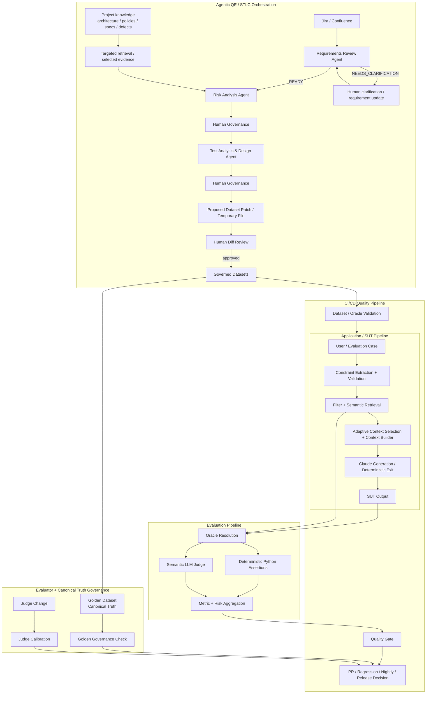
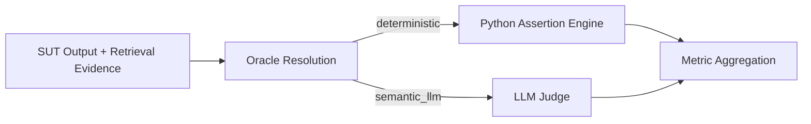
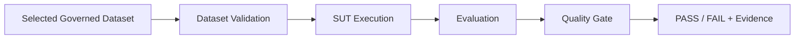
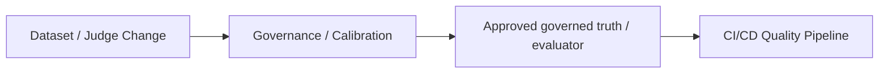
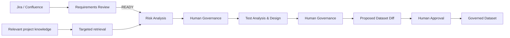

# AI QE Lab — Master Architecture

## Purpose

This is the top-level architecture map for the lab. It shows how the reference application/SUT, evaluation framework, CI/CD quality controls, dataset/evaluator governance, and Agentic QE orchestration fit together without collapsing them into one pipeline.

The blocks are integrated, but each has its own responsibility and can be reasoned about independently.

## Master architecture



## Architectural boundaries

| Block | Primary responsibility | Does not own |
|---|---|---|
| Application / SUT | Produce real application behavior | Quality policy / release decision |
| Evaluation | Judge observed behavior against deterministic/semantic oracles | Product implementation |
| CI/CD Quality | Select suites, execute controls, apply gates | Semantic requirement analysis |
| Dataset Governance | Protect and promote governed evaluation truth | Direct unreviewed agent mutation |
| Agentic QE / STLC Orchestration | Accelerate requirement review, risk analysis, test analysis/design and dataset proposals | Automatic uncontrolled production decisions |
| Evaluator Governance | Validate Judge changes against human truth | SUT business behavior |

## Architecture navigation

Read the master map first, then use the focused views below.

### 1. Application / SUT Pipeline

```mermaid
flowchart LR
    U["User / Evaluation Case"] --> CE["Constraint Extraction"]
    CE --> CV["Constraint Validation"]
    CV --> SF["Structured Filtering"]
    SF --> SR["Embedding + Semantic Ranking"]
    SR --> RK["Retrieval-K"]
    RK --> AS["Adaptive Context Selection"]
    AS --> CB["Context Builder"]
    CB --> LLM["Claude Generation"]
    LLM --> OUT["SUT Output"]
```



The reference Shopping RAG application is the SUT. In a real project this pipeline is normally owned by Development / AI Engineering.

### 2. Evaluation Pipeline



Python owns formal deterministic assertions. The semantic Judge owns meaning/behavior judgment where deterministic comparison is insufficient.

### 3. CI/CD Quality Pipeline



Execution suites:

```text
PR Critical
Regression
Nightly
```

Golden is not simply another execution suite; it is canonical truth / release baseline with separate governance.

### 4. Dataset and Evaluator Governance



Dataset proposals from agents are temporary artifacts until a human reviews the diff and approves promotion.

### 5. Agentic QE / STLC Orchestration



The POC uses manual execution and repeated Human-in-the-Loop controls. If measured confidence, quality and client expectations later justify it, selected human gates may be automated deliberately.

## Cross-cutting rules

### Minimal context

Every agent receives only context required for its decision. Operational metadata and unrelated project documentation are excluded unless they materially affect the contract.

For retrieval-enabled stages:

```text
Retrieve broadly -> select relevant evidence -> send narrowly to the LLM
```

### Human-first governance

Agent output is a proposal/evidence artifact until the relevant governance step approves it. Dataset changes are generated as temporary files/patches and reviewed as diffs before promotion.

### Cost and observability

Across agent and evaluation pipelines retain, where applicable:

```text
trace ID / requirement ID
model + prompt version
input/output tokens
estimated cost
latency
cache/retrieval evidence
human approval history
quality-gate result
```

### Current scope boundary

Automated generation of Playwright/Cypress/API test code is deferred. The current Agentic QE target ends at approved test/evaluation assets and governed dataset updates feeding the existing execution/evaluation/CI framework.