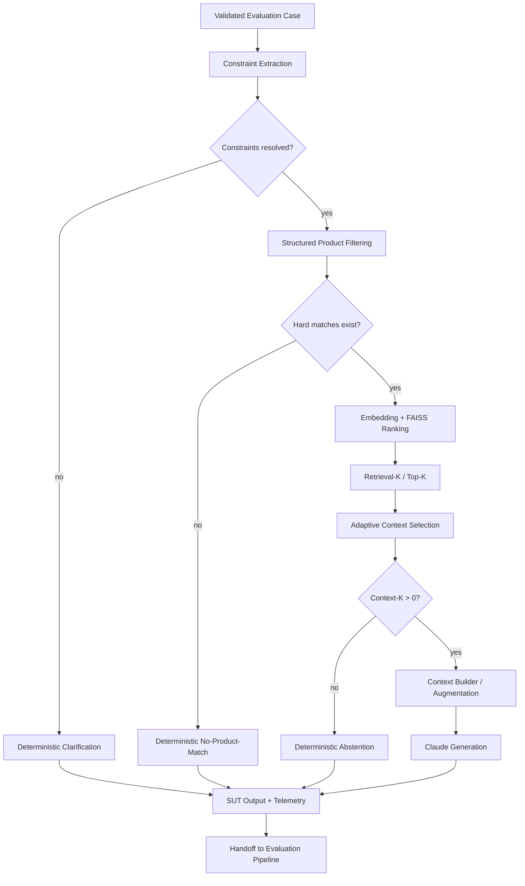
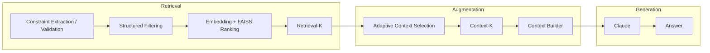

# Application / SUT Pipeline

_Last synchronized with repository: 2026-09-01._

## Purpose

This document is the detailed zoom-in for the **Application / System Under Test** block from the Master Architecture. It owns execution from a validated evaluation case through deterministic exits or LLM generation to `SUT Output + Telemetry`.

It does not own Dataset / Oracle Validation, Oracle evaluation, quality gates, Agentic QE, or CI/CD lifecycle orchestration.

## Detailed state / decision flow



## State semantics

```text
unresolved governed input
-> Clarification
-> retrieval and Claude skipped

resolved constraints + zero hard matches
-> No-Product-Match
-> Claude skipped

hard matches + retrieval + Context-K = 0
-> Abstention
-> Claude skipped

Context-K > 0
-> Context Builder
-> Claude Generation
-> Generated Answer
```

## RAG decomposition



Hard constraints precede semantic relevance. Similarity cannot override a known hard constraint. Retrieval candidates remain diagnostic evidence; only selected Context-K evidence is eligible for generation.

Current controls:

```text
RAG_TOP_K=5
RAG_MIN_CONTEXT_K=2
RAG_MAX_CONTEXT_K=5
RAG_MIN_SIMILARITY=0.30
```

`RAG_MIN_CONTEXT_K` is a target, not a padding requirement. `Context-K` may be zero.

## Output boundary

The pipeline ends at:

```text
SUT Output + Telemetry
```

That output becomes the input to `automated_ai_evaluation.md`, where Oracle Resolution, deterministic/semantic evaluation, metrics, risk aggregation, localization and Product Quality Gate are applied.
