# AI QE Lab — Test Strategy

## 1. Purpose

This strategy defines **how to test an AI-enabled system with the AI QE framework**, not only what is currently implemented in the Shopping RAG Assistant POC.

The framework combines:

- conventional functional, API, integration and E2E testing;
- AI/RAG-specific evaluation;
- governed datasets and Oracle selection;
- deterministic assertions and semantic LLM-as-a-Judge evaluation;
- **independent regression testing of the LLM Judge itself**;
- **governance of canonical Golden expected behavior**;
- observability and failure localization;
- CI/CD quality gates at PR, Regression, Nightly and Release levels;
- future Jira/Confluence-driven test governance and agent-assisted test design.

The strategy answers eight questions:

1. What can fail?
2. How should the failure be tested?
3. Which Oracle should decide product PASS/FAIL?
4. At which execution level should the test run?
5. What evidence is required to localize a failure?
6. How do we know the semantic Judge is still trustworthy after a model/prompt/rubric change?
7. How do we prevent canonical expected truth from being rewritten merely to make CI pass?
8. What quality or release decision follows from the evidence?

Detailed metric definitions and denominators are maintained in `docs/metric_contract.md`.

---

## 2. Test object and control architecture

The current executable SUT is a Shopping RAG Assistant. The same QE model is intended to be reusable for other AI-enabled systems by replacing product-specific risks and assertions while preserving framework responsibilities.

Three separate control loops are now implemented:

```mermaid
flowchart TD
    subgraph PRODUCT["Product Quality"]
        U[User / Evaluation Case] --> CE[Constraint Extraction]
        CE --> CV[Constraint Validation / Classification]
        CV -->|unresolved| CL[Deterministic Clarification]
        CV -->|resolved| SF[Structured Product Filtering]
        SF -->|zero matches| NM[Deterministic No-Product-Match]
        SF -->|eligible| SR[Embedding + FAISS Ranking]
        SR --> RK[Retrieval-K]
        RK --> AS[Adaptive Context Selection]
        AS --> CK{Context-K}
        CK -->|0| AB[Deterministic Abstention]
        CK -->|>0| CB[Context Builder]
        CB --> LLM[Claude SUT]
        LLM --> ANS[Generated Answer]
        CL --> OUT[SUT Output]
        NM --> OUT
        AB --> OUT
        ANS --> OUT
        OUT --> EV[Evaluation Evidence]
        RK --> EV
        AS --> EV
        EV --> OR{Oracle Resolution}
        OR -->|deterministic| PY[Python Assertions]
        OR -->|semantic_llm| J[Version-controlled LLM Judge]
        PY --> AG[Metrics + Risk]
        J --> AG
        AG --> LOC[Failure Localization]
        LOC --> QG[Product Quality Gate]
    end

    subgraph EVAL["Evaluator Quality"]
        JC[Judge Change] --> OLD[OLD Judge / base]
        JC --> NEW[NEW Judge / head]
        CAL[Human Calibration Truth] --> OLD
        CAL --> NEW
        OLD --> JG[Judge Calibration Gate]
        NEW --> JG
    end

    subgraph TRUTH["Canonical Truth Governance"]
        GC[Golden Change] --> META[Reason + Source of Truth]
        META --> GG[Golden Governance Check]
    end
```



A failed final answer is **not automatically an LLM defect**. A Judge calibration failure is **not a product defect**. A Golden Governance failure is **not a product-quality result**. Investigation starts by identifying which control loop failed.

Deterministic early responses are different behaviors and must be tested separately:

- **Clarification** — input is unresolved and requires a user-provided governed value;
- **No-Product-Match** — resolved hard constraints match no catalogue product;
- **Abstention** — the request is understood but no governed evidence survives context selection.

---

## 3. Quality objectives

Testing must provide confidence that:

- explicit business behavior and user constraints are satisfied;
- correct evidence is retrieved and irrelevant evidence does not drive the answer;
- hard constraints are distinguished from semantic relevance;
- ambiguity is handled deterministically where governed input is required;
- unsupported claims and hallucinations are detected;
- generated answers remain grounded in supplied evidence;
- the SUT abstains safely when evidence is insufficient;
- behavior is robust under paraphrase, negative, edge and adversarial input;
- failures are observable and localizable;
- product behavior remains stable across model/prompt/data/configuration changes;
- the **Judge remains aligned with human-reviewed truth** across Judge model/prompt/rubric changes;
- canonical Golden truth cannot be silently moved to hide a product/evaluator failure;
- latency, reliability, tokens and cost remain acceptable;
- merge and release decisions are supported by auditable evidence.

---

## 4. Risk-based test design

Testing starts from architecture and business risk, not from a generic AI checklist.

### Conventional risks

- incorrect functional behavior;
- API/contract failures;
- integration/downstream failures;
- state/data integrity defects;
- error handling and resilience;
- security/privacy failures;
- performance/capacity degradation.

### SUT AI-specific risks

- retrieval miss/noise;
- hard-constraint non-adherence;
- evidence removed by context selection;
- insufficient context;
- hallucination / unsupported claim;
- poor groundedness;
- semantic incorrectness;
- ambiguity treated as resolved;
- stale/conflicting evidence;
- out-of-domain behavior;
- prompt injection / instruction conflict;
- non-deterministic instability;
- model/data drift;
- excessive latency/token/cost growth.

### Evaluator risks

- Judge model change reduces agreement with human truth;
- Judge prompt change changes semantic decisions unexpectedly;
- rubric change makes scoring too strict/lenient;
- Judge introduces a **false PASS** and allows a bad product answer through;
- Judge introduces excessive false FAILs and creates noise/cost;
- malformed/empty Judge response is mistaken for product failure;
- runtime model override silently differs from the reviewed evaluator configuration.

### Test-governance risks

- Golden expected behavior is changed merely because evaluation failed;
- canonical truth is modified without an approved source of truth;
- calibration truth is changed merely to make a proposed Judge pass;
- automated agents later modify governed truth without human approval.

Every material risk should map to an executable test/control, evidence and lifecycle decision.

---

## 5. Test techniques

Use conventional and AI-specific techniques together.

| Technique | Typical use |
|---|---|
| Equivalence Partitioning / BVA | structured fields, limits, price/size/threshold boundaries |
| Decision Tables | business rules and combinations of constraints |
| Pairwise / combinatorial | multi-constraint coverage |
| Negative testing | invalid, missing, contradictory or unsupported inputs |
| Error guessing | architecture weak points and defect history |
| Metamorphic testing | stable behavior under meaning-preserving transformations |
| Paraphrase testing | same intent with different language |
| Adversarial testing | prompt injection, conflicting instructions, manipulation |
| Back-to-back comparison | SUT model/prompt/retrieval changes |
| **OLD-vs-NEW evaluator calibration** | Judge model/prompt/rubric changes against human truth |
| Repeated-run testing | non-determinism/stochastic stability |
| Golden baseline comparison | canonical release-critical product behavior |

For deterministic properties, exact assertions are preferred. For meaning-level behavior, semantic evaluation is allowed, but the semantic evaluator itself must be calibrated.

---

## 6. Dataset strategy

Datasets are purpose-specific test assets, not inheritance layers.

| Dataset | Test object | Purpose | Expected use |
|---|---|---|---|
| **PR Critical** | SUT | fastest high-risk merge protection | pull request gate |
| **Regression** | SUT | stable behavior and confirmed fixed defects | main/merge health |
| **Nightly Evaluation** | SUT | broad AI-risk, edge and adversarial coverage | broad evaluation |
| **Golden** | SUT / canonical truth | trusted business-critical baseline | release/reference validation |
| **Judge Calibration** | Evaluator | human-reviewed known examples for testing the Judge | Judge-change gate |
| **Agent Evaluation** | Future agents | expected/prohibited actions, tool use and HITL | future governance |

Current reviewed routine SUT evaluation inventory:

| Suite | Total | Deterministic | Semantic Judge |
|---|---:|---:|---:|
| PR Critical | 10 | 6 | 4 |
| Regression | 15 | 7 | 8 |
| Nightly | 80 | 48 | 32 |
| **Total** | **105** | **61** | **44** |

Golden is separate from that 105-case routing inventory because its role is trusted release/reference validation.

The current Judge Calibration Dataset contains **8 human-reviewed cases** and 4 expected semantic dimensions per case (32 expected field judgments). It tests the evaluator, not the Shopping Assistant, and is therefore not counted in the SUT suite totals.

Dataset size is not itself a quality objective. Coverage must be justified by risks, business criticality, defect history and execution cost.

---

## 7. Dataset and Oracle governance

Before SUT execution, validate the test contract:

```text
deterministic      -> valid only with required deterministic assertions
semantic_llm       -> valid semantic route
missing/null/empty -> warning + reviewed fallback allowed
invalid non-empty  -> validation ERROR
missing/duplicate ID -> validation ERROR
```

Each governed SUT case should identify, where applicable:

- case ID;
- requirement/business behavior;
- AI/conventional risk;
- input/query;
- expected source/evidence;
- expected behavior;
- deterministic assertions or semantic Oracle;
- criticality;
- target suite/CI level.

The dataset is the primary test contract. Runtime fallback routing is resilience, not a competing source of truth.

### Golden-specific governance

Golden receives stronger change control because changing expected behavior changes what the framework considers correct.

Core rule:

```text
Evaluation FAIL
!=
Change Golden until CI passes
```

A Golden PR must provide:

```text
Golden Change Reason: <approved reason>
Source of Truth: <requirement/business decision/specification/defect reference>
```

The deterministic Golden Governance workflow triggers only for:

```text
datasets/golden_dataset.json
src/golden_governance_check.py
.github/workflows/golden-governance.yml
```

This gives us an auditable reason/source check without spending LLM tokens on unrelated documentation or feature changes.

### Judge-calibration truth governance

The calibration set contains human-reviewed expected Judge outcomes. It must not be changed merely because a proposed model/prompt/rubric performs poorly. A calibration change changes the evaluator test oracle and therefore requires human review.

---

## 8. Product test execution model

A normal product evaluation run follows:

```text
Validate SUT dataset
-> Execute case through real SUT
-> Capture answer + retrieval/context/model evidence
-> Resolve Oracle
-> Execute deterministic assertions OR calibrated semantic Judge
-> Aggregate metrics and risks
-> Localize first failure layer
-> Apply deterministic Product Quality Gate
-> Retain reports/evidence
```

### How to test a new SUT change

1. Identify affected layer and risks.
2. Add/update the smallest relevant deterministic or semantic cases.
3. Verify dataset/Oracle validity before model calls.
4. Run affected cases locally or through PR Critical.
5. Inspect retrieval/context/generation evidence, not only final PASS/FAIL.
6. If a product defect is confirmed, add permanent Regression coverage.
7. For broad architecture/model/prompt/data impact, execute broad evaluation.
8. For a release candidate, use Release Validation with Golden plus valid broad-risk evidence.

---

## 9. Retrieval and context testing

Retrieval-K and Context-K must be tested separately.

Current defaults:

```text
RAG_TOP_K=5
RAG_MIN_CONTEXT_K=2       # target, not padding requirement
RAG_MAX_CONTEXT_K=5
RAG_MIN_SIMILARITY=0.30
```

Testing verifies:

- hard constraints exclude invalid candidates before semantic ranking;
- semantic score never overrides a hard business constraint;
- Top-K contains expected evidence when such evidence exists;
- retrieval noise is measured independently from final context;
- below-threshold evidence is not padded into context;
- selected context preserves expected evidence;
- `Context-K=0` skips generation and produces deterministic abstention;
- valid hard constraints with zero matches produce deterministic no-product-match;
- unresolved governed input produces clarification before retrieval.

The similarity threshold is an engineering control, not a probability. Changes require evidence from retrieval quality, context sufficiency, answer quality and token/cost behavior.

---

## 10. Oracle and metric strategy

Governing rule:

> **Formal assertion -> deterministic Python. Meaning/behavior judgment -> semantic LLM Judge.**

### Deterministic evaluation

Use deterministic assertions for exact facts such as:

- expected retrieved IDs;
- required/forbidden text patterns;
- hard product constraints;
- catalogue min/max facts;
- deterministic early responses;
- exact future tool/action permissions.

### Semantic evaluation

Use the calibrated LLM Judge for meaning-level dimensions such as:

- Correctness;
- Groundedness;
- Hallucination;
- Context Coverage;
- Context Sufficiency;
- semantic adherence where exact assertions are insufficient.

The Judge does **not** choose the Oracle.

### Metric populations

Semantic-only metrics use only semantic/Judge cases as denominator. Deterministic cases are excluded and represented as N/A for non-applicable semantic fields.

Suite-wide/hybrid metrics include Overall Pass Rate, Retrieval Hit and Constraint Adherence according to `metric_contract.md`.

Current provisional product-quality thresholds:

```text
Correctness >= 95%
Groundedness >= 95%
Retrieval Hit >= 95%
Constraint Adherence >= 95%
Hallucination <= 2%
```

These are **POC baseline thresholds**, not universal customer thresholds. Production thresholds should be derived from business impact, risk severity and acceptable failure tolerance.

Quality-gate evaluation remains deterministic even when source metrics include LLM judgments.

---

## 11. Judge configuration and calibration strategy

Judge behavior is treated as a version-controlled configuration:

```text
Judge Configuration
= Model + Judge Prompt + Scoring Rubric
```

Implemented assets:

```text
config/judge_config.json
config/judge_prompt.txt
config/judge_rubric.txt
datasets/judge_calibration_dataset.json
src/judge_calibration_runner.py
.github/workflows/judge-calibration.yml
```

Production `llm_evaluator.py` loads the approved version-controlled Judge assets. A runtime environment model that conflicts with the approved configured model is rejected instead of silently altering evaluator behavior.

### Calibration flow

```text
PR changes model / prompt / rubric / calibration behavior
        ↓
OLD = approved files from PR base/main
NEW = proposed files from PR head
        ↓
run OLD against same human calibration dataset
run NEW against same human calibration dataset
        ↓
compare each to human truth
        ↓
Judge Calibration Gate
```

Current automatic trigger paths:

```text
config/judge_config.json
config/judge_prompt.txt
config/judge_rubric.txt
datasets/judge_calibration_dataset.json
src/judge_calibration_runner.py
.github/workflows/judge-calibration.yml
```

Manual `workflow_dispatch` is also supported.

Current gate:

```text
NEW agreement >= 90%
agreement drop vs OLD <= 5 percentage points
NEW false PASS count <= OLD false PASS count
```

False PASS has special importance because an evaluator false PASS can allow an actual product defect through a semantic quality gate.

Initial approved baseline:

```text
Model  = claude-opus-5
Prompt = v1
Rubric = v1
Cases  = 8
Human agreement = 100%
False PASS = 0
False FAIL = 0
32 / 32 expected semantic field judgments matched
```

The runner distinguishes malformed Judge responses from semantic disagreement. Empty/invalid JSON receives bounded retries and diagnostic logging; persistent parse failure is an evaluator/infrastructure failure, not a product-quality verdict.

### Why this matters

A future cost optimization can propose, for example:

```text
OLD Judge: Opus + Prompt v1 + Rubric v1
NEW Judge: Sonnet + Prompt v1 + Rubric v1
```

The cheaper model is not accepted simply because it runs. It must maintain acceptable agreement with the same human truth and must not introduce dangerous false PASS behavior.

---

## 12. CI/CD test and governance levels

| Level / Control | Trigger | Test object | Purpose |
|---|---|---|---|
| **PR Critical** | meaningful SUT/evaluation PR changes | SUT | fast high-risk feedback / merge gate |
| **Regression** | manual currently; main/merge when enabled | SUT | stable behavior and fixed-defect health |
| **Nightly** | manual currently; schedule when enabled | SUT | broad AI-risk signal |
| **Release Validation** | manual/RC process | SUT | Golden + broad evidence / release gate |
| **Judge Calibration** | Judge/config/prompt/rubric/calibration changes | Evaluator | prevent evaluator regression |
| **Golden Governance** | Golden dataset/check/workflow changes | Canonical truth | prevent unauthorized/unsupported expected-result movement |

Documentation-only changes should not trigger expensive AI evaluation or governance workflows unless the executable workflow/check itself is changed.

The Golden Governance workflow creates a status check. Making it non-bypassable requires repository branch protection/ruleset configuration to require `golden-governance`.

---

## 13. Release Validation strategy

Release Validation is a separate lifecycle level, not another name for Golden.

```text
Release Candidate / Release Scope
        ↓
Release Validation
        ├─ Golden trusted baseline
        └─ Broad Nightly evidence
        ↓
Release Quality Gate
        ↓
GO / NO-GO / explicit risk acceptance
```

Rules:

1. Golden validates canonical business-critical behavior for the release candidate.
2. Broad evidence must represent the same relevant release scope/SHA.
3. Valid broad evidence for that exact candidate may be reused rather than rerun for ceremony.
4. If the candidate changed or evidence is stale/inapplicable, rerun broad coverage.
5. Release readiness also considers unresolved defects, operational evidence, coverage and residual risk.
6. If the release includes a material Judge change, its calibration evidence must also be valid.
7. If the release includes a Golden change, its governance evidence must be visible and approved.

---

## 14. Entry and exit criteria

### Framework/run entry criteria

- testable expected behavior exists;
- dataset schema and Oracle metadata are valid;
- required source data is available;
- environment/model configuration and secrets are available;
- risk/assertion metadata exists;
- required telemetry can be captured;
- no infrastructure incident invalidates the run.

### Product run exits

PR Critical, Regression, Nightly and Release exits require the planned scope to execute, blocking failures to be resolved/classified, applicable gates to pass and evidence to be retained. Release additionally requires acceptable residual risk and sufficient GO/NO-GO evidence.

### Judge Calibration exit

- OLD/NEW configuration identities are recorded when OLD exists;
- NEW meets minimum human agreement;
- unacceptable OLD->NEW degradation is absent;
- no additional false PASS is introduced;
- response/parsing/provider failures are classified separately from semantic disagreements;
- calibration evidence artifact is retained.

### Golden Governance exit

- required PR reason is present and non-placeholder;
- source of truth is present and non-placeholder;
- human review/approval occurs according to repository governance;
- a failed evaluation alone is not accepted as change justification.

---

## 15. Failure localization and defect policy

Investigation identifies the first failing layer:

```text
Dataset / Oracle validation
-> Input / Constraint Validation
-> Structured Filtering
-> Retrieval / Ranking
-> Adaptive Context Selection
-> Context Builder
-> Generation / SUT Prompt / SUT Model
-> Judge / Evaluator
-> Provider / Infrastructure
-> Quality Gate / Reporting
-> Governance Control
```

Typical classes:

- dataset/expected-result defect;
- constraint extraction/validation defect;
- retrieval/filtering/ranking defect;
- context-selection defect;
- context-construction defect;
- generation/prompt/model defect;
- evaluator/Judge semantic defect;
- evaluator response/parsing infrastructure defect;
- Golden governance failure;
- external provider/infrastructure defect;
- stochastic stability defect;
- security/guardrail defect;
- operational/performance defect.

A rerun is evidence about reproducibility, not permission to retry until green. Preserve original failure evidence.

Confirmed **product** defects follow:

```text
Failure
-> Evidence Review
-> Localization
-> Defect Confirmation
-> Fix
-> Verification
-> Regression Case
-> Permanent Regression Protection
```

A confirmed evaluator defect should instead produce a Judge config/prompt/rubric/runner fix plus calibration evidence. A stale/incorrect Golden expectation requires separate source-of-truth approval rather than product-defect handling.

---

## 16. Non-functional and operational testing

Measure where applicable:

- latency/P95;
- provider errors/retries/timeouts;
- rate limits;
- throughput/concurrency;
- token/context-size growth;
- cost trends;
- repeated-run stochastic stability;
- model/provider dependency health;
- Judge calibration token/call overhead when evaluator changes are tested.

Cost controls must not weaken quality. Prefer deterministic evaluation where possible, minimize irrelevant context and use semantic Judge calls only where semantic reasoning is required.

---

## 17. Traceability and future agent governance

Target product traceability:

```text
Requirement
-> Risk
-> Test / Evaluation Case
-> Governed Dataset
-> Dataset Validation
-> SUT Execution
-> Evidence
-> Deterministic Engine or Calibrated Semantic Judge
-> Metric / Risk
-> Product Quality Gate
-> Defect / Regression
-> Residual Risk
-> Release Decision
```

Evaluator traceability:

```text
Judge Change
-> Model / Prompt / Rubric Version
-> Calibration Case
-> Human Expected Judgment
-> OLD Result
-> NEW Result
-> Agreement / False PASS / False FAIL
-> Judge Calibration Gate
-> Approved Judge Baseline
```

Golden traceability:

```text
Golden Case Change
-> Previous Expected Behavior
-> Proposed Expected Behavior
-> Change Reason
-> Source of Truth
-> Human Review
-> Golden Governance Check
-> Approved Canonical Baseline
```

Future Jira/Confluence flow:

```text
Jira Requirement
-> Requirements Review / Entry Gate
-> Test Analysis & Risk
-> Test Design
-> Functional Tests + AI Evaluation Cases
-> Coverage / Gap Analysis
-> Human Approval
-> Governed JSON Dataset
-> Existing Dataset Validation + Product Evaluation
-> Existing Judge Calibration / Golden Governance controls
```

Agents create/analyze/govern quality inputs; they do not replace independent evaluation controls or human release accountability.

---

## 18. Roles and reporting

**Test Lead / Quality Owner** owns strategy, risk model, gate policy, evaluator-governance expectations, residual-risk assessment and release recommendation.

**QA/QE** designs coverage, datasets and assertions; reviews calibration truth; executes tests; analyzes evidence; localizes product/evaluator/governance failures.

**Development / AI Engineering** owns SUT implementation and fixes product/retrieval/prompt/model defects.

**Product / Business** validates business truth and approves material canonical expectation changes.

**Agents** may later assist with requirements review, risk analysis, test design and candidate dataset changes under governed permissions and HITL controls. They must not silently rewrite Golden or calibration truth.

Reports should expose:

- product executed/passed/failed counts;
- actual metric populations/denominators;
- critical failures and risk outcomes;
- retrieval/context/generation evidence;
- Judge model/prompt/rubric identity for semantic results;
- Judge calibration agreement/delta/false PASS/false FAIL for evaluator changes;
- Golden governance reason/source evidence for canonical changes;
- latency/tokens/cost;
- defect classification and residual-risk recommendation.

---

## 19. Strategy evolution

This is a living strategy. It must be updated when architecture, models, prompts, rubrics, datasets, execution levels, metrics/gates, governance controls or release processes materially change.

The governing principles are:

> **Quality confidence must come from traceable evidence across the whole AI system, not from a single model score or a single successful answer.**

> **The evaluator is part of the quality system and must be tested. Canonical truth is part of the quality system and must be governed.**
