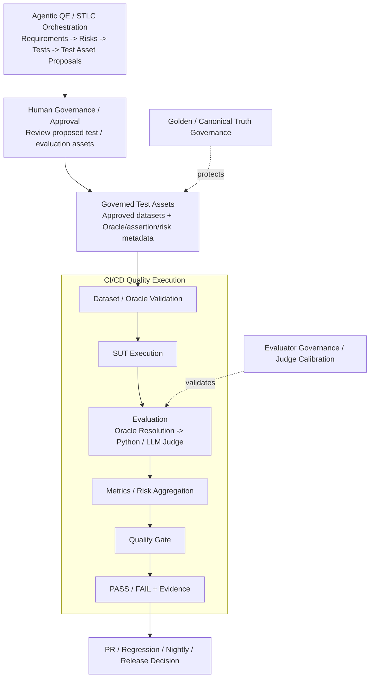
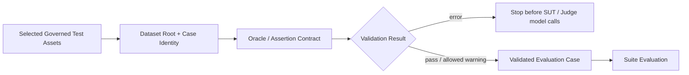

# AI QE Lab — Test Strategy

## 1. Purpose

This strategy defines **how to test and govern an AI-enabled system with the AI QE framework**, not only what is currently implemented in the Shopping RAG Assistant POC.

The framework combines:

- conventional functional, API, integration and E2E testing;
- AI/RAG-specific evaluation;
- target Agentic QE/STLC orchestration for requirement review, risk analysis and test design;
- Human Governance / Approval of proposed test/evaluation assets;
- governed test assets and explicit Dataset / Oracle Validation before execution;
- deterministic assertions and semantic LLM-as-a-Judge evaluation;
- independent regression testing of the LLM Judge itself;
- governance of canonical Golden expected behavior;
- observability, traceability and failure localization;
- CI/CD quality execution at PR, Regression, Nightly and Release levels.

The strategy answers nine questions:

1. Is the requirement sufficiently explicit to continue testing without inventing behavior?
2. What can fail and which risks require coverage?
3. Are proposed tests/evaluation assets approved for promotion into governed assets?
4. Is the selected governed evaluation case technically valid and correctly routed to an Oracle?
5. How should the product behavior be tested and evaluated?
6. At which execution level should the test run?
7. What evidence is required to localize a failure?
8. How do we know the semantic Judge and canonical truth remain trustworthy?
9. What quality or release decision follows from the evidence?

Detailed architecture is maintained in `docs/master_architecture.md`; metric definitions and denominators are maintained in `docs/metric_contract.md`.

---

## 2. Test object and quality architecture

The current executable SUT is a Shopping RAG Assistant. The QE framework is intentionally decomposed into separate but integrated responsibilities so that **asset governance**, **technical dataset validation**, **SUT/evaluation execution**, and **CI/CD gating** are not collapsed into one mechanism.

### 2.1 Master quality architecture



The Agentic QE path is the **target operating architecture** and may be implemented incrementally. The CI/CD execution path reflects the current workflow sequence.

`Governed Test Assets` are artifacts, not an agent. They are approved datasets and related Oracle/assertion/risk metadata. Human Governance / Approval decides whether proposed assets become governed. Dataset / Oracle Validation is a later technical execution-precondition check.

Detailed pipeline behavior is maintained separately:

| Pipeline / control plane | Detailed architecture |
|---|---|
| Agentic QE / STLC Orchestration | `docs/agentic_qe_orchestration.md` |
| Human Governance / Approval | `docs/agentic_qe_orchestration.md` |
| Dataset / Oracle Validation | `docs/dataset_oracle_validation_pipeline.md` |
| Application / SUT | `docs/architecture.md` |
| Evaluation | `docs/automated_ai_evaluation.md` |
| CI/CD Quality Execution | `docs/master_architecture.md` + GitHub workflows |
| Dataset / Oracle contract | `docs/dataset_design.md` |
| Golden Governance | `docs/golden_dataset_governance.md` |
| Evaluator Governance | `docs/judge_calibration_workflow.md` |

### 2.2 Architectural responsibilities

| Layer | Test-strategy responsibility |
|---|---|
| Agentic QE | Target flow to improve requirement readiness, identify risks and propose test/evaluation assets |
| Human Governance / Approval | Review proposed assets and approve/reject promotion into governed test assets |
| Governed Test Assets | Hold approved datasets and related execution/evaluation metadata |
| Dataset / Oracle Validation | Fail invalid selected cases before expensive SUT/Judge execution |
| Application / SUT | Produce real product behavior and execution evidence |
| Evaluation | Apply the validated Oracle to observed SUT behavior |
| Metrics / Risk Aggregation | Convert case-level evaluation into suite-level quality evidence |
| Quality Gate | Apply deterministic pass/fail thresholds/policies |
| CI/CD Quality Execution | Orchestrate validation -> SUT -> evaluation -> metrics -> gate -> evidence |
| Golden Governance | Protect canonical expected behavior from unsupported movement |
| Evaluator Governance | Prove that Judge changes remain aligned with human-reviewed truth |

A failed final answer is **not automatically an LLM defect**. A dataset-validation failure is not a product defect. A Judge calibration failure is not a product defect. A Golden Governance failure is not a product-quality result. Investigation starts by identifying the first failing layer.

---

## 3. Agentic QE / STLC strategy

Agentic QE is an upstream target quality-engineering workflow. It does not replace SUT execution, evaluation or CI/CD gates.

Target flow:

```text
Jira / Confluence
-> Requirements Review Agent
-> READY / NEEDS_CLARIFICATION
-> Risk Analysis Agent
-> targeted project evidence where required
-> Human Governance
-> Test Analysis & Design Agent
-> Proposed Test / Evaluation Assets
-> diff review
-> Human Governance / Approval
-> Governed Test Assets
```

### Requirements Review

The Requirements Review Agent answers:

> Is the requirement sufficiently explicit to continue risk analysis and test design without inventing business behavior?

`READY` permits the next stage. `NEEDS_CLARIFICATION` returns the requirement to a human clarification loop.

### Risk Analysis

Risk Analysis consumes a READY requirement and only the project evidence materially required for risk identification. The governing context rule is:

```text
Retrieve broadly -> select relevant evidence -> send narrowly to the LLM
```

Risk categories may include functional, integration, data, AI, security, resilience, performance and business risk.

### Test Analysis & Design

The target architecture combines Test Analysis and Test Design into one agent. It consumes approved requirement/risk context and proposes tests/evaluation cases that address identified risks.

### Test-asset proposal governance

Agent-generated cases are proposals, not governed truth:

```text
proposed test/evaluation assets
-> temporary proposed dataset file / patch
-> diff against governed assets
-> Human Review / Approval
-> approved promotion
-> Governed Test Assets
```

Human-in-the-Loop governance is the current POC default. Gates may be automated later only when measured quality, confidence and governance requirements justify it.

---

## 4. Quality objectives

Testing must provide confidence that:

- requirements are sufficiently explicit before downstream test design;
- material conventional and AI-specific risks are identified and traceable to coverage;
- proposed quality assets are reviewed before promotion;
- selected governed evaluation cases satisfy the implemented dataset/Oracle execution contract before model execution;
- explicit business behavior and user constraints are satisfied;
- correct evidence is retrieved and irrelevant evidence does not drive the answer;
- hard constraints are distinguished from semantic relevance;
- ambiguity is handled deterministically where governed input is required;
- unsupported claims and hallucinations are detected;
- generated answers remain grounded in supplied evidence;
- the SUT abstains safely when evidence is insufficient;
- behavior is robust under paraphrase, negative, edge and adversarial input;
- failures are observable and localizable;
- product behavior remains stable across model/prompt/data/configuration changes;
- the Judge remains aligned with human-reviewed truth across Judge changes;
- canonical Golden truth cannot be silently moved to hide a product/evaluator failure;
- latency, reliability, tokens and cost remain acceptable;
- merge and release decisions are supported by auditable evidence.

---

## 5. Risk-based test design

Testing starts from requirements, architecture, business impact and known failure modes, not from a generic AI checklist.

### Conventional risks

- incorrect functional behavior;
- API/contract failures;
- integration/downstream failures;
- state/data integrity defects;
- error handling and resilience;
- security/privacy failures;
- performance/capacity degradation.

### SUT AI-specific risks

- retrieval miss/noise;
- hard-constraint non-adherence;
- evidence removed by context selection;
- insufficient context;
- hallucination / unsupported claim;
- poor groundedness;
- semantic incorrectness;
- ambiguity treated as resolved;
- stale/conflicting evidence;
- out-of-domain behavior;
- prompt injection / instruction conflict;
- non-deterministic instability;
- model/data drift;
- excessive latency/token/cost growth.

### Evaluator risks

- Judge model change reduces agreement with human truth;
- Judge prompt/rubric change alters decisions unexpectedly;
- Judge false PASS allows a bad product answer through;
- excessive false FAIL creates noise/cost;
- malformed Judge response is mistaken for product failure;
- runtime Judge configuration differs from reviewed configuration.

### Test-asset/governance risks

- unreviewed agent proposal is promoted directly into governed assets;
- malformed dataset case reaches expensive execution;
- duplicate/missing case identity breaks traceability;
- Oracle metadata is invalid or silently overridden;
- deterministic case lacks the assertion needed to prove its contract;
- Golden expected behavior is changed merely because evaluation failed;
- calibration truth is changed merely to make a proposed Judge pass.

Every material risk should map to an executable test/control, evidence and lifecycle decision.

---

## 6. Test techniques

| Technique | Typical use |
|---|---|
| Equivalence Partitioning / BVA | structured fields, limits, price/size/threshold boundaries |
| Decision Tables | business rules and combinations of constraints |
| Pairwise / combinatorial | multi-constraint coverage |
| Negative testing | invalid, missing, contradictory or unsupported inputs |
| Error guessing | architecture weak points and defect history |
| Metamorphic testing | stable behavior under meaning-preserving transformations |
| Paraphrase testing | same intent with different language |
| Adversarial testing | prompt injection, conflicting instructions, manipulation |
| Back-to-back comparison | SUT model/prompt/retrieval changes |
| OLD-vs-NEW evaluator calibration | Judge model/prompt/rubric changes against human truth |
| Repeated-run testing | non-determinism/stochastic stability |
| Golden baseline comparison | canonical release-critical product behavior |

For deterministic properties, exact assertions are preferred. For meaning-level behavior, semantic evaluation is allowed, but the semantic evaluator itself must be calibrated.

---

## 7. Dataset strategy

Datasets are purpose-specific governed test assets, not inheritance layers.

| Dataset | Test object | Purpose | Expected use |
|---|---|---|---|
| **PR Critical** | SUT | fastest high-risk merge protection | pull request gate |
| **Regression** | SUT | stable behavior and confirmed fixed defects | main/merge health |
| **Nightly Evaluation** | SUT | broad AI-risk, edge and adversarial coverage | broad evaluation |
| **Golden** | SUT / canonical truth | trusted business-critical baseline | release/reference validation |
| **Judge Calibration** | Evaluator | human-reviewed known examples for testing the Judge | Judge-change gate |
| **Agent Evaluation** | Agents | expected/prohibited behavior, tool use, structured output and HITL compliance | agent quality/governance |

Current reviewed routine SUT evaluation inventory:

| Suite | Total | Deterministic | Semantic Judge |
|---|---:|---:|---:|
| PR Critical | 10 | 6 | 4 |
| Regression | 15 | 7 | 8 |
| Nightly | 80 | 48 | 32 |
| **Total** | **105** | **61** | **44** |

Golden is separate from that 105-case routing inventory because its role is trusted release/reference validation. Judge Calibration is separate because its test object is the evaluator.

Dataset size is not itself a quality objective. Coverage must be justified by risk, business criticality, defect history and execution cost.

---

## 8. Dataset / Oracle Validation Pipeline

Dataset / Oracle Validation is the first technical stage of downstream quality execution for a selected governed suite. It answers:

> Does this selected governed case satisfy the implemented execution/evaluation contract well enough to proceed?



### Current implemented contract

The current `src/dataset_validator.py` enforces:

```text
dataset root        -> JSON array required
case identity       -> ID required and unique per dataset
Oracle              -> deterministic | semantic_llm when explicitly present
deterministic route -> non-empty Deterministic Assertions required
missing Oracle      -> warning + reviewed runtime fallback mapper allowed
invalid Oracle      -> validation ERROR
```

For `evaluation_dataset.json`, deterministic assertion metadata may be supplied from the existing assertion sidecar.

Broader schema/required-field/eligibility hardening remains a valid future extension of this pipeline, but it should not be described as already enforced when the current validator does not yet perform those checks.

The governed dataset is authoritative for explicit Oracle routing. Runtime fallback is resilience, not a competing source of truth.

Full details are maintained in `docs/dataset_oracle_validation_pipeline.md`.

---

## 9. Application / SUT test execution model

Only cases that pass the applicable dataset validation stage enter suite execution.

```text
Validated Evaluation Case
-> Constraint Extraction
-> Constraint Validation / Classification
   -> unresolved -> Deterministic Clarification
   -> resolved
-> Structured Product Filtering
   -> zero matches -> Deterministic No-Product-Match
   -> eligible
-> deterministic catalogue routing where applicable
   -> e.g. cheapest-product route
-> Embedding + Semantic Ranking where applicable
-> Retrieval-K
-> Adaptive Context Selection
-> Context-K
   -> 0 -> Deterministic Abstention
   -> >0 -> Context Builder
-> Claude Generation
-> SUT Output + execution evidence
```

Clarification, No-Product-Match, deterministic catalogue routing and Abstention are distinct behaviors and must be tested separately from ordinary semantic generation.

### How to test a new SUT change

1. Identify the affected architecture layer and risks.
2. Add/update the smallest relevant deterministic or semantic cases.
3. Review/approve new test assets before promotion when they originate from the Agentic QE flow.
4. Validate selected dataset/Oracle contracts before model calls.
5. Run affected cases locally or through PR Critical.
6. Inspect retrieval/context/generation evidence, not only final PASS/FAIL.
7. If a product defect is confirmed, add permanent Regression coverage.
8. For broad architecture/model/prompt/data impact, execute broad evaluation.
9. For a release candidate, use Release Validation with Golden plus valid broad-risk evidence.

---

## 10. Retrieval and context testing

Retrieval-K and Context-K must be tested separately.

Current defaults:

```text
RAG_TOP_K=5
RAG_MIN_CONTEXT_K=2       # target, not padding requirement
RAG_MAX_CONTEXT_K=5
RAG_MIN_SIMILARITY=0.30
```

Testing verifies:

- hard constraints exclude invalid candidates before semantic ranking;
- semantic score never overrides a hard business constraint;
- deterministic routing branches are used when the request can be resolved without semantic ranking;
- Top-K contains expected evidence when such evidence exists;
- retrieval noise is measured independently from final context;
- below-threshold evidence is not padded into context;
- selected context preserves expected evidence;
- `Context-K=0` skips generation and produces deterministic abstention;
- valid hard constraints with zero matches produce deterministic no-product-match;
- unresolved governed input produces clarification before retrieval.

The similarity threshold is an engineering control, not a probability. Changes require evidence from retrieval quality, context sufficiency, answer quality and token/cost behavior.

---

## 11. Suite Evaluation / Oracle and metric strategy

`Suite Evaluation` combines the real SUT execution with independent evaluation of the resulting evidence. Validation-time Oracle checking and evaluation-time Oracle Resolution are separate responsibilities:

```text
Dataset / Oracle Validation
-> proves the selected case has an acceptable Oracle/assertion contract

SUT Execution
-> produces actual output + retrieval/context evidence

Evaluation
-> Oracle Resolution
-> deterministic Python OR semantic LLM Judge
-> evaluated case result

Aggregation
-> metrics + risk summary
```

Governing rule:

> **Formal assertion -> deterministic Python. Meaning/behavior judgment -> semantic LLM Judge.**

### Deterministic evaluation

Use deterministic assertions for exact facts such as:

- expected retrieved IDs;
- required/forbidden text patterns;
- hard product constraints;
- catalogue min/max facts;
- deterministic early responses;
- exact future tool/action permissions.

### Semantic evaluation

Use the calibrated LLM Judge for meaning-level dimensions such as:

- Correctness;
- Groundedness;
- Hallucination;
- Context Coverage;
- Context Sufficiency;
- semantic adherence where exact assertions are insufficient.

The Judge does **not** choose the Oracle.

### Metric populations

Semantic-only metrics use only semantic/Judge cases as denominator. Deterministic cases are excluded and represented as N/A for non-applicable semantic fields.

Suite-wide/hybrid metrics include Overall Pass Rate, Retrieval Hit and Constraint Adherence according to `metric_contract.md`.

Current provisional product-quality thresholds:

```text
Correctness >= 95%
Groundedness >= 95%
Retrieval Hit >= 95%
Constraint Adherence >= 95%
Hallucination <= 2%
```

These are POC baseline thresholds, not universal customer thresholds. Production thresholds should be derived from business impact, risk severity and acceptable failure tolerance.

Quality-gate evaluation remains deterministic even when source metrics include LLM judgments.

---

## 12. Evaluator / Judge governance strategy

Judge behavior is treated as a version-controlled configuration:

```text
Judge Configuration = Model + Judge Prompt + Scoring Rubric
```

Calibration flow:

```text
Judge Change
-> OLD approved Judge from base
-> NEW proposed Judge from head
-> same Human Calibration Truth
-> compare human agreement + false PASS / false FAIL
-> Judge Calibration Gate
```

Current gate:

```text
NEW agreement >= 90%
agreement drop vs OLD <= 5 percentage points
NEW false PASS count <= OLD false PASS count
```

False PASS has special importance because an evaluator false PASS can allow an actual product defect through a semantic quality gate.

The calibration truth must not be rewritten merely because a proposed Judge performs poorly. Provider/parsing failures are evaluator/infrastructure failures, not product-quality verdicts.

---

## 13. Golden / Canonical Truth governance

Golden represents trusted expected behavior and receives stronger change control.

Core rule:

```text
Evaluation FAIL
!=
Change Golden until CI passes
```

A Golden change must include an approved reason and source of truth. Golden Governance is separate from ordinary test-asset approval, product execution and Judge Calibration.

```text
Golden Change
-> Reason + Source of Truth
-> Human Review / Governance Check
-> Approved Canonical Truth
```

Ordinary PR Critical, Regression and Nightly assets are governed execution assets, but they should not all be described as canonical truth.

---

## 14. CI/CD test and governance levels

CI/CD is the **execution/orchestration envelope**, not a downstream processing box after evaluation.

Current workflow pattern:

```text
Selected Governed Lifecycle Suite
-> Dataset / Oracle Validation
-> SUT Execution
-> Evaluation
-> Metrics / Risk Aggregation
-> Quality Gate
-> PASS / FAIL + Evidence
-> Lifecycle Decision
```

For example, PR Critical currently executes:

```text
Validate PR Critical Dataset
-> Run PR Critical Evaluation / SUT execution
-> Evaluate PR Critical Dataset
-> PR Critical Quality Gate
-> retain reports/evidence
```

| Level / Control | Trigger | Test object | Purpose |
|---|---|---|---|
| **PR Critical** | meaningful SUT/evaluation PR changes | SUT | fast high-risk feedback / merge gate |
| **Regression** | manual currently; main/merge when enabled | SUT | stable behavior and fixed-defect health |
| **Nightly** | manual currently; schedule when enabled | SUT | broad AI-risk signal |
| **Release Validation** | manual/RC process | SUT | Golden + broad evidence / release gate |
| **Judge Calibration** | Judge/config/prompt/rubric/calibration changes | Evaluator | prevent evaluator regression |
| **Golden Governance** | Golden dataset/check/workflow changes | Canonical truth | prevent unsupported expected-result movement |

Documentation-only changes should not trigger expensive AI evaluation or governance workflows unless the executable workflow/check itself is changed.

---

## 15. Release Validation strategy

Release Validation is a separate lifecycle level, not another name for Golden.

```text
Release Candidate / Release Scope
        ↓
Release Validation
        ├─ Golden trusted baseline
        └─ Broad Nightly evidence
        ↓
Release Quality Gate
        ↓
GO / NO-GO / explicit risk acceptance
```

Rules:

1. Golden validates canonical business-critical behavior for the release candidate.
2. Broad evidence must represent the same relevant release scope/SHA.
3. Valid broad evidence for that exact candidate may be reused rather than rerun for ceremony.
4. If the candidate changed or evidence is stale/inapplicable, rerun broad coverage.
5. Release readiness also considers unresolved defects, operational evidence, coverage and residual risk.
6. Material Judge changes require valid calibration evidence.
7. Golden changes require visible approved governance evidence.

---

## 16. Entry and exit criteria

Entry/exit criteria apply to lifecycle execution/readiness. They are distinct from ticket-level Definition of Ready / Definition of Done.

### Framework/run entry criteria

- selected governed test scope exists for the intended execution;
- applicable test-asset approval is complete for newly proposed/promoted assets;
- selected dataset passes the current Dataset/Oracle Validation contract;
- required source data is available;
- environment/model configuration and secrets are available;
- required telemetry can be captured;
- no infrastructure incident invalidates the run.

### Product run exits

PR Critical, Regression, Nightly and Release exits require the planned scope to execute, blocking failures to be resolved/classified, applicable gates to pass and evidence to be retained. Release additionally requires acceptable residual risk and sufficient GO/NO-GO evidence.

### Agent-stage readiness contracts

Agent stages may define their own explicit hand-off/readiness contracts. For example, Requirements Review produces `READY` before Risk Analysis may execute. These are workflow contracts, not a reuse of ticket-level Definition of Ready.

### Judge Calibration exit

- OLD/NEW configuration identities are recorded when OLD exists;
- NEW meets minimum human agreement;
- unacceptable OLD->NEW degradation is absent;
- no additional false PASS is introduced;
- response/parsing/provider failures are classified separately from semantic disagreements;
- calibration evidence is retained.

### Golden Governance exit

- required change reason is present and non-placeholder;
- source of truth is present and non-placeholder;
- human review/approval occurs according to repository governance;
- a failed evaluation alone is not accepted as change justification.

---

## 17. Failure localization and defect policy

Investigation identifies the first failing layer:

```text
Agentic requirement/risk/test preparation
-> Human Governance / Approval
-> Dataset / Oracle Validation
-> Constraint Extraction / Validation
-> Structured Filtering / deterministic routing
-> Retrieval / Ranking
-> Adaptive Context Selection
-> Context Builder
-> Generation / SUT Prompt / SUT Model
-> Oracle Resolution / Deterministic Engine
-> Judge / Evaluator
-> Metrics / Risk Aggregation
-> Quality Gate / Reporting
-> Governance Control
```

Typical classes:

- requirement/readiness gap;
- agent output/governance defect;
- test-asset approval/governance issue;
- dataset/expected-result defect;
- Oracle contract/routing defect;
- constraint extraction/validation defect;
- retrieval/filtering/ranking defect;
- context-selection defect;
- context-construction defect;
- generation/prompt/model defect;
- evaluator/Judge semantic defect;
- evaluator response/parsing infrastructure defect;
- Golden governance failure;
- external provider/infrastructure defect;
- stochastic stability defect;
- security/guardrail defect;
- operational/performance defect.

A rerun is evidence about reproducibility, not permission to retry until green. Preserve original failure evidence.

Confirmed product defects follow:

```text
Failure
-> Evidence Review
-> Localization
-> Defect Confirmation
-> Fix
-> Verification
-> Regression Case
-> Human Approval where a governed asset changes
-> Permanent Regression Protection
```

A confirmed evaluator defect produces a Judge config/prompt/rubric/runner fix plus calibration evidence. A stale/incorrect Golden expectation requires source-of-truth approval rather than product-defect handling.

---

## 18. Non-functional and operational testing

Measure where applicable:

- latency/P95;
- provider errors/retries/timeouts;
- rate limits;
- throughput/concurrency;
- token/context-size growth;
- cost trends;
- repeated-run stochastic stability;
- model/provider dependency health;
- Judge calibration token/call overhead;
- Agentic QE token/cost/latency/cache behavior.

Cost controls must not weaken quality. Prefer deterministic validation/evaluation where possible, minimize irrelevant context and use semantic model calls only where semantic reasoning is required.

---

## 19. Traceability

Target end-to-end traceability:

```text
Requirement
-> Requirements Review
-> Risk
-> Proposed Test / Evaluation Asset
-> Human Governance / Approval
-> Governed Test Asset
-> Dataset / Oracle Validation
-> SUT Execution
-> Retrieval / Context / Output Evidence
-> Oracle Resolution
-> Deterministic Engine or Calibrated Semantic Judge
-> Metric / Risk
-> Quality Gate
-> Defect / Regression
-> Residual Risk
-> Release Decision
```

Evaluator traceability:

```text
Judge Change
-> Model / Prompt / Rubric Version
-> Calibration Case
-> Human Expected Judgment
-> OLD Result
-> NEW Result
-> Agreement / False PASS / False FAIL
-> Judge Calibration Gate
-> Approved Judge Baseline
```

Golden traceability:

```text
Golden Case Change
-> Previous Expected Behavior
-> Proposed Expected Behavior
-> Change Reason
-> Source of Truth
-> Human Review
-> Golden Governance Check
-> Approved Canonical Baseline
```

---

## 20. Roles and reporting

**Test Lead / Quality Owner** owns strategy, risk model, gate policy, evaluator-governance expectations, residual-risk assessment and release recommendation.

**QA/QE** designs/reviews coverage, datasets and assertions; reviews agent proposals and calibration truth; executes tests; analyzes evidence; localizes product/evaluator/governance failures.

**Development / AI Engineering** owns SUT implementation and fixes product/retrieval/prompt/model defects.

**Product / Business** validates business truth and approves material canonical expectation changes.

**Human Governance / Reviewers** approve or reject proposed test/evaluation asset promotion according to the project governance model.

**Agents** assist with bounded requirements review, risk analysis, test analysis/design and candidate dataset changes under explicit contracts and HITL controls. They do not silently rewrite governed datasets, Golden or calibration truth.

Reports should expose where applicable:

- Agentic QE stage/result and human approval state;
- product executed/passed/failed counts;
- actual metric populations/denominators;
- critical failures and risk outcomes;
- dataset/Oracle validation errors and warnings;
- retrieval/context/generation evidence;
- Judge model/prompt/rubric identity for semantic results;
- Judge calibration agreement/delta/false PASS/false FAIL for evaluator changes;
- Golden governance reason/source evidence for canonical changes;
- latency/tokens/cost;
- defect classification and residual-risk recommendation.

---

## 21. Strategy evolution

This is a living strategy. It must be updated when architecture, agents, models, prompts, rubrics, datasets, execution levels, metrics/gates, governance controls or release processes materially change.

Governing principles:

> **Quality confidence must come from traceable evidence across the whole AI system, not from a single model score or a single successful answer.**

> **Review proposed quality assets before promotion; validate selected governed assets before execution; evaluate product behavior independently; test the evaluator; govern canonical truth; keep every decision traceable.**
