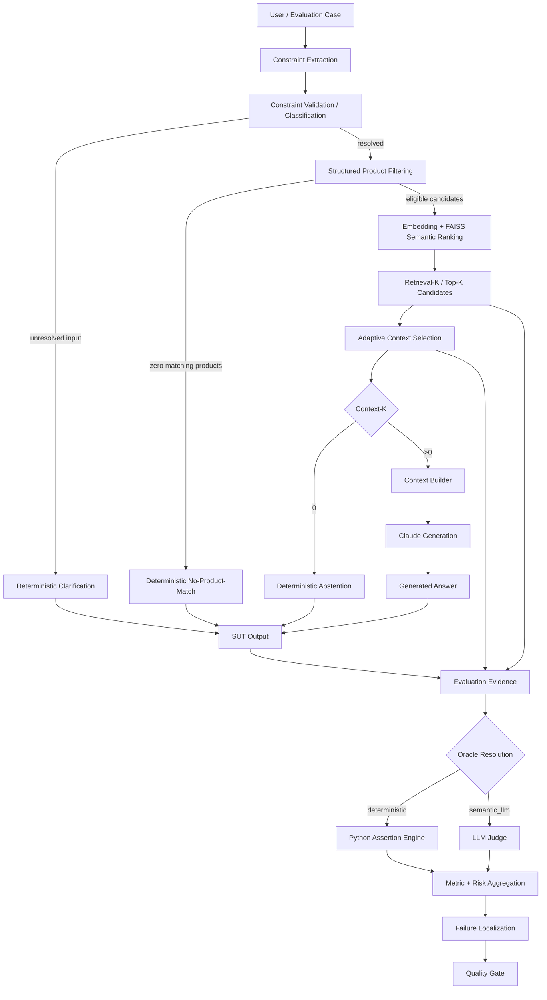

# AI QE Lab — Test Strategy

## 1. Purpose

This strategy defines **how to test an AI-enabled system with the AI QE framework**, not only what is currently implemented in the Shopping RAG Assistant POC.

The framework combines:

- conventional functional, API, integration and E2E testing;
- AI/RAG-specific evaluation;
- governed datasets and Oracle selection;
- deterministic assertions and semantic LLM-as-a-Judge evaluation;
- observability and failure localization;
- CI/CD quality gates at PR, Regression, Nightly and Release levels;
- future Jira/Confluence-driven test governance and agent-assisted test design.

The strategy answers six questions:

1. What can fail?
2. How should the failure be tested?
3. Which Oracle should decide PASS/FAIL?
4. At which execution level should the test run?
5. What evidence is required to localize a failure?
6. What quality or release decision follows from that evidence?

Detailed metric definitions and denominators are maintained in `docs/metric_contract.md`.

---

## 2. Test object and architecture

The current executable SUT is a Shopping RAG Assistant. The same QE model is intended to be reusable for other AI-enabled systems by replacing product-specific risks and assertions while preserving the framework responsibilities.



A failed final answer is **not automatically an LLM defect**. Investigation starts from the first layer where expected behavior diverged.

Deterministic early responses are different behaviors and must be tested separately:

- **Clarification** — input is unresolved and requires a user-provided governed value;
- **No-Product-Match** — resolved hard constraints match no catalogue product;
- **Abstention** — the request is understood but no governed evidence survives context selection.

---

## 3. Quality objectives

Testing must provide confidence that the system:

- satisfies explicit business behavior and user constraints;
- retrieves the correct evidence and does not rely on irrelevant evidence;
- distinguishes hard constraints from semantic relevance;
- handles ambiguity deterministically where governed input is required;
- avoids unsupported claims and hallucinations;
- remains grounded in supplied context/policy evidence;
- abstains safely when evidence is insufficient;
- behaves robustly under paraphrase, negative, edge and adversarial inputs;
- remains observable enough to localize failures;
- remains stable across model/prompt/data/configuration changes;
- meets latency, reliability and cost expectations;
- produces auditable evidence for merge and release decisions.

---

## 4. Risk-based test design

Testing starts from architecture and business risk, not from a generic AI checklist.

### Conventional risks

- incorrect functional behavior;
- API/contract failures;
- integration and downstream failures;
- state/data integrity defects;
- error handling and resilience;
- security/privacy failures;
- performance and capacity degradation.

### AI-specific risks when applicable

- retrieval miss or noisy retrieval;
- hard-constraint non-adherence;
- evidence removed by context selection;
- insufficient context;
- hallucination / unsupported claims;
- poor groundedness;
- semantic incorrectness;
- ambiguity handled as if resolved;
- stale/conflicting evidence;
- out-of-domain behavior;
- prompt injection / instruction conflict;
- non-deterministic instability;
- tool/action misuse for agents;
- model or data drift;
- excessive latency/token/cost growth.

Every material risk should map to an executable case, an Oracle, a CI level and expected evidence.

---

## 5. Test techniques

Use conventional and AI-specific techniques together.

| Technique | Typical use |
|---|---|
| Equivalence Partitioning / BVA | structured fields, limits, thresholds, price/size ranges |
| Decision Tables | business rules and combinations of constraints |
| Pairwise / combinatorial | multi-constraint coverage without exhaustive explosion |
| Negative testing | invalid, missing, contradictory or unsupported inputs |
| Error guessing | known architecture weak points and historical defects |
| Metamorphic testing | verify stable behavior under meaning-preserving transformations |
| Paraphrase testing | same intent with different language |
| Adversarial testing | prompt injection, conflicting instructions, edge AI behavior |
| Back-to-back comparison | model/prompt/retrieval configuration changes |
| Repeated-run testing | non-determinism and stochastic stability |
| Golden baseline comparison | canonical release-critical behavior |

For deterministic properties, exact assertions are preferred. For meaning-level behavior, semantic evaluation is allowed.

---

## 6. Dataset strategy

Datasets are purpose-specific test assets, not inheritance layers.

| Dataset | Purpose | Expected use |
|---|---|---|
| **PR Critical** | fastest high-risk merge protection | pull request gate |
| **Regression** | stable behavior and confirmed fixed defects | main/merge health |
| **Nightly Evaluation** | broad AI-risk, edge and adversarial coverage | scheduled/manual broad evaluation |
| **Golden** | trusted canonical business-critical baseline | release validation |
| **Agent Evaluation** | expected/prohibited actions, tool use and HITL behavior | future agent governance |

Current reviewed evaluation inventory:

| Suite | Total | Deterministic | Semantic Judge |
|---|---:|---:|---:|
| PR Critical | 10 | 6 | 4 |
| Regression | 15 | 7 | 8 |
| Nightly | 80 | 48 | 32 |
| **Total** | **105** | **61** | **44** |

Golden is intentionally separate from the above routing inventory because its role is trusted release/reference validation rather than routine suite-volume reporting.

Dataset size is not itself a quality objective. Coverage must be justified by risks, business criticality, defect history and execution cost.

---

## 7. Dataset and Oracle governance

Before execution, validate the test contract.

```text
deterministic      -> valid only with required deterministic assertions
semantic_llm       -> valid semantic route
missing/null/empty -> warning + reviewed fallback allowed
invalid non-empty  -> validation ERROR
missing/duplicate ID -> validation ERROR
```

Each governed case should identify, where applicable:

- case ID;
- requirement/business behavior;
- AI/conventional risk;
- input/query;
- expected source/evidence;
- expected behavior;
- deterministic assertions or semantic Oracle;
- criticality;
- target suite/CI level.

The dataset is the primary test contract. Runtime fallback routing is a safety mechanism, not a competing source of business truth.

---

## 8. Test execution model

A normal evaluation run follows this sequence:

```text
Validate dataset
-> Execute case through the real SUT
-> Capture answer + retrieval/context/model evidence
-> Resolve Oracle
-> Execute deterministic assertions OR LLM Judge
-> Aggregate metrics and risks
-> Localize first failure layer
-> Apply deterministic Quality Gate
-> Retain reports/evidence
```

### How to test a new change

1. Identify the affected SUT layer and risks.
2. Add/update the smallest relevant deterministic or semantic cases.
3. Verify dataset/Oracle validity before model calls.
4. Run the affected cases locally or through PR Critical.
5. Inspect retrieval/context/generation evidence, not only final PASS/FAIL.
6. If the defect is confirmed, add permanent Regression coverage.
7. For architecture/model/prompt/data changes with broad AI impact, execute Nightly coverage.
8. For a release candidate, use Release Validation with Golden plus valid broad-risk evidence.

---

## 9. Retrieval and context testing

Retrieval-K and Context-K must be tested separately.

Current defaults:

```text
RAG_TOP_K=5
RAG_MIN_CONTEXT_K=2       # target, not padding requirement
RAG_MAX_CONTEXT_K=5
RAG_MIN_SIMILARITY=0.30
```

Testing should verify:

- hard constraints exclude invalid candidates before semantic ranking;
- semantic score never overrides a hard business constraint;
- Top-K contains expected evidence when such evidence exists;
- retrieval noise is measured independently from final context;
- below-threshold evidence is not padded into context;
- selected context preserves expected evidence;
- `Context-K=0` skips generation and produces deterministic abstention;
- valid hard constraints with zero matching products produce deterministic no-product-match behavior;
- unresolved governed inputs produce clarification before retrieval.

The similarity threshold is an engineering control, not a probability. Changes to it require evidence from retrieval quality, context sufficiency, answer quality and token/cost behavior.

---

## 10. Oracle and metric strategy

Governing rule:

> **Formal assertion -> deterministic Python. Meaning/behavior judgment -> semantic LLM Judge.**

### Deterministic evaluation

Use deterministic assertions for exact facts such as:

- expected retrieved IDs;
- required/forbidden text patterns;
- hard product constraints;
- catalogue minimum/maximum facts;
- expected deterministic early responses;
- exact tool/action permissions where applicable.

### Semantic evaluation

Use an LLM Judge for meaning-level dimensions such as:

- Correctness;
- Groundedness;
- Hallucination;
- Context Coverage;
- Context Sufficiency;
- semantic response quality/adherence where exact assertions are insufficient.

The Judge does **not** choose the Oracle.

### Metric populations

Semantic-only metrics use only semantic/Judge cases as denominator. Deterministic cases are excluded and represented as N/A for non-applicable semantic fields.

Suite-wide/hybrid metrics include Overall Pass Rate, Retrieval Hit and Constraint Adherence according to their metric contract.

Current quality thresholds:

```text
Correctness >= 95%
Groundedness >= 95%
Retrieval Hit >= 95%
Constraint Adherence >= 95%
Hallucination <= 2%
```

Quality-gate evaluation remains deterministic even when source metrics include LLM judgments.

---

## 11. CI/CD test levels

The target execution model is:

| Level | Trigger | Purpose | Blocking meaning |
|---|---|---|---|
| **PR Critical** | meaningful PR changes | fast high-risk feedback | blocks merge |
| **Regression** | main/merge when enabled, or manual | stable behavior/fixed defects | main health gate |
| **Nightly** | schedule when enabled, or manual | broad AI-risk signal | broad health/risk evidence |
| **Release Validation** | RC/tag/manual according to release process | release confidence | release gate |

During framework construction or dataset redesign, expensive Regression/Nightly schedules may be intentionally paused and left available via `workflow_dispatch`.

Documentation-only changes should not trigger expensive AI evaluation levels unless documentation itself changes executable workflow behavior.

---

## 12. Release Validation strategy

Release Validation is a separate lifecycle level, not merely another name for Golden.

The target model is:

```text
Release Candidate / Release Scope
        ↓
Release Validation
        ├─ Golden trusted baseline
        └─ Broad Nightly evidence
        ↓
Release Quality Gate
        ↓
GO / NO-GO / explicit risk acceptance
```

Rules:

1. Golden must validate canonical business-critical behavior for the release candidate.
2. Broad Nightly evidence must represent the **same relevant release scope/SHA**.
3. If valid Nightly evidence already exists for that exact candidate/scope, it may be reused rather than rerun solely for ceremony.
4. If the candidate changed after the broad run, or evidence is stale/inapplicable, rerun the broad suite.
5. Release readiness also considers unresolved defects, operational evidence, risk coverage and residual risk.
6. Jira release scope, Confluence evidence, RC/tag naming and baseline-selection rules are connected when project governance is integrated.

Golden can therefore be smaller than Nightly: Golden proves trusted canonical behavior; Nightly provides breadth.

---

## 13. Entry and exit criteria

### Framework/run entry criteria

- testable expected behavior exists;
- dataset schema and Oracle metadata are valid;
- required source data/knowledge base is available;
- environment, model configuration and secrets are available;
- relevant risk/assertion metadata exists;
- required telemetry can be captured;
- no known infrastructure incident invalidates the run.

### PR Critical exit

- required PR scope executed;
- critical cases pass;
- applicable thresholds pass;
- blocking failures are localized and fixed or explicitly dispositioned;
- evidence is retained.

### Regression exit

- stable/fixed-defect scope executed;
- no blocking regression remains unexplained;
- applicable gates pass;
- new confirmed defects are added to Regression coverage.

### Nightly exit

- planned broad-risk population executes successfully or failures are classified;
- AI-risk buckets and semantic populations are reported with correct denominators;
- material degradation is investigated before using the run as release evidence.

### Release exit

- Golden passes for the release candidate;
- valid broad-risk Nightly evidence exists for the same relevant candidate/scope;
- blocking defects are resolved or formally risk-accepted;
- quality thresholds and critical rules pass;
- operational evidence is acceptable;
- residual risk is documented;
- release evidence supports GO/NO-GO.

---

## 14. Failure localization and defect policy

Investigation should identify the first failing layer:

```text
Dataset / Oracle validation
-> Input / Constraint Validation
-> Structured Filtering
-> Retrieval / Ranking
-> Adaptive Context Selection
-> Context Builder
-> Generation / Prompt / Model
-> Judge / Evaluator
-> Provider / Infrastructure
-> Quality Gate / Reporting
```

Typical defect classes:

- dataset/expected-result defect;
- constraint extraction/validation defect;
- retrieval/filtering/ranking defect;
- context-selection defect;
- context-construction defect;
- generation/prompt/model defect;
- evaluator/Judge defect;
- external provider/infrastructure defect;
- stochastic stability defect;
- security/guardrail defect;
- operational/performance defect.

A rerun is evidence about reproducibility, not permission to retry until green. Preserve the original failure.

Confirmed product defects follow:

```text
Failure
-> Evidence review
-> Localization
-> Defect confirmation
-> Fix
-> Verification
-> Regression case
-> Permanent regression protection
```

---

## 15. Non-functional and operational testing

Measure where applicable:

- latency and P95;
- provider errors/retries/timeouts;
- rate limits;
- throughput/concurrency;
- token/context-size growth;
- cost trends;
- stochastic repeated-run stability;
- model/provider dependency health.

Cost controls must not weaken quality. Prefer deterministic evaluation where possible, minimize irrelevant context, and use semantic Judge calls only where semantic reasoning is required.

---

## 16. Traceability and future agent governance

Target traceability:

```text
Requirement
-> Risk
-> Test / Evaluation Case
-> Governed Dataset
-> Dataset Validation
-> SUT Execution
-> Evidence
-> Deterministic Engine or Semantic Judge
-> Metric / Risk
-> Quality Gate
-> Defect / Regression
-> Residual Risk
-> Release Decision
```

Future Jira/Confluence-driven flow:

```text
Jira Requirement
-> Requirements Review / Entry Gate
-> AI Risk Analysis
-> Test Design
-> Functional Tests + AI Evaluation Cases
-> Duplicate / Coverage / Oracle Governance
-> Human Approval where required
-> Governed JSON Dataset
-> Existing Evaluation + CI Framework
```

Agents create and govern quality inputs; they do not replace the independent evaluator or human release accountability.

---

## 17. Roles and reporting

**Test Lead / Quality Owner** owns strategy, risk model, gates, residual-risk assessment and release recommendation.

**QA/QE** designs coverage, datasets, assertions, executes tests, analyzes evidence and localizes failures.

**Development / AI Engineering** owns SUT implementation and fixes application/retrieval/prompt/model defects.

**Product / Business** validates expected behavior, business criticality and accepted residual risk.

**Agents** may assist with requirements review, risk identification and test generation under governed permissions and HITL controls.

Reports should expose:

- executed/passed/failed counts;
- actual metric populations/denominators;
- critical failures;
- risk-level outcomes;
- retrieval/context/generation evidence;
- first failure layer;
- latency/tokens/cost;
- trend/baseline comparison;
- defect and residual-risk status;
- final merge/release recommendation.

---

## 18. Strategy maintenance

This is a living strategy. Architecture, datasets, metrics, workflows and documentation must evolve together.

Do not present a capability as current until executable support exists. Do not hide semantic populations behind suite-wide percentages. Do not add AI risks or metrics merely because a system uses an LLM; every control must map to the actual architecture and business risk.