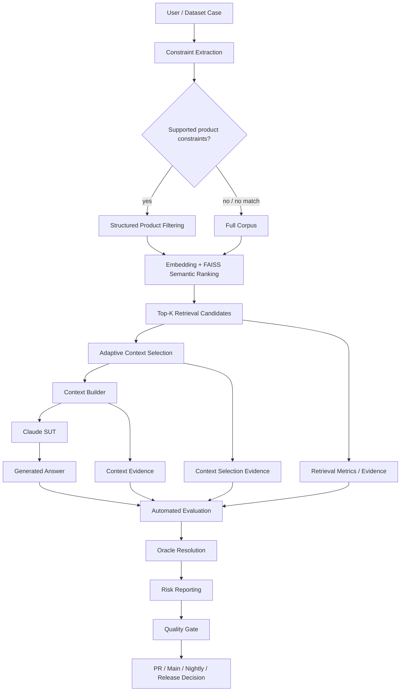
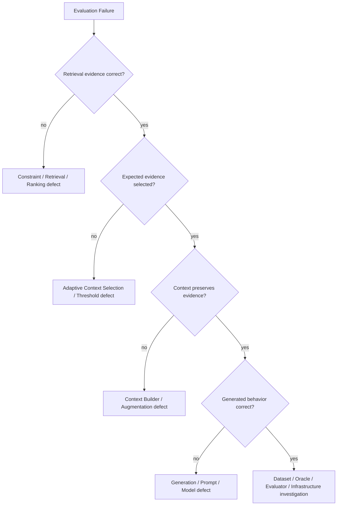

# AI QE Lab — Test Strategy

## 1. Purpose

This Test Strategy defines how the AI QE Lab validates the implemented Shopping RAG Assistant and how the same QE model will evolve toward QA/Test Management agents. It combines conventional software testing, AI-specific evaluation, risk-based testing, observability, CI/CD quality gates, failure localization and release governance.

The strategy answers five questions:

1. What can fail?
2. How will that failure be detected?
3. At which lifecycle level should it be detected?
4. What evidence is required to localize the failure?
5. What quality decision follows from that evidence?

The canonical detailed metric definitions and denominators are maintained in `docs/metric_contract.md`.

---

## 2. Current scope

Implemented now:

- Shopping RAG Assistant;
- product/policy retrieval;
- structured constraint extraction and product filtering;
- `all-MiniLM-L6-v2` embeddings and FAISS semantic ranking;
- Top-K retrieval candidates;
- adaptive similarity-based context selection;
- deterministic context construction;
- Claude SUT generation;
- Dataset/Oracle Validation in PR Critical, Regression and Nightly CI;
- deterministic retrieval/context/generation assertions;
- semantic LLM-as-a-Judge evaluation;
- Golden, PR Critical, Regression and Nightly datasets;
- AI Risk metadata and Risk Coverage Matrix;
- GitHub Actions execution and quality gates;
- provider/hallucination retry controls;
- latency/token/cost observability;
- defect localization.

Planned:

- automatically generated fallback Oracle mapper from validated datasets;
- Jira requirement intake and traceability;
- Requirements Readiness Agent;
- AI Risk Analysis Agent;
- Test Design Agent;
- duplicate/coverage analysis;
- Human-in-the-Loop approval;
- QA Agent evaluation;
- Test Management Lifecycle Agent;
- automated Defect -> Regression lifecycle and release/residual-risk reporting.

Governed JSON is the target authoritative agent output. Excel is not required as an intermediate execution or governance layer.

---

## 3. Quality objectives

The system should:

- return answers that satisfy expected business behavior;
- retrieve intended product/policy evidence;
- avoid unsupported claims and hallucinations;
- obey structured constraints such as price, size, color and product attributes;
- avoid adding weak retrieval evidence to generation context;
- abstain safely when evidence is insufficient or the request is out of scope;
- remain robust to paraphrases, ambiguity and adversarial prompts;
- preserve traceability from risk/test intent to dataset, execution and evidence;
- localize failures to the correct pipeline layer;
- detect regressions before merge, after merge and before release;
- provide operational evidence for latency, tokens and reliability;
- minimize unnecessary Judge/context cost without weakening quality confidence.

---

## 4. System architecture under test



Diagnostic chain:

```text
Query
-> Constraint Extraction / Filtering
-> Retrieval Candidates
-> Adaptive Context Selection
-> Constructed Context
-> Generation
-> Oracle Evaluation
-> Operational Evidence
-> Gate Decision
```

A failed answer is never automatically classified as an LLM defect.

---

## 5. Retrieval and context-selection strategy

Retrieval-K and Context-K are intentionally different controls.

Default current configuration:

```text
RAG_TOP_K=5
RAG_MIN_CONTEXT_K=2
RAG_MAX_CONTEXT_K=5
RAG_MIN_SIMILARITY=0.30
```

`RAG_MIN_SIMILARITY` is an application-level threshold implemented by `context_selector.py`; it is not a built-in FAISS minimum. FAISS returns ranked candidates and the selector decides which candidates enter generation context.

The similarity score is an embedding-similarity signal, not a calibrated probability. The `0.30` default is an engineering threshold that must be validated against retrieval/context sufficiency, answer quality and token-cost evidence.

Rules:

1. retrieve up to Top-K ranked candidates;
2. retain all retrieval candidates as diagnostic evidence;
3. pass only candidates with similarity `>= RAG_MIN_SIMILARITY` to generation;
4. cap selected context by `RAG_MAX_CONTEXT_K`;
5. treat `RAG_MIN_CONTEXT_K` as a target floor, not a hard padding rule;
6. never add below-threshold evidence merely to reach the target minimum;
7. allow Context-K to be 0 or 1 when evidence does not clear the threshold.

---

## 6. Test approach and levels

| Level | Primary purpose | Typical coverage | Execution |
|---|---|---|---|
| Component | deterministic Python behavior | constraints, selector rules, parsers, metrics | local/software tests |
| Retrieval/RAG | candidate and selected-evidence quality | expected source, constraints, Top-K, similarity threshold, Context-K | dataset runs |
| AI Generation | user-visible generated behavior | correctness, grounding, hallucination, adherence | deterministic assertions / Judge |
| Integration | end-to-end RAG + LLM + evaluator | evidence propagation, reports, routing | PR / Regression / Nightly |
| System | complete assistant scenarios | business behavior | Golden / Evaluation |
| Regression | stable/fixed behavior | known behavior and historical defects | main / release |
| Release | release confidence | Golden + Regression + repeated Critical | release candidate |
| Agent Evaluation | future decisions/actions/tools/HITL | planned agent behavior | planned |

Classical and AI-specific techniques include EP, BVA, decision tables, pairwise/combinatorial, negative testing, error guessing, metamorphic testing, paraphrase testing, adversarial testing, back-to-back comparison and repeated-run testing.

---

## 7. Dataset strategy

Datasets are organized by **purpose**, not inheritance.

| Dataset | Purpose | Typical execution |
|---|---|---|
| Golden | trusted canonical/reference behavior | architecture/model/prompt changes and release |
| PR Critical | fast risk-based blocking coverage | pull request merge gate |
| Regression | stable behavior plus fixed defects | `main` health / release |
| Nightly Evaluation | broad AI risk, robustness, adversarial/edge coverage | nightly |
| Agent Evaluation | future tool/action/HITL behavior | planned |

Current reviewed Oracle inventory:

| Suite | Total | Deterministic | Semantic |
|---|---:|---:|---:|
| PR Critical | 10 | 6 | 4 |
| Regression | 15 | 7 | 8 |
| Nightly | 80 | 48 | 32 |
| **Total** | **105** | **61** | **44** |

All 61 deterministic cases have structured atomic assertions. Nightly assertions are maintained in `datasets/evaluation_assertion_metadata.json`.

---

## 8. Dataset validation and Oracle governance

All three active workflows validate the effective dataset package before SUT/Judge execution.

```text
deterministic      -> valid + deterministic assertions required
semantic_llm       -> valid
missing/null/empty -> warning + fallback mapper allowed
invalid non-empty  -> validation ERROR
missing/duplicate ID -> validation ERROR
```

The dataset is authoritative. `judge_routing.py` is a runtime safety/fallback mechanism, not a competing manually maintained business truth. The next governance step is generating/refreshing that mapper from validated approved datasets.

---

## 9. Metrics and Oracle model

The governing rule is:

> **Formal assertion -> deterministic Python. Meaning/behavior judgment -> semantic LLM Judge. Always report the population actually measured.**

### Current metric contract

| Metric | Layer | Mechanism | Population |
|---|---|---|---|
| Overall Pass Rate | case/suite | Python aggregation | all executed cases |
| Retrieval Hit Rate | retrieval | deterministic Python | all executed cases |
| Constraint Match Score | retrieval/filtering | deterministic Python | applicable structured-constraint cases |
| Constraint Precision@K | retrieval/ranking | deterministic Python | applicable structured-constraint cases |
| Candidate K / Selected Context-K / IDs / scores | retrieval/context selection | deterministic Python telemetry | per case |
| Context atomic assertions | augmentation/context | deterministic engine | deterministic cases with applicable assertions |
| Average Context Coverage | augmentation/context | LLM Judge | judged cases only |
| Context Sufficiency Rate | augmentation/context | LLM Judge | judged cases only |
| Generation atomic assertions | generation | deterministic engine | deterministic cases with applicable assertions |
| Correctness Rate | generation | LLM Judge | judged cases only |
| Groundedness Rate | generation | LLM Judge | judged cases only |
| Hallucination Rate | generation | LLM Judge | judged cases only |
| Constraint Adherence Rate | retrieval/generation | deterministic or Judge by route | all executed cases |
| Judge call reduction | Oracle/cost | Python aggregation | all executed cases |
| Risk summary | risk reporting | hybrid aggregation | cases carrying each risk |
| latency/P95/tokens/cost | operations | telemetry + Python | applicable calls/cases |

### Denominator rule

Semantic metrics are **not suite-wide in a mixed deterministic/semantic suite**. Deterministic cases store semantic-only fields as `None` and are excluded.

For current PR Critical:

```text
10 total cases
6 deterministic
4 semantic/Judge

Overall Pass 100%         = 10/10
Retrieval Hit 100%        = 10/10
Correctness 100%          = 4/4 judged
Groundedness 100%         = 4/4 judged
Hallucination 0%          = 0/4 hallucinated; 4 judged
Context Coverage 100%     = 4 judged
Context Sufficiency 100%  = 4/4 judged
Constraint Adherence 100% = 10/10 through hybrid route evaluation
```

If there are zero semantic cases, semantic metrics are **N/A**, not `100%`.

This distinction also applies to AI Risk Summary: `Groundedness N/A (0 semantic cases)` is correct for a deterministic-only risk bucket.

---

## 10. AI risk model

Risk and priority are separate dimensions. Applicable risks include retrieval quality, context-selection/evidence loss, hallucination, groundedness, constraint non-adherence, missing-information handling, ambiguity, conflicting/stale data, out-of-domain behavior, prompt injection, robustness, non-determinism, policy grounding, sensitive-data handling, privacy/security where applicable, bias/fairness where applicable, and operational degradation.

Risk identification must remain architecture-aware; RAG-specific risks must not be assigned automatically to systems that do not use retrieval.

---

## 11. Quality gates and CI/CD

Current policy:

```text
PR Critical = merge gate
Regression  = main health gate
Nightly     = broad AI-risk signal
Release     = release validation gate
```

Current thresholds:

```text
Correctness >= 95%           # judged semantic population when applicable
Groundedness >= 95%          # judged semantic population when applicable
Retrieval Hit >= 95%         # all executed cases
Constraint Adherence >= 95%  # all executed cases / hybrid route
Hallucination <= 2%           # judged semantic population when applicable
```

Critical-case failures can additionally block a run. When a semantic metric has no applicable cases, it is N/A and the corresponding threshold is not fabricated from an empty population.

---

## 12. Failure localization and defect taxonomy



Defect classes include SUT/generation, retrieval/filtering/ranking, context selection, context construction, dataset, expected-result/oracle, evaluator/Judge, provider/infrastructure, stochastic behavior, security/guardrail and operational/performance.

---

## 13. Resilience and repeated-run policy

Provider retry and hallucination retry are separate controls:

- provider retry handles delivery/infrastructure failures;
- hallucination retry investigates stochastic quality instability.

A rerun is evidence about reproducibility, not a retry-until-green mechanism. The original failure remains part of the evidence chain.

---

## 14. Non-functional and cost testing

The strategy includes latency/P95, provider errors/retries, rate limits/timeouts, throughput/concurrency when introduced, token/context-size growth, cost trends and repeated-run stability.

Cost principles:

1. deterministic Python first;
2. semantic Judge only when needed;
3. separate retrieval candidates from generation context;
4. filter low-value evidence before generation;
5. preserve BEFORE/AFTER evidence for optimizations;
6. use model tiering/caching only after quality validation;
7. never weaken quality thresholds merely to reduce spend.

USD cost is an estimate derived from configured pricing and token telemetry, not billing truth.

---

## 15. Entry and exit criteria

Entry criteria include testable expected behavior; valid dataset/schema/Oracle metadata; required source data; environment/model variables and API secrets; relevant risk/assertion metadata; and no infrastructure incident invalidating execution.

Exit criteria include required scope executed; blocking cases passed or dispositioned; applicable thresholds satisfied; failures localized/classified; defects/residual risks understood; evidence retained; and release evidence supporting the decision.

---

## 16. Defect -> Regression policy

Target lifecycle:

```text
Failed evaluation
-> evidence review
-> failure localization
-> defect classification
-> human confirmation
-> fix
-> verification
-> regression case added/updated
-> permanent regression protection
```

---

## 17. Traceability and future governance

```text
Requirement
-> AI Risk
-> Test / Evaluation Case
-> Governed JSON Dataset
-> Dataset Validation
-> Oracle / Atomic Assertions
-> CI Level
-> Retrieval / Context / Generation Evidence
-> Deterministic Engine or Semantic Judge
-> Metric / Quality Gate
-> Defect / Regression
-> Residual Risk / Release Decision
```

Future agent-generated flow:

```text
Jira Story
-> Readiness Gate
-> Applicable AI Risks
-> Test Design
-> Functional Tests + AI Evaluation Cases
-> Duplicate / Coverage Check
-> Human Approval
-> Governed JSON
-> Dataset Validation
-> Derived Oracle Mapper
-> CI Execution
```

JSON is authoritative. No Excel export is required for the executable lifecycle.

---

## 18. Roles, reporting and release readiness

The Test Lead / Quality Owner owns strategy, risk acceptance, gates and release recommendations. QA engineers design coverage and analyze evidence. Development/AI Engineering fixes SUT/retrieval/prompt defects. Product/business stakeholders validate expected behavior and risk acceptance. Future agents assist under defined permissions/HITL controls but do not replace human accountability.

Reports expose executed/passed/failed, actual denominators, blocking failures, risk-level outcomes, retrieval/context-selection/context/generation evidence, latency/tokens, trend vs baseline, defect classification and residual-risk recommendation.

Release validation combines Golden, Regression, repeated Critical where stability matters, unresolved-defect review, operational telemetry, risk coverage and residual-risk assessment.

```text
Evidence acceptable + residual risk acceptable -> GO
Blocking gate failure or unacceptable residual risk -> NO-GO / FIX-FORWARD / EXPLICIT RISK ACCEPTANCE
```

---

## 19. Strategy evolution

This is a living strategy. Implementation, architecture, metrics and documentation must evolve together. A capability must not be presented as current until it exists in executable code. Metric percentages must never hide their applicable population.
