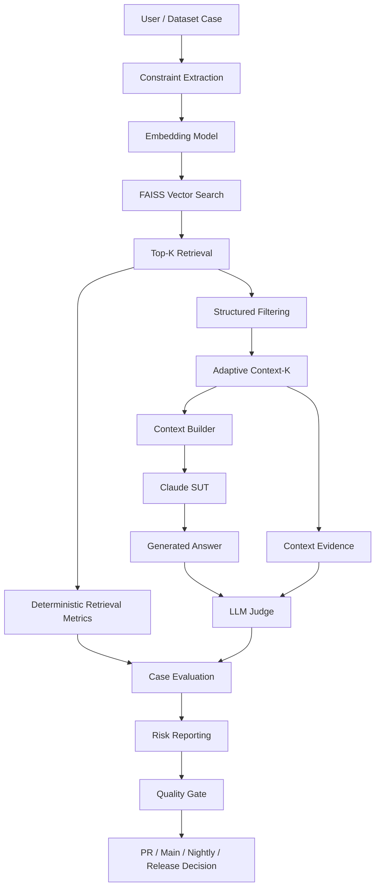
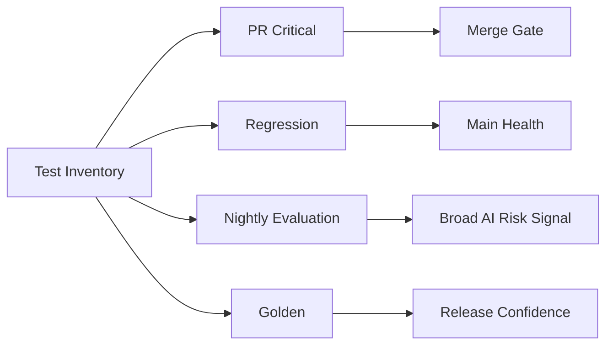
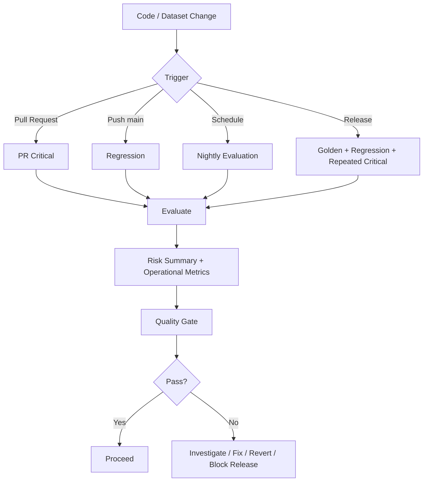
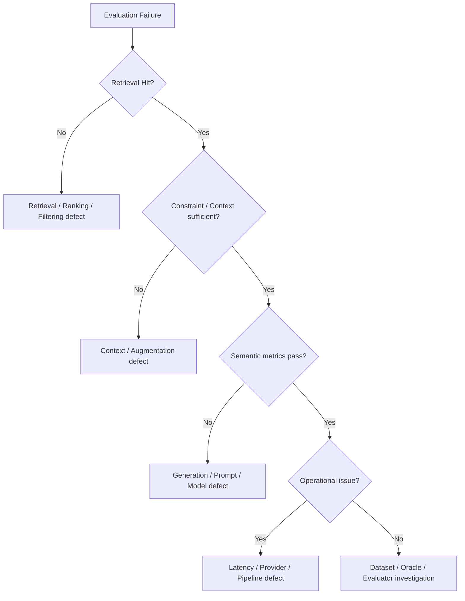
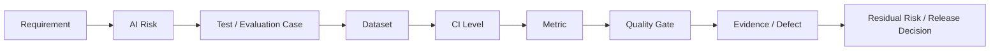

# AI QE Lab — Test Strategy

## 1. Purpose

This Test Strategy defines how the AI QE Lab validates quality across the implemented Shopping RAG Assistant and the planned QA/Test Management agent lifecycle. It combines conventional software testing, AI-specific evaluation, risk-based testing, observability, CI/CD quality gates, and release governance.

The strategy is designed to answer five questions:

1. What can fail?
2. How will that failure be detected?
3. At which test level should it be detected?
4. What evidence is required to classify the failure?
5. What quality decision follows from the evidence?

---

## 2. Scope

### In scope now

- Shopping AI Assistant
- RAG retrieval over products and policies
- structured constraint filtering
- prompt/context construction
- Claude SUT generation
- deterministic retrieval/context metrics
- LLM-as-a-Judge semantic evaluation
- Golden, PR Critical, Regression and Nightly datasets
- AI Risk metadata and Risk Coverage Matrix
- GitHub Actions execution
- quality gates
- retry/resilience logic
- latency/token/cost observability
- defect localization

### Planned scope

- Jira requirement intake
- Requirements Readiness Agent
- AI Risk Analysis Agent
- Test Design Agent
- duplicate/coverage analysis
- Human-in-the-Loop approval
- Excel governance to executable JSON flow
- QA Agent evaluation
- Test Management Lifecycle Agent
- release/residual-risk reporting

---

## 3. Quality objectives

The system should:

- return answers that satisfy expected business behavior;
- use the intended product/policy evidence;
- avoid unsupported claims and hallucinations;
- obey structured constraints such as price, size, color and availability;
- abstain safely when information is unavailable or out of scope;
- remain robust to paraphrases, ambiguity and adversarial prompts;
- preserve traceability from test intent to risk, dataset, execution and result;
- localize failures to the correct pipeline layer;
- detect regressions before merge, after merge and before release;
- provide operational evidence for latency, token consumption and reliability;
- use AI evaluation economically without weakening quality confidence.

---

## 4. System architecture under test



The diagnostic principle is:

```text
Query
→ Retrieval
→ Constraint quality
→ Context sufficiency
→ Generation
→ Semantic evaluation
→ Operational behavior
→ Gate decision
```

A failed final answer is not automatically classified as an LLM defect.

---

## 5. Test approach

The strategy combines:

- **risk-based testing** — prioritize by likelihood, impact and AI failure mode;
- **requirements-based testing** — validate defined expected behavior and acceptance criteria;
- **data-driven testing** — execute governed datasets through common runners;
- **deterministic testing** — Python checks for facts that do not require semantic judgment;
- **model-based/semantic evaluation** — LLM Judge for correctness, groundedness and related semantic qualities;
- **exploratory AI evaluation** — broader Nightly campaigns for ambiguity, robustness, adversarial and conflicting-data behavior;
- **regression testing** — preserve stable behavior and fixed defects;
- **shift-left CI validation** — small critical subset blocks unsafe PRs;
- **observability-driven diagnosis** — retain evidence from retrieval, context, generation and evaluation layers.

---

## 6. Test levels

| Level | Primary purpose | Typical coverage | Execution |
|---|---|---|---|
| Component | Validate deterministic Python logic | constraint extraction, filtering, metric calculation, parsing | local / CI where enabled |
| Retrieval/RAG | Validate retrieval and context construction | expected source, constraints, Top-K, Context-K, context evidence | dataset runs |
| AI Generation | Validate generated behavior | correctness, groundedness, hallucination, adherence | Judge evaluation |
| Integration | Validate end-to-end RAG + LLM + evaluator interaction | telemetry propagation, raw evidence, report creation | PR / Regression / Nightly |
| System | Validate user-visible assistant behavior | complete business scenarios | Golden / Evaluation |
| Regression | Protect stable/fixed behavior | known behavior and historical defects | main / release |
| Release | Establish release confidence | Golden + Regression + repeated Critical | release candidate |
| Agent Evaluation | Validate future agent actions and decisions | requirements review, risk identification, tests, permissions, HITL | planned |

---

## 7. Dataset strategy

Datasets are classified by **purpose**, not by hierarchy.

### Golden Dataset

Trusted canonical behaviors and reference truth. Used for baseline and release confidence.

### PR Critical Dataset

Small risk-based subset used as a merge gate. It is not simply a list of severity-P1 cases; it represents fast, high-value blocking coverage.

### Regression Dataset

Stable behavior, historically fixed defects and important edge cases. It grows as confirmed defects are fixed.

### Nightly Evaluation Dataset

Broad AI-risk surface including ambiguity, missing information, conflicts, prompt injection, paraphrases, robustness and long/multi-constraint queries.

### Future Agent Evaluation Dataset

Will validate both expected and prohibited agent actions, including tool usage, permissions and Human-in-the-Loop behavior.



Overlap between datasets is allowed when the same case serves more than one lifecycle purpose.

---

## 8. AI risk model

Each evaluation case should carry one or more explicit canonical AI Risk labels. Risk and priority are separate dimensions.

### Core risks

- retrieval quality failure;
- hallucination;
- groundedness failure;
- constraint non-adherence;
- missing-information handling;
- ambiguity handling;
- conflicting-data handling;
- stale-data behavior;
- out-of-domain behavior;
- prompt injection / adversarial manipulation;
- robustness to paraphrase and input variation;
- non-determinism / flaky behavior;
- policy grounding;
- sensitive-data handling;
- privacy/security concerns;
- bias/fairness where architecture/use-case makes them applicable;
- operational degradation such as latency/error/token explosion.

### Future agent risks

- hallucinated requirements;
- incorrect AI-risk identification;
- omitted coverage;
- duplicate test creation;
- unauthorized Jira/Xray actions;
- incorrect tool usage;
- missing Human-in-the-Loop approval;
- unsafe autonomous action;
- incorrect release recommendation.

Risk identification must be architecture-aware. A component should not receive RAG-specific risks if it does not use retrieval.

---

## 9. Test design techniques

Classical and AI-specific techniques are used together.

| Technique | Use |
|---|---|
| Equivalence Partitioning | valid/invalid classes, category groupings, input classes |
| Boundary Value Analysis | price/limits/thresholds/token/context boundaries |
| Decision Tables | combinations of business rules and policy conditions |
| Pairwise / Combinatorial | multiple interacting constraints |
| State/transition testing | lifecycle/workflow states where applicable |
| Negative Testing | unavailable products, invalid constraints, missing data |
| Error Guessing | known weak points and observed failure patterns |
| Metamorphic Testing | expected relation after controlled input transformation |
| Paraphrase Testing | semantic robustness across equivalent wording |
| Adversarial Testing | prompt injection and manipulation attempts |
| Back-to-back / Model comparison | controlled model/prompt comparisons |
| Repeated-run Testing | non-determinism and flaky behavior |

Example BVA:

```text
Requirement: price <= 150
149.99 → valid
150.00 → valid boundary
150.01 → invalid
```

---

## 10. Metrics and evaluation model

### Deterministic Python metrics

- Retrieval Hit Rate
- Constraint Match Score
- Constraint Precision@K
- latency
- P95 latency
- token aggregation
- cache telemetry aggregation
- estimated cost when explicitly enabled
- risk coverage counts
- pass rates and threshold checks

### LLM Judge metrics

- Correctness
- Groundedness
- Hallucination
- Constraint Adherence
- Context Coverage
- Context Sufficiency

Diagnostic chain:

```text
Retrieval Hit
→ Constraint Match / Precision@K
→ Context Coverage / Sufficiency
→ Correctness / Groundedness / Hallucination / Adherence
```

This enables failure localization rather than generic “AI failed” reporting.

---

## 11. Quality gates

Current blocking dimensions include:

- critical case failures;
- Correctness threshold;
- Groundedness threshold;
- Retrieval Hit threshold;
- Constraint Adherence threshold;
- Hallucination maximum threshold.

Current policy:

```text
PR Critical = merge gate
Regression = main health gate
Nightly = broad risk signal
Release Validation = release gate
```

Risk/reporting metrics may initially be observational before becoming blocking thresholds. Thresholds should only be introduced after a stable baseline exists and their business meaning is understood.

---

## 12. CI/CD strategy



Documentation-only changes should not unnecessarily consume LLM evaluation cost.

---

## 13. Entry criteria

Typical entry criteria for an executable evaluation include:

- testable expected behavior exists;
- required dataset and expected source are available;
- environment/model variables are configured;
- required API secret is available to CI;
- SUT/evaluator code can execute;
- relevant risk metadata is defined where required;
- quality-gate configuration is available;
- no known blocking infrastructure incident invalidates the run.

Future story-level agent entry criteria will also require sufficient Description, Acceptance Criteria, constraints, data/source information and failure/no-result behavior.

---

## 14. Exit criteria

A test level can be considered complete when:

- required scope executed;
- blocking cases passed or accepted exceptions are explicitly documented;
- quality metrics satisfy defined gates;
- unresolved failures are classified;
- known defects have owners/severity/risk disposition;
- residual risk is understood;
- required evidence/reports are retained;
- release-level evidence supports GO/NO-GO recommendation.

100% metric perfection is not assumed to be universally achievable for probabilistic AI systems; release decisions are based on defined thresholds, risk and evidence.

---

## 15. Failure localization and defect taxonomy



Defect categories include:

- SUT / generation;
- retrieval/filtering/ranking;
- augmentation/context;
- dataset;
- expected-result/oracle;
- evaluator/Judge;
- provider/infrastructure;
- non-deterministic/flaky behavior;
- security/guardrail;
- operational/performance.

A failed evaluator must not be mistaken for a product defect.

---

## 16. Defect → Regression policy

Target lifecycle:

```text
Failed evaluation
→ telemetry review
→ failure localization
→ defect classification
→ human confirmation
→ fix
→ verification
→ regression case added/updated
→ permanent regression protection
```

This closes the learning loop so real failures improve future coverage.

---

## 17. Non-functional testing

The strategy includes:

- response latency and P95;
- API/provider error handling;
- retry behavior;
- throughput/concurrency when introduced;
- token consumption;
- context-size growth;
- cost trends;
- rate-limit behavior;
- timeout handling;
- resilience to transient 429/5xx/529 responses;
- stability across repeated executions.

Provider retry and hallucination retry are different controls:

- **provider retry** handles infrastructure delivery failures;
- **hallucination retry** investigates stochastic quality instability.

---

## 18. Cost and evaluation efficiency

Evaluation cost is a QE concern because unnecessary context or Judge usage can make broad evaluation economically impractical.

Principles:

1. deterministic Python first;
2. semantic LLM Judge only where semantic judgment is required;
3. minimize duplicated prompt/context;
4. separate Retrieval-K from Context-K;
5. use prompt caching where technically/economically meaningful;
6. use model tiering only after quality validation;
7. risk-based judging should reduce expensive uniform evaluation;
8. preserve BEFORE/AFTER evidence for optimization changes;
9. do not weaken thresholds merely to save tokens.

Exact USD values should be hidden in public CI output by default and exposed only through explicit opt-in.

---

## 19. Traceability and governance

Target traceability model:



For future agent-generated coverage:

```text
Jira Story
→ Readiness Gate
→ Applicable AI Risks
→ Test Design
→ Functional Tests + AI Evaluation Cases
→ Duplicate/Coverage Check
→ Human Approval
→ Excel Governance
→ JSON Export
→ CI Execution
```

Excel remains the human-readable governance/review layer; JSON remains the executable representation.

---

## 20. Roles and responsibilities

### Test Lead / Quality Owner

- owns the strategy and quality model;
- approves risk/coverage priorities;
- defines/accepts gates;
- reviews residual risk;
- provides release recommendation.

### QA Engineer

- designs and executes deterministic and AI-specific coverage;
- analyzes telemetry;
- classifies failures;
- maintains datasets and regression coverage.

### Development / AI Engineering

- supports architecture observability;
- fixes SUT/retrieval/prompt defects;
- maintains model/integration behavior.

### Product / Business Stakeholder

- validates expected behavior and business criticality;
- approves ambiguous requirements and risk acceptance.

### Future QA Agents

- assist with requirements review, risk analysis and test design;
- do not replace human accountability;
- must operate under defined permissions and HITL controls.

---

## 21. Reporting

Reports should provide both aggregate and case-level evidence.

Minimum views:

- executed / passed / failed;
- blocking failures;
- risk-level pass/fail;
- retrieval/context/generation metric breakdown;
- latency and token telemetry;
- trend vs baseline where available;
- defect classification;
- residual risk and recommendation.

The reporting objective is not to maximize metric count; it is to support diagnosis and decisions.

---

## 22. Release readiness

Release validation should combine:

- Golden Dataset;
- Regression Dataset;
- repeated PR Critical coverage where stability matters;
- unresolved defect review;
- operational telemetry;
- risk coverage and residual-risk assessment.

Release recommendation model:

```text
Evidence acceptable + residual risk acceptable
→ GO

Blocking quality gate failure
or unacceptable residual risk
→ NO-GO / FIX-FORWARD / EXPLICIT RISK ACCEPTANCE
```

---

## 23. Strategy evolution

This strategy is a living document. It must be updated when:

- architecture changes;
- a new AI component or agent is introduced;
- new risks are discovered;
- datasets or execution levels change;
- metrics/gates are added or retired;
- significant production/evaluation defects reveal missing controls;
- release governance changes.

The guiding principle is:

> Quality confidence must come from traceable evidence across the whole AI system, not from a single model score or a single successful answer.
