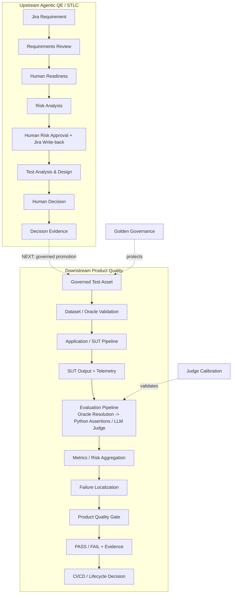

# AI QE Lab — Test Strategy

_Last synchronized with repository: 2026-09-01._

## 1. Purpose

This strategy defines how the AI QE Lab tests and governs an AI-enabled system. The executable reference SUT is the Shopping RAG Assistant, while the reusable outcome is the QE framework around it: governed datasets, deterministic and semantic Oracles, AI-specific test techniques, evaluator governance, CI/CD quality gates, observability, release evidence and Agentic QE/STLC orchestration.

The framework combines:

- conventional functional, API, integration and E2E testing;
- AI/RAG-specific evaluation;
- deterministic Python assertions and calibrated semantic LLM-as-a-Judge evaluation;
- risk-based Metamorphic, Back-to-Back and Adversarial testing;
- governed test datasets and Dataset / Oracle Validation;
- Judge Calibration and Golden / canonical-truth governance;
- PR, Regression, Nightly, specialized AI-testing and Release workflows;
- implemented Requirements Review, Risk Analysis and Test Analysis & Design agents with Human-in-the-Loop governance.

Detailed architecture is maintained in `docs/master_architecture.md`; agent decision branches in `docs/agentic_qe_orchestration.md`; metric definitions and denominators in `docs/metric_contract.md`.

---

## 2. Test object and quality architecture

The current executable SUT is a Shopping RAG Assistant with deterministic constraint handling, structured filtering, semantic retrieval, adaptive context selection and LLM generation.



Agent output is a proposal until the applicable human boundary is passed. Dataset validation is a technical execution-precondition check; it does not replace human governance.

---

## 3. Quality objectives

Testing must provide confidence that:

- requirements are sufficiently explicit before downstream test design;
- material conventional and AI-specific risks are represented by executable coverage;
- explicit business rules and hard constraints are respected;
- retrieval returns relevant evidence and context selection preserves required evidence;
- unsupported claims and hallucinations are detected;
- semantic answers remain grounded in supplied evidence;
- ambiguity, no-match and no-context conditions are handled safely;
- behavior remains stable under controlled meaning-preserving transformations;
- hostile or conflicting instructions cannot override governed business truth;
- model/configuration alternatives can be compared on the same controlled evaluation scope;
- evaluator decisions remain aligned with human-reviewed truth;
- canonical Golden expected behavior cannot be silently moved to hide a failure;
- agent decisions are traceable, permission-bounded and human-governed before mutation;
- latency, retries, tokens and cost remain observable;
- merge and release decisions are supported by auditable evidence.

---

## 4. Risk-based test design

### Conventional risks

- incorrect functional behavior;
- API / contract failures;
- integration and downstream failures;
- state/data integrity defects;
- error handling and resilience;
- security/privacy failures;
- performance/capacity degradation.

### AI/RAG-specific risks

- retrieval miss or retrieval noise;
- hard-constraint non-adherence;
- relevant evidence dropped by context selection;
- insufficient context;
- semantic incorrectness;
- hallucination / unsupported claims;
- poor groundedness;
- stale or conflicting evidence;
- out-of-domain behavior;
- prompt injection / instruction override;
- malicious retrieved content;
- hidden prompt/system leakage;
- non-deterministic instability;
- model/configuration regression;
- excessive latency/token/cost growth.

### Evaluator risks

- Judge false PASS;
- Judge false FAIL / excessive noise;
- Judge model/prompt/rubric regression;
- malformed or incomplete Judge response;
- missing rationale for a semantic verdict;
- runtime Judge configuration differing from reviewed configuration.

### Agentic QE risks

- agent executes on ineligible/incomplete requirement;
- semantic agent output violates its structured contract;
- unchanged inputs cause unnecessary paid LLM calls;
- Risk Analysis writes unapproved content to Jira;
- Test Analysis duplicates already governed coverage;
- similarity is treated as an automatic duplicate verdict;
- agent mutates governed datasets without explicit human approval;
- one malformed ticket aborts unrelated valid batch items;
- edited/extended test assets bypass deterministic validation;
- tool permissions exceed the agent's intended responsibility.

Every material risk should map to an executable test/control, observable evidence and lifecycle decision.

---

## 5. Test techniques

| Technique | Use in the lab | Execution model |
|---|---|---|
| Equivalence Partitioning / BVA | structured fields, limits, price/size/threshold boundaries | standard suites |
| Decision Tables | business-rule and constraint combinations | standard suites |
| Pairwise / combinatorial | multi-constraint coverage | standard suites |
| Negative testing | invalid, missing, contradictory or unsupported inputs | standard suites |
| Error guessing | architecture weak points and defect history | all levels |
| **Metamorphic testing** | verify invariants under paraphrase / irrelevant-noise transformations | PR Critical, cheap deterministic subset |
| Paraphrase testing | same intent expressed differently | standard + Metamorphic |
| **Adversarial testing** | prompt injection, policy override, leakage, malicious context, constraint bypass | dedicated scheduled/manual workflow |
| **Back-to-Back testing** | compare two SUT models/configurations on the same controlled suite | dedicated manual workflow |
| OLD-vs-NEW Judge calibration | compare evaluator versions against human truth | Judge Calibration workflow |
| Repeated-run testing | stochastic stability | targeted/manual |
| Golden baseline validation | canonical release-critical behavior | Release Validation |
| Agent contract testing | schema/enums/required output fields and deterministic normalization | agent PR/runtime tests |
| HITL / permission testing | verify proposals cannot cross mutation boundaries without explicit approval | agent governance workflows |

### 5.1 Metamorphic testing

Metamorphic testing is used when an exact expected free-text response is unnecessary, but a governed invariant must remain true after a controlled input transformation.

```text
META-001  paraphrase invariance
META-002  irrelevant-noise invariance
```

The current relation checks are deterministic. The SUT remains probabilistic; the Oracle verifies that the governed invariant survives the transformation.

### 5.2 Back-to-Back testing

```text
Same PR Critical standard cases
        ├-> Model A -> Evaluation A
        └-> Model B -> Evaluation B
                         ↓
                    Comparator
                         ↓
              quality + telemetry deltas
```

It reports quality deltas, improved/regressed/unchanged cases, critical regressions, average/P95 latency and token usage. It is a controlled offline comparison, not a production A/B traffic experiment.

Back-to-Back does **not** require a separate dataset. It reuses the standard PR Critical cases and excludes the metamorphic relation cases.

### 5.3 Adversarial testing

Current categories include:

- business-policy override;
- instruction override;
- unsupported-claim forcing;
- prompt/system leakage attempts;
- malicious/conflicting retrieved content;
- hard-constraint bypass.

The dedicated summary reports Adversarial Pass Rate, Attack Success Rate, critical failures, category-level outcomes and per-case rationale/evidence.

Drift testing is intentionally outside the current implementation roadmap.

---

## 6. Dataset strategy

Datasets are governed by **execution purpose**, not inheritance.

| Dataset / asset | Test object | Current size | Purpose / use | Primary risk mitigated |
|---|---|---:|---|---|
| **PR Critical — standard** | SUT | 10 | fast merge-blocking high-risk evaluation | critical regression entering main |
| **PR Critical — Metamorphic** | SUT relations | 2 | cheap PR-level invariant checks | instability under controlled transformations |
| **Regression** | SUT | 15 | stable behavior + confirmed fixed defects | recurrence of known failures |
| **Nightly Evaluation** | SUT | 80 | broad AI-risk / edge-case evaluation | narrow PR scope missing broader failures |
| **Golden** | SUT / canonical truth | 35 | trusted release/reference baseline | silent movement of expected behavior |
| **Adversarial** | SUT | 10 | hostile-input / policy-control robustness | prompt/policy/constraint bypass |
| **Judge Calibration** | Evaluator | 8 | human-reviewed truth for Judge regression | evaluator false PASS/FAIL regression |
| **Agent Evaluation** | Agents | planned | expected/prohibited tool/action/HITL behavior | agent permission/tool/governance regression |

```text
pr_critical_dataset.json = 12 physical records
                         = 10 standard evaluation cases
                         + 2 metamorphic relation cases
```

The 10 standard PR cases retain 6 deterministic + 4 semantic Judge routes. The two `META-*` records use the Metamorphic runner. Adversarial is a separate governed asset. Back-to-Back reuses the 10 standard PR cases.

Dataset size is not itself a quality objective. Coverage is justified by risk, criticality, defect history, execution time and cost.

### 6.1 Dataset lifecycle / promotion governance

Current upstream lifecycle:

```text
Requirement -> reviewed Risk -> Test Analysis
-> ADD / EXTEND_EXISTING / SKIP proposal
-> Human APPROVE / REJECT / EDIT / EXTEND_EXISTING
-> explicit confirmation
-> Decision Evidence
-> [NEXT: governed dataset mutation]
```

When promotion is implemented, approved mutation must be followed by deterministic schema/ID/reference/Oracle/integrity validation before a source-control diff/commit/PR is created. Golden candidates remain subject to separate Golden Governance.

---

## 7. Dataset / Oracle Validation

Before active SUT evaluation, selected governed cases must satisfy the technical execution contract.

```text
dataset root        -> JSON array required
case identity       -> ID required and unique per dataset
Oracle              -> deterministic | semantic_llm when explicitly present
deterministic route -> deterministic assertions required
invalid Oracle      -> validation ERROR
missing Oracle      -> reviewed fallback may apply where supported
```

Explicit dataset Oracle metadata is authoritative. Runtime fallback is resilience, not a competing source of truth.

---

## 8. Application / SUT execution model

```text
Evaluation Case
-> Constraint Extraction / Validation
   -> unresolved -> Deterministic Clarification
-> Structured Product Filtering
   -> zero matches -> Deterministic No-Product-Match
-> deterministic catalogue routing where applicable
-> Embedding + Semantic Ranking
-> Retrieval-K
-> Adaptive Context Selection
-> Context-K
   -> 0 -> Deterministic Abstention
   -> >0 -> Context Builder
-> LLM Generation
-> Output + Retrieval/Context/Generation Telemetry
```

A failed final answer is not automatically an LLM defect. Investigation starts at the first failing layer.

---

## 9. Oracle and metric strategy

> **Formal assertion -> deterministic Python. Meaning/behavior judgment -> calibrated semantic LLM Judge.**

### Deterministic evaluation

Use deterministic assertions for exact properties such as expected retrieved IDs, required/forbidden patterns, hard product constraints, catalogue/policy facts and Metamorphic invariant relations.

### Semantic evaluation

Use the calibrated Judge for Correctness, Groundedness, Hallucination, Context Coverage, Context Sufficiency, meaning-level constraint/policy adherence and adversarial behavior where exact text is insufficient.

The Judge does **not** choose the Oracle. Every semantic verdict must contain a short non-empty rationale; missing rationale is an evaluator contract violation.

### Metric populations

Semantic metrics use only semantic/Judge cases in their denominator. Deterministic-only cases are excluded from non-applicable semantic metrics. Suite-wide/hybrid metrics include Overall Pass Rate, Retrieval Hit and Constraint Adherence according to `docs/metric_contract.md`.

Current provisional product-quality thresholds:

```text
Correctness >= 95%
Groundedness >= 95%
Retrieval Hit >= 95%
Constraint Adherence >= 95%
Hallucination <= 2%
```

### Metric ownership by layer

| Layer | Primary metrics / evidence |
|---|---|
| Retrieval | Retrieval Hit, Constraint Match, Precision@K / retrieval evidence |
| Augmentation | Retrieval-K -> Context-K, selected evidence, Context Coverage, Context Sufficiency |
| Generation | Correctness, Groundedness, Hallucination, Constraint Adherence |
| Specialized | Metamorphic relation result, B2B deltas, Adversarial Pass Rate / Attack Success Rate |
| Evaluator | human agreement, false PASS, false FAIL, malformed output |
| Agentic QE | eligibility, cache hit/miss, LLM calls, contract errors, tokens/cost, proposal/decision evidence |
| Operations | average/P95 latency, retries, provider errors, tokens, cost |

Quality-gate evaluation remains deterministic even when source evidence includes semantic Judge outputs.

---

## 10. Evaluator / Judge governance

Judge behavior is version-controlled as `Model + Prompt + Rubric`. Any material change is calibrated against the same human-reviewed Judge Calibration Dataset.

```text
OLD approved Judge ─┐
                    ├-> same human truth -> agreement / false PASS / false FAIL
NEW proposed Judge ─┘
```

Current calibration gate:

```text
NEW agreement >= 90%
agreement drop vs OLD <= 5 percentage points
NEW false PASS count <= OLD false PASS count
```

Malformed responses, provider errors and missing required rationale are evaluator/infrastructure failures, not product-quality verdicts.

---

## 11. Golden / canonical-truth governance

Golden represents trusted expected behavior and receives stronger change control.

```text
Evaluation FAIL
!=
Change Golden until CI passes
```

A Golden change requires an approved reason and source of truth. Golden Governance is separate from product execution and Judge Calibration.

---

## 12. Agentic QE / STLC orchestration

### Requirements Review

Deterministic eligibility runs before paid semantic review. The agent evaluates requirement quality and returns `READY` or `NEEDS_CLARIFICATION`. Content-aware cache hits and ineligible tickets spend zero LLM tokens. Human readiness is the downstream boundary. Automatic approval -> `review-completed` Jira write-back is not yet implemented.

### Risk Analysis

Eligibility requires `review-completed` and Acceptance Criteria. Claude identifies risks; Python validates the contract and computes Likelihood × Impact priority. Output includes Risk, Mitigation and Recommended Test Focus. Risk Analysis itself is read-only. A separate explicit approval workflow appends the approved Risk Register to Jira Description and adds `risk-analysis-completed`.

### Test Analysis & Design

Consumes AC + reviewed Risk Register + governed PR/Regression/Nightly/Golden snapshots. Dataset health is checked deterministically before semantic coverage analysis. Coverage is classified as already covered, similar/extendable or gap. Similarity is decision support, not an automatic duplicate threshold. Proposals carry AC/risk traceability, Oracle, target suite and rationale.

### Human Decision

Agent recommendations are `ADD / EXTEND_EXISTING / SKIP`. Human decisions are `APPROVE / REJECT / EDIT / EXTEND_EXISTING`. The separate manually dispatched workflow uses typed GitHub inputs and explicit confirmation, validates the selected proposal and records decision evidence. It does **not yet** mutate governed datasets.

Detailed branch diagrams are maintained in `docs/agentic_qe_orchestration.md`.

---

## 13. CI/CD and specialized workflow model

```text
PR
├─ Standard Critical Evaluation     -> automatic for meaningful PR changes
└─ Metamorphic Critical             -> automatic / cheap subset

Manual comparison
└─ Back-to-Back                     -> compare models/configurations

Nightly / scheduled
└─ Adversarial                      -> hostile-input suite

Other lifecycle workflows
├─ Regression                       -> manual currently
├─ Broad Nightly Evaluation         -> manual currently
└─ Release Validation               -> manual / release-candidate process
```

| Level / workflow | Trigger | Scope | Gate / outcome |
|---|---|---|---|
| **PR Critical Standard** | pull request | 10 standard PR Critical cases | merge-blocking product Quality Gate |
| **Metamorphic Critical** | pull request | 2 `META-*` cases | Metamorphic Gate |
| **Back-to-Back** | manual | same 10 PR cases against Model A/B | comparative report; critical regression signal |
| **Adversarial** | scheduled + manual | 10 adversarial cases | Adversarial Gate / Attack Success Rate |
| **Regression** | manual currently | 15 cases | regression health |
| **Broad Nightly** | manual currently | 80 cases | broad AI-risk signal |
| **Release Validation** | manual / RC | Golden + broad evidence | release Quality Gate / GO-NO-GO evidence |
| **Judge Calibration** | Judge changes + manual | 8 calibration cases | evaluator regression gate |
| **Golden Governance** | Golden changes | canonical expected behavior | change-control gate |
| **Requirements Review** | manual batch | Jira requirements | requirement-quality evidence |
| **Risk Analysis** | manual batch | reviewed Jira requirements | prioritized risk evidence |
| **Risk Jira Approval** | manual explicit approval | approved Risk Register | Jira write-back |
| **Test Analysis & Design** | manual batch | AC + reviewed risks + governed datasets | coverage/test proposals |
| **Human Decision** | manual explicit choice | one proposal decision | validated decision evidence |

The specialized workflows remain separate because they have different datasets, Oracles, economics and decision purposes.

---

## 14. Release Validation

Release Validation is a lifecycle decision layer, not another name for Golden.

```text
Release Candidate
        ↓
Release Validation
        ├─ Golden trusted baseline
        └─ broad current risk evidence
        ↓
Release Quality Gate
        ↓
GO / NO-GO / explicit risk acceptance
```

Release readiness additionally considers unresolved defects, operational evidence, coverage, evaluator validity and residual risk.

---

## 15. Entry / exit criteria

Entry/exit criteria apply to lifecycle execution/readiness and are distinct from ticket-level Definition of Ready / Definition of Done.

### Framework / product-run entry

- selected governed test scope exists;
- required test-asset approval is complete;
- dataset/Oracle contract is valid;
- source data and environment are available;
- required model configuration/secrets are available;
- telemetry can be captured;
- no infrastructure issue invalidates the run.

### Framework / product-run exit

- planned scope executed;
- blocking failures resolved or explicitly classified;
- applicable Quality Gate passed;
- reports/evidence retained;
- residual risk acceptable for the lifecycle decision.

### Requirements Review entry / exit

**Entry:** at least one parseable Jira ID; ticket accessible and meets deterministic review eligibility; required Jira configuration available.

**Exit:** each eligible ticket has READY or NEEDS_CLARIFICATION evidence, cache/LLM telemetry and no unclassified contract/infrastructure failure. READY does not itself mutate Jira.

### Risk Analysis entry / exit

**Entry:** accessible ticket, `review-completed`, non-empty Acceptance Criteria, required model/Jira configuration.

**Exit:** prioritized Risk Register with valid Risk/Mitigation/Test Focus and deterministic L×I scoring; human approval required before Jira mutation. Approved write-back adds `risk-analysis-completed`.

### Test Analysis & Design entry / exit

**Entry:** accessible Jira ticket, Acceptance Criteria, reviewed Risk Register, governed dataset snapshots and non-blocking dataset health.

**Exit:** coverage evidence plus valid ADD/EXTEND_EXISTING/SKIP proposals, traceability, Oracle/target rationale and decision package; no governed dataset mutation.

### Human Decision entry / exit

**Entry:** valid decision package, Issue key, Proposal ID, allowed decision and explicit confirmation for application.

**Exit:** validated human decision evidence. `REJECT` is a no-op; APPROVE/EDIT/EXTEND_EXISTING are not yet dataset mutations until promotion is implemented.

### Specialized workflow exit

- Metamorphic: all blocking invariant relations pass;
- Back-to-Back: deltas/regressions available and critical regressions explicitly reviewed;
- Adversarial: Attack Success Rate / critical failures satisfy the gate;
- Judge Calibration: evaluator gate passes;
- Golden Governance: approved reason/source-of-truth controls pass.

---

## 16. Failure localization and defect policy

```text
Requirement / Agent eligibility
-> Human Governance
-> Risk/Test proposal contract
-> Dataset / Oracle Validation
-> Constraint handling
-> Filtering / Retrieval
-> Context Selection
-> Context Construction
-> Generation / SUT Model
-> Metamorphic / Adversarial / Back-to-Back
-> Oracle Resolution / Deterministic Engine
-> Judge / Evaluator
-> Metrics / Gate / Reporting
-> Governance Control
```

A rerun is evidence about reproducibility, not permission to retry until green. Preserve original failure evidence. Confirmed product defects should produce permanent Regression coverage after the fix is verified.

---

## 17. Non-functional and operational testing

Measure where applicable:

- average and P95 latency;
- provider errors/retries/timeouts;
- rate limits;
- throughput/concurrency;
- token/context-size growth;
- estimated/actual model cost;
- repeated-run stochastic stability;
- model/provider dependency health;
- Judge calibration overhead;
- agent LLM calls, cache hit/miss, input/output tokens and per-ticket cost.

Back-to-Back additionally compares Model A vs Model B latency and token telemetry on the same controlled cases.

---

## 18. Traceability

```text
Requirement
-> Acceptance Criterion
-> Risk
-> Proposed Test / Evaluation Asset
-> Human Decision
-> Governed Dataset
-> Dataset / Oracle Validation
-> SUT Execution
-> Retrieval / Context / Output Evidence
-> Oracle / Specialized Test Relation
-> Metric / Gate
-> Defect / Regression
-> Residual Risk
-> Release Decision
```

Evidence should retain where applicable: case/requirement/risk IDs, dataset identity, model/prompt identity, Oracle/relation type, semantic rationale, retrieval/context/generation evidence, human approval/decision, tokens/cost/latency and Quality Gate result.

---

## 19. Roles and reporting

**Test Lead / Quality Owner** owns strategy, risk model, gate policy, residual-risk assessment and release recommendation.

**QA/QE** designs/reviews coverage, datasets, deterministic assertions, metamorphic relations and adversarial contracts; analyzes agent proposals/evidence; executes tests; localizes failures.

**Development / AI Engineering** owns the SUT implementation and fixes product/retrieval/prompt/model defects.

**Product / Business** validates business truth and approves material canonical expectation changes.

**Human Governance / Reviewers** approve Risk write-back and accept/reject/edit/extend proposed governed test assets.

Reports should expose where applicable:

- executed/passed/failed counts;
- actual metric populations/denominators;
- critical failures and risk outcomes;
- Metamorphic outcomes;
- Back-to-Back quality/latency/token deltas;
- Adversarial Pass Rate / Attack Success Rate / category results;
- per-case semantic rationale;
- dataset/Oracle validation errors;
- retrieval/context/generation evidence;
- Judge configuration/calibration evidence;
- agent eligibility/cache/contract/decision evidence;
- latency/tokens/cost;
- defect classification and residual-risk recommendation.

---

## 20. Remaining implementation roadmap

Only unimplemented work:

1. confirmed Human Decision -> governed dataset ADD/EDIT/EXTEND_EXISTING mutation;
2. exact BEFORE -> AFTER handling for EXTEND_EXISTING;
3. deterministic post-mutation schema/ID/reference/Oracle/integrity validation;
4. governed source-control diff/commit/PR promotion;
5. optional Requirements Review approval -> `review-completed` Jira write-back;
6. targeted Risk evidence retrieval where justified;
7. Agent Evaluation Dataset + agent behavior evaluation;
8. state-driven orchestration after manual gates are stable;
9. optional Confluence/test-management/release integrations.

Drift testing remains outside the current roadmap.

---

## 21. Strategy evolution

This is a living strategy and must be updated when architecture, agents, models, prompts, datasets, specialized test techniques, metrics/gates, governance controls or release processes materially change.

> **Quality confidence must come from traceable evidence across the whole AI system, not from a single model score or a single successful answer.**