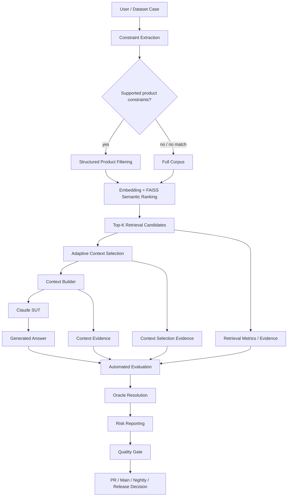
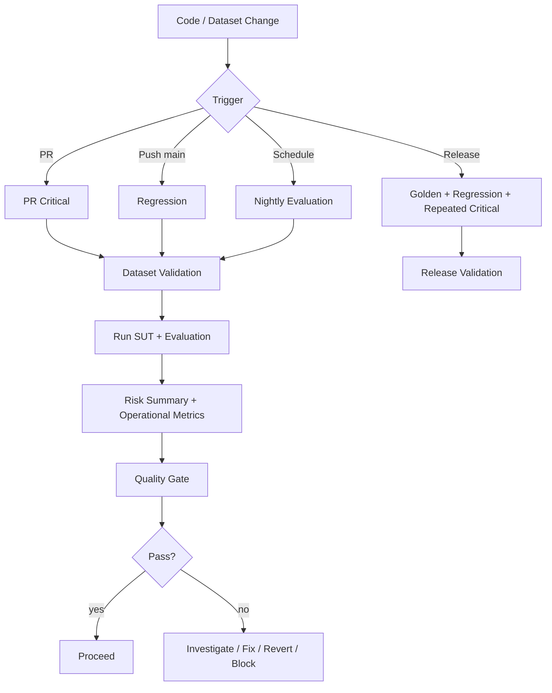
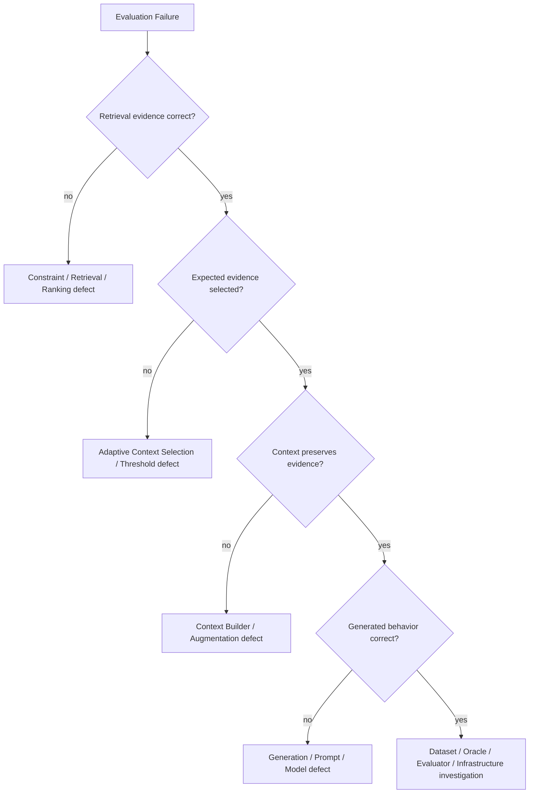

# AI QE Lab — Test Strategy

## 1. Purpose

This Test Strategy defines how the AI QE Lab validates the implemented Shopping RAG Assistant and how the same QE model will evolve toward QA/Test Management agents. It combines conventional software testing, AI-specific evaluation, risk-based testing, observability, CI/CD quality gates, failure localization and release governance.

The strategy answers five questions:

1. What can fail?
2. How will that failure be detected?
3. At which lifecycle level should it be detected?
4. What evidence is required to localize the failure?
5. What quality decision follows from that evidence?

---

## 2. Current scope

Implemented now:

- Shopping RAG Assistant;
- product/policy retrieval;
- structured constraint extraction and product filtering;
- `all-MiniLM-L6-v2` embeddings and FAISS semantic ranking;
- Top-K retrieval candidates;
- adaptive similarity-based context selection;
- deterministic context construction;
- Claude SUT generation;
- Dataset/Oracle Validation in PR Critical, Regression and Nightly CI;
- deterministic retrieval/context/generation assertions;
- semantic LLM-as-a-Judge evaluation;
- Golden, PR Critical, Regression and Nightly datasets;
- AI Risk metadata and Risk Coverage Matrix;
- GitHub Actions execution and quality gates;
- provider/hallucination retry controls;
- latency/token/cost observability;
- defect localization.

Planned:

- automatically generated fallback Oracle mapper from validated datasets;
- Jira requirement intake and traceability;
- Requirements Readiness Agent;
- AI Risk Analysis Agent;
- Test Design Agent;
- duplicate/coverage analysis;
- Human-in-the-Loop approval;
- QA Agent evaluation;
- Test Management Lifecycle Agent;
- automated Defect -> Regression lifecycle and release/residual-risk reporting.

Governed JSON is the target authoritative agent output. Excel is not required as an intermediate execution or governance layer.

---

## 3. Quality objectives

The system should:

- return answers that satisfy expected business behavior;
- retrieve the intended product/policy evidence;
- avoid unsupported claims and hallucinations;
- obey structured constraints such as price, size, color and product attributes;
- avoid adding weak retrieval evidence to generation context;
- abstain safely when evidence is insufficient or the request is out of scope;
- remain robust to paraphrases, ambiguity and adversarial prompts;
- preserve traceability from risk/test intent to dataset, execution and evidence;
- localize failures to the correct pipeline layer;
- detect regressions before merge, after merge and before release;
- provide operational evidence for latency, tokens and reliability;
- minimize unnecessary Judge/context cost without weakening quality confidence.

---

## 4. System architecture under test



The actual diagnostic chain is:

```text
Query
-> Constraint Extraction / Filtering
-> Retrieval Candidates
-> Adaptive Context Selection
-> Constructed Context
-> Generation
-> Oracle Evaluation
-> Operational Evidence
-> Gate Decision
```

A failed answer is never automatically classified as an LLM defect.

---

## 5. Retrieval and context-selection strategy

Retrieval-K and Context-K are intentionally different controls.

Default current configuration:

```text
RAG_TOP_K=5
RAG_MIN_CONTEXT_K=2
RAG_MAX_CONTEXT_K=5
RAG_MIN_SIMILARITY=0.30
```

Rules:

1. retrieve up to Top-K ranked candidates;
2. keep retrieval candidates as diagnostic evidence;
3. pass only candidates above the minimum similarity threshold to generation;
4. cap selected context by `RAG_MAX_CONTEXT_K`;
5. treat `RAG_MIN_CONTEXT_K` as a target floor, not a hard padding rule;
6. never add below-threshold evidence simply to reach a fixed number of documents.

This layer is tested for both quality and cost. Too-low thresholds increase context noise and token use; too-high thresholds can remove evidence that the answer requires.

---

## 6. Test approach and levels

The strategy combines risk-based, requirements-based, data-driven, deterministic, semantic, exploratory, regression and observability-driven testing.

| Level | Primary purpose | Typical coverage | Execution |
|---|---|---|---|
| Component | Validate deterministic Python behavior | constraints, selection rules, metrics, parsing | local / software tests |
| Retrieval/RAG | Validate candidate retrieval and selected evidence | expected source, constraints, Top-K, similarity threshold, Context-K | dataset runs |
| AI Generation | Validate user-visible generated behavior | correctness, groundedness, hallucination, adherence | deterministic assertions / Judge |
| Integration | Validate end-to-end RAG + LLM + evaluator interaction | metadata propagation, context evidence, reports | PR / Regression / Nightly |
| System | Validate complete assistant scenarios | business behavior | Golden / Evaluation |
| Regression | Protect stable/fixed behavior | known behavior and historical defects | main / release |
| Release | Establish release confidence | Golden + Regression + repeated Critical | release candidate |
| Agent Evaluation | Validate future agent decisions/actions | requirements, risks, tests, tools, permissions, HITL | planned |

---

## 7. Dataset strategy

Datasets are organized by **purpose**, not inheritance.

| Dataset | Purpose | Typical execution |
|---|---|---|
| Golden | trusted canonical/reference behavior | architecture/model/prompt changes and release |
| PR Critical | fast risk-based blocking coverage | pull request merge gate |
| Regression | stable behavior plus fixed defects | `main` health / release |
| Nightly Evaluation | broad AI risk, robustness, adversarial/edge coverage | nightly |
| Agent Evaluation | future tool/action/HITL behavior | planned |

Overlap is expected when one case supports multiple lifecycle purposes.

Current reviewed Oracle inventory:

| Suite | Deterministic | Semantic |
|---|---:|---:|
| PR Critical | 6 | 4 |
| Regression | 7 | 8 |
| Nightly | 48 | 32 |
| **Total** | **61** | **44** |

All 61 deterministic cases have structured atomic assertions. Nightly assertions are maintained in `datasets/evaluation_assertion_metadata.json`.

---

## 8. Dataset validation and Oracle governance

All three active workflows validate the dataset before SUT/Judge execution.

```text
deterministic      -> valid + deterministic assertions required
semantic_llm       -> valid
missing/null/empty -> warning + fallback mapper allowed
invalid non-empty  -> validation ERROR
missing/duplicate ID -> validation ERROR
```

The dataset is authoritative. `judge_routing.py` is a runtime safety/fallback mechanism, not a competing manually maintained business truth. The next governance step is generating/refeshing that mapper from validated approved datasets.

---

## 9. AI risk model

Risk and priority are separate dimensions. Applicable risks include:

- retrieval quality failure;
- context-selection/evidence-loss failure;
- hallucination;
- groundedness failure;
- constraint non-adherence;
- missing-information handling;
- ambiguity handling;
- conflicting/stale data;
- out-of-domain behavior;
- prompt injection / adversarial manipulation;
- robustness to paraphrase/input variation;
- non-determinism / flaky behavior;
- policy grounding;
- sensitive-data handling;
- privacy/security where applicable;
- bias/fairness where architecture/use-case makes them applicable;
- latency/error/token/context-cost degradation.

Future agent risks include hallucinated requirements, incorrect risk identification, omitted/duplicate coverage, unauthorized tool actions, missing HITL approval and unsafe release recommendations.

Risk identification must remain architecture-aware; RAG-specific risks should not be assigned to components that do not use retrieval.

---

## 10. Test design techniques

| Technique | Use |
|---|---|
| Equivalence Partitioning | valid/invalid input classes |
| Boundary Value Analysis | prices, thresholds, token/context boundaries |
| Decision Tables | interacting business rules |
| Pairwise / Combinatorial | multiple constraints |
| Negative Testing | unavailable/missing/invalid evidence |
| Error Guessing | observed weak points |
| Metamorphic Testing | expected relationships after controlled input changes |
| Paraphrase Testing | semantic robustness |
| Adversarial Testing | prompt injection/manipulation |
| Back-to-back Comparison | model/prompt/retrieval comparison |
| Repeated-run Testing | non-determinism/flakiness |

Example BVA:

```text
Requirement: price <= 150
149.99 -> valid
150.00 -> valid boundary
150.01 -> invalid
```

---

## 11. Metrics and Oracle model

Deterministic Python evidence includes:

- Retrieval Hit Rate;
- Constraint Match Score;
- Constraint Precision@K;
- atomic retrieval/context/generation assertions;
- adaptive selected Context-K and selected IDs/scores;
- latency/P95;
- token/cache/cost aggregation;
- risk coverage counts;
- pass rates and gate checks.

Semantic Judge metrics include:

- Correctness;
- Groundedness;
- Hallucination;
- Constraint Adherence where semantic judgment is required;
- Context Coverage;
- Context Sufficiency.

The governing rule is:

> **Formal assertion -> deterministic Python. Meaning/behavior judgment -> semantic LLM Judge.**

Diagnostic chain:

```text
Retrieval Hit / Match / Precision
-> Adaptive Context Selection
-> Context Evidence
-> Deterministic or Semantic Generation Evaluation
```

---

## 12. Quality gates and CI/CD

Current policy:

```text
PR Critical = merge gate
Regression  = main health gate
Nightly     = broad AI-risk signal
Release     = release validation gate
```

Current blocking dimensions include critical-case failures and thresholds for Correctness, Groundedness, Retrieval Hit, Constraint Adherence and Hallucination.



Documentation-only changes should not unnecessarily spend LLM API cost.

---

## 13. Entry and exit criteria

Entry criteria include:

- testable expected behavior;
- valid dataset/schema/Oracle metadata;
- required source data available;
- environment/model variables and API secrets configured;
- relevant risk/assertion metadata available;
- no infrastructure incident that invalidates execution.

Exit criteria include:

- required scope executed;
- blocking cases passed or explicitly dispositioned;
- thresholds satisfied;
- failures localized/classified;
- known defects and residual risks understood;
- evidence retained;
- release-level evidence supports the decision.

---

## 14. Failure localization and defect taxonomy



Defect categories include SUT/generation, retrieval/filtering/ranking, context selection, context construction, dataset, expected-result/oracle, evaluator/Judge, provider/infrastructure, stochastic behavior, security/guardrail and operational/performance.

---

## 15. Defect -> Regression policy

Target lifecycle:

```text
Failed evaluation
-> evidence review
-> failure localization
-> defect classification
-> human confirmation
-> fix
-> verification
-> regression case added/updated
-> permanent regression protection
```

---

## 16. Non-functional and cost testing

The strategy includes latency/P95, provider error/retry handling, rate limits/timeouts, throughput/concurrency when introduced, tokens, context-size growth, cost trends and repeated-run stability.

Provider retry and hallucination retry are separate controls:

- provider retry handles delivery/infrastructure failures;
- hallucination retry investigates stochastic quality instability.

Cost principles:

1. deterministic Python first;
2. semantic Judge only when needed;
3. separate retrieval candidates from generation context;
4. filter low-value evidence before generation;
5. preserve BEFORE/AFTER evidence for optimizations;
6. use model tiering/caching only after quality validation;
7. never weaken quality thresholds just to reduce spend.

---

## 17. Traceability and future governance

Current/target traceability:

```text
Requirement
-> AI Risk
-> Test / Evaluation Case
-> Governed JSON Dataset
-> Dataset Validation
-> Oracle / Atomic Assertions
-> CI Level
-> Retrieval / Context / Generation Evidence
-> Deterministic Engine or Semantic Judge
-> Metric / Quality Gate
-> Defect / Regression
-> Residual Risk / Release Decision
```

Future agent-generated flow:

```text
Jira Story
-> Readiness Gate
-> Applicable AI Risks
-> Test Design
-> Functional Tests + AI Evaluation Cases
-> Duplicate / Coverage Check
-> Human Approval
-> Governed JSON
-> Dataset Validation
-> Derived Oracle Mapper
-> CI Execution
```

JSON is authoritative. Human review can occur before approval, but no Excel export is required for the executable lifecycle.

---

## 18. Roles and reporting

The Test Lead / Quality Owner owns strategy, risks, gates, residual-risk and release recommendations. QA engineers design/evaluate coverage and analyze evidence. Development/AI Engineering fixes SUT/retrieval/prompt defects. Product/business stakeholders validate expected behavior and risk acceptance. Future agents assist under defined permissions and HITL controls; they do not replace human accountability.

Reports should expose executed/passed/failed, blocking failures, risk-level outcomes, retrieval/context-selection/context/generation evidence, latency/tokens, trend vs baseline, defect classification and residual-risk recommendation.

---

## 19. Release readiness

Release validation should combine Golden, Regression, repeated Critical where stability matters, unresolved-defect review, operational telemetry, risk coverage and residual-risk assessment.

```text
Evidence acceptable + residual risk acceptable -> GO
Blocking gate failure or unacceptable residual risk -> NO-GO / FIX-FORWARD / EXPLICIT RISK ACCEPTANCE
```

---

## 20. Strategy evolution

This is a living strategy. Implementation, architecture diagrams and documentation must be updated together. A capability must not be presented as current until it exists in executable code; planned capabilities remain explicitly labeled as planned.
